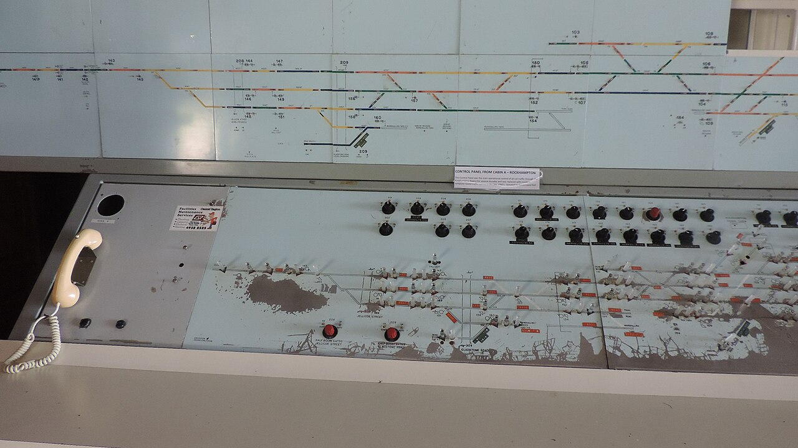

# Selenium

*Selenium WebDriver is the standards-aligned, language-neutral route to real-browser automation; its broad reach is valuable when browser, platform, language, or Grid coverage matters more than an all-in-one runner.*

> Your company already writes Java, must validate Safari on macOS and Chrome on Windows, and owns a
> remote browser lab. A fashionable one-command starter is not the deciding fact. The deciding fact
> is whether the automation layer can speak the team's language and drive the browser/platform matrix
> the release actually promises. That is the workload where Selenium remains unusually strong.

> **In real life**
>
> The railway control panel in the image is not the train and does not prescribe the timetable. It is
> a durable interface through which an operator routes many different trains over many lines. WebDriver
> plays that role: test code sends standardized browser commands; vendor drivers route them to Chrome,
> Firefox, Edge, or Safari; your test runner, assertions, and reporting remain choices around it.

**Selenium WebDriver**: Selenium is an umbrella open-source browser-automation project. WebDriver is its language-neutral API and W3C protocol for controlling browsers through vendor implementations; Grid routes WebDriver sessions to remote machines for parallel, cross-browser, and cross-platform execution. Selenium is not, by itself, a complete test strategy or a single bundled assertion/reporting stack.

## What it gives you — and what you assemble

As checked on **2026-07-18**, Selenium's official documentation lists browser-specific support for
Chrome, Edge, Firefox, Safari, and Internet Explorer, and its getting-started guide describes bindings
for mainstream languages. Grid is designed to run sessions in parallel on remote machines, across
browser versions and platforms. That breadth is the reason to shortlist Selenium for an established
Java, Python, C#, Ruby, or JavaScript estate, a vendor-browser lab, or a mixed OS matrix.

The trade is assembly. You choose a test runner, assertions, fixtures, reporting, wait conventions,
driver lifecycle, and Grid/cloud topology. Selenium Manager reduces driver setup friction, but it does
not design reliable locators or isolate test data. A small, disciplined framework is an advantage; an
accidental framework is maintenance debt.

> **Tip**
>
> Run a proof against the hardest supported combination first: for example Safari on the required macOS,
> a corporate proxy, and the remote Grid. A Chrome-only hello-world proves the easiest path, not the reason
> you considered Selenium.

> **Common mistake**
>
> Calling Selenium "slow and flaky" as an intrinsic property. WebDriver adds process/network boundaries,
> but most flake comes from shared state, brittle locators, fixed sleeps, and ambiguous oracles. Measure a
> representative flow and diagnose its waits before blaming the protocol.


*Signal control panel, Archer Park Rail Museum — Kerry Raymond, Wikimedia Commons, CC BY 4.0. [Source](https://commons.wikimedia.org/wiki/File:Signal_control_panel,_Archer_Park_Rail_Museum,_2016.jpg)*
- **Route diagram** — One operator-facing model spans many physical lines, like one WebDriver interface spanning vendor browser implementations.
- **Switch bank** — Commands are explicit controls; the browser driver translates them to the selected browser.
- **Telephone** — A separate communication channel reminds us that runners, reports, and infrastructure sit around WebDriver rather than inside it.

**A WebDriver command across a Grid**

1. **Test asks** — Java or Python code requests a session with browser and platform capabilities.
2. **Grid routes** — The Grid matches that request to an available node; local execution skips this hop.
3. **Driver translates** — The vendor driver uses the browser's automation facilities to perform the command.
4. **Browser responds** — The result returns through the protocol; the test's own assertion decides pass or fail.

The executable model below does not import Selenium. It models capability routing so the playground
stays dependency-free while making the selection contract testable.

*Route Selenium-style capabilities (Python)*

```python
nodes = [
    ("mac-1", "safari", "macos"),
    ("win-1", "edge", "windows"),
    ("linux-1", "chrome", "linux"),
]
requests = [("safari", "macos"), ("edge", "windows"), ("firefox", "linux")]

def route(browser, platform):
    matches = [name for name, b, p in nodes if b == browser and p == platform]
    return matches[0] if matches else "UNROUTABLE"

results = [route(*request) for request in requests]
expected = ["mac-1", "win-1", "UNROUTABLE"]
assert results == expected, "routing oracle rejected: " + str(results)
print("routes:", ",".join(results))
print("routed:", sum(x != "UNROUTABLE" for x in results), "of", len(results))
print("verdict:", "PASS" if results == expected else "FAIL")
```

*Route Selenium-style capabilities (Java)*

```java
import java.util.*;

public class Main {
    record Node(String name, String browser, String platform) {}
    static String route(List<Node> nodes, String browser, String platform) {
        return nodes.stream().filter(n -> n.browser().equals(browser) && n.platform().equals(platform))
                .map(Node::name).findFirst().orElse("UNROUTABLE");
    }
    public static void main(String[] args) {
        var nodes = List.of(new Node("mac-1", "safari", "macos"),
                new Node("win-1", "edge", "windows"), new Node("linux-1", "chrome", "linux"));
        var requests = List.of(new String[]{"safari", "macos"}, new String[]{"edge", "windows"},
                new String[]{"firefox", "linux"});
        var results = requests.stream().map(r -> route(nodes, r[0], r[1])).toList();
        var expected = List.of("mac-1", "win-1", "UNROUTABLE");
        if (!results.equals(expected)) throw new AssertionError("routing oracle rejected: " + results);
        System.out.println("routes: " + String.join(",", results));
        System.out.println("routed: " + results.stream().filter(x -> !x.equals("UNROUTABLE")).count() + " of " + results.size());
        System.out.println("verdict: " + (results.equals(expected) ? "PASS" : "FAIL"));
    }
}
```

### Your first time: Prove Selenium fits one real workload

- [ ] Write the required browser, OS, and language matrix — Use release commitments, not browser popularity in general.
- [ ] Automate one critical flow with explicit waits — Avoid sleeps; record setup, runtime, and diagnostic quality.
- [ ] Run the hardest remote combination — Confirm capability routing, artifacts, and cleanup on the actual Grid or provider.
- [ ] Write the ownership list — Name who maintains runners, bindings, drivers, Grid, locators, and reports.

- **A session works locally but Grid says no matching capabilities.**
  Compare the requested browser/platform/version with registered node stereotypes and inspect Grid status; do not keep changing the test body.
- **Clicks intermittently fail on a dynamic page.**
  Replace fixed sleeps with an explicit condition tied to the observable state, then capture DOM/screenshot logs at failure.

### Where to check

- Grid status and node stereotypes for capability mismatches.
- Browser/driver logs and the failing page's DOM state for command failures.
- Selenium's browser pages for vendor-specific behavior and current setup notes.

### Worked example: A regulated portal with a mixed estate

A Java team must test Chrome and Edge on Windows plus Safari on macOS, keep tests beside existing JUnit
utilities, and burst nightly runs across owned machines. Selenium is a workload fit: bindings match the
estate, vendor browsers are the target, and Grid routes remote sessions. Playwright might offer a more
integrated new-runner experience, but switching languages and equating patched WebKit with branded Safari
would not satisfy this matrix. The result is not "Selenium wins"; it is "these constraints select it."

**Quiz.** Which requirement most directly strengthens the case for Selenium?

- [ ] The team wants any tool with a green logo
- [x] A Java suite must drive vendor browsers across owned Windows and macOS Grid nodes
- [ ] The team refuses to define expected results
- [ ] The product has no web interface

*Selenium's bindings, vendor-browser WebDriver implementations, and Grid directly address that workload. A logo, missing oracle, or non-web product does not.*

- **WebDriver** — A language-neutral browser-control API/protocol implemented through browser drivers.
- **Grid** — A router and node system for remote, parallel, cross-browser/platform WebDriver sessions.
- **Selenium's main trade** — Broad ecosystem reach in exchange for assembling more of the surrounding test stack.

### Challenge

Change the model's Safari node to Linux. Both playgrounds must reject the now-wrong expected
route. Then update the oracle only if the changed inventory is genuinely the intended system.

### Ask the community

> Our estate is Java plus a vendor-browser lab. What evidence would justify moving away from Selenium?

Useful answers compare a representative flow, the mandatory browser/OS matrix, CI diagnostics, team
language, migration cost, and maintenance over several weeks—not generic benchmark screenshots.

- [Selenium — Overview](https://www.selenium.dev/documentation/overview/)
- [Selenium — Supported browsers](https://www.selenium.dev/documentation/webdriver/browsers/)
- [Selenium — Grid](https://www.selenium.dev/documentation/grid/)

🎬 [Selenium Grid with Docker: Setup, Framework Integration & Live Demo (2025)](https://www.youtube.com/watch?v=5VUReeHTid8) (14 min)

- Selenium WebDriver is a standards-aligned browser-control layer, not an all-in-one testing philosophy.
- Its strongest workload fit is broad language, vendor-browser, platform, and remote Grid coverage.
- The surrounding runner, assertions, waits, reporting, and lifecycle conventions remain engineering decisions.
- Date comparisons and prove the hardest required browser/OS combination before choosing.


## Related notes

- [[Notes/automation-foundations/the-tool-landscape/playwright-tool|Playwright]]
- [[Notes/automation-foundations/the-tool-landscape/cypress|Cypress]]
- [[Notes/automation-foundations/the-tool-landscape/choosing-a-tool|Choosing a tool]]


---
_Source: `packages/curriculum/content/notes/automation-foundations/the-tool-landscape/selenium.mdx`_
