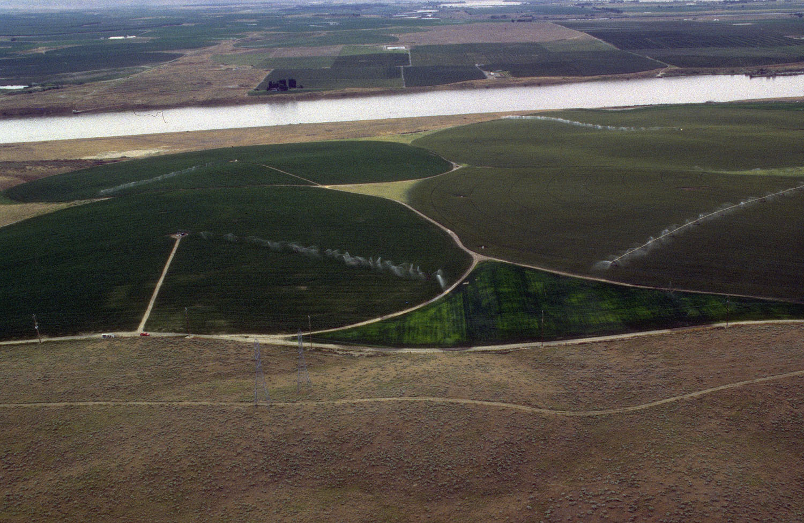

# Benefits

*What automation actually buys a team: the same checks executed identically every time, at a speed and scale no human schedule can match - which shrinks the window between a regression appearing and someone noticing it.*

> A team ships a release on Friday. The login flow broke in that release - not in a new feature, but in
> a screen everyone tested thoroughly two months ago and nobody has re-checked since, because there was
> never time. The bug sits in production all weekend. Monday morning, support tickets arrive. Nothing
> about this story involves a hard bug; it involves a check that existed, was known, was even written
> down - and simply didn't get run. The core benefit of automation is that "didn't get run" stops being
> a thing that happens to your most important checks.

> **In real life**
>
> An aerial photo of farmland tells the story. The circular fields under center-pivot irrigation are
> deep green: a machine sweeps the same arc every day, delivering the same amount of water to every
> row, whether it's a holiday, a harvest week, or 3 a.m. The land outside the machine's reach is brown
> sagebrush - not because anyone decided it was unimportant, but because hand-watering that much ground
> every day is beyond what any crew can sustain. Manual testing is hand-watering: careful, adaptable,
> and physically limited by hours in the day. Automation is the pivot rig: it covers the acreage it's
> built for, identically, every single cycle - and the difference shows up exactly like the photo does,
> as the gap between what gets covered every day and what quietly dries out.

**Benefits of automation**: Test automation is having software execute predefined checks against your application - clicking, typing, calling APIs, comparing actual results to expected results - instead of a person doing those same steps by hand. Its benefits come from what machines are better at than people: executing the identical steps every run (consistency), running thousands of checks in minutes (speed), running them at 2 a.m. on every commit (frequency, no fatigue), and reporting exactly what was checked (a record you can trust). It does NOT think, notice the unexpected, or judge whether something feels wrong - that stays human work, which is why automation frees testers for it rather than replacing them.

## What the machine is actually better at

- **Consistency.** An automated check performs the same steps, in the same order, with the same data,
  every single run. It never skips step 4 because it's Friday afternoon, never assumes "that part was
  fine last week." Where a human's tenth repetition of a login test gets sloppier, the machine's
  ten-thousandth is identical to its first.
- **Speed and scale.** A suite of hundreds of checks runs in minutes. The same checks done by hand
  represent days of work - which in practice means they simply don't all get done per release. The
  machine doesn't make each individual check smarter; it makes running ALL of them cheap enough to
  actually happen.
- **Frequency.** Because a run costs minutes, you can afford one on every commit, every merge, every
  night. Regressions get caught the day they're introduced, not the week someone finally had time to
  re-test that area - and a bug found the same day is cheaper to diagnose, because only that day's
  changes could have caused it.
- **A trustworthy record.** After a run you know exactly which checks executed and what they found.
  "Did anyone re-verify checkout after that refactor?" stops being a memory question and becomes a
  report you can open.

> **Tip**
>
> The sharpest way to frame the benefit: automation doesn't find new bugs, it stops OLD behavior from
> silently breaking. Its natural home is regression - re-verifying that what worked yesterday still
> works today. That's precisely the work humans are worst at sustaining (boring, repetitive, endless)
> and machines are best at.

> **Common mistake**
>
> Selling automation as "testing, but cheaper" or "we'll need fewer testers." Automation executes
> checks; it doesn't design them, prioritize them, investigate failures, or explore. Teams that buy the
> "replacement" framing end up with a suite nobody maintains and no one doing the thinking. The honest
> pitch is narrower and stronger: the repetitive re-checking gets done by machines, completely and
> constantly, so the humans can do the work machines can't.


*Center pivot irrigation, Idaho — Bob Heims, U.S. Army Corps of Engineers, Wikimedia Commons, Public domain. [Source](https://commons.wikimedia.org/wiki/File:Center_pivot_irrigation_Idaho.jpg)*
- **A pivot rig mid-sweep, spray visible** — The machine is watering RIGHT NOW, unattended, exactly as it did yesterday and will tomorrow - the automated suite running its same checks on every commit, no one standing over it.
- **A second rig running at the same time** — Multiple rigs water multiple fields simultaneously - suites run in parallel: hundreds of checks across browsers or services at once, a scale no human team's day allows.
- **The deep-green wedge** — Visibly healthier crop where coverage has been relentless and even - the areas of an app under continuous automated regression, where old behavior can't silently rot because it's re-verified every night.
- **Dry sagebrush, outside the system's reach** — Nobody chose to let this land dry out - it's simply beyond what hand-watering can sustain. Exactly what happens to known-but-unrun manual regression checks when every release competes for limited tester hours.

**Where a regression's lifetime goes, with and without a nightly suite - press Play**

1. **Monday: a refactor quietly breaks an old feature** — No one intended it, no new feature touched it, and it's in an area last hand-tested months ago - the classic regression.
2. **Without automation: nothing happens** — The manual test pass for this release focuses on the new feature, as it must - there are only so many tester-hours. The broken area isn't on this week's list.
3. **The bug ships, and ages** — Every day it survives, more code lands on top of it. When a user finally reports it, 'what change caused this?' means digging through weeks of commits.
4. **With a nightly suite: Monday night, a red check** — The suite re-verifies old behavior indiscriminately - that's its whole job. Tuesday morning the team sees the failure with one day's worth of commits to suspect.
5. **Verdict** — Same bug, same code, same team. The suite didn't out-think anyone - it just made sure the old checks actually ran, the one thing the humans could never afford to keep doing.

The benefit in one line: automation makes "we re-checked everything" true every night, instead of a
thing nobody has time to make true even once a month.

*Run it - one tester's rotation vs a nightly suite against the same regression (Python)*

```python
# A product has 120 known regression checks. A regression breaks check #77 on day 1.
# Manual: one tester re-runs 30 checks/day (4 min each), rotating through the list.
# Automation: the whole suite runs every night, 3 seconds per check.

TOTAL_CHECKS = 120
BROKEN_CHECK = 77
PER_DAY_MANUAL = 30

def manual_detection_day():
    day = 1
    start = 0
    while True:
        covered = [(start + i) % TOTAL_CHECKS + 1 for i in range(PER_DAY_MANUAL)]
        if BROKEN_CHECK in covered:
            return day, covered[0], covered[-1]
        start = (start + PER_DAY_MANUAL) % TOTAL_CHECKS
        day += 1

day, first, last = manual_detection_day()
print("Manual rotation, 30 checks/day out of", TOTAL_CHECKS, "total:")
print("  day 1 covers checks 1-30, day 2 covers 31-60, ...")
print("  check", BROKEN_CHECK, "finally re-run on day", day,
      "(that day covered", str(first) + "-" + str(last) + ")")
print("  daily effort:", PER_DAY_MANUAL * 4, "minutes for",
      round(100 * PER_DAY_MANUAL / TOTAL_CHECKS), "% coverage")
print("  bug was live and unnoticed for", day - 1, "full days")
print()
suite_minutes = TOTAL_CHECKS * 3 / 60
print("Nightly automated suite, all", TOTAL_CHECKS, "checks every night:")
print("  night 1 run time:", suite_minutes, "minutes for 100 % coverage")
print("  check", BROKEN_CHECK, "re-run on night 1 -> caught with 1 day of commits to suspect")
```

Same model in Java:

*Run it - one tester's rotation vs a nightly suite against the same regression (Java)*

```java
public class Main {
    static final int TOTAL_CHECKS = 120;
    static final int BROKEN_CHECK = 77;
    static final int PER_DAY_MANUAL = 30;

    public static void main(String[] args) {
        int day = 1;
        int start = 0;
        int first = 0, last = 0;
        boolean found = false;
        while (!found) {
            first = start + 1;
            last = start + PER_DAY_MANUAL;
            for (int i = first; i <= last; i++) {
                if (i == BROKEN_CHECK) { found = true; break; }
            }
            if (!found) {
                start = (start + PER_DAY_MANUAL) % TOTAL_CHECKS;
                day++;
            }
        }
        System.out.println("Manual rotation, 30 checks/day out of " + TOTAL_CHECKS + " total:");
        System.out.println("  day 1 covers checks 1-30, day 2 covers 31-60, ...");
        System.out.println("  check " + BROKEN_CHECK + " finally re-run on day " + day
                + " (that day covered " + first + "-" + last + ")");
        System.out.println("  daily effort: " + (PER_DAY_MANUAL * 4) + " minutes for "
                + Math.round(100.0 * PER_DAY_MANUAL / TOTAL_CHECKS) + " % coverage");
        System.out.println("  bug was live and unnoticed for " + (day - 1) + " full days");
        System.out.println();
        double suiteMinutes = TOTAL_CHECKS * 3 / 60.0;
        System.out.println("Nightly automated suite, all " + TOTAL_CHECKS + " checks every night:");
        System.out.println("  night 1 run time: " + suiteMinutes + " minutes for 100 % coverage");
        System.out.println("  check " + BROKEN_CHECK + " re-run on night 1 -> caught with 1 day of commits to suspect");
    }
}
```

### Your first time: Your mission: measure what repetition actually costs you

- [ ] Pick one flow you've tested by hand more than once (login, add-to-cart, a signup) — Something with a fixed, known sequence of steps and a clear expected result - the kind of check that never changes between releases.
- [ ] Run it by hand three times in a row, timing each run — Note the total time, and honestly note any step you were tempted to skip or rushed through on run 3 - that drift is the consistency problem this note describes.
- [ ] Multiply: your average time x every flow like this x every release — That number is the recurring bill for keeping regression checks manual - and it grows with every feature shipped, forever.
- [ ] Write down which of those flows you'd hand to a machine first — You've just done real automation triage - the next note, what-to-automate, turns this instinct into explicit criteria.

You now have a number, not a feeling, for what the machine would buy you - and you felt the
consistency drift firsthand by run 3.

- **Leadership approved automation expecting the testing budget to shrink, and now asks why testers are still needed.**
  Reset the framing to what this note's Term says: automation executes checks, it doesn't design them, investigate failures, or explore. The benefit was never fewer humans - it was that the repetitive re-checking finally happens completely and constantly. Show the regression-detection window shrinking (bugs caught same-day vs weeks later); that's the return on the investment.
- **The team automated a handful of checks, but bugs in old features still reach production regularly.**
  A benefit like 'regressions get caught nightly' only materializes at coverage plus frequency - a dozen checks run occasionally is hand-watering with a fancier hose. Check two things: are the automated checks the HIGH-VALUE old flows (not just the easy ones), and are they actually running on every commit or night, with failures someone looks at?

### Where to check

- **Your CI pipeline's test stage (or its absence)** — the fastest reality check on whether "we have automation" means checks actually run on every change, or a suite exists that nobody triggers.
- **The last few production bugs, sorted by 'new feature or old one?'** — if old features keep breaking, that's the regression gap automation exists to close; count how long each bug lived before detection.
- **The time between a regression being introduced (its causing commit) and being noticed** — the single number the nightly-suite benefit shrinks; your issue tracker plus git history can reconstruct it.
- **[[automation-foundations/why-and-when-to-automate/what-to-automate]]** — the next note: turning "automation is valuable" into the specific list of checks where that value is highest.

### Worked example: a team that measured the benefit instead of arguing about it

1. A team debates whether automating their regression checks is worth the setup cost. Opinions are
   loud; numbers are absent.
2. A tester reframes it with data: the release checklist has 120 recurring checks. Hand-executing
   one takes about 4 minutes - 8 hours of pure repetition per release, so in practice only the
   30-40 highest-priority checks actually get run each time.
3. They pull the last quarter's production bugs and tag each one: caused by the new feature, or a
   regression in an old one? Result: over half were regressions - and every one of them had a
   matching check on the list that simply hadn't been run for that release.
4. They automate the top 60 checks. The suite runs nightly in 6 minutes. Two weeks in, it flags a
   checkout regression the morning after the commit that caused it - one day of changes to search
   instead of an archaeology dig.
5. Finding: the benefit was never 'the machine tests better than us.' It was that 100% of the known
   checks now run 100% of the nights - the exact work the humans were skipping, not by choice, but
   by arithmetic.

**Quiz.** A team automates its regression checks and runs them on every commit. Which benefit is this setup MOST directly buying them?

- [ ] The suite will find new bugs in new features that manual testers would have missed
- [x] Regressions in existing behavior get detected within a day of the change that caused them, instead of whenever someone next re-tests that area
- [ ] The team can reduce tester headcount since the machine now does the testing
- [ ] The application will have fewer bugs written in the first place, since developers know tests exist

*Automation's home turf is re-verifying known, existing behavior - so its most direct payoff is shrinking the window between a regression appearing and being noticed, from 'whenever a human next re-tests that area' to 'the next run.' Option one inverts the strength: finding NEW bugs needs human exploration and judgment; the suite only checks what it was told to check. Option three is the classic mis-sell this note warns about - execution gets automated, but designing checks, investigating failures, and exploring stay human work. Option four describes a fuzzy cultural side effect at best, not the mechanism: the suite catches breakage after it's written; it doesn't prevent the writing.*

- **The four things machines beat humans at, per this note** — Consistency (identical steps every run), speed and scale (hundreds of checks in minutes), frequency (every commit or night, no fatigue), and a trustworthy record of exactly what ran.
- **The irrigation analogy** — Center-pivot rigs keep their fields green by covering the same arc identically every day; hand-watering is careful but physically limited - and the dry land outside the rig's reach is the regression checks that never get re-run.
- **Automation's natural home** — Regression - re-verifying that what worked yesterday still works today. The work humans are worst at sustaining (repetitive, endless) and machines are best at.
- **What automation does NOT do** — Design checks, prioritize, investigate failures, explore, or judge that something feels wrong - it executes predefined checks. The 'fewer testers' pitch fails on exactly this.
- **The single number the nightly-suite benefit shrinks** — The window between a regression being introduced and being noticed - from weeks ('when someone next re-tests that area') to one day, which also shrinks the pile of commits to suspect.

### Challenge

Take a real release checklist (yours, or draft a 20-item one for an app you test). For each item,
estimate minutes-by-hand and mark whether it actually got executed in the last two releases. Compute:
total hand-execution cost per release, and the percentage of the list that really ran. Those two
numbers are your personal version of this note's whole argument - keep them for the ROI note later
in this module.

### Ask the community

> My team says we don't have time to automate because all our tester hours go into manual regression passes - but the regression passes are exactly what automation would replace. How do I break this chicken-and-egg cycle?

Useful replies usually converge on starting embarrassingly small: automate only the 5-10 most
re-run checks first (the daily smoke set), reclaim those minutes every single day, and reinvest them
into the next batch - rather than waiting for a mythical free month to automate everything at once.

- [SmartBear — What Is Automated Testing?](https://smartbear.com/learn/automated-testing/what-is-automated-testing/)
- [BrowserStack — Importance of Automation Testing: 13 Benefits](https://www.browserstack.com/guide/benefits-of-automation-testing)
- [Testopic — What is automated testing? Beginner intro & automation demo](https://www.youtube.com/watch?v=pQPUs9uaKUM)

🎬 [59 Seconds Agile — Why Should We Automate Testing? Benefits of Automation Testing](https://www.youtube.com/watch?v=gJ1uMCwMAC0) (2 min)

- Automation's benefits are exactly the machine's strengths: identical execution every run, hundreds of checks in minutes, runs on every commit without fatigue, and a reliable record of what was checked.
- Its natural home is regression - keeping yesterday's behavior verified - which is the work human schedules are least able to sustain.
- The measurable payoff is a shorter regression-detection window: bugs in old features caught the night they're introduced, with one day of commits to suspect.
- The pivot-irrigation photo is the whole argument: green where machine coverage is relentless, dry where coverage depends on scarce human hours.
- Automation replaces execution, not judgment - the honest pitch is that machines take the repetition so testers can do the thinking machines can't.


## Related notes

- [[Notes/automation-foundations/why-and-when-to-automate/what-to-automate|What to automate]]
- [[Notes/automation-foundations/why-and-when-to-automate/manual-vs-automated|Manual vs automated]]
- [[Notes/automation-foundations/the-automation-pyramid/unit-integration-e2e|Unit / integration / E2E]]


---
_Source: `packages/curriculum/content/notes/automation-foundations/why-and-when-to-automate/benefits.mdx`_
