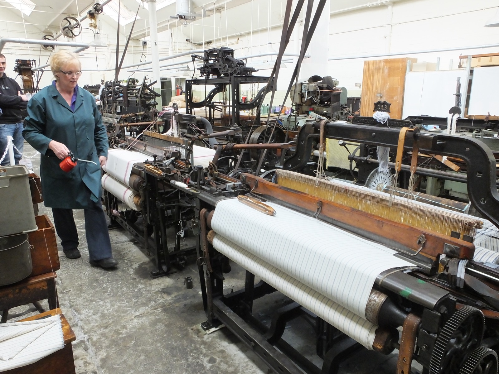

# Manual vs automated

*Not a contest but a division of labor: machines take the repeatable, decidable checks and run them constantly; humans take exploration, judgment, and the unexpected - and a release plan that uses both lanes covers more than either could alone.*

> "Should we do manual or automated testing?" is one of the most-asked questions in QA interviews and
> one of the most broken. It assumes the two are rivals for the same job. They aren't - they're
> different tools for different halves of the same job, and every strong testing strategy in existence
> uses both. The teams that get this wrong pick a side: all-manual teams drown in repetitive regression
> passes and ship regressions anyway; all-automated teams ship products that technically pass and
> practically frustrate everyone. The real question is never which - it's what goes in which lane.

> **In real life**
>
> Walk through a working weaving shed. The power looms do the weaving - thousands of identical picks
> per hour, a precision and pace no human hand could sustain, repeating the programmed pattern exactly.
> And walking the rows between them: the weaver, oil can in hand - starting and stopping machines,
> catching broken threads early, judging the cloth's quality, deciding when something's off enough to
> halt the loom. Neither replaces the other. Looms without the weaver jam and churn out flawed cloth by
> the yard; a weaver without looms produces a fraction of the fabric. The shed works BECAUSE the
> repetitive precision went to the machines and the judgment stayed with the person - which is exactly
> how a healthy testing effort divides a release.

**Manual vs automated**: Manual testing is a human executing and judging checks directly - following steps, exploring, noticing, evaluating. Automated testing is software executing predefined checks and comparing actual to expected results. The division of labor: automation takes what machines do best - the regression suite, smoke checks, data-driven repeats, cross-browser passes - and runs it constantly at a speed and consistency humans can't sustain. Manual work takes what humans do best - exploratory testing, usability judgment, investigating the failures automation flags, and testing the brand-new before it stabilizes. They are complementary, not competing: automation frees the human hours that exploration and judgment need, and human testing finds the classes of problems no script can express. A strategy missing either lane has a hole the other can't cover.

## The division of labor, spelled out

- **The machine lane.** Regression checks, smoke tests, the same form with fifty datasets, the same
  flow on three browsers - anything frequent, stable, deterministic, and consequential (the profile
  from [[automation-foundations/why-and-when-to-automate/what-to-automate]]). Run on every commit or
  nightly, and the humans read the results over coffee.
- **The human lane.** Exploratory sessions on new and risky areas, usability and visual judgment,
  one-off verifications, features still changing weekly - everything from
  [[automation-foundations/why-and-when-to-automate/what-not-to-automate]] - plus one more that's
  easy to miss: investigating what the machine lane flags. A red check says "expected 37.79, got
  39.99"; a human figures out why, and whether it matters.
- **The handoffs.** New features start in the human lane (exploration while they're unstable), and
  graduate to the machine lane once stable - their checks become tomorrow's regression scripts.
  In the other direction, when automation flags something odd, it hands the thread to a human. The
  lanes feed each other; a strategy where they don't is two teams working in parallel, not one
  system.
- **What the split buys.** Neither lane's win is possible without the other: the machine lane only
  stays trustworthy because humans investigate its reds and prune its rot; the human lane only has
  hours for real exploration because the machine took the 300-check regression pass. Cut either and
  the other degrades within a quarter.

> **Tip**
>
> In interviews and planning meetings alike, refuse the either/or framing out loud. The strong answer
> to "manual or automated?" is the split itself: "Automate the stable, repeatable, machine-decidable
> checks so they run on every change; spend the human hours on exploration, judgment, new features,
> and investigating failures. Each lane covers exactly what the other can't."

> **Common mistake**
>
> Treating manual testing as the junior phase and automation as the senior phase of the same activity -
> "we'll do manual until we're mature enough to automate it all away." That ladder doesn't exist: the
> human lane's work (exploration, judgment) isn't automation-in-waiting, it's a permanent, skilled
> discipline that automation NEEDS to stay honest. Teams that 'graduate' out of manual testing
> discover, via support tickets, that nobody has actually looked at the product in months.


*Starting two looms, Queen Street Mill, Burnley — Clem Rutter, Wikimedia Commons, CC BY-SA 3.0. [Source](https://commons.wikimedia.org/wiki/File:Queen_Street_Mill_starting_two_looms_8516.JPG)*
- **The weaver, oil can in hand** — One person runs this whole row: starts and stops machines, catches broken threads, judges the cloth, maintains the mechanism. The human lane - exploration, judgment, investigation, upkeep - is what keeps the machine lane honest.
- **The woven cloth coming off the loom** — Thousands of identical picks at machine pace and machine consistency - the output of the automated lane: the same checks executed perfectly, every run, at a volume no human could sustain by hand.
- **The shuttle, resting on the fabric** — Placed there by hand at shift's end - the human procedures AROUND the machine: deciding when it runs, setting it up, standing it down. Suites don't schedule, triage, or retire their own checks either.
- **The heddle wires and iron frame** — The loom repeats its programmed pattern exactly - and ONLY that pattern. Changing what it weaves is skilled human work, exactly like changing what a suite checks: the scripts execute; deciding what they should execute stays with people.

**One release, two lanes, one afternoon - press Play**

1. **9:00 - a release candidate is cut** — The automated suite starts immediately: 300 regression checks, three browsers, in parallel. No human is watching it run.
2. **9:12 - the suite reports: 298 green, 2 red** — Twelve minutes for what would be a week by hand. The machine lane's job ends where judgment starts: WHY are two red?
3. **9:30 - a tester investigates the reds** — One is a timing flake (noted for pruning); one is real - a rounding regression in checkout. Filed with the failing data attached. Human lane, doing what scripts can't: deciding what a failure means.
4. **10:00-16:00 - exploratory sessions on the new payment-methods feature** — The feature is too new and too changeable to script - a tester explores it with charters, finds two design gaps and a confusing error state no predefined check would have expressed.
5. **Verdict** — One afternoon: 900 scripted checks executed, a regression caught and diagnosed, a new feature genuinely examined. Neither lane could have delivered this alone - and neither was 'the real testing.' Both were.

The whole note in one line: machines re-verify what we already know should work; humans discover
what we don't yet know about - and a release needs both answered.

*Run it - one release budget, three staffing strategies (Python)*

```python
# A release needs: 80 regression checks, exploratory testing of a new feature,
# and a usability pass. The testing budget is one 360-minute day.
# Manual regression: 4 min/check. Automated regression: the suite runs in 4 min total.

REGRESSION_CHECKS = 80
MANUAL_MIN_PER_CHECK = 4
SUITE_RUNTIME_MIN = 4
EXPLORATORY_MIN = 90
USABILITY_MIN = 30
BUDGET_MIN = 360

def report(name, reg_minutes, reg_covered, human_left):
    explor = min(EXPLORATORY_MIN, max(0, human_left))
    human_left -= explor
    usab = min(USABILITY_MIN, max(0, human_left))
    print(name)
    print("  regression:", reg_covered, "/", REGRESSION_CHECKS,
          "checks in", reg_minutes, "min")
    print("  exploratory done:", explor, "/", EXPLORATORY_MIN, "min",
          "| usability done:", usab, "/", USABILITY_MIN, "min")
    gaps = []
    if reg_covered < REGRESSION_CHECKS: gaps.append("regression coverage")
    if explor < EXPLORATORY_MIN: gaps.append("exploration")
    if usab < USABILITY_MIN: gaps.append("usability")
    print("  gaps:", ", ".join(gaps) if gaps else "none - everything covered")
    print()

print("Budget: one", BUDGET_MIN, "minute testing day")
print()
# Strategy 1: all manual - regression eats the day
manual_reg_min = REGRESSION_CHECKS * MANUAL_MIN_PER_CHECK
report("ALL MANUAL:", manual_reg_min, REGRESSION_CHECKS, BUDGET_MIN - manual_reg_min)

# Strategy 2: all automated - human work simply not done
report("ALL AUTOMATED (no human lane):", SUITE_RUNTIME_MIN, REGRESSION_CHECKS, 0)

# Strategy 3: both lanes - suite runs, humans explore
report("BOTH LANES:", SUITE_RUNTIME_MIN, REGRESSION_CHECKS, BUDGET_MIN - SUITE_RUNTIME_MIN)
```

Same comparison in Java:

*Run it - one release budget, three staffing strategies (Java)*

```java
public class Main {
    static final int REGRESSION_CHECKS = 80;
    static final int MANUAL_MIN_PER_CHECK = 4;
    static final int SUITE_RUNTIME_MIN = 4;
    static final int EXPLORATORY_MIN = 90;
    static final int USABILITY_MIN = 30;
    static final int BUDGET_MIN = 360;

    static void report(String name, int regMinutes, int regCovered, int humanLeft) {
        int explor = Math.min(EXPLORATORY_MIN, Math.max(0, humanLeft));
        humanLeft -= explor;
        int usab = Math.min(USABILITY_MIN, Math.max(0, humanLeft));
        System.out.println(name);
        System.out.println("  regression: " + regCovered + " / " + REGRESSION_CHECKS
                + " checks in " + regMinutes + " min");
        System.out.println("  exploratory done: " + explor + " / " + EXPLORATORY_MIN + " min"
                + " | usability done: " + usab + " / " + USABILITY_MIN + " min");
        StringBuilder gaps = new StringBuilder();
        if (regCovered < REGRESSION_CHECKS) gaps.append("regression coverage");
        if (explor < EXPLORATORY_MIN) gaps.append(gaps.length() > 0 ? ", exploration" : "exploration");
        if (usab < USABILITY_MIN) gaps.append(gaps.length() > 0 ? ", usability" : "usability");
        System.out.println("  gaps: " + (gaps.length() == 0 ? "none - everything covered" : gaps.toString()));
        System.out.println();
    }

    public static void main(String[] args) {
        System.out.println("Budget: one " + BUDGET_MIN + " minute testing day");
        System.out.println();
        int manualRegMin = REGRESSION_CHECKS * MANUAL_MIN_PER_CHECK;
        report("ALL MANUAL:", manualRegMin, REGRESSION_CHECKS, BUDGET_MIN - manualRegMin);
        report("ALL AUTOMATED (no human lane):", SUITE_RUNTIME_MIN, REGRESSION_CHECKS, 0);
        report("BOTH LANES:", SUITE_RUNTIME_MIN, REGRESSION_CHECKS, BUDGET_MIN - SUITE_RUNTIME_MIN);
    }
}
```

### Your first time: Your mission: split a real release into the two lanes

- [ ] Take the full set of testing work for any release you know (or invent one for an app you use: 'ship the new profile page') — Everything: the old flows to re-verify, the new feature itself, the 'does it feel right' concerns.
- [ ] Sort every item into machine lane, human lane, or handoff — Machine: frequent + stable + deterministic + consequential. Human: judgment, exploration, brand-new, one-off. Handoff: new-feature checks that will graduate to scripts once stable.
- [ ] For the machine lane, note what humans still owe it — Someone triages its failures, prunes its flaky checks, and writes new scripts as features graduate - that's recurring human time; budget it.
- [ ] For the human lane, put real minutes next to each item — Exploration and usability work only happen if they're scheduled like the suite is - unbudgeted judgment work is the first thing a deadline deletes.

You've just written a two-lane test strategy - the exact artifact the 'manual or automated?'
interview question is fishing for.

- **The automated suite is green but each release still ships obvious problems - confusing flows, broken-feeling new features, visual glitches.**
  The human lane is missing or starved. A green suite only means yesterday's known checks still pass; nobody is exploring or judging. Reinstate scheduled exploratory and usability sessions - starting with the newest features, which are exactly what the suite can't cover yet.
- **Testers spend entire sprints re-executing the same regression checklist by hand and exploration 'never fits.'**
  The machine lane is missing - repetitive, stable, decidable checks are being paid for in human hours, the most expensive currency available. Automate the top of that checklist first (highest-frequency, most stable checks), and reinvest every reclaimed hour into the exploration that keeps getting cut.

### Where to check

- **Your release process doc (or the de-facto checklist), lane by lane** — literally annotate each item M or A; a document that's all one letter is this note's failure modes in writing.
- **What happens after an automated check fails** — the handoff test: if reds sit uninvestigated (or get rerun until green), the human half of the machine lane's own loop is missing.
- **The newest feature's test coverage** — it should be human-heavy now (exploration) with named checks graduating to scripts as it stabilizes; if it's script-heavy already, expect churn, and if it's covered by neither lane, that's the gap.
- **[[automation-foundations/the-automation-pyramid/unit-integration-e2e]]** — next chapter: once work is IN the machine lane, the pyramid decides at which layer each check should run.

### Worked example: the same team, before and after drawing the lanes

1. A six-person QA team spends four days of every two-week sprint on a 260-item manual regression
   pass. Exploration is 'when there's time' - there is never time. Releases still ship regressions,
   because by day four, attention on item 214 isn't what it was on item 14.
2. They stop and sort the 260 items with the two-lane criteria: 190 are frequent, stable,
   deterministic, and worth automating; 40 are judgment checks mislabeled as steps ('verify the
   dashboard looks correct'); 30 are rarely-run oddities kept manual.
3. Over two quarters they script the 190 in priority order. The suite runs nightly in 9 minutes.
   The 40 judgment items become a structured monthly usability/exploratory rotation. The 30
   oddities stay on a manual checklist, run when relevant.
4. The freed four days per sprint become: failure triage each morning, exploratory charters on
   every new feature, and script maintenance. Escaped regressions drop; more surprisingly,
   NEW-feature bug reports rise - exploration is finally happening, and finding things.
5. Finding: nothing was 'replaced.' The same 260 items' worth of intent now runs as 190 scripts
   plus genuinely human work - each kind of check finally executed by the kind of worker that's
   good at it.

**Quiz.** A startup asks: 'We can only afford one - manual testing or automation. Which should we pick?' What's the answer this note argues for?

- [ ] Automation - it's faster, more consistent, and cheaper per check once built
- [ ] Manual - humans can do everything scripts can do, plus judgment, so it's the more complete option
- [x] Reject the premise: even a tiny effort needs both lanes - a small automated smoke suite for the stable core, and human hours for exploration and judgment - because each covers what the other can't
- [ ] Automation for the frontend, manual for the backend

*The note's whole argument is that the two aren't substitutes: automation re-verifies known, stable, decidable behavior at machine speed; humans explore, judge, and investigate - and a strategy missing either lane has a hole the other cannot fill. Even minimal budgets split rather than pick: a few smoke scripts plus focused exploratory time beats all-in on either. Option one ships technically-passing, practically-frustrating products with nobody looking at them; option two is false on its face (a human cannot re-run 300 checks nightly with machine consistency - the checks silently stop happening); option four is a random partition - both lanes apply to both frontend and backend.*

- **The division of labor, in one sentence** — Machines re-verify what we already know should work (regression, smoke, data-driven, cross-browser); humans discover what we don't yet know (exploration, judgment, new features, failure investigation).
- **The weaving-shed analogy** — Power looms weave at a pace and precision no hand can match; the weaver walks the rows - starting, fixing, judging, maintaining. Neither replaces the other; the shed works because each half does what it's best at.
- **The two handoffs between lanes** — New features graduate from human exploration to machine regression once stable; automated failures hand off to humans for investigation. Lanes that don't feed each other are two disconnected efforts, not a strategy.
- **What all-automated teams get wrong** — A green suite only means known checks pass - with no human lane, nobody explores, judges, or investigates, and the product degrades in exactly the ways scripts can't express. 'Graduating out of' manual testing isn't maturity; it's blindness.
- **What all-manual teams get wrong** — Human hours - the most expensive testing currency - get spent on repetitive checks machines do better, so regression passes eat the schedule, attention decays by item 200, and exploration 'never fits.'

### Challenge

Write your own two-lane answer to the interview question 'manual or automated testing?' - five
sentences maximum, naming what goes in each lane and the two handoffs between them. Then test it
against a real product you use: name one bug only the machine lane would catch (a quiet regression)
and one only the human lane would (a confusing flow) - if you can produce both examples, your answer
holds.

### Ask the community

> My company is hiring its first QA and the job posting says 'automation only, we don't do manual testing.' Is that a red flag, and how would you push back in the interview?

Useful replies usually point out the hidden workload: someone still has to decide what to script,
explore new features, judge usability, and investigate failures - 'automation only' just means that
work is unassigned - and suggest asking the interviewer who currently does those four things, which
either opens the conversation or confirms the flag.

- [BrowserStack — Manual Testing vs Automation Testing](https://www.browserstack.com/guide/manual-vs-automated-testing-differences)
- [Katalon — Manual Testing vs. Automated Testing: Key Differences](https://katalon.com/resources-center/blog/manual-testing-vs-automation-testing)
- [Paul Gerrard — What are Manual versus Automated Testing?](https://www.youtube.com/watch?v=B-dmsUrbzHc)

🎬 [Paul Gerrard — What are Manual versus Automated Testing?](https://www.youtube.com/watch?v=B-dmsUrbzHc) (9 min)

- Manual vs automated is a division of labor, not a contest: machines take the frequent, stable, decidable checks; humans take exploration, judgment, new features, and failure investigation.
- The lanes feed each other - new features graduate from exploration to scripts as they stabilize, and automated reds hand off to humans for diagnosis.
- All-manual fails by arithmetic (repetition eats every hour and attention decays); all-automated fails by blindness (green suites, nobody actually looking).
- The machine lane carries permanent human costs - triage, pruning, script-writing - and the human lane needs scheduled, budgeted minutes or deadlines delete it.
- The strong interview answer names the split and both handoffs - never picks a side.


## Related notes

- [[Notes/automation-foundations/why-and-when-to-automate/benefits|Benefits]]
- [[Notes/automation-foundations/why-and-when-to-automate/what-not-to-automate|What NOT to]]
- [[Notes/automation-foundations/the-automation-pyramid/balancing-the-suite|Balancing the suite]]


---
_Source: `packages/curriculum/content/notes/automation-foundations/why-and-when-to-automate/manual-vs-automated.mdx`_
