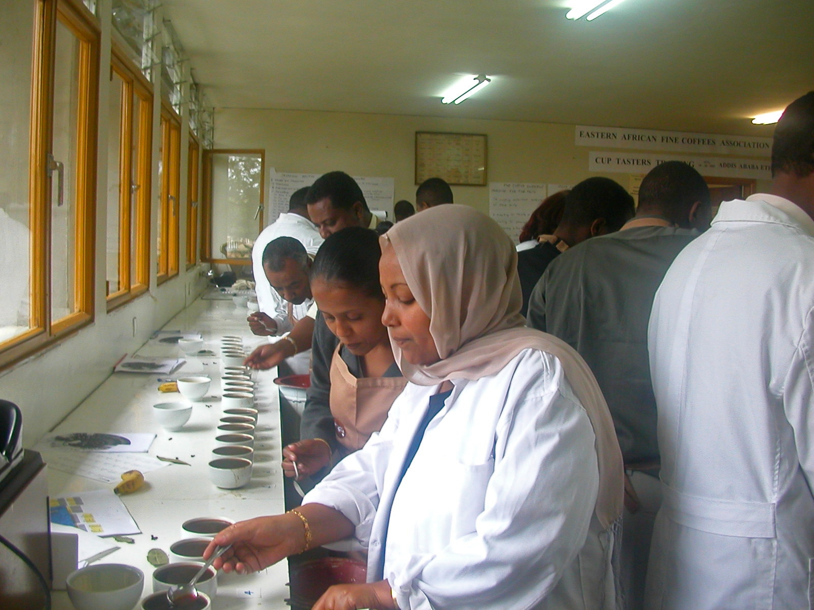

# What NOT to

*The checks that don't belong in scripts: exploratory testing, usability and visual judgment, one-offs, and features still in churn - not because automation is weak there, but because those checks either have no objective pass/fail or can never repay the script's cost.*

> A team decides their goal is "100% automation." They script everything on the test plan - including
> "verify the dashboard is intuitive for a first-time user," which becomes a script asserting that
> certain elements exist at certain positions. The script passes for a year. In that year, the dashboard
> accumulates three confusing relabels, a hidden critical button, and an onboarding flow that new users
> abandon halfway - all "verified intuitive" by a green check on every build. Automating a judgment
> didn't check the judgment; it replaced the judgment with something a machine could do, and quietly
> stopped anyone from making it.

> **In real life**
>
> Coffee is graded by machines for a lot of things - bean size, moisture content, defect counts. But
> walk into a cupping lab and you'll find rows of identical cups and professionals in white coats,
> slurping from spoons and taking notes. Why? Because "is this lot's quality worth the price" comes down
> to aroma, flavor, body - properties that only exist in a trained human's perception. No one has
> automated the cuppers, not for lack of trying, but because the cup's measurement instrument IS the
> human. Some testing is like moisture content: objective, automate it. And some is like cupping:
> the tester's perception is the instrument, and a script that replaces it isn't measuring anything.

**What NOT to automate**: The categories that don't belong in automation: EXPLORATORY TESTING (the value is a human noticing the unexpected - a script only checks what someone already thought of, so scripting it deletes the entire point), USABILITY AND VISUAL JUDGMENT ('intuitive', 'readable', 'looks right' have no objective expected value a machine can compare against), ONE-OFFS AND RARELY-RUN CHECKS (a script's cost is repaid by repetition; a check run once or yearly never repays it), FEATURES STILL IN CHURN (scripts against a UI redesigned every sprint generate maintenance and false reds, not protection), and INHERENTLY NON-DETERMINISTIC OUTCOMES (if the correct result legitimately varies, a script can only flap). These aren't automation's failures waiting for better tools - the first two are checks where the human is the instrument, the rest are checks where the economics can never work.

## The categories, and why each one resists

- **Exploratory testing.** A script executes what someone anticipated; exploration exists to find
  what nobody anticipated. The tester varies the path BECAUSE of what the last screen showed - a
  judgment loop no predefined script contains. Automating it doesn't do exploration faster; it
  produces a regression check and stops the exploring.
- **Usability and UX judgment.** "Can a new user figure this out?" has no expected value to assert.
  A machine can verify the button exists; it cannot verify the button makes sense. These checks need
  the human because the human's confusion IS the measurement.
- **Visual design quality.** Tools can diff screenshots pixel-by-pixel - that's checking "did it
  change," not "is it good." The diff tool flags an intentional improvement and misses that the
  layout was always cluttered. Machines detect change; humans judge quality.
- **One-offs and rarities.** A migration spot-check, a yearly compliance walkthrough: scripting costs
  more than a careful manual pass, and the script rots unused between runs. Payback comes from
  repetition; no repetition, no payback.
- **Features mid-churn.** Not "never," but "not yet" - every sprint of redesign breaks the scripts,
  and a suite that's red for non-reasons teaches the team to ignore red. Cover churning features with
  exploratory testing until they settle, then automate ([[automation-foundations/why-and-when-to-automate/what-to-automate]]).
- **Inherently non-deterministic outcomes.** Recommendations that legitimately vary, content that
  depends on external feeds, timing-dependent behavior with no stable expected value. A script needs
  an expected result; when "correct" is a range of maybes, the script either flaps or asserts nothing.

> **Tip**
>
> Quick litmus test before scripting any check, in order: Could two competent testers disagree on
> pass/fail? (If yes - it's judgment; keep it human.) Will this run at least monthly? (If no - the
> script won't repay itself.) Did this screen change in the last two sprints? (If yes - not yet.)
> Three questions, and most bad automation candidates fail within seconds.

> **Common mistake**
>
> Hearing "don't automate exploratory or usability work" as "that work is optional." Teams that
> automate everything scriptable sometimes reallocate ALL tester time to maintaining the suite - and
> the un-automatable checks silently stop happening, exactly like the Hook's dashboard. The correct
> conclusion runs the other way: because these checks CAN'T be delegated to machines, human time is
> precisely what they must be budgeted for - it's where freed-up tester hours are supposed to go.


*Ethiopian coffee tasters, Coffee Corps Advanced Cuppers Training — G. LaRue, USAID Africa Bureau, Wikimedia Commons, Public domain. [Source](https://commons.wikimedia.org/wiki/File:Ethiopia_coffee_tasters_(5762556065).jpg)*
- **Rows of identical cups** — Same beans, same grind, same water, same steep - the inputs are perfectly standardized, and STILL no machine issues the grade. Objective preparation, subjective verdict: exactly the shape of a usability check.
- **A taster mid-slurp, spoon in hand** — The measuring instrument is a trained human palate - there is nothing to extract into a script, because the perception itself is the measurement. Usability, visual quality, and exploratory insight work the same way.
- **CUP TASTERS TRAINING banner** — Judgment is a trained, professional skill - not a gap where automation hasn't arrived yet. Exploratory testing and UX evaluation are disciplines you get better at, not scripts waiting to be written.
- **Score sheets on the counter** — Human judgment still produces structured, comparable records - cupping forms, session notes, exploratory charters. 'Not automatable' never means 'not rigorous.'

**What happens when a judgment call gets turned into a script - press Play**

1. **The test plan says: 'verify checkout feels effortless'** — A genuine, important check - and a judgment. A human runs it by going through checkout and noticing friction.
2. **It gets 'automated' as: assert 4 elements exist, flow completes in under 8s** — The only parts a machine could grip. The judgment - effortless for a person - is not in the script, because it can't be.
3. **The flow degrades: a confusing coupon field, an alarming error style, an extra confirm step** — Every element still exists. The flow still completes in 6 seconds. The script stays green through all of it.
4. **Support tickets and cart abandonment rise** — Users are failing a check the dashboard says is passing - because what was automated was never the check, just its shadow.
5. **Verdict** — The script isn't lying - it verifies exactly what it asserts. The failure happened at conversion: a judgment was swapped for a proxy, and the team stopped making the judgment.

The line to keep: a machine compares actual to expected - so a check with no objective expected
value doesn't get automated when you script it, it gets replaced by a weaker check wearing its name.

*Run it - a layout-assertion script vs a human review on two changes (Python)*

```python
# A 'UX check' scripted as layout assertions: it compares tracked properties to a baseline.
# Watch it judge two changes: a genuine improvement, and a genuine usability bug.

BASELINE = {
    "buy_button_present": True,
    "buy_button_x": 720, "buy_button_y": 540,
    "buy_button_color": "green",
    "form_fields": 3,
    "checkout_steps": 2,
    "buy_button_label": "Buy now",
}

def script_verdict(page):
    diffs = [k for k in BASELINE if page.get(k) != BASELINE[k]]
    return ("FAIL", diffs) if diffs else ("PASS", diffs)

improvement = dict(BASELINE)
improvement["buy_button_x"] = 640      # moved into the user's natural scan path
improvement["buy_button_y"] = 480
improvement["buy_button_color"] = "brand-accent"  # higher contrast, on brand

usability_bug = dict(BASELINE)
usability_bug["buy_button_label"] = "Initiate Transaction Finalization"

print("Change 1: deliberate redesign - button moved into scan path, contrast raised")
verdict, diffs = script_verdict(improvement)
print("  script says:", verdict, "- differences:", diffs)
print("  human review says: clearly better - nothing users rely on was harmed")
print("  -> FALSE ALARM: the script punishes improvement, because it can only detect change")
print()
print("Change 2: button relabeled to 'Initiate Transaction Finalization'")
verdict, diffs = script_verdict(usability_bug)
print("  script says:", verdict, "- differences:", diffs)
print("  human review says: new users will not understand this is the purchase button")
print("  -> LOOKS CAUGHT - the label IS tracked, so the script fails... but read its reason:")
print("     it reports 'value differs from baseline', the same thing it said about the improvement.")
print("     It cannot tell betrayal from progress - a human must still make every real call.")
```

Same demonstration in Java:

*Run it - a layout-assertion script vs a human review on two changes (Java)*

```java
import java.util.*;

public class Main {
    static Map<String, String> baseline() {
        Map<String, String> m = new LinkedHashMap<>();
        m.put("buy_button_present", "true");
        m.put("buy_button_x", "720");
        m.put("buy_button_y", "540");
        m.put("buy_button_color", "green");
        m.put("form_fields", "3");
        m.put("checkout_steps", "2");
        m.put("buy_button_label", "Buy now");
        return m;
    }

    static List<String> diffs(Map<String, String> base, Map<String, String> page) {
        List<String> out = new ArrayList<>();
        for (String k : base.keySet()) {
            if (!base.get(k).equals(page.get(k))) out.add(k);
        }
        return out;
    }

    public static void main(String[] args) {
        Map<String, String> base = baseline();

        Map<String, String> improvement = baseline();
        improvement.put("buy_button_x", "640");
        improvement.put("buy_button_y", "480");
        improvement.put("buy_button_color", "brand-accent");

        Map<String, String> usabilityBug = baseline();
        usabilityBug.put("buy_button_label", "Initiate Transaction Finalization");

        System.out.println("Change 1: deliberate redesign - button moved into scan path, contrast raised");
        List<String> d1 = diffs(base, improvement);
        System.out.println("  script says: " + (d1.isEmpty() ? "PASS" : "FAIL") + " - differences: " + d1);
        System.out.println("  human review says: clearly better - nothing users rely on was harmed");
        System.out.println("  -> FALSE ALARM: the script punishes improvement, because it can only detect change");
        System.out.println();
        System.out.println("Change 2: button relabeled to 'Initiate Transaction Finalization'");
        List<String> d2 = diffs(base, usabilityBug);
        System.out.println("  script says: " + (d2.isEmpty() ? "PASS" : "FAIL") + " - differences: " + d2);
        System.out.println("  human review says: new users will not understand this is the purchase button");
        System.out.println("  -> LOOKS CAUGHT - the label IS tracked, so the script fails... but read its reason:");
        System.out.println("     it reports 'value differs from baseline', the same thing it said about the improvement.");
        System.out.println("     It cannot tell betrayal from progress - a human must still make every real call.");
    }
}
```

### Your first time: Your mission: catch a judgment check wearing a script's clothes

- [ ] Take any test plan or checklist you have access to (or the shortlist from the previous note) — Real checks someone actually runs - ten is plenty.
- [ ] Mark every check whose pass/fail two competent testers could argue about — 'Looks correct', 'is intuitive', 'feels fast', 'renders properly' - anything where the verdict lives in perception, not comparison.
- [ ] For each marked check, write what a script COULD assert about it — Element exists, response under N ms, no console errors - notice how far that proxy sits from the actual question the check asks.
- [ ] Label each marked check 'human: exploratory/usability' instead of 'automate later' — That relabeling is the whole skill: these aren't automation debt, they're a different kind of work that needs budgeted human time.

You've now separated checks-a-machine-can-decide from judgments-a-human-must-make - and seen exactly
what gets lost when the second kind is forced into the first kind's shape.

- **The suite has been green for months, but users keep reporting the product is confusing, ugly, or frustrating in areas the suite 'covers.'**
  Look at what those green checks actually assert - almost certainly element-existence and timing proxies standing in for judgment checks. The fix isn't better scripts; it's restoring the human activity the scripts replaced: schedule exploratory sessions and usability passes for those areas, and stop counting the proxies as coverage of the judgment.
- **A chunk of the suite flaps red/green across runs with no code changes, and it's always the same scripts.**
  Check whether those scripts assert outcomes that are legitimately non-deterministic - live feeds, recommendations, timing-sensitive rendering. If the correct behavior genuinely varies, no retry logic will fix the script; either pin the variability in the test environment (seeded data, fixed clock, mocked feed) so a real expected value exists, or take the check back to human review.

### Where to check

- **The assertions inside your 'UX' and 'visual' automated checks** — read what they literally verify; if it's element-existence and load-time proxies, the judgment check they replaced isn't happening anywhere.
- **The suite's flakiest scripts, cross-referenced with what they assert** — persistent flappers often turn out to assert non-deterministic outcomes; that's a category error, not a stability bug.
- **Your team's calendar, for exploratory and usability sessions** — the direct test of the mistake-callout: if freed-up tester time all went to suite maintenance, the un-automatable checks stopped existing.
- **[[automation-foundations/why-and-when-to-automate/manual-vs-automated]]** — the next note assembles both halves: how the scripted lane and the human lane divide the work of one release.

### Worked example: the 100% automation goal, audited a year later

1. A team adopts a goal: every check on the test plan gets automated. A year later, a new QA lead
   audits the resulting 400-script suite.
2. She finds 60 scripts that map to judgment checks - 'intuitive', 'consistent look', 'clear error
   messages' - each automated as element-existence plus timing assertions. All green, always.
3. She cross-references support tickets: the product's top three complaint themes (confusing
   navigation, alarming error screens, cluttered settings page) all live in areas those 60 green
   scripts 'cover.' Nobody had LOOKED at those areas in months - why would they, the checks pass.
4. She also finds 45 scripts that have failed intermittently forever: they assert on a live
   recommendations panel whose correct content legitimately varies per run. The team's habit was
   'rerun until green' - which had already trained them to rerun genuine failures too.
5. The fix: the 60 judgment proxies are deleted and replaced with a monthly exploratory/usability
   rotation with charters and session notes; the 45 flappers get seeded data and a mocked feed so a
   real expected value exists, or move to the human rotation. The suite shrinks by a quarter and
   both the suite and the humans start catching things again.

**Quiz.** A test plan item reads: 'Verify the new-user onboarding flow is easy to complete without help.' What does this note say is the right way to handle it?

- [ ] Automate it as: all onboarding screens load, required fields accept input, and the flow completes in under 60 seconds
- [x] Keep it as recurring human work - a usability pass where a tester (ideally watching a real new user) judges where the flow confuses people
- [ ] Automate it once the onboarding flow's UI stops changing between sprints
- [ ] Drop it from the plan, since checks without objective pass/fail criteria aren't real tests

*'Easy to complete without help' is a judgment about human experience - the measurement instrument is a person's confusion or ease, so a human must run the check, and it stays valuable release after release. Option one is the Hook's exact failure: those assertions are a proxy that stays green while the flow becomes confusing, replacing the judgment rather than performing it. Option three misdiagnoses the blocker - stability fixes the churn problem, but no amount of stability gives 'easy' an objective expected value a machine can compare. Option four throws away a critical check because it doesn't fit the tool - the note's point is the reverse: because machines can't do this work, human time must be explicitly budgeted for it.*

- **The five don't-automate categories** — Exploratory testing (the point is human noticing), usability/UX judgment (no objective expected value), visual design quality (machines detect change, not goodness), one-offs/rarities (no repetition, no payback), and features mid-churn (scripts break faster than they protect) - plus inherently non-deterministic outcomes.
- **The cupping-lab analogy** — Bean size and moisture are machine-graded; the quality verdict comes from trained humans slurping from spoons - because the human perception IS the instrument. Some checks are moisture content; some are cupping.
- **The three-question litmus test** — Could two competent testers disagree on pass/fail? Will it run at least monthly? Did the screen change in the last two sprints? Judgment, payback, stability - most bad candidates fail in seconds.
- **What actually happens when you script a judgment check** — The judgment isn't automated - it's replaced by a proxy (elements exist, loads fast) that stays green while the real quality degrades, and the team stops making the judgment at all.
- **The right conclusion from 'machines can't do this'** — Not 'skip it' - the opposite: un-automatable checks are exactly where freed-up human tester time must be budgeted; that reallocation is automation's whole payoff.

### Challenge

Find one green automated check in any suite you can read (or write the one you'd expect to exist for
an app you use) that claims to cover a quality like 'usable', 'clear', or 'looks right'. List what
it literally asserts, then spend ten minutes doing the human version of the check on the same
screen. Write down everything you noticed that the assertions could never catch - that list is the
gap this note is about.

### Ask the community

> Leadership set a '95% test automation' target and my exploratory and usability sessions keep getting deprioritized because they don't move the metric. How do I defend un-automatable testing work?

Useful replies usually attack the metric's denominator: a percentage of WHAT? Counting judgment
checks in an automation target guarantees they're either faked as proxies or dropped - the workable
framing is two separate budgets (automated coverage of machine-decidable checks, plus scheduled
human sessions for judgment work), reported side by side.

- [Satisfice (James Bach) — Exploratory Testing](https://www.satisfice.com/exploratory-testing)
- [BrowserStack — Exploratory Testing: A Detailed Guide](https://www.browserstack.com/guide/exploratory-testing)
- [Serenity Dojo TV — This is Why You SHOULD NOT Automate Your Test Cases](https://www.youtube.com/watch?v=2SKEqGxWnrI)

🎬 [Serenity Dojo TV — This is Why You SHOULD NOT Automate Your Test Cases](https://www.youtube.com/watch?v=2SKEqGxWnrI) (4 min)

- Don't automate checks where the human is the instrument: exploratory testing, usability judgment, and visual quality have no objective expected value for a machine to compare against.
- Don't automate checks that can't repay a script: one-offs, rarities, and features still changing every sprint - 'not yet' for churn, 'never' for no-repetition.
- Scripting a judgment check doesn't automate it - it substitutes a proxy that stays green while the real quality rots, and the judgment silently stops being made.
- Persistently flaky scripts often assert legitimately non-deterministic outcomes - pin the variability with seeded data and mocks so an expected value exists, or return the check to humans.
- 'Machines can't do this' means budget human time for it - the un-automatable checks are where automation's freed-up hours are supposed to go.


## Related notes

- [[Notes/automation-foundations/why-and-when-to-automate/what-to-automate|What to automate]]
- [[Notes/automation-foundations/why-and-when-to-automate/manual-vs-automated|Manual vs automated]]
- [[Notes/automation-foundations/pitfalls/over-automation|Over-automation]]


---
_Source: `packages/curriculum/content/notes/automation-foundations/why-and-when-to-automate/what-not-to-automate.mdx`_
