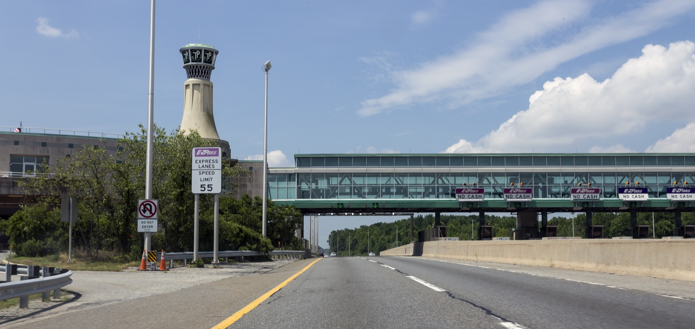

# What to automate

*The checks worth automating share a profile: run often, steps never change, result is objectively pass/fail, and the flow matters enough that breakage hurts - regression, smoke, data-driven and cross-browser checks fit; everything else earns its place by scoring, not excitement.*

> A team gets budget for automation and spends the first month scripting their newest, most exciting
> feature - the one the demo showcases. The scripts break weekly, because the feature changes weekly.
> Meanwhile login, checkout, and search - boring, stable, executed by hand before every release for two
> years - stay manual. Six months later the team concludes "automation doesn't work for us." Nothing was
> wrong with their tools. They automated the wrong things. Picking WHAT to automate is a skill of its
> own, and it has actual criteria - not vibes.

> **In real life**
>
> Approach a modern toll plaza. The E-ZPass express lanes handle the overwhelming standard case - a
> normal vehicle with a transponder - at 55 mph, unattended, thousands of times an hour, every pass
> identical: detect, read, charge, log. Nobody built an express lane for oversized loads, disputed
> charges, or drivers with questions; those go to the booth, where a human can look, judge, and decide.
> The plaza's designers didn't automate "tolls" - they automated the specific transactions that are
> high-volume, completely standard, and objectively decidable, and kept humans for everything that
> isn't. That split - express lane versus booth - is exactly the what-to-automate decision.

**What to automate**: Selecting what to automate means filtering candidate checks through a profile: RUN OFTEN (regression and smoke checks executed every release, build, or commit), STABLE (the feature's behavior and UI aren't changing every sprint - scripts against moving targets are pure maintenance), DETERMINISTIC (a machine can decide pass/fail objectively - same input, same expected output, no human judgment needed), and HIGH-VALUE (core flows where breakage actually hurts: login, checkout, data integrity). Data-driven checks (same steps, many input sets) and cross-browser repeats multiply the payoff, because one script replaces dozens of manual repetitions. A check that misses these criteria isn't automated 'later' by default - it must earn its place, because every script added is maintenance signed up for.

## The profile of a good automation candidate

- **It runs often.** Regression checks before every release, smoke checks on every build, sanity
  checks on every deploy. Frequency is where the payback comes from: a script that replaces a check
  done 60 times a month repays its cost fast; one replacing a yearly check may never repay it.
- **It's stable.** The feature is done changing every sprint. Scripts written against a UI mid-redesign
  break constantly - each break costs maintenance time and, worse, trains the team to ignore red.
- **It's deterministic.** Same input, same expected output, decidable by comparison - a machine can
  say pass or fail without a human squinting. "The total equals 41.98" automates; "the page feels
  responsive" does not.
- **It matters.** Core user flows - login, signup, checkout, search - where a regression means real
  damage. Automating trivia costs the same effort as automating the critical path; spend it where
  red means something.
- **Multipliers: data-driven and cross-browser repeats.** Ten input combinations through one form, or
  the same flow on Chromium and WebKit - identical steps repeated with variations are where one
  script replaces the most manual runs. Tedious precision work (comparing a 500-row export
  field-by-field) is the same shape: machines don't get bored on row 400.

> **Tip**
>
> Score candidates instead of debating them: frequency + stability + criticality, with determinism as
> a hard gate (a check a machine can't judge scores zero, full stop). Highest totals first. This turns
> "what should we automate?" from a taste argument into a sorted backlog - and it's exactly how the
> playground below works.

> **Common mistake**
>
> Automating by excitement or by ease: scripting the shiny new feature (unstable - the scripts will
> churn), or whatever's trivially scriptable (low value - green checkmarks on things nobody fears).
> Both produce the same failure: months of effort, a suite that's either constantly red for
> non-reasons or reassuringly green about nothing, and a team that concludes automation "doesn't
> work." The boring, stable, critical, endlessly-repeated checks are the whole game.


*NJ Turnpike Toll Plaza, Interchange 1 — Acroterion, Wikimedia Commons, CC BY-SA 4.0. [Source](https://commons.wikimedia.org/wiki/File:NJ_Turnpike_Toll_Plaza_1_NJ1.jpg)*
- **EXPRESS LANES, SPEED LIMIT 55** — The standard case engineered to flow at full speed with zero human involvement - your highest-frequency, most standard checks (smoke, core regression) deserve exactly this treatment: automated, on every commit.
- **The open express lanes themselves** — No stopping, no booth, no judgment call - because a transponder read is deterministic. Only checks a machine can decide objectively (same input, same expected output) qualify for this lane.
- **A row of dedicated NO CASH lanes** — The plaza multiplies the automated path across many parallel lanes - the data-driven and cross-browser multiplier: one scripted flow, repeated across many inputs and browsers, replacing dozens of manual runs.
- **The booth lanes at the plaza's edge** — Still there, still staffed - for the oversized load, the disputed charge, the unusual case. What DOESN'T fit the automation profile keeps its human lane; the next note is about exactly those.

**One candidate check going through automation triage - press Play**

1. **Candidate: 'Verify checkout total with a discount code'** — Someone proposes automating it. Instead of debating, run it through the profile.
2. **Gate: is it deterministic?** — Yes - cart of 29.99 plus 12.00 with code SAVE10 must total 37.79. A machine can compare numbers. It passes the hard gate; a 'does the page look right?' check would stop here.
3. **Score: frequency, stability, value** — Run before every release and after every pricing change (high frequency), checkout hasn't changed in a year (stable), and broken totals are revenue damage (critical). High marks across the board.
4. **Multiplier: how many variations?** — Twelve discount codes, three currencies - one script, thirty-six manual repetitions replaced per pass. The payback multiplies.
5. **Verdict: top of the automation backlog** — Not because it was exciting - because it scored highest on the exact criteria that predict payback. That's the whole method.

One line to keep: automate the express-lane transactions - frequent, standard, machine-decidable,
consequential - and let everything else earn its lane or stay with the humans.

*Run it - scoring six candidate checks for automation (Python)*

```python
# Score = frequency points + stability + criticality. Determinism is a HARD GATE:
# a check a machine can't judge objectively scores nothing, no matter how often it runs.

CANDIDATES = [
    # (name, runs_per_month, stable, deterministic, critical)
    ("Login smoke check", 60, True, True, True),
    ("Checkout total with discount codes", 40, True, True, True),
    ("CSV export matches 500 seeded orders", 12, True, True, False),
    ("New AI-suggestions panel behavior", 8, False, True, True),
    ("Onboarding copy feels friendly", 20, True, False, False),
    ("One-off migration spot-check", 1, True, True, False),
]

def freq_points(runs):
    if runs >= 20: return 3
    if runs >= 10: return 2
    if runs >= 2: return 1
    return 0

def triage(name, runs, stable, deterministic, critical):
    if not deterministic:
        return (0, "NEVER - needs human judgment, no objective pass/fail")
    score = freq_points(runs) + (2 if stable else 0) + (2 if critical else 0)
    if score >= 5: verdict = "AUTOMATE NOW"
    elif score >= 3: verdict = "LATER - payback is thin, revisit when it stabilizes or runs more"
    else: verdict = "KEEP MANUAL - a script would cost more than it saves"
    return (score, verdict)

print("Automation triage (max score 7, determinism is a hard gate):")
print()
for name, runs, stable, det, crit in CANDIDATES:
    score, verdict = triage(name, runs, stable, det, crit)
    print(" ", name)
    print("    runs/month:", runs, "| stable:", stable, "| deterministic:", det, "| critical:", crit)
    print("    score:", score, "->", verdict)
    print()
```

Same triage in Java:

*Run it - scoring six candidate checks for automation (Java)*

```java
public class Main {
    static int freqPoints(int runs) {
        if (runs >= 20) return 3;
        if (runs >= 10) return 2;
        if (runs >= 2) return 1;
        return 0;
    }

    static void triage(String name, int runs, boolean stable, boolean deterministic, boolean critical) {
        int score;
        String verdict;
        if (!deterministic) {
            score = 0;
            verdict = "NEVER - needs human judgment, no objective pass/fail";
        } else {
            score = freqPoints(runs) + (stable ? 2 : 0) + (critical ? 2 : 0);
            if (score >= 5) verdict = "AUTOMATE NOW";
            else if (score >= 3) verdict = "LATER - payback is thin, revisit when it stabilizes or runs more";
            else verdict = "KEEP MANUAL - a script would cost more than it saves";
        }
        System.out.println("  " + name);
        System.out.println("    runs/month: " + runs + " | stable: " + stable
                + " | deterministic: " + deterministic + " | critical: " + critical);
        System.out.println("    score: " + score + " -> " + verdict);
        System.out.println();
    }

    public static void main(String[] args) {
        System.out.println("Automation triage (max score 7, determinism is a hard gate):");
        System.out.println();
        triage("Login smoke check", 60, true, true, true);
        triage("Checkout total with discount codes", 40, true, true, true);
        triage("CSV export matches 500 seeded orders", 12, true, true, false);
        triage("New AI-suggestions panel behavior", 8, false, true, true);
        triage("Onboarding copy feels friendly", 20, true, false, false);
        triage("One-off migration spot-check", 1, true, true, false);
    }
}
```

### Your first time: Your mission: build a real automation shortlist

- [ ] List the last 10 checks you (or your team) executed by hand — From a release checklist, a test-case tool, or memory of the last testing session on any app you work with - real ones, not hypotheticals.
- [ ] For each, write four values: runs per month, stable yes/no, deterministic yes/no, critical yes/no — Be honest on 'stable' - if the screen changed in the last two sprints, it's a no. Be strict on 'deterministic' - if two testers could disagree on pass/fail, it's a no.
- [ ] Apply the playground's scoring by hand (or rerun it with your rows) — Frequency points plus 2 for stable plus 2 for critical; determinism failing means score zero regardless.
- [ ] Circle your top 3 - that's your automation backlog, ordered — Notice what did NOT make the list: probably the newest features and anything visual/subjective. That's the criteria working.

You've now done the selection step real teams skip - and the shape of your top 3 (boring, stable,
critical, repeated) is the shape good suites are made of.

- **The automation suite is constantly red, and almost every failure turns out to be 'the feature changed again,' not a bug.**
  The stability criterion was skipped - scripts were written against features still in churn. Pull those scripts out of the suite (park them, don't delete), let the feature settle, and re-add when it stops moving. A suite red for non-bugs trains everyone to ignore red, which destroys the suite's entire value.
- **The suite is green for months, yet regressions in login/checkout/search still reach production by hand-testing gaps.**
  Inverted selection: what got automated was the easy stuff, not the valuable stuff. Diff the suite against your actual critical flows - if the checks you'd be most scared to skip before a release aren't in the suite, they're the backlog, and the trivial checks currently padding the green count are just noise.

### Where to check

- **Your release checklist, annotated with 'how often does this run?'** — the frequency column of the scoring model; the checks executed before every single release are your top candidates by definition.
- **Sprint-over-sprint UI churn in the area you want to script** — git history or design changelogs tell you whether the feature is stable enough to automate against yet.
- **The last quarter's escaped regressions, mapped to flows** — where breakage actually hurt is the criticality column, filled in with evidence instead of opinion.
- **[[automation-foundations/why-and-when-to-automate/what-not-to-automate]]** — the mirror-image note: the categories that fail these criteria and why forcing them into scripts backfires.

### Worked example: two automation backlogs, one right and one wrong

1. Two teams at the same company get identical automation budgets. Team A asks "what's most
   impressive to automate?" Team B asks "what do we re-run most, that's stable, machine-decidable,
   and scary to break?"
2. Team A scripts their flagship new dashboard - dozens of scenarios against a UI redesigned every
   sprint. Team B scripts login, checkout with 12 discount codes, search, and the CSV export
   comparison everyone hates doing by hand.
3. Three months in: Team A's suite fails daily; every failure is churn, not bugs. Fixing scripts
   consumes the time the suite was meant to save. Team B's suite runs nightly, quietly - then one
   morning flags a checkout-total regression introduced by a pricing refactor the previous afternoon.
4. Team A pauses their suite "temporarily." Team B extends theirs with the next 5 highest-scoring
   checks from the same criteria.
5. Finding: identical tools, identical skills, opposite outcomes - decided entirely at the SELECTION
   step. Frequency, stability, determinism, value: the boring checklist beat the impressive demo.

**Quiz.** Your team can automate exactly one of these next. Going by this note's criteria, which one?

- [ ] The redesigned recommendations widget shipping incrementally over the next three sprints - it's the product's flagship feature
- [x] The login-to-dashboard smoke check: run on every build, unchanged for a year, objectively pass/fail, and everything depends on it
- [ ] A visual review that the new marketing pages look polished on mobile
- [ ] A data-integrity check for last month's one-time database migration

*The smoke check hits every criterion at once: maximum frequency (every build), proven stability (unchanged for a year), deterministic (login succeeds and the dashboard loads, or not), and maximum criticality (everything depends on it) - it's the express-lane transaction. The recommendations widget fails stability - three sprints of incremental redesign means the scripts churn weekly, this note's opening failure story. The visual polish review fails the determinism hard gate - 'looks polished' has no objective pass/fail a machine can decide. The migration check fails frequency - it verifies a one-time event, so a script would be built for a check that never runs again.*

- **The four criteria for a good automation candidate** — Runs often (frequency drives payback), stable (not changing every sprint), deterministic (machine-decidable pass/fail - a hard gate), and high-value (breakage actually hurts).
- **The toll-plaza analogy** — Express lanes automate the high-volume, standard, objectively-decidable transaction at full speed; booths keep humans for oversized loads and disputes. Automate the express-lane checks; keep booth cases human.
- **Why determinism is a hard gate, not just a score** — A machine can only compare actual vs expected - a check two humans could disagree on ('feels friendly', 'looks right') has no expected value to compare, so no amount of frequency makes it automatable.
- **The two classic wrong-selection failures** — Automating by excitement (the shiny unstable feature - suite constantly red from churn) and by ease (trivial checks - suite green about nothing). Both end with 'automation doesn't work for us.'
- **The multiplier categories** — Data-driven checks (same steps, many input sets) and cross-browser repeats - one script replaces dozens of manual runs per pass, so they repay automation fastest.

### Challenge

Take the shortlist from your FirstTime mission and stress-test the top item: write out its exact
steps, its input data, and its objectively expected result - the spec you'd hand to someone (or
some machine) to execute without asking you anything. If you can't write the expected result as a
comparable value, you've discovered it fails the determinism gate - move to the next item and note
what that teaches you about the difference between a check and a judgment.

### Ask the community

> My manager wants our newest feature automated first because it's the most important thing we're building - but it changes every sprint and the scripts keep breaking. How do I make the case for automating the stable core flows instead?

Useful replies usually suggest reframing in maintenance cost: show the hours spent re-fixing scripts
against the churning feature versus the near-zero upkeep of scripts on stable flows - and propose
covering the new feature with manual exploratory testing until it stabilizes, which is faster AND
catches more anyway.

- [Katalon — How to Select Test Cases for Automation: A Practical Guide](https://katalon.com/resources-center/blog/how-to-select-test-cases-for-automation)
- [QA Madness — An Effective Approach to Selecting Test Cases for Automation](https://www.qamadness.com/an-effective-approach-to-selecting-test-cases-for-automation/)
- [QA Madness — What Types of Testing to Automate?](https://www.youtube.com/watch?v=nhAq59rDJrk)

🎬 [QA Madness — What Types of Testing to Automate?](https://www.youtube.com/watch?v=nhAq59rDJrk) (4 min)

- Good automation candidates share one profile: run often, stable, deterministic, and consequential - frequency drives payback, stability keeps maintenance sane, determinism makes machine judgment possible, value makes red mean something.
- Determinism is a hard gate: no objective expected result, no automation - regardless of how often the check runs.
- Data-driven and cross-browser checks are multipliers: one script replaces dozens of manual repetitions per pass.
- The two classic selection failures are automating by excitement (unstable features, constant red) and by ease (trivial checks, meaningless green).
- Score candidates - frequency + stability + criticality behind the determinism gate - and work the sorted list; selection, not tooling, is what separates suites that pay off from suites that get abandoned.


## Related notes

- [[Notes/automation-foundations/why-and-when-to-automate/benefits|Benefits]]
- [[Notes/automation-foundations/why-and-when-to-automate/what-not-to-automate|What NOT to]]
- [[Notes/automation-foundations/the-automation-pyramid/roi|ROI]]


---
_Source: `packages/curriculum/content/notes/automation-foundations/why-and-when-to-automate/what-to-automate.mdx`_
