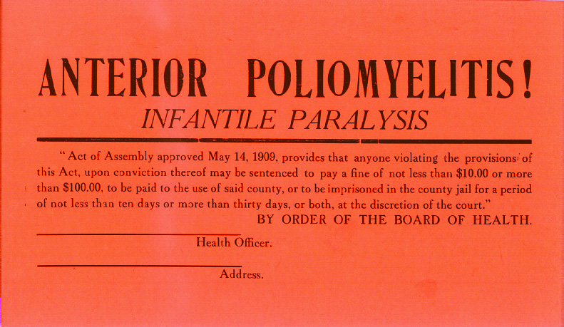

# Quarantine

*Quarantine temporarily removes a proven unstable test from a blocking lane while keeping it visible, running, owned, time-bounded, and measured; an untracked skip is deletion, not quarantine.*

> A flaky checkout test blocks releases, so someone adds `skip`. Six months later checkout breaks in
> production and the team discovers its only end-to-end guard has not executed once. The immediate
> noise disappeared by silently deleting coverage.

> **In real life**
>
> Medical quarantine separates a risk from the main population while preserving identification,
> observation, authority, and a condition for release. CI quarantine should isolate blocking impact,
> not make the test invisible.

**Test quarantine**: Test quarantine is a temporary governance state for a confirmed unstable test. The test is excluded from a specific blocking decision but continues in a visible non-blocking lane with an owner, issue, reason, evidence, start date, expiry, review cadence, affected risk, and objective exit criteria. Quarantine volume and age are quality metrics.

## A quarantine record is part of the test

```yaml
test_id: checkout::creates_order
issue: QA-1842
owner: payments-qa
started: 2026-07-17
expires: 2026-07-24
scope: chromium-linux
exit: 200 consecutive equivalent passes after fix
```

Keep the quarantined lane red/visible in reports without blocking the chosen merge/release decision.
If the feature risk is critical, replace lost coverage with another gate before relaxing the original.

> **Tip**
>
> Expire quarantine automatically. A bot or gate should fail governance when the expiry passes, even
> if the test itself remains non-blocking, forcing review instead of permanent limbo.

> **Common mistake**
>
> Quarantining after one unexplained failure. First preserve evidence and establish instability. A
> deterministic product regression placed in quarantine is a safety failure.


*Polio quarantine card — author unknown, U.S. public domain. [Source](https://commons.wikimedia.org/wiki/File:Polio_quarantine_card.jpg)*
- **Named condition** — The sign clearly identifies why isolation exists; test quarantine needs the same explicit reason.
- **Governance** — Authority, scope, evidence, and enforcement rules prevent informal permanent skipping.
- **Owner** — A person or team must accept responsibility for diagnosis and restoration.
- **Exit** — Expiry and measurable release criteria return the test to the blocking lane.

**A controlled quarantine lifecycle**

1. **Instability is evidenced** — Attempt history proves nondeterminism or environment instability.
2. **Risk is assessed** — Decide whether alternate coverage makes temporary non-blocking status acceptable.
3. **Record is approved** — Owner, issue, scope, reason, start, expiry, and exit criteria.
4. **Separate lane keeps running** — Results remain visible and measured without blocking the chosen decision.
5. **Cause is fixed** — Change test, product, data, environment, or infrastructure.
6. **Exit evidence restores gate** — Meet stability threshold and remove quarantine metadata.

*Run it — flag expired quarantine records (Python)*

```python
``from datetime import date
records = [("checkout", date(2026, 7, 16)), ("search", date(2026, 7, 20))]
today = date(2026, 7, 17)
for test, expiry in records:
    print(test, "EXPIRED" if expiry < today else f"active until {expiry}")``
```

*Run it — flag expired quarantine records (Java)*

```java
``import java.time.*;
import java.util.*;

public class Main {
    record Q(String test, LocalDate expiry) {}
    public static void main(String[] args) {
        var today = LocalDate.parse("2026-07-17");
        var records = List.of(new Q("checkout", LocalDate.parse("2026-07-16")),
            new Q("search", LocalDate.parse("2026-07-20")));
        for (Q q : records)
            System.out.println(q.test() + " " + (q.expiry().isBefore(today) ? "EXPIRED" : "active until " + q.expiry()));
    }
}``
```

### Your first time: Your mission: quarantine without losing the risk

- [ ] Prove and classify instability — Link attempt evidence and distinguish test, product, environment, infrastructure, or dependency.
- [ ] Assess lost coverage — Name the protected risk and any replacement gate.
- [ ] Create the governance record — Owner, issue, reason, scope, start, expiry, review, and exit threshold.
- [ ] Keep it executing — Verify the separate lane reports results and expiry monitoring works.

You have temporary isolation with accountability, not a permanent skip.

- **Quarantined tests disappear from reports.**
  Run them in a separate non-blocking job and publish attempt-level results and artifacts.
- **The quarantine list only grows.**
  Set short expiries, age/volume limits, weekly review, owners, and a governance failure for overdue records.
- **A real regression was quarantined.**
  Restore blocking behavior, reassess release impact, and require instability evidence before future approval.
- **The test passes but remains quarantined.**
  Evaluate objective exit criteria across representative conditions, then remove metadata and confirm the gate.

### Where to check

- **Quarantine registry/annotation** — issue, owner, scope, dates, and exit.
- **Non-blocking job report** — proof the test still executes.
- **Coverage/risk record** — what gate was weakened and its substitute.
- **Expiry monitor** — overdue state and escalation.
- **Attempt history after fix** — evidence required for restoration.

### Worked example: isolating one browser without hiding checkout

1. Checkout is stable on Chromium/Firefox but intermittently times out on WebKit Linux.
2. Evidence ties the failure to a WebKit runner image update; product API results are correct.
3. The team quarantines only `webkit-linux`, not the entire test, for seven days.
4. Chromium/Firefox remain release-blocking; WebKit runs in a visible job linked to the issue.
5. After the runner fix and 200 passes, expiry automation restores WebKit to the gate.

**Quiz.** Which action is a real quarantine?

- [ ] Delete the flaky test
- [ ] Skip it indefinitely with a comment
- [x] Run it visibly outside one blocking decision with owner, issue, expiry, risk assessment, and exit criteria
- [ ] Retry until green and report only final status

*Quarantine is temporary, scoped, observable, owned, and reversible. Silent or indefinite exclusion is lost coverage.*

- **Quarantine** — Temporary scoped removal from a blocking decision while execution and visibility continue.
- **Expiry** — Date that forces review or restoration instead of permanent limbo.
- **Exit criteria** — Objective evidence required to return the test to its blocking lane.
- **Risk substitution** — Alternate control protecting the behavior while original coverage is non-blocking.
- **Quarantine debt** — Volume, age, and risk of tests currently excluded from gates.

### Challenge

Design a quarantine registry schema and policy. Add one scoped record, prove it still runs, simulate
expiry, show the replacement risk control, and restore it after a measurable stability threshold.

### Ask the community

> Test [ID] is proposed for quarantine in [scope]. Instability evidence, protected risk, replacement gate, owner/issue, expiry, and exit criterion are [values].

These facts let reviewers judge whether temporary isolation is safer than continued blocking.

- [Playwright Docs — tags and annotations](https://playwright.dev/docs/test-annotations)
- [Martin Fowler — eradicating non-determinism in tests](https://martinfowler.com/articles/nonDeterminism.html)

🎬 [Flaky Tests Foiled Forever — Craft of Testing](https://www.youtube.com/watch?v=CnjdvotD0-I) (14 min)

- Quarantine changes one blocking decision; it must not erase execution or evidence.
- Require proven instability, risk assessment, owner, issue, scope, expiry, and exit criteria.
- Quarantine the narrowest failing configuration and preserve alternate gates.
- Measure age and volume, and fail governance when records expire.
- A skip without lifecycle and visibility is deletion disguised as maintenance.


## Related notes

- [[Notes/automation-in-cicd/flake-management/detecting-flakes|Detecting flakes]]
- [[Notes/automation-in-cicd/flake-management/retries|Retries]]
- [[Notes/automation-in-cicd/gitlab-ci-and-quality-gates/blocking-a-merge-on-failure|Blocking a merge on failure]]


---
_Source: `packages/curriculum/content/notes/automation-in-cicd/flake-management/quarantine.mdx`_
