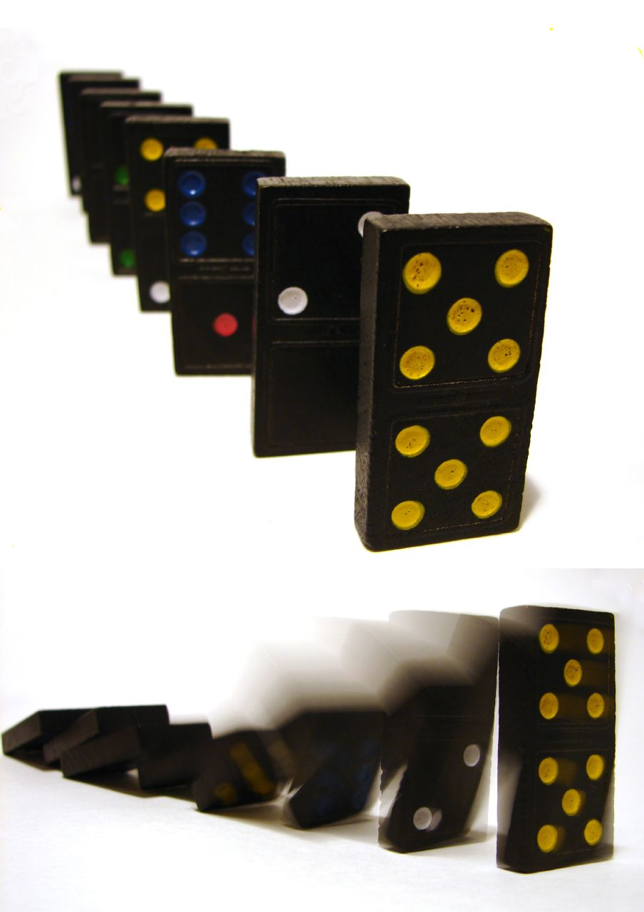

# Triggers

*GitHub Actions triggers define which repository events create runs; branch, path, activity, schedule, manual, and concurrency controls keep feedback relevant without security or cost surprises.*

> A perfect test job attached to the wrong event is still broken. It may miss the pull request that
> needed protection, run twice for every commit, or hand dangerous permissions to untrusted fork code.
> Triggers define the boundary of automation, not merely its timetable.

> **In real life**
>
> One pushed domino can start an entire chain. The engineering question is not whether the dominoes can
> fall, but which first domino is exposed, which chains it reaches, and how you stop an old chain when a
> newer push makes it irrelevant.

**workflow trigger**: A GitHub Actions trigger is an event declared under a workflow's on key that can create a run. Events include push, pull_request, workflow_dispatch, schedule, workflow_call, and many repository activities. Event configuration can filter branches, tags, paths, and activity types. The event also determines payload, commit context, token behavior, and security exposure, so similarly named triggers are not interchangeable.

## Choose the event from the decision

```yaml
on:
  pull_request:
    branches: [main]
    paths:
      - "src/**"
      - "tests/**"
  workflow_dispatch:

concurrency:
  group: ci-${{ github.workflow }}-${{ github.ref }}
  cancel-in-progress: true
```

Use `pull_request` for checks on proposed changes, `push` for the exact code that landed, and
`workflow_dispatch` for an intentional manual run. Path filters save work only when excluded paths
cannot affect the protected risk. Required checks plus path skips need careful design: a check that
never runs may remain pending and block merging.

> **Tip**
>
> Add concurrency to pull-request CI so a new commit cancels the obsolete in-progress run for that same
> branch. Do not group every branch under one shared key or unrelated work will cancel each other.

> **Common mistake**
>
> Using `pull_request_target` merely to access secrets. It runs in the base repository's privileged
> context; checking out and executing untrusted pull-request code there can expose secrets or write
> permissions. Use it only with a threat model and GitHub's secure-use guidance.


*Domino effect — Louise, CC BY 2.0. [Source](https://commons.wikimedia.org/wiki/File:Domino_effect.jpg)*
- **Event** — A push, pull request, schedule, dispatch, or repository activity can start the chain.
- **Filters** — Branch, path, tag, and activity filters decide whether this event reaches the workflow.
- **Run context** — The chosen event controls payload, revision, ref, and security context.
- **Cancellation** — Concurrency can stop obsolete work when a newer change starts the same chain.

**Should this event create a CI run?**

1. **Repository event** — A push, pull request activity, dispatch, or timer occurs.
2. **Workflow event matches** — The event must be listed under on.
3. **Activity filter matches** — Optional types narrow opened, synchronize, closed, and other activities.
4. **Branch/path filters match** — All configured dimensions must admit the change.
5. **Concurrency checked** — Older work in the same intentional group may be cancelled.
6. **Run receives context** — Jobs use the event payload and exact ref appropriate to this event.

*Run it — evaluate a trigger policy (Python)*

```python
``event = {"name": "pull_request", "branch": "main", "paths": ["src/cart.py", "docs/cart.md"]}
allowed_events = {"pull_request", "workflow_dispatch"}
relevant = any(path.startswith(("src/", "tests/")) for path in event["paths"])
trigger = event["name"] in allowed_events and event["branch"] == "main" and relevant
print("create run:", trigger)
print("reason:", "relevant PR change" if trigger else "filtered out")``
```

*Run it — evaluate a trigger policy (Java)*

```java
``import java.util.*;

public class Main {
    public static void main(String[] args) {
        String event = "pull_request", branch = "main";
        var paths = List.of("src/cart.py", "docs/cart.md");
        var allowed = Set.of("pull_request", "workflow_dispatch");
        boolean relevant = paths.stream().anyMatch(p -> p.startsWith("src/") || p.startsWith("tests/"));
        boolean trigger = allowed.contains(event) && branch.equals("main") && relevant;
        System.out.println("create run: " + trigger);
        System.out.println("reason: " + (trigger ? "relevant PR change" : "filtered out"));
    }
}``
```

### Your first time: Your mission: prove an event boundary

- [ ] Write a pull_request trigger for the default branch — Start without path filters and record event name, ref, and SHA in the log.
- [ ] Push a second commit to the same pull request — Confirm synchronize creates a run for the new revision.
- [ ] Add branch-scoped concurrency — Push twice quickly and verify only obsolete work for that pull request is cancelled.
- [ ] Add a manual trigger — Run it deliberately and compare its event context with the pull-request run.

You can now explain why every run exists and which revision it judges.

- **The workflow runs twice for one change.**
  Check whether push and pull_request both match the feature branch. Decide which decision each run serves.
- **A required check stays pending after a docs-only change.**
  The workflow may be path-filtered away while protection still expects its check. Redesign the gate or run a lightweight decision job.
- **New commits do not cancel old runs.**
  Inspect the concurrency group. It must be stable for one pull request but distinct across unrelated branches.
- **A forked pull request cannot read secrets.**
  Treat this as a security boundary. Redesign the test; do not execute fork code in a privileged target context.

### Where to check

- **Run event label and payload context** — what actually started the run.
- **Workflow `on` block** — event, activity, branch, tag, and path filters.
- **Ref and SHA in logs** — the revision being checked differs by event.
- **Concurrency group** — whether cancellation scope is too broad or narrow.
- **Token permissions and secret availability** — especially for forks and privileged events.

### Worked example: the duplicate CI bill

1. A workflow triggers on every `push` and every `pull_request`.
2. A developer pushes to a feature branch with an open pull request, creating two identical suites.
3. Neither run is technically wrong, but cost doubles and check names confuse reviewers.
4. The team uses pull_request for pre-merge tests and limits push to main for post-merge verification.
5. Each event now serves a distinct decision; concurrency cancels obsolete pull-request revisions.

**Quiz.** Why is pull_request_target unsafe for casually running code from an external pull request?

- [ ] It has no event payload
- [ ] It runs only on Windows
- [x] It can have base-repository privileges, so executing untrusted pull-request code can expose secrets or write access
- [ ] It cannot use YAML

*The privileged base-repository context is useful for narrow trusted automation but dangerous when combined with checkout and execution of attacker-controlled code.*

- **pull_request** — Pre-merge event for proposed changes, with fork safety restrictions.
- **push** — Event for commits or tags written to repository refs; often used for post-merge checks.
- **workflow_dispatch** — An explicitly manual trigger that can accept declared inputs.
- **Concurrency's CI purpose** — Cancel obsolete runs for the same branch or pull request when a newer revision arrives.
- **Path-filter risk** — A required workflow skipped by filters may leave its expected check pending.

### Challenge

Inventory every trigger in one repository. For each, state its decision, revision context, permissions,
secret exposure, duplication risk, and cancellation group. Remove one trigger with no distinct job.

### Ask the community

> Workflow [name] was [missing/duplicated/cancelled] for event [event]. Branch, changed paths, ref/SHA, filters, and concurrency group were [values].

Those values turn trigger debugging from guesswork into a deterministic filter check.

- [GitHub Docs — Events that trigger workflows](https://docs.github.com/en/actions/reference/workflows-and-actions/events-that-trigger-workflows)
- [GitHub Docs — Control workflow concurrency](https://docs.github.com/en/actions/how-tos/write-workflows/choose-when-workflows-run/control-workflow-concurrency)

🎬 [Triggers & Events in GitHub Actions — DevTips Daily](https://www.youtube.com/watch?v=PG19_K1300A) (7 min)

- Triggers define the scope, revision context, cost, and security boundary of a workflow.
- Use pull_request, push, and manual events for distinct decisions rather than duplicating work.
- Branch and path filters save work only when they cannot bypass or strand a required check.
- Concurrency should cancel obsolete work within one change, not unrelated branches.
- Never execute untrusted pull-request code in a privileged target context without a threat model.


## Related notes

- [[Notes/automation-in-cicd/github-actions/workflow-basics|Workflow basics]]
- [[Notes/automation-in-cicd/scheduling-and-reporting/scheduled-runs|Scheduled runs]]
- [[Notes/automation-in-cicd/gitlab-ci-and-quality-gates/blocking-a-merge-on-failure|Blocking a merge on failure]]


---
_Source: `packages/curriculum/content/notes/automation-in-cicd/github-actions/triggers.mdx`_
