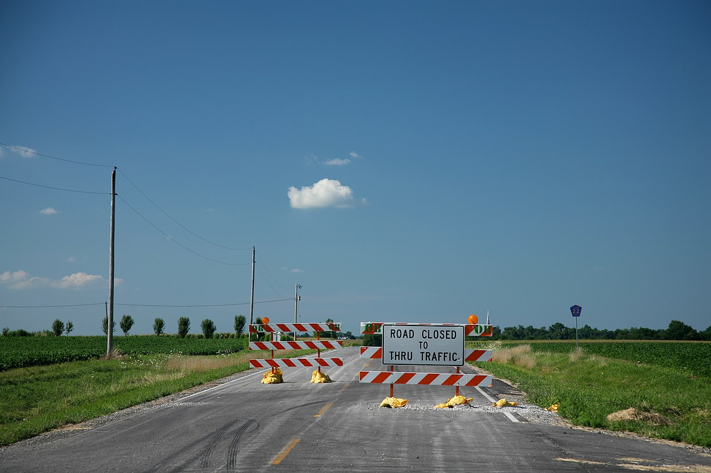

# Blocking a merge on failure

*A merge gate must require the latest candidate pipeline and prevent failed, missing, stale, skipped, or unauthorized evidence from entering the protected branch while retaining an audited exception path.*

> A red pipeline that reviewers may ignore is a notification, not a gate. A green pipeline for yesterday's
> commit is worse: it looks like a gate while protecting the wrong code. Enforcement must bind required
> evidence to the latest candidate revision and make bypass visible.

> **In real life**
>
> A road barrier works because it physically prevents unsafe traffic from proceeding. A sign that says
> "please consider stopping" is information. Merge protection needs the barrier, a rule for opening it,
> and a record of who did so — not merely a colorful pipeline badge.

**merge gate**: Blocking a merge on failure means configuring GitLab merge checks and protected-branch controls so a merge request cannot enter the target branch until the required pipeline for the latest candidate revision succeeds. A robust gate also handles missing, skipped, manual, stale, cancelled, and allowed-to-fail jobs; prevents direct unauthorized pushes; and records exceptional overrides. 'Pipelines must succeed' is the core setting, not the entire governance model.

## Define all non-green states

Ask what happens when:

- no pipeline is created because workflow rules filtered it out;
- a required job is skipped, manual, cancelled, or marked `allow_failure`;
- a new commit arrives while an old green pipeline is displayed;
- a merge train creates a different combined revision;
- an administrator overrides the check or pushes directly.

The safest rule is simple: the latest candidate revision has fresh, successful, required evidence.
Everything else is blocked or governed explicitly.

> **Tip**
>
> Deliberately test the gate with a failing job, no pipeline, skipped job, stale green run, and direct
> push attempt. Settings pages are claims; these adversarial merge requests are evidence.

> **Common mistake**
>
> Marking a flaky required test `allow_failure` permanently. This changes a quality gate into decoration.
> Quarantine the narrow test with an owner and expiry while preserving a stable blocking signal.


*Road closed, Champaign County — Daniel Schwen, CC BY-SA 4.0. [Source](https://commons.wikimedia.org/wiki/File:Road_closed.jpg)*
- **Hard block** — The merge action is unavailable while required evidence is not successful.
- **Readable reason** — The merge request names the failing/missing check and links to evidence.
- **Protected boundary** — Direct pushes cannot bypass the merge-request gate for ordinary users.
- **Governed exception** — Any emergency opening requires authority, reason, audit record, owner, and follow-up.

**Latest revision to protected branch**

1. **Candidate revision formed** — The merge request or train identifies the exact SHA to judge.
2. **Pipeline required** — Rules must create the intended pipeline rather than silently skip it.
3. **Required jobs resolve** — Failures, cancellations, skips, manuals, and allowed failures are interpreted by policy.
4. **Approvals checked** — Code ownership and human review complement automated evidence.
5. **Merge allowed** — Only the current candidate with successful evidence crosses the boundary.
6. **Override audited** — Exceptional authority records reason, actor, consequence, and remediation.

*Run it — evaluate a merge gate (Python)*

```python
``candidate = "abc123"
pipeline = {"sha": "abc123", "status": "success", "required_jobs": {"tests": "success", "scan": "success"}}
approvals = 2
fresh = pipeline["sha"] == candidate
jobs_green = all(status == "success" for status in pipeline["required_jobs"].values())
allowed = fresh and pipeline["status"] == "success" and jobs_green and approvals >= 2
print("fresh evidence:", fresh)
print("merge allowed:", allowed)``
```

*Run it — evaluate a merge gate (Java)*

```java
``import java.util.*;

public class Main {
    public static void main(String[] args) {
        String candidate = "abc123", pipelineSha = "abc123", pipelineStatus = "success";
        var jobs = Map.of("tests", "success", "scan", "success");
        int approvals = 2;
        boolean fresh = pipelineSha.equals(candidate);
        boolean jobsGreen = jobs.values().stream().allMatch("success"::equals);
        boolean allowed = fresh && pipelineStatus.equals("success") && jobsGreen && approvals >= 2;
        System.out.println("fresh evidence: " + fresh);
        System.out.println("merge allowed: " + allowed);
    }
}``
```

### Your first time: Your mission: attack the merge gate safely

- [ ] Enable successful-pipeline requirements on a sandbox project — Protect the target branch and configure required approvals.
- [ ] Open a merge request with a deliberate test failure — Confirm the merge action is blocked and points to the job.
- [ ] Test missing, skipped, and stale evidence — Change workflow rules, skip a job, and push after a green run; each should behave intentionally.
- [ ] Test bypass authority and audit — Use approved roles only and verify actor, reason, and event are recorded.

The gate is real only after the bypass attempts fail or create governed evidence.

- **A failed pipeline still allows merging.**
  Check Pipelines must succeed, allow_failure, merge permissions, protected branches, and whether this is the MR's latest pipeline.
- **No pipeline exists but merge is allowed.**
  Align workflow rules and project policy so missing required evidence blocks rather than counts as success.
- **An old green pipeline remains after a new push.**
  Verify latest-SHA association, merge-result pipelines/trains, cancellation behavior, and required fresh pipeline settings.
- **The gate blocks forever on a manual job.**
  Decide whether the manual job is genuinely required; encode optional versus blocking manual behavior deliberately.

### Where to check

- **Merge request pipeline SHA versus candidate SHA** — freshness.
- **Project merge checks** — Pipelines must succeed and skipped-pipeline behavior.
- **Job `allow_failure`, rules, and manual status** — apparent red/skip semantics.
- **Protected branch push/merge permissions** — alternate entry paths.
- **Audit events and override history** — who bypassed what, why, and what followed.

### Worked example: the green check for the wrong commit

1. Commit A passes. A reviewer sees green.
2. Commit B is pushed, but a workflow rule accidentally prevents its pipeline.
3. If policy treats missing evidence loosely, the merge button remains available.
4. The team requires a successful latest-candidate pipeline and repairs workflow rules.
5. Commit B now creates its own run; merging stays blocked until that exact evidence succeeds.

**Quiz.** What is the strongest merge-gate condition?

- [ ] Any pipeline in the project passed recently
- [ ] The author says tests passed locally
- [x] The required pipeline and jobs for the latest candidate revision succeeded, with protected entry paths
- [ ] The pipeline badge is green on the README

*Evidence must bind to the exact candidate and required checks, while protected branches close alternative entry paths. Older or unrelated green results prove nothing about the current merge.*

- **Notification versus gate** — A notification reports status; a gate physically prevents the protected action.
- **Fresh evidence** — Required results produced for the exact latest candidate revision.
- **allow_failure risk** — The job may be red without failing the pipeline, so it cannot be assumed blocking.
- **Protected branch** — Restricts direct push and merge routes that could bypass review and CI.
- **Safe override** — Rare, authorized, reasoned, audited, owned, time-bounded, and followed by remediation.

### Challenge

Threat-model one merge gate. Enumerate stale success, missing pipeline, skipped/manual job, allowed
failure, direct push, administrator override, merge train, retry, and fork cases; test each safely.

### Ask the community

> MR [id] candidate SHA [sha] is [allowed/blocked]. Latest pipeline SHA/status is [values], required jobs are [states], merge checks/protection are [settings], and override audit shows [event].

This evidence identifies whether the gap is freshness, job semantics, project policy, or alternate entry.

- [GitLab Docs — Merge when pipeline succeeds](https://docs.gitlab.com/user/project/merge_requests/merge_when_pipeline_succeeds/)
- [GitLab Docs — Protected branches](https://docs.gitlab.com/user/project/repository/branches/protected/)

🎬 [Block Merges Unless All Status Checks Pass — GitLab Unfiltered](https://www.youtube.com/watch?v=PZeTKB2DVtk) (2 min)

- A real gate prevents merging; a status badge merely informs.
- Required success must bind to the latest candidate revision, not any recent green run.
- Define missing, skipped, manual, cancelled, stale, and allowed-to-fail behavior explicitly.
- Protect the target branch so direct pushes cannot bypass the merge route.
- Test bypasses and make exceptional overrides authorized, audited, owned, and repaired.


## Related notes

- [[Notes/automation-in-cicd/gitlab-ci-and-quality-gates/quality-gates-coverage-and-sonar|Quality gates (coverage, Sonar)]]
- [[Notes/automation-in-cicd/github-actions/triggers|Triggers]]
- [[Notes/automation-in-cicd/flake-management/quarantine|Quarantine]]


---
_Source: `packages/curriculum/content/notes/automation-in-cicd/gitlab-ci-and-quality-gates/blocking-a-merge-on-failure.mdx`_
