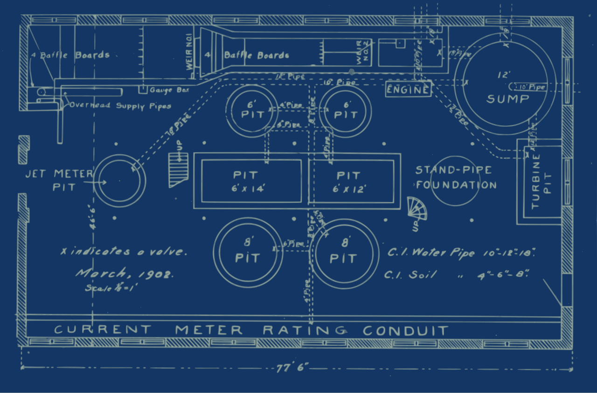

# Jenkinsfile — pipeline as code

*A Jenkinsfile stores the delivery procedure beside the application so stages, agents, steps, post actions, and branch behavior can be reviewed, versioned, reproduced, and audited.*

> The most dangerous Jenkins configuration is the one everyone depends on and nobody can review. A
> Jenkinsfile moves the procedure into the repository, where a pipeline change has an author, diff,
> branch, review, and rollback instead of a story about which checkbox somebody clicked.

> **In real life**
>
> A blueprint separates the design of a system from the particular crew and day that build it. A
> Jenkinsfile does the same for delivery: stages and requirements are versioned; agents supply the
> temporary workshop that executes the plan.

**Jenkinsfile**: A Jenkinsfile is a text file, normally at the repository root, that defines a Jenkins Pipeline using Declarative or Scripted syntax. Declarative Pipeline wraps work in a pipeline block with agent, stages, stage, steps, and optional post directives. Stored in source control and used by Pipeline or Multibranch Pipeline jobs, it makes delivery procedure reviewable and branch-aware. It does not version controller plugins, credentials, global tools, or every external service by itself.

## A minimal Declarative Pipeline

```groovy
pipeline {
  agent { label 'linux && browser' }
  options { timestamps() }
  stages {
    stage('Install') {
      steps { sh 'npm ci' }
    }
    stage('Test') {
      steps { sh 'npm test' }
    }
  }
  post {
    always { junit 'reports/*.xml' }
    unsuccessful { archiveArtifacts artifacts: 'artifacts/**', allowEmptyArchive: true }
  }
}
```

`pipeline` defines the whole Declarative model. `agent` allocates a matching executor/workspace.
`stages` organize feedback; `steps` do work. `post` preserves evidence based on the final result.

> **Tip**
>
> Begin with Declarative syntax unless you need Scripted Pipeline's flexibility. Its opinionated
> structure is easier to validate, visualize, review, and hand to the next maintainer.

> **Common mistake**
>
> Putting secrets directly in Groovy strings or environment blocks. Store credentials in Jenkins and
> bind them only around the step that needs them; avoid interpolation that can expose values in process
> arguments or logs.


*Simple blueprints — j4p4n / Openclipart, CC0. [Source](https://commons.wikimedia.org/wiki/File:Simple_blueprints.svg)*
- **pipeline boundary** — The outer block defines the reviewed delivery system.
- **stages** — Named boundaries organize build, test, and delivery feedback.
- **agent and tools** — The plan states required execution capabilities without becoming the machine.
- **post conditions** — Evidence and cleanup are part of the plan, including when a stage fails.

**Pipeline as code lifecycle**

1. **Jenkinsfile changed** — The pipeline modification appears in a branch diff.
2. **Review performed** — Peers inspect commands, permissions, credentials use, and failure behavior.
3. **Multibranch discovers** — Jenkins finds the branch and its own Jenkinsfile.
4. **Agent allocated** — The declared label or container supplies an executor and workspace.
5. **Stages execute** — Steps run in a visible, ordered pipeline model.
6. **Evidence and history** — Post actions publish results; source control retains the procedure version.

*Run it — validate a pipeline model (Python)*

```python
``pipeline = {
    "agent": "linux && browser",
    "stages": [("Install", ["npm ci"]), ("Test", ["npm test"])],
    "post": ["junit", "archive-on-failure"],
}
print("agent:", pipeline["agent"])
for name, steps in pipeline["stages"]:
    print(f"stage {name}: {', '.join(steps)}")
print("evidence:", ", ".join(pipeline["post"]))``
```

*Run it — validate a pipeline model (Java)*

```java
``import java.util.*;

public class Main {
    record Stage(String name, List<String> steps) {}
    public static void main(String[] args) {
        String agent = "linux && browser";
        var stages = List.of(new Stage("Install", List.of("npm ci")), new Stage("Test", List.of("npm test")));
        System.out.println("agent: " + agent);
        stages.forEach(s -> System.out.println("stage " + s.name() + ": " + String.join(", ", s.steps())));
        System.out.println("evidence: junit, archive-on-failure");
    }
}``
```

### Your first time: Your mission: move one job procedure into source control

- [ ] Create a Jenkinsfile on a branch — Use Declarative pipeline, one explicit agent label, and install/test stages.
- [ ] Configure a sandbox Pipeline from SCM — Point it at the repository and script path; do not replace the production job yet.
- [ ] Add always-run test publishing — Make a deliberate failure and confirm reports survive while the build remains red.
- [ ] Compare with the original job — Check parameters, credentials, tools, triggers, retention, and downstream actions before cutover.

Pipeline-as-code migration is complete only when no invisible behavior was lost.

- **Jenkins reports no stages or invalid Declarative syntax.**
  Use Pipeline Syntax or Declarative Directive Generator; check pipeline, agent, stages, stage, steps, and brace nesting.
- **A branch builds another revision.**
  In Multibranch Pipeline use the branch-provided SCM context and checkout scm rather than a hard-coded branch checkout.
- **post evidence is missing after failure.**
  Place publishing under post always or the appropriate condition and confirm paths are workspace-relative.
- **The Jenkinsfile works on one controller only.**
  Inventory plugin steps, shared libraries, credentials IDs, tools, labels, and global configuration that remain external dependencies.

### Where to check

- **Replay/model validation and Blue Ocean/classic stage view** — parsed structure and failing stage.
- **SCM revision plus Jenkinsfile commit** — which procedure and code were executed.
- **Pipeline Steps reference/Snippet Generator** — plugin-provided step names and arguments.
- **Controller plugin and shared-library versions** — dependencies not captured in the Jenkinsfile.
- **post logs and archived evidence** — whether failure paths behave as designed.

### Worked example: a successful migration that forgot reports

1. A freestyle job runs Maven tests and publishes JUnit through a post-build checkbox.
2. Its first Jenkinsfile migration keeps only `sh 'mvn test'`.
3. Failures turn the stage red, but Jenkins shows no test trend or individual failure pages.
4. The team adds `post { always { junit 'target/surefire-reports/*.xml' } }`.
5. Command and evidence contracts now match; the old job can be retired after parallel comparison.

**Quiz.** What important Jenkins state is not automatically captured by a Jenkinsfile?

- [ ] Stage names
- [ ] Shell steps
- [x] Controller plugin versions, credentials, global tools, and some shared configuration
- [ ] The repository history

*A Jenkinsfile versions the pipeline procedure, but it can call capabilities supplied by the controller. Reproducibility also requires governing plugins, credentials IDs, tools, agents, and shared libraries.*

- **stage versus step** — A stage is a visible phase; steps are the individual commands/actions inside it.
- **post always** — Runs publishing or cleanup regardless of final result, preserving failure evidence.
- **Multibranch Pipeline** — Discovers branches and pull requests containing Jenkinsfiles and creates managed branch jobs.
- **What pipeline-as-code buys** — Diff, review, branch testing, audit history, rollback, and a shared source of truth.

### Challenge

Diff one classic job against its Jenkinsfile replacement. Account for every trigger, parameter,
credential, tool, label, command, publisher, artifact, retention rule, and downstream dependency.

### Ask the community

> Jenkinsfile at [path/commit] fails in [stage] on [agent]. The parser/console says [exact error], and required plugin/shared-library versions are [values].

Share the smallest stage that reproduces the issue, with credentials redacted.

- [Jenkins Handbook — Using a Jenkinsfile](https://www.jenkins.io/doc/book/pipeline/jenkinsfile/)
- [Jenkins Handbook — Pipeline as Code](https://www.jenkins.io/doc/book/pipeline/pipeline-as-code/)

🎬 [Complete Jenkins Pipeline Tutorial — Jenkinsfile explained — TechWorld with Nana](https://www.youtube.com/watch?v=7KCS70sCoK0) (36 min)

- A Jenkinsfile makes delivery procedure versioned, reviewed, branch-aware, and auditable.
- Declarative Pipeline organizes agent requirements, stages, steps, and post behavior.
- Publish evidence in failure-safe post conditions without hiding the failing exit status.
- A Jenkinsfile still depends on governed controller plugins, credentials, tools, agents, and libraries.
- Migrate classic jobs by matching their entire contract, not only the visible shell command.


## Related notes

- [[Notes/automation-in-cicd/jenkins/jobs-and-the-classic-ui|Jobs & the classic UI]]
- [[Notes/automation-in-cicd/jenkins/agents-and-plugins|Agents & plugins]]
- [[Notes/automation-in-cicd/github-actions/workflow-basics|Workflow basics]]


---
_Source: `packages/curriculum/content/notes/automation-in-cicd/jenkins/jenkinsfile-pipeline-as-code.mdx`_
