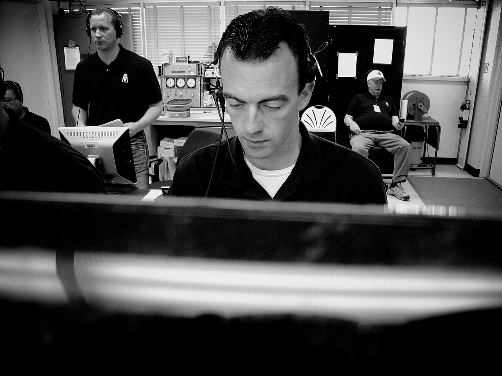

# Jobs & the classic UI

*A Jenkins job binds a trigger, source revision, runtime environment, build steps, credentials, and post-build evidence; the classic UI exposes each setting but can hide unreviewed drift.*

> A green Jenkins dashboard can represent a carefully versioned pipeline or a decade of undocumented
> checkboxes. The classic UI is useful because it reveals every job control. It is dangerous for the
> same reason: a production-changing click can exist without a commit, review, or useful diff.

> **In real life**
>
> A control room gathers triggers, instruments, switches, operators, and alarms into one view. Jenkins'
> classic UI does that for automation. Reading the panel is valuable; relying on someone's memory of
> which switch changed last Tuesday is not.

**Jenkins job**: A Jenkins job is a configured unit of automation that defines when work starts, which source and credentials it uses, where it runs, which commands or Pipeline it executes, and what happens afterward. Freestyle jobs expose these choices as classic UI sections. Pipeline jobs can also be created in the UI, but their durable procedure should normally live in a Jenkinsfile under source control. A build is one numbered execution of a job.

## Read a classic job as a contract

Audit these sections in order:

1. **General** — name, description, retention, parameters, concurrency.
2. **Source Code Management** — repository, credentials, branch/ref, checkout behavior.
3. **Build Triggers** — webhook, schedule, upstream job, polling, or manual start.
4. **Build Environment** — agent label, tools, variables, secrets, cleanup.
5. **Build Steps** — exact commands and their working directory.
6. **Post-build Actions** — reports, artifacts, notifications, downstream work.

> **Tip**
>
> Before migrating a freestyle job, export or screenshot its configuration and inspect the job's
> `config.xml` through approved administration tooling. The visible shell command is rarely the whole job.

> **Common mistake**
>
> Editing a shared job live to diagnose a failure. The next run is now a different experiment, and the
> change may never reach source control. Clone to a sandbox or change the Jenkinsfile on a branch.


*Morpheus control room — Joe Bibby / NASA, public domain (also CC BY 2.0 source). [Source](https://commons.wikimedia.org/wiki/File:Control_Room_(5762137297).jpg)*
- **Job console** — The job page gathers configuration, numbered builds, status, and links to evidence.
- **Trigger and queue** — A request enters the queue before an eligible executor runs it.
- **Environment controls** — Credentials, tools, parameters, and agent labels shape the execution.
- **Console output** — Logs explain one build, but configuration history explains why the job behaved that way.

**One classic job build**

1. **Trigger fires** — Webhook, timer, upstream job, or user schedules a build.
2. **Build enters queue** — Jenkins records parameters and waits for an eligible executor.
3. **Agent assigned** — Labels and availability select the machine and workspace.
4. **SCM checked out** — The configured repository and ref become the build source.
5. **Steps execute** — Shell, batch, Maven, Gradle, or plugin-provided builders run.
6. **Post actions publish** — Reports, artifacts, notifications, and retention apply.

*Run it — audit a job contract (Python)*

```python
``job = {
    "trigger": "webhook",
    "revision": "refs/pull/42/head",
    "agent": "linux && browser",
    "steps": ["npm ci", "npm test"],
    "post": ["junit", "archive"],
}
required = ["trigger", "revision", "agent", "steps", "post"]
missing = [field for field in required if not job.get(field)]
print("job auditable:", not missing)
print("missing:", missing or "none")``
```

*Run it — audit a job contract (Java)*

```java
``import java.util.*;

public class Main {
    public static void main(String[] args) {
        var job = new LinkedHashMap<String, Object>();
        job.put("trigger", "webhook");
        job.put("revision", "refs/pull/42/head");
        job.put("agent", "linux && browser");
        job.put("steps", List.of("npm ci", "npm test"));
        job.put("post", List.of("junit", "archive"));
        var required = List.of("trigger", "revision", "agent", "steps", "post");
        var missing = required.stream().filter(k -> !job.containsKey(k)).toList();
        System.out.println("job auditable: " + missing.isEmpty());
        System.out.println("missing: " + (missing.isEmpty() ? "none" : missing));
    }
}``
```

### Your first time: Your mission: reverse-engineer one Jenkins job

- [ ] Open one non-production job and record its type — Freestyle, Pipeline, Multibranch, or another plugin-defined type changes where truth lives.
- [ ] Trace trigger to checked-out revision — Find webhook/poll/timer settings, repository credentials, ref, and the build's actual commit.
- [ ] Trace queue to agent — Record label expression, assigned node, executor, workspace, tools, and parameters.
- [ ] Trace commands to evidence — Capture build steps, exit behavior, reports, artifacts, retention, and notifications.

You can migrate or debug the job only after its complete contract is visible.

- **A webhook arrives but no build starts.**
  Check trigger configuration, multibranch indexing, queue state, quiet period, and whether an eligible executor exists.
- **The job builds the wrong branch.**
  Inspect SCM refspec, branch specifier, webhook payload, and the revision printed in the build.
- **A command works over SSH but not in Jenkins.**
  Compare the service account, workspace, PATH, tool configuration, environment variables, and agent label.
- **A report exists on disk but not in Jenkins.**
  Check post-build publisher pattern, workspace-relative path, and whether publishing runs after failure.

### Where to check

- **Build cause and parameters** — why this numbered build exists.
- **Queue item and executor** — why it waited and where it ran.
- **SCM polling/webhook log and built revision** — trigger-to-commit truth.
- **Console output plus timestamps** — the first causal error, not only the red final line.
- **Job configuration and history/audit trail** — what changed outside the source repository.

### Worked example: the test job waiting forever

1. A freestyle job requires label `linux && chrome`.
2. The only connected agent is labelled `linux` and `chromium`.
3. The build remains queued with no console log because no executor satisfies the expression.
4. The team corrects the governed label or job requirement and documents the capability.
5. The queued build receives an agent; no test code change was ever needed.

**Quiz.** What is the difference between a Jenkins job and a build?

- [ ] They are synonyms
- [x] A job is the automation configuration; a build is one numbered execution of it
- [ ] A build contains only plugins
- [ ] A job is always a physical agent

*The job defines the repeatable contract. Every trigger creates a numbered build with its own cause, parameters, revision, logs, result, and evidence.*

- **Jenkins job** — Configured automation: triggers, SCM, environment, steps, and post-build behavior.
- **Jenkins build** — One numbered execution of a job with a cause, revision, parameters, logs, and result.
- **Why a queued job has no test log** — No agent/executor has started it; inspect labels, capacity, offline nodes, and queue reason.
- **Classic UI's main risk** — Important behavior can change through clicks without repository review or a useful diff.
- **Six audit sections** — General, SCM, triggers, environment, build steps, and post-build actions.

### Challenge

Pick one freestyle job and produce a migration-ready record: trigger, revision selection, credentials,
parameters, agent labels, commands, publishers, retention, downstream dependencies, and current owner.

### Ask the community

> Jenkins job [name/type], build [number], was triggered by [cause] for [revision], queued on [label], and failed/waited at [evidence]. Its relevant configuration is [paste].

Separate queue problems, SCM problems, command failures, and publisher failures; each lives on a different panel.

- [Jenkins Handbook — Getting started with Pipeline](https://www.jenkins.io/doc/book/pipeline/getting-started/)
- [Jenkins Handbook — Using Jenkins](https://www.jenkins.io/doc/book/using/using-jenkins/)

🎬 [Jenkins Freestyle Job: Git Integration & Build Triggers Explained — DevOpswithShiva](https://www.youtube.com/watch?v=F6GNUt6q6Vk) (38 min)

- A job is the configuration; a build is one numbered execution.
- Audit trigger, SCM, environment, steps, and post-build actions as one contract.
- Queued means no executor has started; diagnose labels and capacity before test code.
- Classic UI changes can drift outside code review, so prefer versioned Pipeline for durable procedure.
- Use build cause, revision, agent, configuration history, logs, and artifacts together when diagnosing.


## Related notes

- [[Notes/automation-in-cicd/jenkins/jenkinsfile-pipeline-as-code|Jenkinsfile — pipeline as code]]
- [[Notes/automation-in-cicd/jenkins/agents-and-plugins|Agents & plugins]]
- [[Notes/automation-in-cicd/running-tests-in-ci/running-the-suite|Running the suite]]


---
_Source: `packages/curriculum/content/notes/automation-in-cicd/jenkins/jobs-and-the-classic-ui.mdx`_
