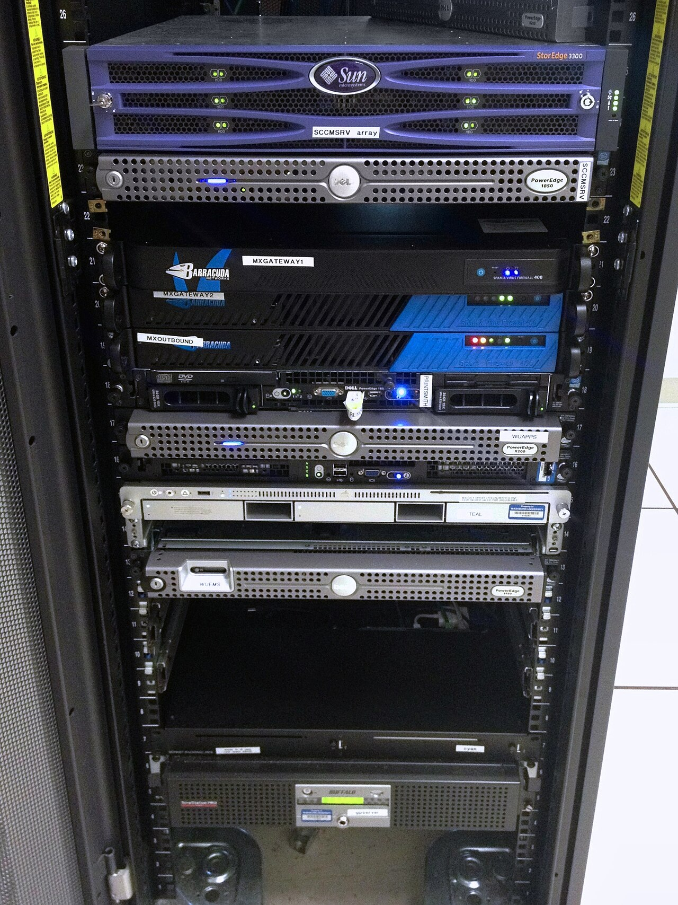

# When teams still pick Jenkins

*Jenkins remains rational when teams need self-hosted control, unusual networks or hardware, deep legacy integrations, and extensibility—provided they accept the operational ownership.*

> Choosing Jenkins because "we already have it" is not a strategy. Replacing it because it looks old is
> not one either. The honest decision compares workload constraints and migration cost with the people,
> security work, upgrades, backups, agents, and plugins required to own a controller.

> **In real life**
>
> A mixed server rack can support hardware, operating systems, and integrations accumulated over years.
> That flexibility is valuable when the diversity is real. It is expensive when nobody knows which box
> matters. Jenkins has the same bargain: extraordinary adaptability in exchange for explicit ownership.

**Jenkins selection tradeoff**: Jenkins is a self-hosted, extensible automation server whose controller, agents, plugins, credentials, backups, upgrades, availability, and security are operated by the adopting organization. Teams still choose it for controlled networks, specialized or on-premises hardware, unusual build environments, mature internal integrations, and migration constraints. The choice is sound only when those needs outweigh the total operational and security cost.

## Decide from constraints, not fashion

Jenkins is a strong candidate when work must reach isolated networks, licensed lab equipment, mobile
device racks, mainframes, custom hardware, or established internal systems that hosted runners cannot.
It also fits organizations already capable of operating it reliably.

Prefer a managed repository-native service when standard runners, simpler administration, and tight
pull-request integration meet the workload. A hybrid can keep specialized Jenkins jobs while moving
ordinary checks elsewhere — but two systems also mean two security and observability models.

> **Tip**
>
> Write a one-page decision record: constraints, alternatives, five-year ownership, migration boundary,
> security model, recovery target, plugin policy, success metrics, and exit plan.

> **Common mistake**
>
> Comparing only license price. Jenkins software is open source; controller operations, patching,
> plugins, backups, availability, agents, incident response, and specialist knowledge are not free.


*Rack with various servers — Patrick Finnegan, CC BY-SA 2.0. [Source](https://commons.wikimedia.org/wiki/File:Rack_with_varoius_servers.jpg)*
- **Specialized estate** — Heterogeneous hardware and internal systems can justify flexible self-hosted automation.
- **Integration depth** — Existing plugins and custom connections may carry real migration value and risk.
- **Operations burden** — Every layer needs patching, monitoring, backup, capacity, security, and an owner.
- **Exit boundary** — Know which jobs can move first and how evidence remains comparable during migration.

**A defensible CI platform decision**

1. **List hard constraints** — Network, hardware, compliance, integrations, scale, and skills.
2. **Model alternatives** — Jenkins, managed services, and hybrid designs must meet the same workload.
3. **Price total ownership** — Include people, reliability, security, upgrades, agents, and migration.
4. **Prototype hardest job** — Test the constraint that could invalidate an option.
5. **Record decision** — Document evidence, tradeoffs, owner, measures, and review date.
6. **Maintain exit plan** — Reduce lock-in through Jenkinsfiles, portable scripts, standard reports, and governed dependencies.

*Run it — compare weighted platform fit (Python)*

```python
``weights = {"isolated_network": 5, "low_ops": 4, "custom_hardware": 5}
scores = {
    "jenkins": {"isolated_network": 5, "low_ops": 1, "custom_hardware": 5},
    "managed": {"isolated_network": 2, "low_ops": 5, "custom_hardware": 1},
}
for option, values in scores.items():
    total = sum(weights[k] * values[k] for k in weights)
    print(option, total)``
```

*Run it — compare weighted platform fit (Java)*

```java
``import java.util.*;

public class Main {
    public static void main(String[] args) {
        var weights = Map.of("isolated", 5, "lowOps", 4, "hardware", 5);
        var options = Map.of(
            "jenkins", Map.of("isolated", 5, "lowOps", 1, "hardware", 5),
            "managed", Map.of("isolated", 2, "lowOps", 5, "hardware", 1));
        options.forEach((name, values) -> {
            int total = weights.keySet().stream().mapToInt(k -> weights.get(k) * values.get(k)).sum();
            System.out.println(name + " " + total);
        });
    }
}``
```

### Your first time: Your mission: test the hardest constraint

- [ ] Name three hard requirements and three preferences — A device lab is a constraint; liking one YAML syntax is usually a preference.
- [ ] Estimate total ownership for three years — Include platform staff, upgrades, incidents, backups, agents, security, and migration.
- [ ] Prototype the least portable workload — Prove network, hardware, credentials, evidence, and timing with real execution.
- [ ] Record owner, metrics, and review date — Platform decisions expire as workloads and services change.

A tool choice becomes engineering only when evidence could have changed the answer.

- **Only one person can repair Jenkins.**
  Treat concentration as a reliability risk: document, automate configuration, cross-train, and establish on-call ownership.
- **Upgrades are postponed indefinitely.**
  Inventory plugins and dependencies, create a staging controller, test upgrades regularly, and set a supported-version policy.
- **Migration runs both systems forever.**
  Define job waves, equivalence evidence, cutover criteria, owners, and a controller retirement date.
- **A managed runner cannot reach the lab.**
  Test private networking or self-hosted runner options before assuming the entire portfolio must remain on Jenkins.

### Where to check

- **Workload inventory** — actual networks, hardware, runtimes, duration, and evidence.
- **Controller/agent operational metrics** — availability, queue time, patch lag, failures, and toil.
- **Plugin and security inventory** — advisories, versions, ownership, and unused dependencies.
- **Recovery test** — backups are claims until restore time and data loss are measured.
- **Migration experiment** — compare same revision, command, environment, result, and artifacts.

### Worked example: keeping Jenkins for the device lab, not everything

1. A company has 200 standard web jobs and 12 tests requiring on-premises payment terminals.
2. Replacing all Jenkins jobs fails because hosted runners cannot reach the isolated lab.
3. Keeping all jobs preserves years of controller toil.
4. Standard jobs move to managed CI; Jenkins retains a hardened lab controller and ephemeral agents.
5. Both publish the same report format, and the decision record reviews the remaining 12 jobs quarterly.

**Quiz.** Which reason most strongly justifies choosing Jenkins?

- [ ] Its logo is familiar
- [x] A hard requirement for controlled networks or specialized hardware plus a team able to operate it
- [ ] The software has no license fee
- [ ] A tutorial used it

*Hard workload constraints and proven operating capability can outweigh Jenkins' ownership cost. Familiarity, price alone, or tutorial popularity cannot.*

- **Jenkins' strongest fit** — Self-hosted control, unusual networks/hardware, deep legacy integrations, and capable platform ownership.
- **Total ownership** — Software plus staff, upgrades, security, backups, availability, agents, plugins, incidents, and migration.
- **Hybrid risk** — Two CI systems can isolate specialized work but duplicate security, identity, reporting, and support models.
- **Best decision prototype** — The hardest, least portable workload — not a hello-world build.
- **Exit-plan enablers** — Versioned pipelines, portable scripts, standard artifacts, dependency inventory, and staged migration.

### Challenge

Write a decision record comparing Jenkins, one managed alternative, and a hybrid for your hardest
workload. Include a cost model, security/operations ownership, recovery evidence, and exit plan.

### Ask the community

> We need [network/hardware/integration constraints], run [job profile], and can operate [capabilities]. Jenkins/managed/hybrid scores [evidence], with unresolved risk [risk].

Share constraints and measured ownership, not a brand preference.

- [Jenkins User Handbook](https://www.jenkins.io/doc/book/)
- [Jenkins Security Advisories](https://www.jenkins.io/security/)

🎬 [Jenkins Explained in 3 minutes — DevExplain](https://www.youtube.com/watch?v=hlpNgRcZyN0) (4 min)

- Jenkins is rational for real self-hosted, network, hardware, integration, or migration constraints.
- Its flexibility is purchased with controller, agent, plugin, security, backup, and staffing ownership.
- Compare total ownership and prototype the hardest workload, not a toy pipeline.
- Hybrid designs can isolate specialized jobs but duplicate platform models.
- Record an owner, metrics, review date, and exit plan so today's constraint does not become permanent folklore.


## Related notes

- [[Notes/automation-in-cicd/jenkins/agents-and-plugins|Agents & plugins]]
- [[Notes/automation-in-cicd/jenkins/jenkinsfile-pipeline-as-code|Jenkinsfile — pipeline as code]]
- [[Notes/automation-in-cicd/github-actions/workflow-basics|Workflow basics]]


---
_Source: `packages/curriculum/content/notes/automation-in-cicd/jenkins/when-teams-still-pick-jenkins.mdx`_
