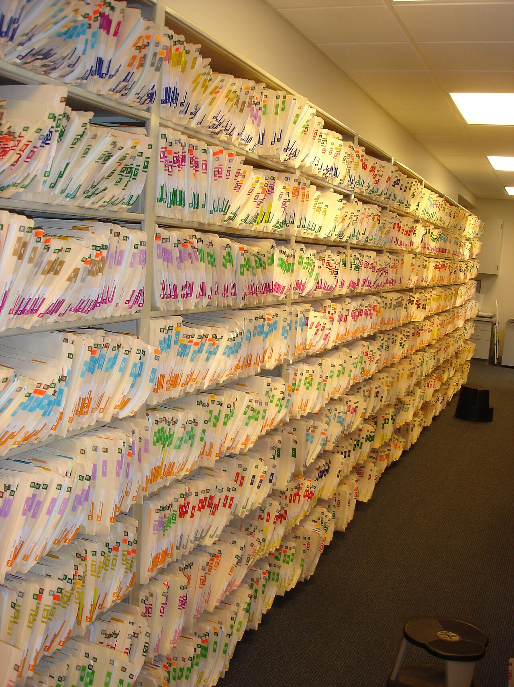

# Artifacts

*CI artifacts preserve the reports, traces, screenshots, videos, logs, and build outputs needed to explain a run after its temporary runner has disappeared, with deliberate upload and retention rules.*

> A CI runner is disposable. When its job ends, the filesystem that contained the failed test's trace
> and screenshot can vanish with it. If the team uploads only the green checkmark, the best evidence
> often disappears seconds before someone begins investigating.

> **In real life**
>
> An archive is useful because folders are labelled, preserved for a known period, and retrievable by a
> future person who was not present when they were filed. A heap of unnamed CI output is not an archive;
> it is delayed deletion.

**CI artifact**: A CI artifact is a file or collection of files uploaded from a job's temporary workspace and retained by the CI system after the job ends. Artifacts commonly include test reports, traces, screenshots, videos, logs, coverage data, and packaged builds. They differ from dependency caches: artifacts are evidence or outputs for people and later jobs, while caches are reusable inputs intended to make future runs faster.

## Preserve evidence deliberately

An artifact policy answers:

- **What:** upload the smallest evidence that explains or consumes the run.
- **When:** use an always-run upload step so failed tests still publish diagnostics.
- **Which revision:** name and metadata must connect evidence to workflow, job, attempt, and commit.
- **How long:** retain failure evidence long enough for triage without storing it forever.
- **Who can read it:** reports may contain URLs, user data, tokens, or screenshots; access is a security decision.

> **Tip**
>
> Upload one self-contained report directory rather than scattered files with broken relative links.
> Include a small metadata file containing the commit SHA, attempt, browser, environment, and test command.

> **Common mistake**
>
> Using a cache as the only home for failure evidence. Caches can be evicted, overwritten, or restored
> by an unrelated run; they are an optimization, not an audit trail.


*Shelves of file folders — Alex Gorzen, CC BY-SA 2.0. [Source](https://commons.wikimedia.org/wiki/File:Shelves-of-file-folders.jpg)*
- **Named collection** — Artifact names should identify suite, browser, revision, and attempt without opening every archive.
- **Retained evidence** — Upload before the disposable runner is destroyed, including on failed or cancelled test steps where possible.
- **Retrievable structure** — Keep a report's assets together so links, traces, and screenshots still open after download.
- **Controlled access** — Screenshots and logs can expose sensitive data; retention and permissions belong in the design.

**From failed test to usable artifact**

1. **Test fails** — The runner writes a report and diagnostic files to known paths.
2. **Metadata captured** — Revision, run attempt, environment, and tool versions travel with the evidence.
3. **Sensitive content checked** — Tokens and unnecessary personal data are redacted or never recorded.
4. **Upload runs always** — A conditional upload executes even though the test step is red.
5. **Retention applies** — The provider keeps the archive for an intentional investigation window.
6. **Investigator downloads** — A teammate can open the self-contained report after the runner is gone.

*Run it — choose artifacts by outcome (Python)*

```python
``files = {
    "html-report": 8,
    "trace": 14,
    "video": 40,
    "dependency-cache": 600,
}
failed = True
selected = ["html-report", "trace"] + (["video"] if failed else [])
print("upload:", ", ".join(selected))
print("total MB:", sum(files[name] for name in selected))
print("cache is evidence:", "dependency-cache" in selected)``
```

*Run it — choose artifacts by outcome (Java)*

```java
``import java.util.*;

public class Main {
    public static void main(String[] args) {
        var sizes = Map.of("html-report", 8, "trace", 14, "video", 40, "dependency-cache", 600);
        boolean failed = true;
        var selected = new ArrayList<>(List.of("html-report", "trace"));
        if (failed) selected.add("video");
        int total = selected.stream().mapToInt(sizes::get).sum();
        System.out.println("upload: " + String.join(", ", selected));
        System.out.println("total MB: " + total);
        System.out.println("cache is evidence: " + selected.contains("dependency-cache"));
    }
}``
```

### Your first time: Your mission: recover evidence after the runner disappears

- [ ] Configure a known report and trace directory — Keep paths deterministic so the upload step does not guess with a broad wildcard.
- [ ] Make artifact upload run on failure — Use the provider's always condition while preserving the test step's red status.
- [ ] Trigger one deliberate failure — Confirm the job is red and the artifact is still present.
- [ ] Download it in a clean directory — Open the report and trace as another teammate would; verify relative assets and revision metadata.

Evidence is real only when someone can retrieve and interpret it later.

- **No artifact appears on a failed job.**
  The upload probably inherited success-only execution or the path never existed. Use an always condition and print a bounded directory listing before upload.
- **The HTML opens but screenshots and styles are missing.**
  Upload the whole self-contained report directory while preserving its internal paths.
- **Artifact storage grows without limit.**
  Record size by suite, capture rich media on failure, compress sensible formats, and set explicit retention.
- **A log artifact exposes a credential.**
  Revoke it immediately, restrict access, remove unsafe logging, and treat artifacts as sensitive repository data.

### Where to check

- **Upload-step condition** — it must execute after a failing test step.
- **Resolved path and file count** — distinguish "nothing generated" from "wrong upload glob."
- **Artifact name and metadata** — connect it to SHA, job, browser, and attempt.
- **Retention and permissions** — ensure investigators can access it, but unintended viewers cannot.
- **Downloaded copy** — verify it opens away from the runner and contains no machine-only links.

### Worked example: the missing trace caused by success-only upload

1. Browser tests write traces only for failures and exit 1 on checkout.
2. The following upload step has the provider's default success condition, so it is skipped.
3. The runner is destroyed; the log says only that a locator timed out.
4. The team changes the upload condition to always, keeps the test job red, and uploads the trace directory.
5. The next failure's trace reveals an overlay intercepting the click — evidence now survives without hiding failure.

**Quiz.** Which statement correctly distinguishes an artifact from a cache?

- [ ] Artifacts always make jobs faster; caches explain failures
- [x] Artifacts preserve outputs or evidence from a run; caches reuse inputs to speed later runs
- [ ] They are identical names for permanent storage
- [ ] Caches are safe for secrets because users cannot download them

*Artifacts retain results and evidence for people or downstream jobs. Caches are disposable performance optimizations for reusable inputs and should not be the only copy of diagnostic evidence.*

- **Why must failure upload use an always condition?** — The test step is red precisely when its diagnostic artifacts are most valuable; success-only defaults skip them.
- **Artifact versus cache** — Artifact: run output/evidence. Cache: reusable input that speeds future work.
- **Useful artifact identity** — Suite, browser or target, commit SHA, job, and run attempt.
- **Why verify a downloaded report?** — A report can rely on paths or assets that existed only on the temporary runner.
- **Artifact security risk** — Logs, traces, screenshots, and videos can contain tokens, URLs, user data, or confidential UI.

### Challenge

Audit one pipeline's artifacts. For each, record purpose, generation path, failure behavior, typical
size, retention, access, and the decision it supports. Delete one useless upload and repair one missing
failure artifact.

### Ask the community

> Run [link/id] failed at [test]. Artifact upload status is [status], resolved path/file count is [values], and retention/access are [values]. What should I inspect next?

Share metadata and directory shape, but redact tokens and personal data before sharing logs or screenshots.

- [GitHub Docs — Store and share data with workflow artifacts](https://docs.github.com/en/actions/using-workflows/storing-workflow-data-as-artifacts)
- [Playwright — Setting up CI](https://playwright.dev/docs/ci-intro)

🎬 [Playwright — Capture Screenshots and Record Videos After Test Execution — CommitQuality](https://www.youtube.com/watch?v=HUzCg0o0ScM) (9 min)

- Artifacts preserve run evidence after a disposable runner disappears.
- Upload diagnostics even when tests fail, without changing the job's red status.
- Keep reports self-contained and bind them to revision, job, target, and attempt.
- Set intentional size, retention, and access policies.
- Treat logs and visual evidence as potentially sensitive data; caches are not evidence archives.


## Related notes

- [[Notes/automation-in-cicd/running-tests-in-ci/headless-mode|Headless mode]]
- [[Notes/automation-in-cicd/scheduling-and-reporting/publishing-reports|Publishing reports]]
- [[Notes/playwright/tracing-and-debugging/screenshots-and-video|Screenshots & video]]


---
_Source: `packages/curriculum/content/notes/automation-in-cicd/running-tests-in-ci/artifacts.mdx`_
