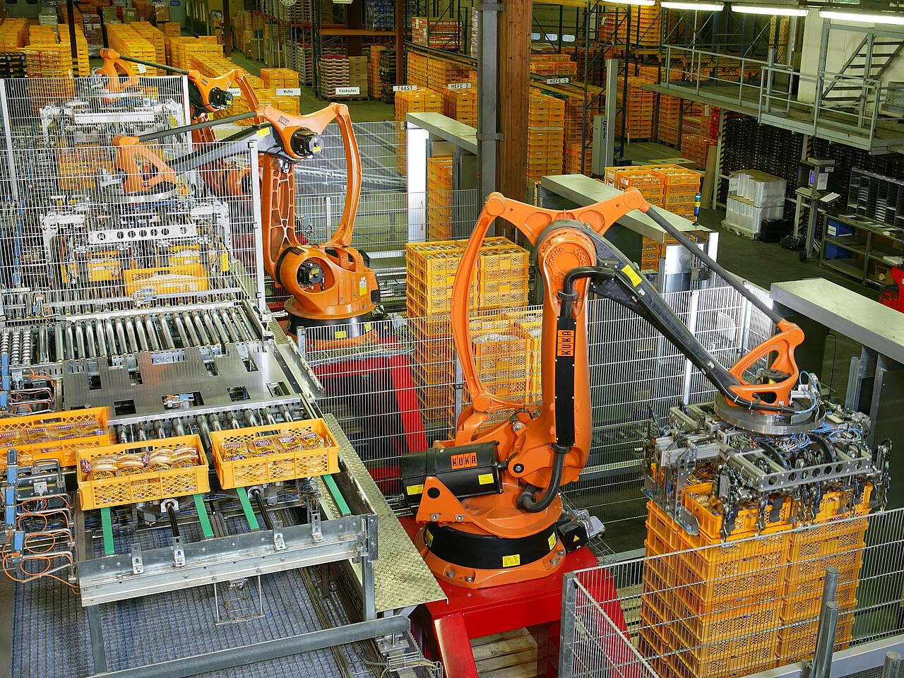

# Headless mode

*Headless browsers render and execute the page without a visible window, which suits CI runners, but reliable results still depend on browser versions, viewport, resources, isolation, and useful traces.*

> No browser window appears on a CI runner, yet a real browser can still load the page, execute
> JavaScript, calculate layout, click elements, and take screenshots. Headless does not mean fake. It
> means the browser works without spending a desktop window on a machine nobody is watching.

> **In real life**
>
> An industrial robot can stack bread all night without a person holding its controls. Removing the
> operator's visible motions does not remove the factory conditions around it. Headless tests likewise
> need power, resources, timing, dimensions, and sensors — your configuration and artifacts.

**headless browser**: Headless mode runs a browser without displaying its graphical window while retaining the browser engine's page loading, JavaScript execution, layout, networking, storage, and interaction behavior. Modern browser-test tools normally use headless mode in CI. Headed mode is valuable for local observation, but it is a debugging view rather than a separate test strategy.

## What changes — and what should not

Headless mode removes the visible window. It does not excuse different application data, an
uncontrolled browser version, or arbitrary waits. Keep these explicit:

- browser engine and version;
- viewport, device scale, locale, time zone, and permissions;
- CPU and memory expectations on the runner;
- worker count and test isolation;
- trace, screenshot, and video policy for failures.

Playwright runs headless by default and recommends using one worker in CI for stability, then scaling
with sharding when the suite is proven isolated.

> **Tip**
>
> Debug a CI-only failure from its trace first. Reproducing headed locally is useful, but changing mode,
> workers, data, and browser version at once destroys the comparison.

> **Common mistake**
>
> Adding longer sleeps because "headless is faster" or "CI is slower." Wait for observable application
> conditions. Fixed time changes turn resource variation into intermittent failures.


*Factory automation robots palletizing bread — KUKA Roboter GmbH / Bachmann, public domain. [Source](https://commons.wikimedia.org/wiki/File:Factory_Automation_Robotics_Palettizing_Bread.jpg)*
- **Real machinery** — Headless still uses a real browser engine; only the visible window is absent.
- **Controlled workspace** — Viewport, browser version, locale, and resources define the test environment.
- **Parallel stations** — More workers increase speed only when tests and runner resources are genuinely isolated.
- **Safety evidence** — Traces, screenshots, and video replace the missing observer when a run fails.

**Diagnosing a headless-only failure**

1. **Freeze the evidence** — Keep the failing trace, screenshot, logs, revision, and browser version.
2. **Match configuration** — Use the same viewport, locale, data, environment, and worker count locally.
3. **Replay the trace** — Inspect DOM snapshots, actions, network, console, and timing around the failure.
4. **Run headless locally** — Confirm whether the failure follows environment or only CI resources.
5. **Observe headed** — Use headed or debug mode after preserving the equivalent setup.
6. **Fix the condition** — Repair locator, isolation, readiness, or resource assumptions — not the symptom with sleep.

*Run it — compare declared browser environments (Python)*

```python
``local = {"browser": "chromium-140", "viewport": "1280x720", "locale": "en-US"}
ci = {"browser": "chromium-140", "viewport": "1280x720", "locale": "en-US"}

differences = [key for key in local if local[key] != ci.get(key)]
print("comparable:", not differences)
print("differences:", differences or "none")``
```

*Run it — compare declared browser environments (Java)*

```java
``import java.util.*;

public class Main {
    public static void main(String[] args) {
        var local = Map.of("browser", "chromium-140", "viewport", "1280x720", "locale", "en-US");
        var ci = Map.of("browser", "chromium-140", "viewport", "1280x720", "locale", "en-US");
        var differences = new ArrayList<String>();
        for (String key : local.keySet())
            if (!Objects.equals(local.get(key), ci.get(key))) differences.add(key);
        System.out.println("comparable: " + differences.isEmpty());
        System.out.println("differences: " + (differences.isEmpty() ? "none" : differences));
    }
}``
```

### Your first time: Your mission: run the same test with and without a window

- [ ] Choose one stable browser test and run it headless — Record browser version, viewport, workers, duration, and result.
- [ ] Run the same revision headed — Keep every other setting unchanged; observe what the user would see.
- [ ] Enable a trace for one run — Open it and locate the action, DOM snapshot, network request, and console messages.
- [ ] Introduce a real assertion failure — Confirm the headless run leaves enough evidence to explain it without watching live.

Headless is ready for CI when the failure remains diagnosable after the window disappears.

- **An element is visible headed but missing headless.**
  Compare viewport, responsive layout, user agent, feature flags, and fonts before blaming mode.
- **Tests pass with one worker but fail in parallel.**
  Look for shared accounts, records, files, ports, and cleanup. Keep CI at one worker until isolation is fixed.
- **The browser process crashes in CI.**
  Check installed browser dependencies, container sandbox guidance, shared memory, and runner CPU or memory limits.
- **A click times out only on CI.**
  Use the trace to inspect actionability, overlays, navigation, and network readiness; do not add a blind sleep.

### Where to check

- **Trace timeline and DOM snapshot** — what the browser saw at the failed action.
- **Browser/version install logs** — whether local and CI engines actually match.
- **Viewport, locale, time zone, and permissions** — configuration that changes rendered behavior.
- **Worker count and runner resources** — contention can expose isolation and timing assumptions.
- **Console and network panels** — application errors often masquerade as missing elements.

### Worked example: the mobile menu that looked like a headless bug

1. CI uses a 1280-pixel viewport; a laptop debug session accidentally uses a maximized 1920-pixel window.
2. The navigation collapses at 1400 pixels, so CI shows a menu button while the headed run shows links.
3. A locator for the visible "Account" link times out only in CI.
4. The trace screenshot reveals the collapsed menu. Headless rendering is correct; the environments differ.
5. The test sets an intentional desktop viewport and a separate mobile project tests the collapsed flow.

**Quiz.** A browser test passes headed locally but fails headless in CI. What should you compare first?

- [ ] Only the headless command-line flag
- [x] Revision, browser version, viewport, data, configuration, workers, resources, and the failure trace
- [ ] Whether the CI provider has a dark theme
- [ ] A ten-second sleep

*The visible-window setting is only one variable. Most apparent headless differences come from environment, responsive layout, resources, or isolation. Preserve and compare evidence before changing timing.*

- **What does headless remove?** — The displayed browser window — not the browser engine's rendering, JavaScript, network, storage, or interaction behavior.
- **Best first artifact for a CI browser failure** — A trace containing actions, DOM snapshots, network, console, and timing context.
- **Why start with one worker in CI?** — It reduces contention and shared-state collisions while the suite's isolation is being proven.
- **Headed mode's purpose** — Human observation and debugging, while keeping the rest of the environment equivalent.
- **Why not repair CI timing with sleep?** — A fixed delay guesses rather than waits for an observable condition, remaining slow and flaky.

### Challenge

Take a CI-only browser failure and write an environment diff before changing code: revision, engine,
version, viewport, locale, data, workers, CPU/memory, and application URL. Use the trace to support one
cause and one falsifiable experiment.

### Ask the community

> This test fails headless in CI at [action]. Revision/browser/viewport/workers are [values]. The trace shows [DOM/network/console evidence], while the equivalent local headless run shows [difference]. What assumption should I test next?

Attach the trace or its exact observations; "headless is broken" is not a reproducible diagnosis.

- [Playwright — Continuous Integration](https://playwright.dev/docs/ci)
- [Playwright — Trace Viewer](https://playwright.dev/docs/trace-viewer)

🎬 [Playwright Trace Viewer Explained — Best Feature for Debugging Failures — MasterQAAutomation](https://www.youtube.com/watch?v=267pBzbvSgQ) (5 min)

- Headless uses a real browser engine without displaying its window.
- Control browser version, viewport, locale, resources, and workers before comparing results.
- Use traces and failure media as the absent observer on CI.
- Begin with conservative parallelism and scale only after isolation is proven.
- Fix observable readiness or environment assumptions instead of adding sleeps.


## Related notes

- [[Notes/automation-in-cicd/running-tests-in-ci/running-the-suite|Running the suite]]
- [[Notes/automation-in-cicd/running-tests-in-ci/artifacts|Artifacts]]
- [[Notes/playwright/tracing-and-debugging/trace-viewer|Trace viewer]]


---
_Source: `packages/curriculum/content/notes/automation-in-cicd/running-tests-in-ci/headless-mode.mdx`_
