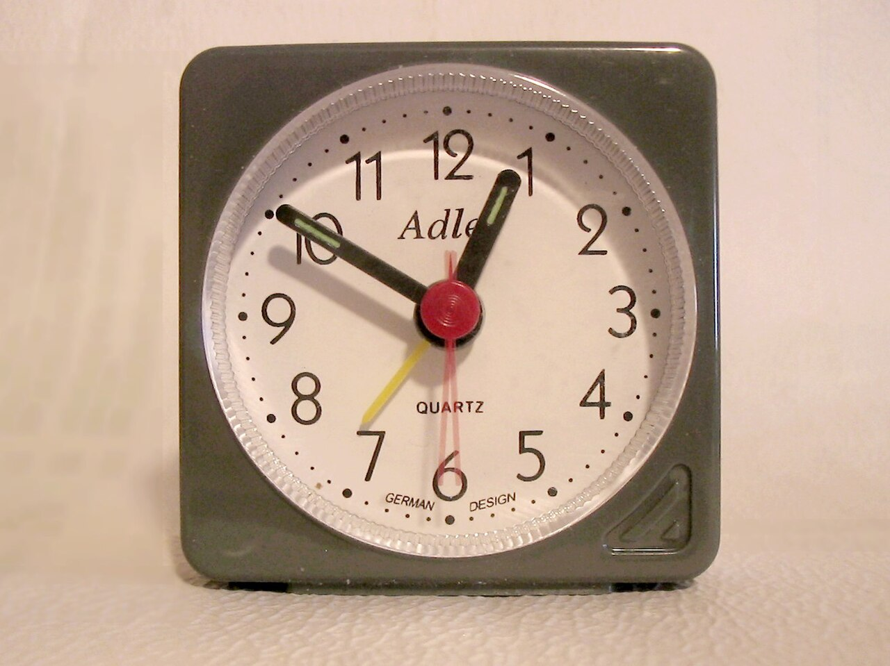

# Scheduled runs

*Scheduled CI runs find time-dependent and broad regression failures, but a trustworthy schedule needs explicit timezone, branch, ownership, concurrency, environment, and missed-run monitoring.*

> The nightly suite is green every morning. Then someone notices it has not run for eleven days.
> A schedule is not evidence until you can prove the expected run was created, used the intended
> revision and environment, completed, and reached an owner when it failed.

> **In real life**
>
> An alarm clock answers when to wake up, not whether you got out of bed or reached work. Cron creates
> an opportunity to test. Run monitoring, reports, and notifications prove the useful work happened.

**Scheduled CI run**: A scheduled CI run is a pipeline created from a time rule, usually a five-field cron expression. It normally executes the workflow definition from a platform-selected branch and may be delayed by runner demand. Its contract must state timezone, target branch/SHA, cadence, environment, concurrency behavior, owner, and how a missing run is detected.

## Design the schedule as an operating contract

```yaml
name: nightly-regression
on:
  schedule:
    - cron: "17 1 * * 1-5"
  workflow_dispatch:
concurrency:
  group: nightly-regression
  cancel-in-progress: false
```

Off-peak minute `17` avoids the common top-of-hour rush. Manual dispatch gives responders a safe
reproduction path. The concurrency rule makes overlap policy explicit rather than accidental.

> **Tip**
>
> Write the intended local time beside the cron rule, then test the UTC conversion and daylight-saving
> behavior. Also record the expected next run in monitoring; humans are poor missing-event detectors.

> **Common mistake**
>
> Using nightly CI as a landfill for slow tests. A schedule should answer a named risk that cannot be
> covered cheaply on every change. Keep fast release-blocking checks on pull requests.


*Alarm — Mohylek, public domain. [Source](https://commons.wikimedia.org/wiki/File:Alarm.jpg)*
- **Trigger time** — Cron states when the platform should create a run, usually in an explicit timezone or UTC.
- **Cadence** — Choose frequency from risk and feedback need, not habit.
- **Delay tolerance** — Hosted schedulers and runner queues can start later than the nominal minute.
- **Missed-run alarm** — Monitor the absence of the expected execution, not only failed executions.

**A trustworthy scheduled regression**

1. **Time rule becomes due** — Scheduler evaluates cron and timezone.
2. **Pipeline is created** — Capture source, target branch, and exact SHA.
3. **Concurrency policy applies** — Queue, cancel, or reject overlap intentionally.
4. **Suite uses controlled environment** — Seed data, secrets, dependencies, and clocks.
5. **Evidence is published** — Report, artifacts, duration, environment, and revision survive the runner.
6. **Owner receives outcome** — Failure and missing-run alerts route to someone who can act.

*Run it — detect a missing nightly run (Python)*

```python
``from datetime import datetime, timezone
last_run = datetime(2026, 7, 15, 1, 22, tzinfo=timezone.utc)
now = datetime(2026, 7, 17, 3, 0, tzinfo=timezone.utc)
hours = (now - last_run).total_seconds() / 3600
print(f"hours since last run: {hours:.1f}")
print("alert: missing schedule" if hours > 30 else "schedule healthy")``
```

*Run it — detect a missing nightly run (Java)*

```java
``import java.time.*;

public class Main {
    public static void main(String[] args) {
        Instant last = Instant.parse("2026-07-15T01:22:00Z");
        Instant now = Instant.parse("2026-07-17T03:00:00Z");
        long hours = Duration.between(last, now).toHours();
        System.out.println("hours since last run: " + hours);
        System.out.println(hours > 30 ? "alert: missing schedule" : "schedule healthy");
    }
}``
```

### Your first time: Your mission: make one scheduled suite observable

- [ ] Name the risk and cadence — Explain why this suite is scheduled instead of required on every change.
- [ ] Record timezone, branch, and SHA — Prove which workflow and product revision executed.
- [ ] Define overlap behavior — Choose queue, cancel, or parallel based on data and environment safety.
- [ ] Alert on failure and absence — Test both a red run and a run that was never created.

You now operate a schedule rather than trusting a cron string.

- **The run starts at the wrong local hour.**
  Check platform timezone semantics, daylight-saving transitions, and the documented UTC/local conversion.
- **Two nightlies corrupt shared test data.**
  Add a concurrency group or isolated environment/data namespace and define stale-run cancellation.
- **The workflow runs old tests.**
  Inspect the scheduled run's branch, workflow revision, and SHA; scheduled events commonly use the default branch.
- **Nobody noticed the schedule stopped.**
  Create a dead-man alert when no successful or attempted run appears inside the expected window.

### Where to check

- **Workflow event and cron** — source rule, timezone, and manual fallback.
- **Run branch and SHA** — exact workflow/product revision.
- **Queue and concurrency history** — delay, overlap, and cancellation.
- **Environment/data lease** — collisions with another run.
- **Last expected versus actual run** — missing-event monitoring.

### Worked example: a nightly that silently moved by one day

1. The team writes `0 1 * * 1-5`, intending weekday mornings in Kathmandu.
2. The platform evaluates it in UTC, so it starts at 06:45 local—not 01:00.
3. Data cleanup overlaps office-hour exploratory testing and creates false failures.
4. The owner documents timezone semantics, chooses the intended UTC expression, and adds a manual trigger.
5. Monitoring compares expected and actual start windows, catching future schedule drift.

**Quiz.** What proves a nightly schedule is healthy?

- [ ] A valid cron expression
- [ ] A green badge from any previous run
- [x] Expected runs are created in the right window and finish on the intended revision/environment with owned outcomes
- [ ] The suite contains every automated test

*Cron only requests a trigger. Health includes run creation, identity, environment, completion, evidence, ownership, and detection of missed executions.*

- **Cron** — A compact time rule; it does not prove execution or completion.
- **Dead-man alert** — An alert raised because an expected event or heartbeat did not appear.
- **Scheduled-run identity** — Trigger source, workflow revision, target branch, and exact SHA.
- **Overlap policy** — Explicit choice to queue, cancel, or parallelize concurrent scheduled runs.
- **Manual fallback** — A controlled dispatch path used to reproduce or recover a schedule.

### Challenge

Audit one scheduled workflow. Predict its next three runs in local time, identify the branch and SHA
it will use, force an overlap, and demonstrate an alert for a deliberately missed execution.

### Ask the community

> Scheduled workflow [name] expected [time/timezone] but [ran late/did not run/used wrong revision]. Expected branch/SHA, actual event, concurrency state, and last successful run are [values].

These facts distinguish cron interpretation, scheduler delay, runner capacity, and stale configuration.

- [GitHub Docs — workflow schedule syntax](https://docs.github.com/en/actions/reference/workflows-and-actions/workflow-syntax#onschedule)
- [GitLab Docs — scheduled pipelines](https://docs.gitlab.com/ci/pipelines/schedules/)

🎬 [Triggers & Events in GitHub Actions — DevTips Daily](https://www.youtube.com/watch?v=PG19_K1300A) (7 min)

- A cron rule requests a run; it does not prove useful work completed.
- Record timezone, cadence, source branch, workflow revision, SHA, environment, and owner.
- Define concurrency and shared-data behavior before schedules overlap.
- Alert on missing runs as well as failed runs.
- Keep fast release feedback on changes; schedule suites for named broader or time-dependent risks.


## Related notes

- [[Notes/automation-in-cicd/scheduling-and-reporting/notifications|Notifications]]
- [[Notes/automation-in-cicd/flake-management/detecting-flakes|Detecting flakes]]
- [[Notes/automation-in-cicd/github-actions/triggers|Triggers]]


---
_Source: `packages/curriculum/content/notes/automation-in-cicd/scheduling-and-reporting/scheduled-runs.mdx`_
