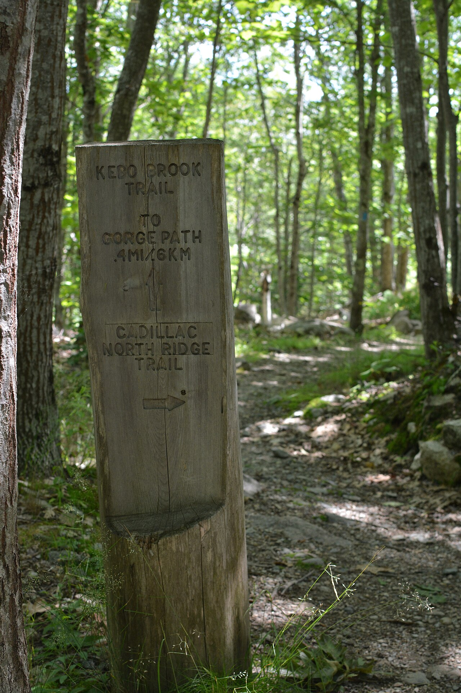

# When BDD helps

*BDD's overhead - collaborative scenario-writing, glue-code maintenance, an extra layer of indirection - pays for itself under specific conditions: genuinely ambiguous business rules, cross-functional teams, audit-hungry regulated domains, and long-lived features where living documentation compounds.*

> BDD is not free. Scenario-writing meetings cost hours of several people's time; glue code is a
> whole layer that exists only to translate; every scenario adds indirection between "test fails"
> and "here's the code that failed." Those costs are real and permanent - so the honest question is
> never "is BDD good?" but "under which conditions does what BDD buys outweigh what it costs?" This
> note names those conditions specifically; the next note names their absence just as specifically.

> **In real life**
>
> Somebody hand-carved a signpost deep in a national park: trail names, an arrow, distances in two
> units, set in a post that will outlast decades of weather. Real effort - and worth every stroke of
> the chisel, because it stands at a genuine junction on a heavily-walked route, where without it some
> fraction of every day's hikers would confidently stride down the wrong trail and pay for it in
> hours. Nobody carves signs like that along a straight path with no turnings. The sign's value comes
> from three things at once: real ambiguity (paths genuinely diverge), real traffic (many people pass
> here), and a long lifetime (it keeps preventing wrong turns for years). BDD's overhead pays off at
> exactly that kind of junction.

**When BDD helps**: BDD helps - meaning its permanent overhead of collaborative scenario-writing, glue-code maintenance, and an extra layer of indirection is genuinely repaid - under identifiable conditions. First: complex business rules with real ambiguity (pricing tiers, eligibility logic, state machines), where working through concrete examples surfaces expensive misunderstandings before code exists. Second: cross-functional teams where business, development, and testing must stay aligned, because a shared readable specification prevents the rework that misalignment causes. Third: regulated or compliance-heavy domains (finance, healthcare, aviation), where an auditor-readable, execution-backed record of system behavior is itself a deliverable. Fourth: features with a long lifetime, where living documentation's value compounds - every year the feature survives, the always-current spec keeps paying while a manual doc would have rotted. The common thread: BDD's costs are fixed and up front, while its benefits scale with ambiguity, audience, and time.

## The four conditions where the overhead pays

- **Complex business rules with genuine ambiguity** — a loyalty-points formula with tier
  boundaries, a refund policy full of exceptions, an eligibility rule with interacting conditions.
  Concrete Given/When/Then examples force the edge cases ("exactly at the boundary?" "both
  conditions at once?") into the open while they cost a conversation, not a rework sprint. If a
  rule can be misunderstood three ways, examples are the cheapest disambiguator that exists.
- **Cross-functional teams with a real communication gap** — when a product owner in one office,
  developers in another, and testers in a third must mean the same thing by "checkout works," a
  shared readable spec is load-bearing infrastructure. The more people who must agree - and the
  more expensive their disagreement - the more each scenario-writing hour returns.
- **Regulated and compliance-heavy domains** — when an auditor asks "show me evidence the system
  enforces the withdrawal limit," a green, timestamped scenario in plain language IS the evidence:
  behavior stated readably, executed against the real system, archived per run (the previous note's
  living documentation, doing double duty as an audit trail).
- **Long-lived features** — living documentation is an annuity: the up-front cost is fixed, but a
  feature that lives eight years pays out eight years of always-current, onboarding-ready,
  regression-guarded specification. The longer the horizon, the more certainly the investment
  clears its cost.

> **Tip**
>
> Score a candidate feature honestly on those four axes before reaching for Gherkin: ambiguity,
> number of non-technical people who must agree, audit pressure, expected lifetime. Strong on two or
> more - BDD will likely repay its cost. Strong on none - write a plain test and move on. The
> scoring habit matters because it makes the decision explicit instead of ideological.

> **Common mistake**
>
> Blanket-mandating BDD for everything because it helped somewhere - "all new tests must be Cucumber
> scenarios." The conditions above are the mechanism by which BDD produces value; applying it where
> they're absent (internal utilities, one-developer scripts, throwaway code) pays full overhead for
> zero return, and worse, teaches the team that scenarios are bureaucratic theater - which then
> erodes the practice on features where it WAS earning its keep.


*Sign at junction with Cadillac North Ridge Trail — Wikimedia Commons, public domain (NPS Photo). [Source](https://commons.wikimedia.org/wiki/File:Sign_at_junction_with_Cadillac_North_Ridge_Trail_(7dddef20-37ef-4ce5-bf91-bb8c4bd18414).JPG)*
- **The carved names and distances — real up-front effort, spent deliberately** — Someone chiseled every letter. Scenario-writing conversations cost the same way: hours of several people's attention, paid before any payoff - which is exactly why they should be spent at real junctions, not everywhere.
- **The arrow at the point of divergence — disambiguation exactly where paths split** — The sign earns its cost because THIS is where a confident wrong turn happens. Concrete examples earn theirs at the same spot: the boundary case, the exception, the rule three people understood three ways.
- **The trail continuing past the sign — the traffic that multiplies the value** — A junction one hiker passes a year barely repays a sign; a route walked daily repays it constantly. The more people who must correctly 'read' a behavior - devs, testers, POs, auditors - the more each scenario returns.
- **Weathered wood, still legible — built for a long lifetime** — This sign will prevent wrong turns for decades without re-carving. Living documentation compounds the same way: a long-lived feature keeps collecting the dividend year after year.

**A feature where every hour of BDD overhead came back with interest**

1. **The feature: tiered insurance premium calculation - genuinely ambiguous** — Boundary cases, interacting discounts, and a product owner, actuary, and two dev teams who must all agree.
2. **A three-amigos session works through concrete examples** — Two hours, five people. It surfaces that 'age at policy start' meant two different things - caught for the price of a meeting.
3. **The examples become Gherkin scenarios; glue code automates them** — The overhead is now fully paid: conversations held, scenarios written, a translation layer built and maintained.
4. **An auditor asks for evidence of the premium rules a year later** — The latest green report - plain-language scenarios, executed and timestamped - is handed over as-is.
5. **Year three: new developers onboard from the living documentation** — The same scenarios keep paying: current spec, regression guard, audit trail. Fixed cost, compounding return.

Deciding where an up-front investment pays off - by scoring the conditions that generate its return
instead of debating it in the abstract - is really just: rate each factor, weigh them, compare to
the fixed cost. Here's that shape as a small, generic simulation.

*Run it - score features on the four conditions before investing in BDD (Python)*

```python
features = [
    {"name": "tiered premium calculation", "ambiguity": 3, "stakeholders": 3, "audit": 3, "lifetime_years": 8},
    {"name": "internal log-rotation script",  "ambiguity": 0, "stakeholders": 0, "audit": 0, "lifetime_years": 2},
    {"name": "checkout discount rules",       "ambiguity": 3, "stakeholders": 2, "audit": 1, "lifetime_years": 5},
    {"name": "hackathon demo prototype",      "ambiguity": 1, "stakeholders": 1, "audit": 0, "lifetime_years": 0},
]

def bdd_recommendation(f):
    # benefits scale with ambiguity, audience, audit pressure, and time
    payoff = f["ambiguity"] * 2 + f["stakeholders"] * 2 + f["audit"] * 2 + min(f["lifetime_years"], 5)
    fixed_cost = 6  # scenario-writing sessions + glue-code layer + ongoing indirection
    verdict = "BDD likely pays off" if payoff > fixed_cost else "plain tests - overhead won't be repaid"
    return f"payoff {payoff:>2} vs cost {fixed_cost} -> {verdict}"

for f in features:
    print(f"{f['name']:<32} {bdd_recommendation(f)}")
```

Same condition-scoring shape in Java.

*Run it - score features on the four conditions before investing in BDD (Java)*

```java
import java.util.*;

public class Main {
    record Feature(String name, int ambiguity, int stakeholders, int audit, int lifetimeYears) {}

    static String bddRecommendation(Feature f) {
        // benefits scale with ambiguity, audience, audit pressure, and time
        int payoff = f.ambiguity() * 2 + f.stakeholders() * 2 + f.audit() * 2 + Math.min(f.lifetimeYears(), 5);
        int fixedCost = 6; // scenario-writing sessions + glue-code layer + ongoing indirection
        String verdict = payoff > fixedCost ? "BDD likely pays off" : "plain tests - overhead won't be repaid";
        return "payoff " + payoff + " vs cost " + fixedCost + " -> " + verdict;
    }

    public static void main(String[] args) {
        List<Feature> features = List.of(
            new Feature("tiered premium calculation", 3, 3, 3, 8),
            new Feature("internal log-rotation script", 0, 0, 0, 2),
            new Feature("checkout discount rules", 3, 2, 1, 5),
            new Feature("hackathon demo prototype", 1, 1, 0, 0)
        );
        for (Feature f : features) {
            System.out.println(f.name() + ": " + bddRecommendation(f));
        }
    }
}
```

### Your first time: Your mission: score three real features against the four conditions

- [ ] List three features from a product you know - one rule-heavy, one internal/technical, one in between — A pricing or eligibility rule, a background job or utility, and something user-facing but simple.
- [ ] Score each 0-3 on all four conditions: ambiguity, cross-functional audience, audit pressure, expected lifetime — Be honest, especially about ambiguity - 'I find it complex' is not the same as 'stakeholders genuinely disagree about it.'
- [ ] For your highest scorer, write down the specific misunderstanding a scenario conversation would catch — If you can't name one plausible concrete disagreement, revisit the ambiguity score you gave it.
- [ ] For your lowest scorer, write one sentence defending a plain test instead — Being able to argue AGAINST BDD for a specific feature is the skill this note is actually building.

You've now practiced the decision this whole chapter turns on: matching the tool to the conditions
that let it pay, instead of applying it by default.

- **The team runs BDD on a rule-heavy feature but scenario sessions surface no disagreements - ever.**
  Either the feature's ambiguity was overestimated, or the sessions rubber-stamp scenarios one person pre-wrote. Check who talks in the meeting: silence from the product owner usually means the conversation isn't real, not that agreement is.
- **Stakeholders agree BDD 'helped' but nobody can point to a caught misunderstanding or a used report.**
  Demand receipts: list the specific disagreements caught before code, the report links opened by non-engineers, the audit request answered by scenarios. If the list is empty after a quarter, the conditions for payoff may genuinely be absent - the next note covers that case honestly.
- **A compliance team rejects the Cucumber report as audit evidence.**
  Usually a traceability gap, not a concept failure - auditors typically need scenarios linked to requirement IDs and runs linked to versions/dates. Tags mapping scenarios to requirements and archived, timestamped reports per release usually close it.
- **BDD paid off at first, but two years in, scenario sessions feel like overhead again.**
  Conditions change: once a feature's rules stabilize and the team's shared understanding matures, ambiguity - one of the four payoff drivers - shrinks. Keep the living documentation running (it still compounds), but it's legitimate to reserve new scenario conversations for genuinely new or changing rules.

### Where to check

- **The feature's disagreement history** — bug reports and rework traced to misunderstood
  requirements are direct evidence of the ambiguity condition (and of what its absence looks like).
- **Who must sign off on behavior** — the real list of non-technical people who need to read and
  agree is the cross-functional condition, countable rather than assumed.
- **Your domain's regulatory obligations** — whether an execution-backed behavior record is a
  deliverable someone will actually ask for, or just a nice idea.
- **The feature's realistic lifetime** — roadmap plans and the age of comparable features tell you
  whether living documentation has years to compound or months.

### Worked example: one team, two features, opposite BDD decisions - both right

1. A fintech team builds two things in the same quarter: a fee-calculation engine (regulated,
   rule-dense, five stakeholder groups, expected to run for a decade) and an internal Slack bot
   that posts deploy notifications.
2. For the fee engine, they run full BDD: three-amigos sessions per rule cluster, Gherkin
   scenarios, glue code, published living documentation. The first session alone catches that
   "monthly fee" meant calendar month to the product owner and rolling 30 days to the tech lead.
3. For the Slack bot, they write plain JUnit tests in an afternoon. No scenario meetings, no
   feature files - there is no ambiguity, no non-technical reader, no auditor, and the bot might
   not survive the year.
4. At the annual audit, the fee engine's timestamped scenario reports answer three evidence
   requests without a single engineer writing a document. The Slack bot is never asked about.
5. The lesson the team writes down: the decision wasn't BDD versus not-BDD as a philosophy - it was
   scoring each feature against the conditions that let BDD's fixed overhead actually return
   something.

**Quiz.** A team must choose ONE feature to pilot BDD on. Candidates: (A) a tax-withholding calculator - genuinely ambiguous rules, four departments must agree, regulator-audited, ten-year lifetime; (B) an internal image-resizing utility maintained by one developer; (C) a two-week conference demo. Based on this note's conditions, which is the strongest pilot and why?

- [ ] B - simple utilities are the safest place to learn a new practice
- [x] A - it is strong on all four payoff conditions (ambiguity, cross-functional audience, audit pressure, long lifetime), so the fixed overhead of scenario sessions and glue code has the most return to collect
- [ ] C - a short project means the BDD experiment ends quickly either way
- [ ] Any of them - BDD's benefits do not depend on the feature chosen

*The tax calculator maxes every condition this note identifies: real ambiguity for examples to disambiguate, multiple departments for the shared spec to align, an auditor for the execution-backed record to satisfy, and a decade for living documentation to compound over. Option B has no communication gap and no ambiguity - piloting there would 'succeed' at demonstrating pure overhead, teaching the team BDD is theater. Option C's throwaway timeline eliminates the compounding benefit entirely and the demo has no stakeholder-alignment problem to solve. Option four contradicts the note's central claim: BDD's value is conditional, which is precisely why the choice of feature matters.*

- **The four conditions where BDD's overhead genuinely pays off** — Complex business rules with real ambiguity; cross-functional teams needing a shared readable spec; regulated domains needing auditable behavior evidence; long-lived features where living documentation compounds.
- **Why do complex business rules reward BDD specifically?** — Concrete examples force edge cases and interacting conditions into the open while a misunderstanding costs a conversation - instead of a rework sprint after code exists.
- **What makes a green scenario report useful to an auditor?** — It's behavior stated in plain language, executed against the real system, and timestamped per run - evidence of enforcement, not just a claim of it.
- **Why does feature lifetime change the BDD calculation?** — The overhead is fixed and up front, but living documentation pays out every year the feature survives - long-lived features collect the dividend many times over; throwaway code never does.
- **The trail-signpost analogy for when BDD helps** — A hand-carved sign repays its effort at a genuine junction, on a heavily-walked trail, over decades - ambiguity, audience, and lifetime are what turn up-front effort into compounding value, for signs and scenarios alike.

### Challenge

Run the scoring exercise for real: take your current project's backlog (or a public product you
know well) and score its next five features 0-3 on each of the four conditions. Rank them by total.
Then defend your top pick in a short paragraph as if convincing a skeptical tech lead to fund the
scenario-writing sessions - citing the specific misunderstanding, audience, audit need, or lifetime
that will repay the overhead, not the general virtues of BDD.

### Ask the community

> I'm deciding whether BDD is worth the overhead for `[feature]`. Scored against ambiguity / cross-functional audience / audit pressure / lifetime it looks like: `[your scores and reasoning]` - what am I over- or under-weighting?

Posting your actual scores invites people to challenge specific judgments ("that's not real
ambiguity, that's just complexity") - far more useful than asking "is BDD good?" which only
harvests ideology.

- [Dan North — Introducing BDD (the original article)](https://dannorth.net/introducing-bdd/)
- [Cucumber — official BDD documentation](https://cucumber.io/docs/bdd/)

🎬 [BDD Explained (Behaviour Driven Development) — Modern Software Engineering](https://www.youtube.com/watch?v=zYj70EsD7uI) (16 min)

- BDD's costs are real, fixed, and permanent: scenario-writing time, a glue-code layer to maintain, and indirection between failure and cause - the question is always whether conditions exist for the benefits to outrun them.
- Condition one: genuinely ambiguous business rules, where concrete examples surface misunderstandings at conversation prices instead of rework prices.
- Condition two: cross-functional teams, where a shared readable spec is load-bearing - the more people who must agree and the costlier their disagreement, the more each scenario returns.
- Condition three: regulated domains, where a timestamped, execution-backed, plain-language behavior record doubles as audit evidence.
- Condition four: long lifetimes, where living documentation compounds annually - and the flip side of all four conditions is the next note: when they're absent, the same overhead buys nothing.


## Related notes

- [[Notes/bdd-with-cucumber/bdd-in-a-framework/cucumber-and-selenium|Cucumber + Selenium]]
- [[Notes/bdd-with-cucumber/bdd-in-a-framework/reports-and-living-documentation|Reports & living documentation]]
- [[Notes/bdd-with-cucumber/bdd-in-a-framework/when-it-hurts|When it hurts]]


---
_Source: `packages/curriculum/content/notes/bdd-with-cucumber/bdd-in-a-framework/when-bdd-helps.mdx`_
