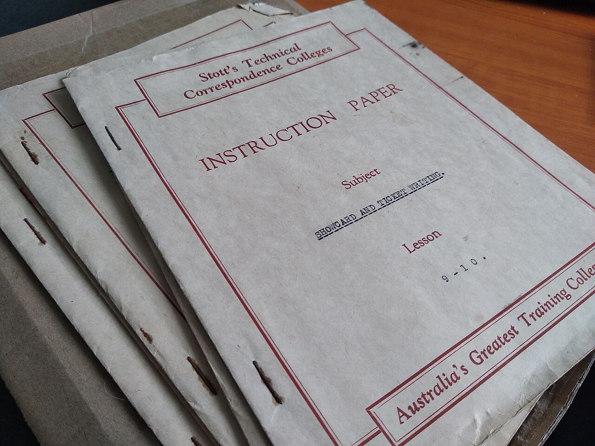

# BDD vs test scripts

*A BDD scenario is written in plain, shared language for anyone on the team to read and helped write; a traditional test script is code, written by and for testers, that only a technical reader can follow.*

> A traditional test script and a BDD scenario can verify the exact same behavior and still be
> fundamentally different documents - one readable only by whoever wrote it (and maybe a few other
> engineers), the other readable and reviewable by a product owner who's never opened an IDE. That
> difference in audience is the actual point, not a stylistic preference.

> **In real life**
>
> A specialist correspondence-college instruction booklet, dense with trade jargon and procedural steps,
> is genuinely useful - to someone already trained in that specific trade. Hand it to someone outside
> that trade and it communicates almost nothing; the knowledge needed to read it is itself the barrier.
> A traditional test script is written the same way: for the tester (or developer) who wrote it, in the
> vocabulary of testing and code, useful to exactly the audience already equipped to read it.

**BDD scenarios vs test scripts**: BDD scenarios and traditional test scripts both verify software behavior, but differ fundamentally in audience and form. A traditional test script is written in code (or a tool-specific format) by a tester or developer, for other technical readers - a business stakeholder generally cannot read or meaningfully review it. A BDD scenario is written in plain, structured natural language (Gherkin's Given/When/Then) specifically so a non-technical stakeholder can read, discuss, and help write it, while the SAME document still drives automated execution via step definitions. The difference isn't about which catches more bugs - a well-written script and a well-written scenario can both do that - it's about who can participate in writing, reviewing, and trusting the specification in the first place.

## Same job, different audience

- **Written by** — a test script is typically written solely by a tester or developer. A BDD scenario
  is (ideally) written collaboratively, with input from whoever actually holds the business intent.
- **Readable by** — a test script requires reading code or a testing tool's specific format. A BDD
  scenario is deliberately plain enough that a product owner can read it without any technical
  background.
- **When it's written** — a test script is commonly written after (or alongside) implementation, to
  verify what was built. A BDD scenario is meant to be written *before* implementation, as part of
  agreeing what should be built.
- **What it actually is** — a test script is purely a test. A BDD scenario is simultaneously a
  requirement, a specification, and a test - one document doing three jobs a traditional workflow
  splits across three separate, driftable artifacts.
- **What's the same** — both, once automated, run in CI and produce a pass/fail result. Neither is
  inherently "better testing" in a narrow technical sense; the difference is entirely about who the
  document serves and when it enters the process.

> **Tip**
>
> Not every test needs to be a BDD scenario. Low-level technical checks (an edge case in input
> validation, a specific error-handling path) that no business stakeholder would ever meaningfully weigh
> in on are often better as a plain test script - reserve Gherkin for behavior a non-technical
> stakeholder should actually be able to read and agree with.

> **Common mistake**
>
> Writing Gherkin scenarios that are really just test scripts wearing Given/When/Then formatting -
> technical, implementation-detail-heavy steps ("Given the database has a row with id=42 and
> status_flag=3") that a business stakeholder still couldn't meaningfully read or review. The syntax
> alone doesn't make something a BDD scenario if the audience it's actually written for hasn't changed.


*Instruction manual — Wikimedia Commons, CC BY-SA 4.0 (Ocarina188). [Source](https://commons.wikimedia.org/wiki/File:Instruction_manual.jpg)*
- **"INSTRUCTION PAPER" — written for one specific, trained audience** — Genuinely useful, but only to someone already inside the trade it's written for - the same way a test script written in code communicates fully only to another engineer.
- **The specific subject line — narrow, technical, jargon-named** — Meaningful to a specialist, opaque to an outsider - a traditional test script's implementation-detail-heavy steps read the same way to a non-technical stakeholder.
- **The other booklets in the stack, unopened** — Each one similarly locked to its own specific trade's readership - a library of individually specialist documents, not one shared reference everyone on a team could pick up and follow.
- **"Australia's Greatest Training College" — a real, legitimate credential, still narrow** — Quality and rigor within its own domain don't automatically translate to accessibility outside it - the same distinction that separates a well-written test script from a well-written, genuinely shared BDD scenario.

**The same behavior, documented two different ways**

1. **A traditional test script exists** — Written in code, by a tester, verifying login works correctly.
2. **A product owner asks to review it** — They can't meaningfully read the code - they'd need someone to translate it verbally.
3. **A BDD scenario exists for the same behavior** — Given a registered user, When they enter valid credentials, Then they should be logged in.
4. **The same product owner reads it directly** — No translation needed - they can confirm or challenge it themselves.
5. **Both, once automated, run the same way in CI** — The difference was never about execution - it was always about who could participate before that point.

Choosing a document format based on who actually needs to read and contribute to it - not just who
needs to execute it - is really just: name the real audience, then pick the form that audience can
genuinely use. Here's that shape as a small, generic simulation.

*Run it - pick a documentation format based on who actually needs to read it (Python)*

```python
checks = [
    {"name": "login with valid credentials", "business_stakeholder_cares": True},
    {"name": "database rejects a malformed UTF-8 byte sequence", "business_stakeholder_cares": False},
    {"name": "checkout total updates when a promo code is applied", "business_stakeholder_cares": True},
    {"name": "internal cache eviction after exactly 500ms", "business_stakeholder_cares": False},
]

def recommend_format(check):
    return "BDD scenario (Gherkin)" if check["business_stakeholder_cares"] else "traditional test script"

for check in checks:
    print(f"{check['name']}: {recommend_format(check)}")
```

Same audience-based format choice in Java.

*Run it - pick a documentation format based on who actually needs to read it (Java)*

```java
import java.util.*;

public class Main {
    record Check(String name, boolean businessStakeholderCares) {}

    static String recommendFormat(Check check) {
        return check.businessStakeholderCares() ? "BDD scenario (Gherkin)" : "traditional test script";
    }

    public static void main(String[] args) {
        List<Check> checks = List.of(
            new Check("login with valid credentials", true),
            new Check("database rejects a malformed UTF-8 byte sequence", false),
            new Check("checkout total updates when a promo code is applied", true),
            new Check("internal cache eviction after exactly 500ms", false)
        );

        for (Check check : checks) {
            System.out.println(check.name() + ": " + recommendFormat(check));
        }
    }
}
```

### Your first time: Your mission: rewrite one test script as a genuine BDD scenario, and judge honestly

- [ ] Find a real, existing test script (yours or an open-source project's) that verifies user-facing behavior — Read it as if you were a non-technical product owner - note exactly where you'd get lost.
- [ ] Rewrite the same behavior as a Given/When/Then scenario in plain language — No code, no implementation details - just what a user does and what should happen.
- [ ] Show both versions to someone non-technical, if you can — Ask them honestly which one they could review and agree with on their own.
- [ ] Identify one behavior from your own work that's genuinely low-level/technical — Confirm honestly that it's better left as a plain test script, not forced into Gherkin.

You've now practiced the real judgment call this note is about: matching the format to the actual
audience, not applying BDD everywhere by default.

- **A team's Gherkin scenarios are technically formatted correctly but no business stakeholder ever reads or reviews them.**
  This suggests the scenarios are test scripts wearing Given/When/Then syntax, not genuine BDD - check whether they're actually written at a level a non-technical reader could follow, and whether stakeholders are actually invited into the writing process.
- **A team is forcing every single low-level technical check into Gherkin format, and it's slowing everyone down.**
  Revisit which checks genuinely benefit from stakeholder-readable format versus which are purely technical - not everything needs to be a BDD scenario, per the note's own guidance.
- **A product owner reviews a scenario and can't tell whether it's actually correct.**
  Check whether implementation details have crept into the scenario's language (the note's mistake callout) - a scenario that's genuinely stakeholder-readable shouldn't require technical knowledge to evaluate.
- **Two documents exist for the same behavior - a Gherkin scenario AND a separate traditional test script.**
  This often indicates duplicated, driftable effort - if the scenario is genuinely automatable (next chapters cover exactly this), it should BE the test, not have a redundant separate script maintained alongside it.

### Where to check

- **Who actually authored a given scenario** (git blame/authorship) — a single technical author is a
  sign it may be a test script in Gherkin clothing, not genuinely collaborative.
- **Whether a non-technical team member has ever opened the `.feature` files** — the most direct signal
  for whether the "shared" audience is real or aspirational.
- **The vocabulary inside the scenario itself** — database field names, internal function names, and
  status codes are markers of implementation detail leaking into what should be plain language.
- **Whether a duplicate traditional test exists for the same behavior a scenario already covers** — a
  sign of unnecessary duplicated maintenance effort.

### Worked example: a scenario that looked like BDD but was actually a script in disguise, caught and fixed

1. A `.feature` file scenario reads: "Given user_table has a row where email='test@x.com' and
   status_flag=1, When POST /api/login is called with valid credentials, Then response.status_code
   should equal 200 and session_token should be present in the response body."
2. A product owner is asked to review it and can't meaningfully evaluate whether it's correct - the
   database field names and API details mean nothing to them.
3. It's rewritten: "Given a registered user with a verified email, When they log in with the correct
   password, Then they should be signed in and taken to their dashboard."
4. The product owner can now genuinely confirm this matches their intent - and flags, correctly, that
   the original also never covered what should happen with an UNverified email, a gap the technical
   version's field-level focus had obscured.
5. The rewritten scenario is both more readable AND more complete, because writing it in plain language
   forced a clearer statement of the actual behavior being verified.

**Quiz.** A team's .feature files are syntactically correct Gherkin (proper Given/When/Then structure) but contain steps like 'Given user_table has a row where status_flag=1' and no business stakeholder ever reviews them. Is this genuine BDD, based on this note?

- [ ] Yes - correct Gherkin syntax is what defines BDD, regardless of who reads or writes it
- [x] No - the note is explicit that BDD's actual point is a shared, stakeholder-readable specification; implementation-detail-heavy language and the absence of any non-technical readership indicate this is a test script wearing Gherkin formatting, not genuine BDD
- [ ] Yes, as long as the scenarios are automated and running in CI
- [ ] It depends only on whether the team calls their process 'BDD' internally

*The note's mistake callout addresses exactly this pattern - syntax alone doesn't make something BDD if the audience and language haven't actually changed to serve a non-technical stakeholder. Option one and option three both mistake surface-level markers (correct syntax, CI automation) for the substantive thing BDD is actually about: who can read, write, and trust the specification. Option four treats BDD as a label rather than a practice with real, checkable characteristics the note lays out directly.*

- **The core difference between a BDD scenario and a test script** — Audience and authorship - a scenario is written in plain language for a non-technical stakeholder to read and help write; a script is code, for other technical readers.
- **Does BDD catch more bugs than traditional testing?** — Not inherently - the difference is about WHO can participate in writing, reviewing, and trusting the specification, not raw bug-catching power.
- **When should a check stay a plain test script instead of becoming a BDD scenario?** — When it's a low-level technical check no business stakeholder would meaningfully review - reserve Gherkin for behavior a non-technical reader should actually be able to evaluate.
- **The tell-tale sign of a 'test script wearing Gherkin clothing'** — Implementation-detail-heavy steps (database fields, internal status codes) that a business stakeholder still couldn't meaningfully read or review, despite correct Given/When/Then syntax.
- **The correspondence-college-booklet analogy** — A genuinely useful, well-made document - but written entirely for one trained audience, communicating almost nothing to anyone outside it, the same limitation a code-only test script has for a non-technical reader.

### Challenge

Find a real Gherkin `.feature` file (yours, a teammate's, or an open-source project's). Read every
step and flag any that contain implementation details (database fields, internal function/variable
names, raw status codes) rather than plain, user-facing language. For each flagged step, rewrite it in
language a non-technical stakeholder could actually evaluate, and note whether the rewrite reveals
anything the original was quietly assuming or leaving out.

### Ask the community

> I'm trying to decide whether `[describe the behavior]` should be a BDD scenario or a plain test script. Here's why I'm unsure: `[describe the ambiguity]`.

Describing the actual behavior and who would realistically need to review it usually resolves this
faster than debating the question in the abstract - the right answer follows directly from the real
audience.

- [Department of Product — Writing BDD Test Scenarios](https://www.departmentofproduct.com/blog/writing-bdd-test-scenarios/)
- [Satisfice — Behavior-Driven Development vs. Testing](https://www.satisfice.com/blog/archives/638)

🎬 [Writing Better BDD Scenarios — SmartBear](https://www.youtube.com/watch?v=awwFfCYoGFQ) (62 min)

- A BDD scenario and a traditional test script can verify identical behavior - the real difference is audience: who can read, write, and review it.
- A test script is code for technical readers; a BDD scenario is plain, structured language meant for a non-technical stakeholder too.
- Neither format is inherently better testing - reserve Gherkin for behavior a business stakeholder should genuinely be able to evaluate, and plain scripts for purely technical checks.
- Gherkin syntax with implementation-detail-heavy steps is a test script in disguise, not genuine BDD - the language, not just the keyword structure, has to actually change.
- A scenario that's genuinely readable by its intended non-technical audience often reveals gaps a purely technical version's field-level focus obscures.


## Related notes

- [[Notes/bdd-with-cucumber/bdd-in-plain-words/what-bdd-solves|What BDD solves]]
- [[Notes/bdd-with-cucumber/bdd-in-plain-words/given-when-then|Given / When / Then]]
- [[Notes/bdd-with-cucumber/bdd-in-plain-words/the-three-amigos|The three amigos]]


---
_Source: `packages/curriculum/content/notes/bdd-with-cucumber/bdd-in-plain-words/bdd-vs-test-scripts.mdx`_
