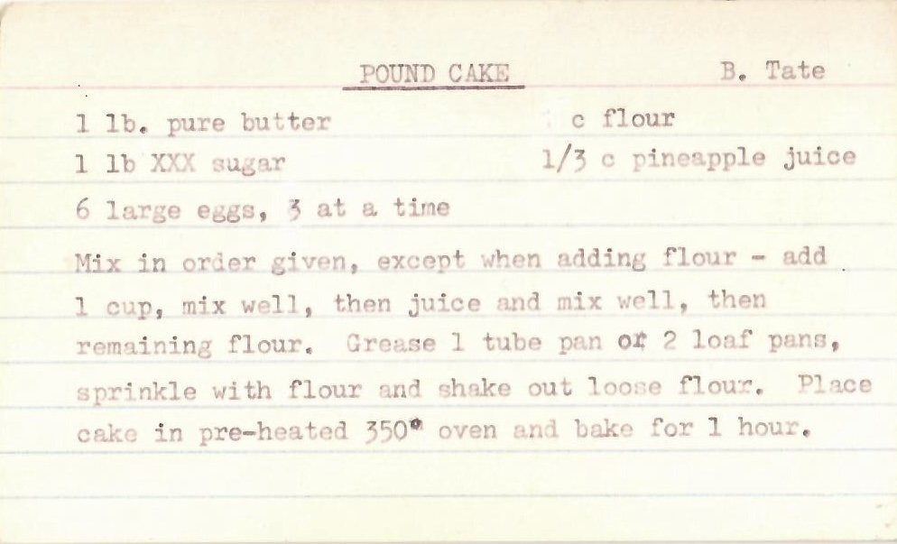

# Writing scenarios

*A .feature file is a Feature line with a short description plus Scenario blocks of Given/When/Then steps. A well-scoped scenario verifies exactly one behavior, and its name alone tells you what broke when it fails - two disciplines that decide whether the file stays useful.*

> A CI run fails overnight and the report says: "Scenario: Test 3 - FAILED." Nobody knows what Test 3
> verifies without opening the file and reading every step. The same failure in a well-written feature
> file reads: "Scenario: Withdrawal is refused when funds are insufficient - FAILED" - and the
> diagnosis has already started before anyone opens anything. That difference is entirely decided at
> writing time.

> **In real life**
>
> A typed recipe card from a mid-century recipe box has a fixed, reliable anatomy: the dish's name
> underlined at the top, an attribution beside it, the ingredients listed before any instruction
> appears, then the method as ordered steps ending in a checkable result ("bake for 1 hour" at 350
> degrees). One card, one dish - nobody writes pound cake and gingerbread on the same card, and nobody
> has to read the method to know what the card makes, because the title already says it. A `.feature`
> file is built on exactly that anatomy: a name that declares the capability, context before action,
> one scenario per behavior.

**Writing scenarios**: A .feature file is Gherkin's unit of specification: it starts with a Feature: keyword naming one capability of the system, optionally followed by free-text description lines (unparsed prose giving context), then one or more Scenario: blocks. Each scenario has a name and a sequence of Given/When/Then steps describing one concrete example of the feature's behavior. A well-scoped scenario verifies exactly ONE behavior - one action, one checkable outcome - so a failure points at a single cause; a poorly-scoped one folds several behaviors together, making failures ambiguous. The scenario's name should state what is being verified precisely enough that the name alone, in a failure report, identifies the broken behavior.

## The anatomy of a .feature file

```gherkin
Feature: Cash withdrawal
  Account holders can withdraw cash from an ATM,
  limited by their available balance.

  Scenario: Withdrawal succeeds with sufficient funds
    Given the account balance is $100
    When the account holder requests $20
    Then the ATM should dispense $20
    And the account balance should be $80

  Scenario: Withdrawal is refused when funds are insufficient
    Given the account balance is $10
    When the account holder requests $20
    Then the ATM should refuse the withdrawal
    And the account balance should still be $10
```

- **`Feature:` names one capability** - not the whole product, not a sprint, one coherent piece of
  behavior. Everything in the file should belong to it; if a scenario doesn't, it belongs in a
  different file.
- **The description lines are free prose** - the lines between `Feature:` and the first scenario
  aren't executed or parsed. They're the place for context: who this is for, why it exists, links to
  the discussion that produced it.
- **Each `Scenario:` is one concrete example** - a specific starting state, one action, a specific
  checkable outcome. The two scenarios above share a shape but each stands alone: either can fail
  independently and the failure means one specific thing.
- **Well-scoped means one behavior** - "withdrawal succeeds" and "withdrawal is refused" are two
  behaviors, so they're two scenarios. A single scenario that withdraws, then checks the refusal
  path, then checks a receipt prints, is three behaviors folded together - when it fails, which one
  broke?
- **The name is the scenario's headline** - it should state the behavior AND the condition:
  "Withdrawal is refused when funds are insufficient," not "Insufficient funds," not "Test 3." A
  reader scanning only names should be able to list what the feature does and doesn't cover.

> **Tip**
>
> Read your scenario names as if they were lines in tomorrow's failure report, because that's exactly
> what they'll be. If "Scenario: `[name]` - FAILED" wouldn't tell a teammate what behavior broke
> without opening the file, rename it now - it costs seconds at writing time and saves a
> file-spelunking session per future failure.

> **Common mistake**
>
> Folding a user journey into one scenario: log in, add an item, apply a promo code, check out, verify
> the confirmation email - five behaviors in one block. It feels efficient, but any failure now points
> at the whole journey instead of one behavior, later steps never run once an early one fails (hiding
> whether they also broke), and the scenario name has no honest option except something vague like
> "Checkout flow works."


*Pound cake recipe card — Wikimedia Commons, CC BY-SA 4.0 (SJGW). [Source](https://commons.wikimedia.org/wiki/File:Pound_cake_recipe_card_-_Handwritten_2024-05-21_103943_page_1.jpg)*
- **"POUND CAKE" — the Feature line** — One capability, named at the top, underlined. Nobody reads the method to learn what this card makes - the same job a Feature: line and a good scenario name do in a failure report.
- **"B. Tate" — the description's job** — Context that isn't an instruction: where this came from, whose it is. Gherkin's free-text description lines under Feature: hold exactly this kind of unexecuted, useful prose.
- **The ingredient list — context before action** — Everything that must exist before step one, stated up front with no actions mixed in - the discipline of a scenario's Given section.
- **The method — ordered steps to a checkable result** — Mix, grease, bake at 350 for 1 hour: actions in sequence ending in a verifiable outcome, the When/Then arc of a scenario - and only ONE dish's worth of them on this card.

**Reading a .feature file top to bottom**

1. **Feature: Cash withdrawal** — One capability named - the file's single subject.
2. **Description lines: who it's for, why it exists** — Free prose, never executed - context for human readers.
3. **Scenario: Withdrawal succeeds with sufficient funds** — The name states behavior + condition before a single step is read.
4. **Given / When / Then steps** — One starting state, one action, one checkable outcome.
5. **Next Scenario: Withdrawal is refused when funds are insufficient** — A second behavior gets its own block - never folded into the first.

A failure report is only as useful as the scoping and naming that went into each scenario - one
behavior per block, a name that says what's verified. Here's that shape as a small, generic
simulation.

*Run it - see how scoping and naming decide a failure report's usefulness (Python)*

```python
feature = {
    "name": "Cash withdrawal",
    "scenarios": [
        {"name": "Withdrawal succeeds with sufficient funds", "actions": 1, "passed": True},
        {"name": "Withdrawal is refused when funds are insufficient", "actions": 1, "passed": False},
        {"name": "Test 3", "actions": 3, "passed": False},
    ],
}

def failure_report(feature):
    print(f"Feature: {feature['name']}")
    for s in feature["scenarios"]:
        status = "PASS" if s["passed"] else "FAIL"
        print(f"  [{status}] Scenario: {s['name']}")
        if not s["passed"]:
            if s["actions"] > 1:
                print(f"        ^ folds {s['actions']} actions together - which one broke? the report can't say")
            elif len(s["name"].split()) < 4:
                print("        ^ name doesn't state behavior + condition - someone must open the file to diagnose")
            else:
                print("        ^ the name alone already tells the team which behavior broke")

failure_report(feature)
```

Same failure-report shape in Java.

*Run it - see how scoping and naming decide a failure report's usefulness (Java)*

```java
import java.util.*;

public class Main {
    record Scenario(String name, int actions, boolean passed) {}

    public static void main(String[] args) {
        List<Scenario> scenarios = List.of(
            new Scenario("Withdrawal succeeds with sufficient funds", 1, true),
            new Scenario("Withdrawal is refused when funds are insufficient", 1, false),
            new Scenario("Test 3", 3, false)
        );

        System.out.println("Feature: Cash withdrawal");
        for (Scenario s : scenarios) {
            String status = s.passed() ? "PASS" : "FAIL";
            System.out.println("  [" + status + "] Scenario: " + s.name());
            if (!s.passed()) {
                if (s.actions() > 1) {
                    System.out.println("        ^ folds " + s.actions() + " actions together - which one broke? the report can't say");
                } else if (s.name().split(" ").length < 4) {
                    System.out.println("        ^ name doesn't state behavior + condition - someone must open the file to diagnose");
                } else {
                    System.out.println("        ^ the name alone already tells the team which behavior broke");
                }
            }
        }
    }
}
```

### Your first time: Your mission: write a .feature file whose names carry their own weight

- [ ] Pick one capability you know well (cash withdrawal, adding to a cart, resetting a password) — Write the Feature: line plus two description lines saying who it's for and why it exists.
- [ ] Write three Scenario blocks - one happy path, two edge/failure cases - each with one When — If a scenario needs a second When, that's a second behavior asking for its own block.
- [ ] Cover every scenario's steps with your hand and read only the three names — Could a teammate list what this feature does and doesn't cover from the names alone? If not, rename.
- [ ] Deliberately merge two of your scenarios into one, read it back, then split them again — Notice how the merged version's name has no honest option except something vague.

You've now practiced the two disciplines this note is about: one behavior per scenario, and names
that do their job in a failure report.

- **A scenario fails and nobody can tell what broke without reading every step.**
  The name isn't stating behavior + condition - rename it so it would read as a complete, specific headline in a failure report ("Withdrawal is refused when funds are insufficient", not "Insufficient funds test").
- **One scenario keeps failing for entirely different reasons on different days.**
  It's almost certainly covering several behaviors - count its actions and split it so each block has one When and one checkable outcome, giving each future failure a single meaning.
- **A .feature file has grown to dozens of scenarios and nobody reads it anymore.**
  Check whether the Feature: line still names ONE capability - files usually bloat when unrelated behaviors accumulate under a vague feature name, and splitting by capability restores readability.
- **Steps fail with 'undefined step' errors even though the scenario reads fine as English.**
  Gherkin's structure parses, but each step must still match a step definition in the automation layer - the wording of a step is an interface, so check for small phrasing drift between the .feature file and the defined steps.

### Where to check

- **The scenario names alone, read as a list** — if the list doesn't summarize what the feature does
  and doesn't cover, naming needs work before anything else.
- **Actions per scenario** — any block whose steps perform more than one action (excluding And/But
  continuations of a single When) is a scoping candidate to split.
- **The failure report from the last CI run** — the most honest test of whether names carry enough
  information, since that's where they're actually consumed.
- **Cucumber's official Gherkin reference** — the definitive source for `Feature:` and `Scenario:`
  syntax details (descriptions, keywords per language, rules) beyond this note's scope.

### Worked example: a feature file whose failure report went from opaque to self-explanatory

1. A team's `checkout.feature` contains scenarios named "Test 1" through "Test 6," each written
   quickly during a sprint - several fold multiple behaviors together.
2. One night "Test 4 - FAILED" appears in CI. Diagnosing it takes forty minutes, most of which is
   reading Test 4's fourteen steps to work out it covers promo codes, then which of its three
   actions actually broke.
3. The team rewrites the file: each scenario gets exactly one When, multi-behavior blocks are split,
   and every name is rewritten as behavior + condition ("Expired promo code is rejected at
   checkout").
4. Test 4's fourteen steps become three scenarios of four to five steps each - same coverage, three
   precise names.
5. The next failure reads "Expired promo code is rejected at checkout - FAILED." The developer who
   sees it knows what broke, where to look, and what to re-test before opening a single file.

**Quiz.** A scenario is named 'Checkout works' and its steps log in, add an item, apply a promo code, and verify the confirmation page. It has started failing intermittently. According to this note, what's the most useful first change?

- [ ] Add more Then assertions to the end so the scenario checks more things per run
- [x] Split it into one-behavior scenarios, each with a single When and a name stating behavior + condition - so each future failure points at exactly one cause and the report names it
- [ ] Rename it to 'Test: checkout regression suite' so its scope is clearer
- [ ] Delete the scenario, since intermittent failures mean the behavior can't be specified in Gherkin

*The scenario folds several behaviors together (the note's mistake callout), so failures are ambiguous and later steps never run once an early one fails - splitting by behavior with precise names fixes both, which is exactly the anatomy discipline this note teaches. Option one makes the problem worse: more assertions in an over-folded scenario means even more possible meanings per failure. Option three changes the label without fixing the scoping, and the proposed name still says nothing about behavior or condition. Option four gives up entirely - intermittent failure is a symptom of ambiguous scoping here, not evidence the behavior is unspecifiable.*

- **The anatomy of a .feature file** — A Feature: line naming one capability, optional free-text description lines (unparsed prose), then one or more Scenario: blocks each with a name and Given/When/Then steps.
- **What makes a scenario well-scoped?** — It verifies exactly one behavior - one action, one checkable outcome - so any failure points at a single cause.
- **What are the description lines under Feature: for?** — Human context - who the feature is for, why it exists, links to the discussion. They're never parsed or executed.
- **The test of a good scenario name** — Read it as a line in a failure report: if 'Scenario: [name] - FAILED' tells a teammate which behavior broke without opening the file, the name works.
- **The recipe-card analogy for a .feature file** — Title = Feature line (one dish per card), attribution = description, ingredients = Given context before action, the method = ordered steps to a checkable result.

### Challenge

Take a real .feature file (yours, a teammate's, or from an open-source project - searching GitHub for
"path:*.feature" finds thousands). Read only the scenario names and write down what you believe the
feature covers. Then read the steps and compare: flag every scenario whose name undersold or missold
its content, and every scenario performing more than one action. Rewrite the worst two - one rename,
one split - and note in a sentence each how the failure report improves.

### Ask the community

> I'm not sure whether this should be one scenario or several: `[paste the scenario or describe the behaviors it covers]`. Here's what makes me hesitate: `[your reasoning]`.

Listing the distinct actions the scenario performs usually answers the question before anyone
replies - if you can name two things that could fail independently, you've found two scenarios.

- [Cucumber — official Gherkin reference](https://cucumber.io/docs/gherkin/reference/)
- [Automation Panda — BDD 101: Gherkin by example](https://automationpanda.com/2017/01/27/bdd-101-gherkin-by-example/)

🎬 [#3 What is Cucumber Feature File | Complete Overview of Gherkin Keywords — Suresh SDET Automation](https://www.youtube.com/watch?v=WQ1f22t6xMI) (20 min)

- A .feature file is a Feature: line naming one capability, free-text description lines for human context, and one Scenario: block per concrete behavior.
- A well-scoped scenario verifies exactly one behavior - one action, one checkable outcome - so a failure has a single meaning.
- Folding a journey into one scenario makes every failure ambiguous and hides whether later steps also broke, since they never run.
- Name scenarios as behavior + condition, so the name alone identifies the broken behavior in a failure report.
- Reading only the scenario names should tell a teammate what the feature does and doesn't cover - that's the fastest review a feature file can get.


## Related notes

- [[Notes/bdd-with-cucumber/gherkin-and-feature-files/scenario-outlines-and-examples|Scenario outlines & examples]]
- [[Notes/bdd-with-cucumber/gherkin-and-feature-files/backgrounds-and-tags|Backgrounds & tags]]
- [[Notes/bdd-with-cucumber/gherkin-and-feature-files/good-vs-bad-gherkin|Good vs bad Gherkin]]


---
_Source: `packages/curriculum/content/notes/bdd-with-cucumber/gherkin-and-feature-files/writing-scenarios.mdx`_
