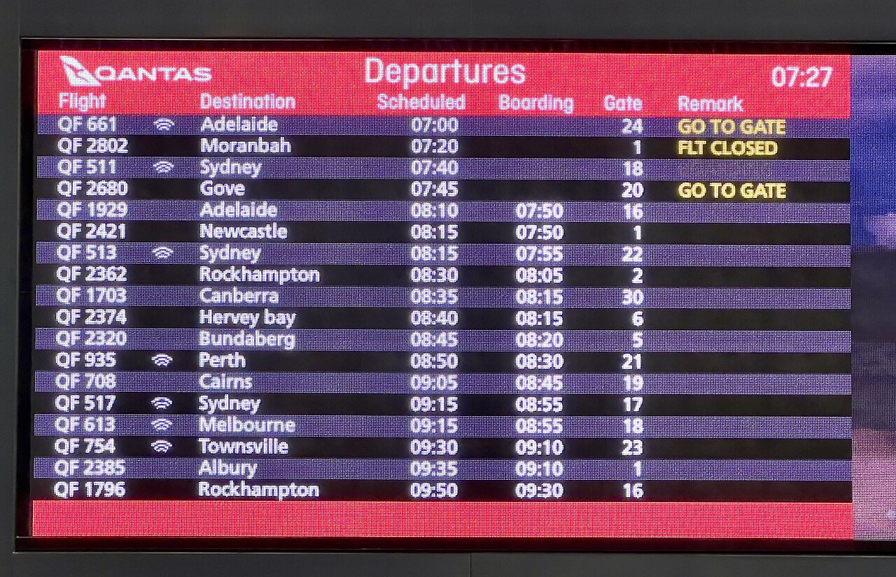

# Data tables

*A pipe-delimited table directly under a Gherkin step passes multiple rows of structured data to that ONE step - arriving as a DataTable (list of maps) in Java or a list of dicts in Python. Distinct from a Scenario Outline's Examples table, which re-runs the whole scenario per row.*

> "Given the following users exist" - and then what? Cramming three users' names, emails, and roles
> into one sentence produces an unreadable monster, and writing three near-identical Given steps buries
> the scenario in setup. Gherkin's answer is to hang a pipe-delimited table directly under the step:
> one step line, many rows of structured data, delivered to the glue code as a single argument. The
> catch is knowing when that's the right tool - and when what you actually have is a Scenario Outline
> wearing the wrong clothes.

> **In real life**
>
> An airport departures board is one display doing one job - "here are this morning's departures" -
> but the information itself is rows and columns: a header naming Flight, Destination, Scheduled,
> Boarding, Gate, and beneath it a row per flight, every cell readable by looking up its column. Nobody
> announces each flight as its own separate speech; the board presents the whole set as a single,
> structured unit. A Gherkin data table is exactly that board: one step making one statement, carrying
> a whole grid of rows that the glue code reads column-by-name.

**Data table**: A data table is Gherkin's way of passing multiple rows of structured data to a SINGLE step: a pipe-delimited block placed directly beneath the step line, becoming that step's final argument. This is fundamentally different from a Scenario Outline's Examples table - a data table feeds one step within one execution of the scenario, while Examples re-runs the ENTIRE scenario once per row. In Cucumber-JVM the glue method receives a DataTable object, typically read as table.asMaps() - a List of Maps keyed by the header row - or converted straight into a list of domain objects. In behave the table arrives as context.table with iterable rows accessed by heading; in pytest-bdd a step can declare a datatable argument. Data tables shine for bulk setup or bulk expected results inside one behavior; when each row instead represents a separate run of the same behavior, the scenario should be an Outline.

## One step, many rows

```gherkin
Scenario: An admin sees every registered user
  Given the following users exist:
    | name  | email             | role   |
    | Amina | amina@example.com | admin  |
    | Ben   | ben@example.com   | viewer |
    | Chloe | chloe@example.com | editor |
  When the admin opens the user list
  Then all 3 users are displayed
```

- **The table belongs to the step above it** - it isn't a free-floating block; Gherkin attaches it
  to "the following users exist" as that step's argument. The scenario still runs exactly once.
- **How it lands in Java** - the glue method's last parameter is a `DataTable`:

```java
@Given("the following users exist:")
public void usersExist(DataTable table) {
    List<Map<String, String>> rows = table.asMaps();
    rows.forEach(row -> userHelper.create(
        row.get("name"), row.get("email"), row.get("role")));
}
```

  `asMaps()` uses the first row as keys, giving one map per data row; `asLists()` gives raw rows,
  and an entry transformer can turn rows directly into domain objects. Every cell arrives as a
  String unless you convert it.
- **How it lands in Python** - behave exposes it as `context.table`
  (`for row in context.table: create(row["name"], row["email"], row["role"])`); pytest-bdd steps
  can take a `datatable` argument carrying the rows. Same idea everywhere: header row becomes the
  keys, data rows become the records.
- **Data table vs Scenario Outline - the actual distinction** - a data table is *data inside one
  run*: seed these five users, expect these three rows in the result. An Examples table is *many
  runs*: log in with each of these credential pairs and check each outcome independently. If a row
  failing should fail the whole scenario as one unit, it's a data table; if each row deserves its
  own independent pass/fail line in the report, it's an Outline.
- **Vertical (key-value) tables** - a two-column table of `| field | value |` pairs under a step is
  a common idiom for describing one entity readably; in Java, `table.asMap()` turns it into a
  single map.

> **Tip**
>
> Treat the header row as part of your glue contract and read cells by column name, never by index -
> `row.get("email")`, not `row.get(1)`. Column-name access lets scenario authors reorder or add
> columns without breaking existing glue, and turns a renamed column into an obvious, well-named
> failure instead of silently shifted data.

> **Common mistake**
>
> Using a data table where each row is really an independent test case - a login step carrying a table
> of five username/password/expected-outcome rows, looped inside one step definition. It "works", but
> all five cases now share one pass/fail: the report can't show which credential pair failed, a failure
> on row two may skip rows three to five entirely, and the whole point of separate examples - separate
> verdicts - is lost. Rows that are independent cases belong in a Scenario Outline's Examples table,
> which re-runs the scenario per row and reports each one on its own line.


*Flight departure board at Brisbane Airport, December 2022 — Wikimedia Commons, CC BY-SA 4.0 (Kgbo). [Source](https://commons.wikimedia.org/wiki/File:Flight_departure_board_at_Brisbane_Airport,_December_2022.jpg)*
- **"Departures" — the one statement the whole grid belongs to** — The board makes a single announcement, the way a data table belongs to a single step line - the rows below are its argument, not separate announcements.
- **The header row — Flight, Destination, Scheduled...** — Column names, exactly like a Gherkin table's first row - and exactly what becomes the keys when glue code calls asMaps() or reads row['destination'].
- **One row per flight — one map per record** — QF 1929 to Adelaide, 08:10, gate 16: each row is a complete record readable by column name, the way each data-table row arrives as one map in the glue.
- **The Remark column — GO TO GATE, FLT CLOSED** — Any cell is addressed by row plus column name. Read cells by header, never by position - a reordered board still reads correctly by column name.

**A pipe table's journey into the glue code**

1. **The .feature file: 'Given the following users exist:' with 3 pipe rows beneath** — The table sits directly under the step line - Gherkin attaches it to that step.
2. **Cucumber matches the step text and sees the attached table** — The table becomes the step's final argument - the scenario still runs exactly once.
3. **The glue method receives a DataTable and calls asMaps()** — The header row becomes the keys; each data row becomes one Map.
4. **The glue loops the maps and delegates: userHelper.create(name, email, role)** — Thin glue: iterate and hand off, no business logic in the step itself.
5. **The rest of the scenario proceeds against the seeded state** — One When, one Then - the table was bulk setup inside ONE behavior, not many test cases.

Underneath the framework, a data table is just text parsing with a contract: split the pipe rows,
promote the first row to keys, zip every later row against those keys. Here's the whole pipeline as a
small, generic simulation.

*Run it - parse a pipe table into a list of dicts keyed by the header row (Python)*

```python
raw = """
| name  | email             | role   |
| Amina | amina@example.com | admin  |
| Ben   | ben@example.com   | viewer |
| Chloe | chloe@example.com | editor |
"""

def parse_table(text):
    rows = []
    for line in text.strip().splitlines():
        cells = [c.strip() for c in line.strip().strip("|").split("|")]
        rows.append(cells)
    header, data = rows[0], rows[1:]
    return [dict(zip(header, row)) for row in data]

users = parse_table(raw)
print(f"parsed {len(users)} rows, columns: {list(users[0].keys())}")
for user in users:
    # read by column NAME - reordering columns in the .feature would not break this
    print(f"  create(name={user['name']}, email={user['email']}, role={user['role']})")
```

The same header-to-keys parsing pipeline in Java - the shape `DataTable.asMaps()` gives you.

*Run it - parse a pipe table into a list of maps keyed by the header row (Java)*

```java
import java.util.*;

public class Main {
    static List<Map<String, String>> parseTable(String[] lines) {
        List<List<String>> rows = new ArrayList<>();
        for (String line : lines) {
            String trimmed = line.trim();
            trimmed = trimmed.substring(1, trimmed.length() - 1); // strip outer pipes
            List<String> cells = new ArrayList<>();
            for (String cell : trimmed.split("\\\\|")) cells.add(cell.trim());
            rows.add(cells);
        }
        List<String> header = rows.get(0);
        List<Map<String, String>> maps = new ArrayList<>();
        for (int r = 1; r < rows.size(); r++) {
            Map<String, String> map = new LinkedHashMap<>();
            for (int c = 0; c < header.size(); c++) map.put(header.get(c), rows.get(r).get(c));
            maps.add(map);
        }
        return maps;
    }

    public static void main(String[] args) {
        String[] table = {
            "| name  | email             | role   |",
            "| Amina | amina@example.com | admin  |",
            "| Ben   | ben@example.com   | viewer |",
            "| Chloe | chloe@example.com | editor |"
        };
        List<Map<String, String>> users = parseTable(table);
        System.out.println("parsed " + users.size() + " rows, columns: " + users.get(0).keySet());
        for (Map<String, String> user : users) {
            System.out.println("  create(name=" + user.get("name")
                + ", email=" + user.get("email") + ", role=" + user.get("role") + ")");
        }
    }
}
```

### Your first time: Your mission: use a data table for setup, then catch yourself misusing one

- [ ] Write a scenario that seeds three records through ONE Given step with a pipe table — Header row first, one record per row - then a single When and a single Then against the seeded state.
- [ ] Sketch the glue that receives it as a list of maps and loops it into a helper call — Java: DataTable.asMaps(); behave: context.table; either way, read every cell by column name.
- [ ] Now deliberately write the misuse: a login step with a table of credential pairs AND an expected-outcome column — Notice the tell - an 'expected result' column inside a data table means each row is secretly its own test case.
- [ ] Convert that misuse into a proper Scenario Outline with an Examples table — Same rows, but now each runs and reports independently - say out loud which artifact moved where.

You've now used both table kinds on the same data and felt the boundary between them, which is the
entire judgment call this note exists to teach.

- **The step won't match once the table is added, though the text is unchanged.**
  The table isn't part of the match - but the glue signature must accept it. Add the DataTable parameter (Java) or read context.table (behave); a step definition without the table argument can't receive one.
- **Every cell comes through as a String and numeric comparisons fail.**
  That's the contract - table cells arrive as text. Convert explicitly in the glue (Integer.parseInt, int(row['qty'])) or register a table/entry transformer to map rows into typed objects.
- **Someone reorders the table's columns and the glue starts writing emails into the name field.**
  The glue is reading cells by index. Switch to header-keyed access (asMaps(), row['email']) so column order stops mattering and renames fail loudly instead of shifting silently.
- **One row of a looped data table fails and the remaining rows never get checked, hiding their results.**
  That's the signature of independent test cases living in a data table - convert to a Scenario Outline so each row runs and reports on its own, or aggregate all row failures before asserting if it genuinely is one unit.

### Where to check

- **The step definition's signature** — whether it declares the table argument (Java `DataTable`,
  pytest-bdd `datatable`) is the first check when a tabled step misbehaves.
- **The header row of the table itself** — typos and renamed columns break header-keyed access with
  a clear message; compare the headers against the exact strings the glue reads.
- **The test report's granularity** — one report line for many table rows versus one line per
  Examples row is the fastest way to see whether the right table kind was chosen.
- **Cucumber's DataTable documentation (cucumber.io) and behave's tutorial section on tables** — the
  authoritative references for asMaps/asLists/transformers and `context.table` semantics.

### Worked example: a login table that hid which case actually failed - and the outline that fixed it

1. A scenario reads: "When the following logins are attempted:" with a five-row table - username,
   password, and an expected column mixing 'success' and 'locked out'. One step definition loops the
   rows and asserts each expectation.
2. CI goes red. The report shows exactly one failing line: the whole scenario. Nobody can tell from
   the report which of the five credential pairs broke - the tester re-runs locally with print
   statements just to find out it was row four.
3. Worse: the loop stopped at row four's failed assertion, so rows five's behavior was never
   checked at all - a second regression sat invisible behind the first.
4. The team converts it: a Scenario Outline - `When "<username>" logs in with "<password>" Then the
   result is "<outcome>"` - with the same five rows moved into an Examples table.
5. The next failure names its row directly in the report ("row: mia / wrongpass / locked out"),
   the other four rows still run to completion, and the data-table version is kept only where it
   belonged all along: the Given step that bulk-seeds the user accounts.

**Quiz.** A scenario needs five products pre-loaded into a catalog before checking that searching for 'mug' returns two of them. A teammate suggests a Scenario Outline with the five products as Examples rows. Based on this note, what's wrong with that suggestion?

- [ ] Nothing - Examples tables and data tables are interchangeable ways to attach rows
- [x] Examples would re-run the ENTIRE scenario five times, once per product - but the products aren't independent cases, they're bulk setup inside one behavior, so they belong in a data table under a single Given step
- [ ] Scenario Outlines can't contain more than three Examples rows
- [ ] Data tables are only allowed under Then steps, so neither approach can seed products

*The distinction is the note's core: an Examples table parameterizes the whole scenario (one run per row), while a data table feeds many rows to one step inside one run. Five seeded products supporting one search assertion are one run's setup - as an Outline, each run would seed only one product, and the search-for-two assertion couldn't even work. Option one erases the distinction the entire note is built on. Option three invents a row limit that doesn't exist. Option four invents a keyword restriction - data tables can attach to any step, and Given-step setup is their most common home.*

- **What is a Gherkin data table?** — A pipe-delimited block directly under a step line, passed to that SINGLE step as its final argument - many rows of structured data inside one execution of the scenario.
- **Data table vs Scenario Outline Examples** — Data table: rows feed one step within one run (bulk setup / bulk expected results). Examples: the whole scenario re-runs once per row, each with its own report line - for independent cases.
- **How a data table arrives in Java glue** — As a DataTable parameter - table.asMaps() gives a List of Maps keyed by the header row; asLists() gives raw rows; transformers can produce typed domain objects. Cells are Strings until converted.
- **How a data table arrives in Python** — behave: context.table, iterable rows accessed by heading. pytest-bdd: a datatable step argument. Either way, the header row supplies the keys.
- **The tell that a data table should be a Scenario Outline** — An expected-outcome column, or rows that deserve independent pass/fail verdicts - one looped step gives all rows a single shared verdict and can skip later rows after an early failure.

### Challenge

Find (or write) one scenario that uses a data table and one that uses a Scenario Outline. For each,
argue in two sentences why it uses the right table kind - or convert it if it doesn't. Then take the
data-table scenario and sketch its glue twice: once reading cells by index, once by column name, and
demonstrate with a reordered column which version survives.

### Ask the community

> I have a step with a table of `[describe your rows and columns]` and I'm unsure whether it should stay a data table or become a Scenario Outline. Here's what one row failing should mean: `[one shared failure / independent verdicts]`.

Stating what a single row's failure should mean is the fastest route to a correct answer - that one
property (shared verdict versus independent verdicts) decides the table kind almost every time.

- [Cucumber — Gherkin reference (data tables and doc strings)](https://cucumber.io/docs/gherkin/reference/)
- [Baeldung — Cucumber data tables in Java (asMaps, asLists, transformers)](https://www.baeldung.com/cucumber-data-tables)

🎬 [7 | Cucumber Tutorial | Data Tables asLists and asMaps — Saravanan Seenivasan](https://www.youtube.com/watch?v=oAure-GrqJQ) (18 min)

- A data table is a pipe-delimited block under a single step, passed to that step as one structured argument - the scenario still runs exactly once.
- In Java it arrives as a DataTable (asMaps() = list of maps keyed by the header row); in behave as context.table; in pytest-bdd as a datatable argument - cells are text until converted.
- Read cells by column name, never by index - header-keyed access survives reordering and turns renames into loud, clear failures.
- Data tables are for bulk data inside one behavior (seeding, bulk expected results); rows that are independent cases with independent verdicts belong in a Scenario Outline's Examples table.
- An expected-outcome column inside a data table is the classic tell that each row is secretly its own test case - and that the report will hide which one failed.


## Related notes

- [[Notes/bdd-with-cucumber/step-definitions/glue-code-java|Glue code (Java)]]
- [[Notes/bdd-with-cucumber/step-definitions/behave-and-pytest-bdd-python|behave / pytest-bdd (Python)]]
- [[Notes/bdd-with-cucumber/step-definitions/hooks-and-context|Hooks & context]]


---
_Source: `packages/curriculum/content/notes/bdd-with-cucumber/step-definitions/data-tables.mdx`_
