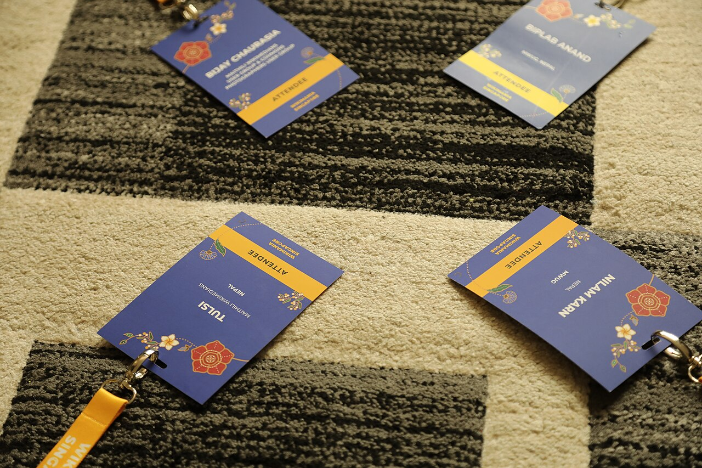

# Accessibility signals: what the robot catches, and what it never will

*The Lighthouse Accessibility score decoded: what automation reliably catches (contrast, labels, alt text, landmarks), what it structurally cannot (keyboard flow, screen-reader sense), the accessibility tree pane, exact WCAG AA contrast math, and why the manual half is the hireable half.*

> The previous note taught you to distrust a Lighthouse score politely. This one teaches you to
> distrust one specific score for a specific, structural reason. A page can hit **Accessibility: 100**
> and still be completely unusable by a blind person -- not because the tool is buggy, but because the
> tool is a machine checking machine-checkable facts, and most of accessibility lives outside that set.
> Contrast ratios? Computable. Whether the Tab key visits your checkout button before the footer's
> seventeenth social icon? Not computable -- somebody has to press Tab. This note covers exactly what
> the automated Accessibility score checks and how (down to the WCAG contrast math, which you'll
> implement yourself), what it structurally cannot check, where the accessibility tree pane fits in,
> and why the tester who knows the boundary between those two halves is the one who gets hired to do
> accessibility work instead of just running a scanner at it.

> **In real life**
>
> An automated accessibility scan is a spell-checker. It will catch every misspelled word with total
> reliability, instantly, for free -- and it will happily wave through a letter that reads 'Dear valued
> customer, we regret to inform you that your house is on fire, kind regards.' Perfect spelling,
> catastrophic document. The scanner checks that your alt text EXISTS; it cannot check that it says
> something useful instead of 'IMG_4032_final_v2.png'. It checks that a label points at an input; it
> cannot check that tabbing through the form follows an order any human would predict. A spell-checked
> letter still needs a human read before it goes out, and a scanner-clean page still needs a human with
> a keyboard before anyone calls it accessible.

WCAG

## What the robot actually checks

The Lighthouse Accessibility score is powered by **axe-core**, the same open-source rules engine
behind the axe DevTools extension -- so 'Lighthouse found it' and 'axe found it' are usually the same
sentence. Its audits are pass/fail checks over computable facts in the DOM and the rendered styles:
**color contrast** (foreground vs background ratio, checked against the AA numbers above), **labels**
(does every form input have an associated label, does every button have an accessible name),
**alt text presence** (does every meaningful image carry an `alt` attribute), **landmarks and
structure** (headings in order, one `main`, lists built from actual list elements), and **ARIA
misuse** (roles that don't exist, `aria-` attributes pointing at IDs that aren't there, required
ARIA children missing). Every one of these has a right answer a machine can compute. That's the
membership test for the list.

Two honest caveats before you trust the number. First, the score is a weighted roll-up, same as the
Performance score from the previous note -- a 94 tells you *where to look*, and the failed audits
underneath tell you *what's wrong*, element by element (Lighthouse names the exact selector for every
contrast failure, which is a gift; put it in the ticket). Second, the coverage: automated tools catch
roughly 30-40 percent of WCAG issues -- the figure you first met in
[why semantics matter](/notes/the-web-platform-for-testers/html-essentials/why-semantics-matter), and
it hasn't improved since, because the missing 60-70 percent is missing for structural reasons, not
engineering laziness.

## What it structurally cannot check

The scanner cannot press Tab. **Keyboard flow** -- whether focus moves in a sensible order, whether
it's visibly indicated, whether a modal traps it or the whole page loses it into an invisible div --
is a judgment about *sequence and sense*, and no rule engine has an opinion about sense. The scanner
cannot listen. **Screen-reader experience** -- whether the page read aloud in order actually makes a
narrative, whether 'button button link image button' means anything -- requires a human ear. The
scanner cannot evaluate meaning: `alt="chart"` on a revenue chart passes the alt-text audit and
communicates nothing; a `div` wired up with a click handler breaks no rule at all, it's simply absent
from the accessibility tree, invisible to assistive tech and to `getByRole` locators alike. Zero
automated violations is a floor. It is never a verdict.

This is exactly why accessibility is a real hiring skill rather than a checkbox. Anyone can click the
Lighthouse button; the tester teams pay extra for is the one who runs the scan in two minutes, then
spends twenty on the half machines can't do -- Tab through every flow, a screen reader pass on the
critical path (VoiceOver ships free on the Mac you're likely reading this on, NVDA free on Windows),
and alt text read for *usefulness*, not presence. With the EAA enforceable and ADA suits routine,
'accessibility tester' stopped being a niche and became a line item.

Your instrument for the manual half lives one pane over: select any element in the Elements panel and
open the **Accessibility pane** (it's in the sidebar next to Styles; there's also a checkbox to render
the full accessibility tree view). It shows you the element the way assistive tech receives it -- its
computed **role**, its **accessible name**, and its state -- the accessibility tree you met in
[why semantics matter](/notes/the-web-platform-for-testers/html-essentials/why-semantics-matter). A
button whose computed name is empty, or a fake div-button that shows up as 'generic', is a finding
you can screenshot straight into a ticket.


*Wikimania Singapore 2023 attendee lanyards — Wikimedia Commons, CC BY-SA 4.0 (Bijay Chaurasia)*
- **The large printed name = the accessible name** — The single biggest thing on this badge is the person's NAME - not their affiliation, not the event logo, the name, because that's the one fact everyone reading it needs first. The Accessibility pane's computed name works the same way: it's the one string a screen reader announces, derived from text, a label, or aria-label, in that priority order.
- **The yellow ATTENDEE band = the computed role** — Underneath the name, a fixed category label - ATTENDEE, not SPEAKER, not ORGANIZER. That's role: not what this badge looks like, but what KIND of thing it officially is. A real button computes to role 'button' automatically; a div styled to look like one computes to 'generic' - same visual weight as this band, completely different category underneath.
- **The upside-down badge = what a visual glance misses** — Read this photo top-to-bottom by eye and this badge is the odd one out - flipped, harder to read at a glance, easy to skip past. That's exactly the gap the Accessibility pane closes: it doesn't care about visual orientation or layout order, it reports what's actually IN the tree, catching the flipped, mislabeled, or invisible-to-a-scan-but-present element your eyes would walk right past.
- **Each badge, separate and complete** — Four people, four badges, each one carrying its own full set of name plus role plus affiliation - never shared, never merged. Every node in the accessibility tree works the same way: its own computed name, its own role, its own states, looked up individually no matter how many other elements sit right next to it on the page.
- **The smaller affiliation line = states, easy to overlook** — Below the name and role sits a smaller line most people never really read - which country, which project. That's this pane's states and properties: present, accurate, and almost always skipped by a quick look, right up until the detail you needed was sitting there in smaller text the whole time.

**From markup to human -- where the scanner's sight ends**

1. **The browser builds the DOM and computes styles** — Everything downstream derives from this: the elements, their attributes, and the final computed colors and sizes. This layer is fully machine-readable, which is precisely why the audits that live here -- contrast, alt presence, label wiring -- are the ones automation nails with near-total reliability.
2. **The accessibility tree is derived from the DOM** — The browser prunes everything without meaning: semantic elements survive with roles and names, styled divs vanish. The Accessibility pane shows you this tree node by node. A scanner can verify facts about what IS here -- it cannot notice that something that should be here is simply absent, because absence of a div-button breaks no rule.
3. **The scanner checks every computable fact** — axe-core (inside Lighthouse) sweeps the DOM and tree: ratios below 4.5:1, inputs without labels, images without alt, broken ARIA references, heading levels that skip. Everything it flags is real and worth fixing. This is the 30-40 percent -- caught instantly, for free, on every run.
4. **A human presses Tab and listens** — Focus order, visible focus, keyboard traps, whether the page read aloud makes sense, whether alt text is USEFUL -- judgments about sequence and meaning. No rule engine has an opinion about meaning. This is the 60-70 percent, and it is the half that constitutes the actual hiring skill.
5. **The finding gets filed with the element, the number, and the rule** — Either way, the professional output is the same shape: exact selector, measured value versus the WCAG AA threshold, and which success criterion it violates. 'button.cta is 2.8:1, needs 4.5:1 per WCAG 1.4.3' -- from scanner or from keyboard, evidence looks identical in the ticket.

The contrast audit is the most quoted and least understood, so let's demystify it completely: here is
the actual WCAG relative-luminance formula, implemented on real hex colors -- including the classic
'barely passes' and 'barely fails' cases that start design debates:

*Run it -- a WCAG contrast-ratio calculator from the spec formula (Python)*

```python
# WCAG contrast ratio between two hex colours, from the actual spec formula.
# Relative luminance: linearize each sRGB channel, then weight for the eye's
# sensitivity (green counts most). Ratio = (lighter + 0.05) / (darker + 0.05).
def channel(c8):
    c = c8 / 255
    return c / 12.92 if c <= 0.03928 else ((c + 0.055) / 1.055) ** 2.4

def luminance(hex_colour):
    h = hex_colour.lstrip("#")
    r, g, b = (channel(int(h[i:i+2], 16)) for i in (0, 2, 4))
    return 0.2126 * r + 0.7152 * g + 0.0722 * b

def contrast(fg, bg):
    l1, l2 = sorted([luminance(fg), luminance(bg)], reverse=True)
    return (l1 + 0.05) / (l2 + 0.05)

def judge(fg, bg, label):
    ratio = contrast(fg, bg)
    aa_normal = "PASS" if ratio >= 4.5 else "FAIL"
    aa_large = "PASS" if ratio >= 3.0 else "FAIL"
    print(f"{label}: {fg} on {bg}")
    print(f"  ratio {ratio:.2f}:1  AA normal (needs 4.5:1): {aa_normal}"
          f"  AA large (needs 3:1): {aa_large}")

judge("#333333", "#FFFFFF", "Body text")
judge("#767676", "#FFFFFF", "Muted caption")
judge("#999999", "#FFFFFF", "That 'subtle' placeholder")
judge("#FFFFFF", "#E8710A", "White on brand orange button")

# Output:
# Body text: #333333 on #FFFFFF
#   ratio 12.63:1  AA normal (needs 4.5:1): PASS  AA large (needs 3:1): PASS
# Muted caption: #767676 on #FFFFFF
#   ratio 4.54:1  AA normal (needs 4.5:1): PASS  AA large (needs 3:1): PASS
# That 'subtle' placeholder: #999999 on #FFFFFF
#   ratio 2.85:1  AA normal (needs 4.5:1): FAIL  AA large (needs 3:1): FAIL
# White on brand orange button: #FFFFFF on #E8710A
#   ratio 3.09:1  AA normal (needs 4.5:1): FAIL  AA large (needs 3:1): PASS
```

Note the last case carefully: white on brand orange **fails** for normal text and **passes** for large
text -- both verdicts from the same 3.09:1 ratio. Whether that button is a bug depends on its font
size, which is exactly the kind of precision a credible ticket needs. Same calculator in Java:

*Run it -- the WCAG contrast calculator (Java)*

```java
public class Main {

    // WCAG contrast ratio between two hex colours, straight from the spec:
    // linearize each sRGB channel, weight for the eye (green counts most),
    // then ratio = (lighter + 0.05) / (darker + 0.05).
    static double channel(int c8) {
        double c = c8 / 255.0;
        return c <= 0.03928 ? c / 12.92 : Math.pow((c + 0.055) / 1.055, 2.4);
    }

    static double luminance(String hex) {
        String h = hex.replace("#", "");
        double r = channel(Integer.parseInt(h.substring(0, 2), 16));
        double g = channel(Integer.parseInt(h.substring(2, 4), 16));
        double b = channel(Integer.parseInt(h.substring(4, 6), 16));
        return 0.2126 * r + 0.7152 * g + 0.0722 * b;
    }

    static double contrast(String fg, String bg) {
        double l1 = Math.max(luminance(fg), luminance(bg));
        double l2 = Math.min(luminance(fg), luminance(bg));
        return (l1 + 0.05) / (l2 + 0.05);
    }

    static void judge(String fg, String bg, String label) {
        double ratio = contrast(fg, bg);
        String aaNormal = ratio >= 4.5 ? "PASS" : "FAIL";
        String aaLarge = ratio >= 3.0 ? "PASS" : "FAIL";
        System.out.println(label + ": " + fg + " on " + bg);
        System.out.printf("  ratio %.2f:1  AA normal (needs 4.5:1): %s  AA large (needs 3:1): %s%n",
                ratio, aaNormal, aaLarge);
    }

    public static void main(String[] args) {
        judge("#333333", "#FFFFFF", "Body text");
        judge("#767676", "#FFFFFF", "Muted caption");
        judge("#999999", "#FFFFFF", "That 'subtle' placeholder");
        judge("#FFFFFF", "#E8710A", "White on brand orange button");
    }
}

/* Output:
Body text: #333333 on #FFFFFF
  ratio 12.63:1  AA normal (needs 4.5:1): PASS  AA large (needs 3:1): PASS
Muted caption: #767676 on #FFFFFF
  ratio 4.54:1  AA normal (needs 4.5:1): PASS  AA large (needs 3:1): PASS
That 'subtle' placeholder: #999999 on #FFFFFF
  ratio 2.85:1  AA normal (needs 4.5:1): FAIL  AA large (needs 3:1): FAIL
White on brand orange button: #FFFFFF on #E8710A
  ratio 3.09:1  AA normal (needs 4.5:1): FAIL  AA large (needs 3:1): PASS
*/
```

> **Tip**
>
> Pair every automated scan with the **two-minute keyboard pass**: put the mouse out of reach and Tab
> through the page's critical flow. You're checking exactly four things -- can you reach every control,
> can you SEE where focus is at all times, does the order make sense, and can you get back out of every
> overlay with Escape or Tab. This one habit covers the highest-impact slice of what the scanner
> structurally misses, costs two minutes, and requires zero tooling. If you do only one manual check per
> page, this is the one -- and 'focus disappears after the cookie banner closes' is a finding no
> Lighthouse run in history has ever produced.

### Your first time: Your mission: run the scan, then beat the scanner

- [ ] Run a Lighthouse Accessibility audit on a page you use daily — DevTools, Lighthouse panel, tick only Accessibility, run it. Note the score, then immediately open the failed audits underneath -- as with the previous note's Performance score, the number is the doorbell and the audit list is the person at the door.
- [ ] Verify one contrast failure by hand — Pick any flagged contrast failure, grab the two hex colors from the Styles pane, and run them through the Python playground above. Confirm the ratio and which AA threshold applies (4.5:1 normal, 3:1 large). You have just turned 'the tool said so' into 'I verified the math' -- a much stronger sentence in a ticket.
- [ ] Open the Accessibility pane on a real button and a fake one — Select a genuine button element in the Elements panel and read its computed role and name in the Accessibility pane. Then find (or imagine) a clickable div and compare: role 'generic', often no name. That difference is invisible to the scanner and obvious in this pane.
- [ ] Do the two-minute keyboard pass — Mouse away. Tab through the page's main flow, watching for unreachable controls, invisible focus, nonsense order, and overlays you cannot escape. Write down the first thing that surprises you -- there is nearly always something, even on famous sites.
- [ ] Write one finding of each kind — File (or draft) one scanner finding -- element, measured ratio, threshold, WCAG criterion -- and one manual finding, like a focus-order problem, with the exact Tab sequence to reproduce it. Feel how the evidence anatomy is identical even though only one came from a tool.

You've verified the robot's math, watched it miss what it must miss, and produced one finding from each half of the craft. That's the whole skill in miniature.

- **The page scores 100 on Accessibility but a keyboard user cannot complete checkout.**
  Working as designed -- the score only aggregates machine-checkable audits, and keyboard flow is not one of them. Do the manual pass: Tab through checkout, note where focus becomes invisible or trapped, and file it with the exact sequence ('after closing the promo modal, focus returns to body; Tab then cycles the header only'). Cite WCAG 2.1.1 (keyboard) or 2.4.3 (focus order) so nobody mistakes it for an opinion.
- **The contrast audit flags the brand color, and design pushes back with 'it looks fine to me'.**
  Take the debate from taste to arithmetic. Show the computed ratio next to the AA threshold: 3.09:1 against a required 4.5:1 is not a matter of eyesight. Offer the two compliant escape routes: darken the shade until the picker's contrast line passes, or bump the text to large (18pt/24px regular or 14pt bold) where 3:1 suffices. DevTools' color picker will preview a passing shade live -- bring that screenshot to the meeting, not adjectives.
- **Every image has alt text, the audit passes, and a screen-reader user still gets nothing useful.**
  The scanner checks presence, not meaning -- alt='image' or alt='photo123.jpg' passes every automated audit ever written. Read the alt text aloud with the page hidden and ask whether you'd know what the image showed. Decorative images should carry EMPTY alt (alt='') so screen readers skip them; meaningful ones need a description that does the image's job. This review is human work by definition; budget for it.
- **The Accessibility score DROPPED after the team added ARIA attributes to improve accessibility.**
  Painfully common and usually correct: bad ARIA is worse than no ARIA, and axe-core aggressively flags misuse -- made-up roles, aria-labelledby pointing at IDs that don't exist, required children missing (a tablist with no tabs). Open the specific failed audits and check each flagged attribute against the pattern's spec. The fix is often deletion: native elements (button, nav, label) carry their semantics for free, no ARIA required -- the first rule of ARIA is don't use ARIA when HTML already does it.

### Where to check

Accessibility signals earn attention at specific moments, and the split between robot work and human
work stays the same at each of them:

- **On every new UI feature, before merge** -- run the scan (seconds) and the two-minute keyboard pass. Together they catch the bulk of what would otherwise ship; separately each misses what the other sees.
- **After any design-system or theme change** -- colors are global, so one token edit can push dozens of components below 4.5:1 at once. The contrast audit catches this in one run; check both light and dark themes if the product has them.
- **When a form or modal changes** -- labels, focus order, and focus trapping are exactly the audits-plus-manual territory where regressions hide. Tab into it, through it, and OUT of it.
- **In the Accessibility pane, whenever a locator mysteriously fails** -- a getByRole that finds nothing usually means the element fell out of the accessibility tree. The pane shows you what the tree actually contains, which is faster than arguing with the test.
- **On the legal-exposure pages first** -- signup, checkout, contact, anything a customer MUST pass through. WCAG AA on those flows is what the EAA and ADA conversations are actually about; a decorative blog widget can wait.

### Worked example: the signup form that scored 96 and blocked real users

1. **The setup:** a redesigned signup form ships behind a feature flag. Lighthouse Accessibility: 96. The team channel celebrates; someone suggests skipping the manual review 'since it's basically green'.
2. **The tester runs the scan anyway and reads the audit list, not the score.** One real finding: the terms-and-conditions link is 4.1:1 against the background -- below the 4.5:1 AA bar for normal text. Verified by hand with the contrast formula; the exact selector and both hex values go in the notes.
3. **Then the keyboard pass, which the score cannot cover.** Tab reaches the email field, the password field... and then focus vanishes. Two more Tabs and it reappears -- in the footer. The custom-built country dropdown between them, a styled div with a click handler, was never focusable at all.
4. **The Accessibility pane confirms it in one screenshot:** the dropdown's computed role is 'generic', accessible name empty. It does not exist in the accessibility tree. A keyboard user literally cannot select a country, which means they cannot sign up.
5. **The tester checks the announcement path too:** with VoiceOver on, the 'password requirements' hint -- shown only after a failed attempt -- is never announced, because it's injected silently. Noted as a second manual finding, lower severity.
6. **Two tickets get filed, each with the right kind of evidence.** The contrast one: selector, 4.1:1 measured versus 4.5:1 required, WCAG 1.4.3, screenshot of the picker. The dropdown one: the Tab sequence to reproduce, the Accessibility pane screenshot showing role 'generic', WCAG 2.1.1, and the plain-impact sentence: 'keyboard-only users cannot complete signup'.
7. **The dropdown gets rebuilt on a native select; the link gets darkened.** The next Lighthouse run still says 96 -- the score never knew about the worst bug in the form, before or after.
8. **The lesson:** the scanner found the finding a machine could find, the keyboard found the one that actually blocked users, and neither could have done the other's job. The tester who did both, with exact evidence for each, is the reason the flag flipped safely.

> **Common mistake**
>
> Treating a green Accessibility score as an accessibility CERTIFICATION -- 'we ran the audit, we're
> compliant.' No automated tool can certify WCAG conformance, because most success criteria require
> human judgment; the vendors of those tools say this themselves, in writing. The mirror-image mistake
> is just as damaging: dumping forty raw scanner findings into the tracker as forty bugs, unverified,
> so developers learn to treat accessibility tickets as lint noise. Both errors come from outsourcing
> judgment to the robot. The professional position is the boundary itself: automation for the
> computable facts, run constantly and trusted for what it covers; a human -- you -- for keyboard flow,
> reading order, and meaning; and every finding from either source filed with the element, the number,
> and the criterion, so it reads as engineering instead of advocacy.

**Quiz.** A page scores 100 on the Lighthouse Accessibility audit. What can you actually conclude?

- [x] The machine-checkable subset passed -- contrast, labels, alt presence, ARIA wiring -- and the keyboard, screen-reader, and meaning checks remain entirely untested until a human does them
- [ ] The page conforms to WCAG AA, since Lighthouse audits are built directly on the WCAG success criteria
- [ ] The page is accessible to screen-reader users, though keyboard-only users might still hit problems
- [ ] Nothing at all -- automated accessibility scores are marketing and carry no information about the page

*A perfect score means every audit the tool CAN run has passed -- and those audits cover the computable facts only, roughly 30-40 percent of real WCAG issues. It cannot mean AA conformance, because most success criteria (focus order, keyboard operability, whether alt text or reading order make sense) require human judgment that no rule engine performs -- axe's own makers state a clean scan is not conformance. It says nothing special about screen-reader users either; announcement order and usefulness are exactly what automation misses. But 'nothing at all' overcorrects: the covered subset is real, contrast and label failures are genuine user-blocking bugs, and a clean scan honestly clears them. Floor, not verdict.*

- **WCAG AA contrast numbers** — Normal text: at least 4.5:1 against its background. Large text (18pt/24px regular, or 14pt bold): at least 3:1. Non-text UI parts like button borders: 3:1. The contrast success criterion is WCAG 1.4.3 -- cite it in tickets.
- **What the automated Accessibility score checks** — Machine-computable facts via axe-core: color contrast ratios, form inputs with labels, images with alt attributes, landmark/heading structure, and ARIA misuse. Roughly 30-40 percent of real WCAG issues. Every flag names the exact element -- use it.
- **What automation structurally cannot check** — Anything requiring judgment about sequence or meaning: keyboard focus order and traps, visible focus, whether a screen-reader read-through makes sense, whether alt text is USEFUL rather than merely present, a clickable div missing from the tree entirely.
- **The Accessibility pane** — Elements panel sidebar (next to Styles): shows the selected node as assistive tech receives it -- computed role, accessible name, state -- plus a full accessibility-tree view. Role 'generic' or an empty name on an interactive element is a screenshot-ready finding.
- **The two-minute keyboard pass** — Mouse away, Tab through the critical flow. Four checks: every control reachable, focus visible at all times, order sensible, every overlay escapable. Covers the highest-impact slice of what scanners miss; costs nothing.
- **Why a11y is a hiring skill** — The European Accessibility Act (enforceable June 2025) and routine ADA litigation both point at WCAG AA. Teams pay for testers who know the automation boundary: run the scan for the 30-40 percent, do the human checks for the rest, file both with element + number + criterion.

### Challenge

Pick a real page with a form on it. (1) Run the Lighthouse Accessibility audit and record the score
and the two most serious flagged audits. (2) Take one flagged contrast pair (or any text/background
pair if none are flagged), extract both hex values, and verify the ratio with the playground
calculator -- state which AA threshold applies and whether it passes. (3) Do the two-minute keyboard
pass and write down one thing the scanner did not and could not flag. (4) Open the Accessibility pane
on the form's submit control and record its computed role and accessible name. Finish by drafting the
two findings -- one automated, one manual -- each with element, measurement or sequence, and the WCAG
criterion. One sentence to close: which of your two findings would hurt a real user more?

### Ask the community

> Accessibility read: page `[URL/page]` scored `[score]` on the Lighthouse Accessibility audit. Top automated finding: `[audit, element, measured value vs threshold]`. My keyboard pass found: `[what happened when tabbing]`. The Accessibility pane shows `[role/name]` for `[element]`. Are these file-worthy, and what severity fits the keyboard one?

The pattern reviewers check first: does the automated finding carry the measured ratio AND the
threshold (4.5:1 or 3:1, depending on text size), and does the manual finding carry an exact Tab
sequence someone else can replay? A keyboard issue on a must-pass flow (signup, checkout) usually
outranks any contrast finding -- blocked is worse than hard-to-read. Post both anyway; the comparison
is the lesson.

- [W3C -- How to Meet WCAG (Quick Reference), every success criterion with techniques](https://www.w3.org/WAI/WCAG22/quickref/)
- [Chrome Developers -- accessibility features in DevTools, including the Accessibility pane](https://developer.chrome.com/docs/devtools/accessibility/reference)
- [Deque axe -- the rules engine behind Lighthouse's accessibility audits](https://www.deque.com/axe/)
- [web.dev -- color and contrast accessibility, with the luminance math explained](https://web.dev/articles/color-and-contrast-accessibility)
- [The Testing Academy - accessibility testing: how to become an accessibility tester](https://www.youtube.com/watch?v=wLL69ZwxJ8o)

🎬 [Accessibility testing: how to become an accessibility tester](https://www.youtube.com/watch?v=wLL69ZwxJ8o) (12 min)

- The Lighthouse Accessibility score aggregates machine-checkable audits only -- contrast, labels, alt presence, landmarks, ARIA wiring -- via axe-core. That's roughly 30-40 percent of real WCAG issues, caught instantly and reliably.
- The other 60-70 percent is structurally invisible to automation: keyboard flow, focus visibility and traps, screen-reader sense, and whether alt text means anything. A human with a keyboard covers the highest-impact slice in two minutes.
- The WCAG AA numbers to know cold: 4.5:1 contrast for normal text, 3:1 for large text (18pt/24px regular or 14pt bold) and non-text UI -- computed from the relative-luminance formula you can now implement and verify yourself.
- The Accessibility pane (Elements sidebar) shows any element as assistive tech receives it -- computed role, accessible name, state. Role 'generic' on something clickable is the classic scanner-invisible, pane-obvious finding.
- A clean scan is a floor, never a certification -- and accessibility findings earn action when filed like engineering: exact element, measured value versus threshold, WCAG criterion, and plain user impact. That boundary-keeping is the hireable skill.


---
_Source: `packages/curriculum/content/notes/browser-devtools-mastery/audits-and-performance/accessibility-signals.mdx`_
