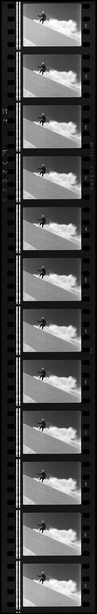

# The Performance panel, gently: record, read, point

*A no-fear introduction to the Performance panel: record a session, read the filmstrip, spot long tasks on the main thread, and translate 'the page feels slow' into Core Web Vitals evidence -- LCP 2.5s, CLS 0.1, INP 200ms -- a developer can act on.*

> The Performance panel is where DevTools tourists turn around and leave. You click record once, out
> of curiosity, and it hands you back what appears to be a seismograph reading of a city being
> demolished -- flame charts, colored bars, ten collapsible tracks, numbers in microseconds. So you
> close it and go back to the Network tab, and 'the page feels slow' stays an opinion forever. Here's
> the secret the panel's appearance hides: a tester needs maybe ten percent of it, and that ten percent
> is genuinely easy. Record a short session. Scrub the filmstrip to see what a user saw and when. Find
> the long red-flagged blocks on the main thread. Read three numbers with published thresholds. That's
> the whole workflow -- no flame-chart archaeology, no profiling degree. By the end of this note,
> 'feels slow' becomes 'a 310ms task blocks the thread on every keystroke, INP is 460ms against a 200ms
> threshold, trace attached' -- and nobody argues with that sentence.

> **In real life**
>
> The Performance panel is a dashcam, not an engine teardown. When your car makes the noise, you don't
> disassemble the gearbox in your driveway -- you record the drive, scrub the footage to the exact
> moment, and show the mechanic THAT. The mechanic fixes it; the footage is what got them looking in
> the right place instead of shrugging 'runs fine for me'. A performance recording is the same
> transaction: you are not expected to explain WHY the main thread stalled for 310 milliseconds --
> that's the developer's gearbox. You are expected to produce the clip: here's the recording, here's
> the moment, here's the number, here's the threshold it violates. Testers who try to be the mechanic
> stall for days; testers who deliver good footage get fixes by Friday.

Long task

## Recording a session without ceremony

Open DevTools, click the **Performance** tab. Before anything else, click the little gear and set
**CPU throttling to 4x slowdown** -- your development machine is a spaceship compared to the phones
your users hold, and an unthrottled recording of a fast laptop proves nothing (the same lesson
[network throttling](/notes/browser-devtools-mastery/throttling-and-emulation/slow-3g-and-offline-mode)
taught you, applied to the processor). Then choose one of two recordings. The **record-and-reload**
button (the circular arrow) measures a page load: it reloads cold and stops automatically. The plain
**record** button measures an interaction: you press it, do the one slow thing -- type in the laggy
search box, open the janky menu -- and press stop. Keep it short. Five to ten seconds of recording is
a gift; sixty seconds is a haystack.

What comes back has three zones worth knowing, top to bottom. The **filmstrip** -- a row of tiny
screenshots across the top -- is literally what the screen showed, frame by frame; enable screenshots
with the checkbox if it's empty. The **Main track** is the main thread's diary: every bar is work,
wide bars are long work, and the red-hatched corners flag long tasks for you -- the panel does the
diagnosis-by-color so you don't have to read the flame chart underneath. And the **Summary tab** at
the bottom tells you, for whatever you've selected, where the time went. Newer Chrome versions also
show **live Core Web Vitals** right in the panel before you even record -- local LCP, CLS, and INP
for the page as you use it, which is the fastest possible 'is it just me' check.

One honest reassurance about all the rest: the Interactions track, the Network track, the GPU lane,
the raw flame chart -- they're for the mechanic. You will grow into some of them. Nothing in this
note's workflow requires them, and no tester ever got fired for saying 'the trace is attached, the
long task is at the 3.2 second mark' without narrating the flame chart.

## The three numbers, and where they live in the recording

You met Core Web Vitals in
[Core Web Vitals awareness](/notes/the-web-platform-for-testers/how-browsers-render/core-web-vitals-awareness)
-- here's the recap in plain words, and where each one shows up in your recording. **LCP** (Largest
Contentful Paint) is *loading*: the moment the biggest thing in the viewport finishes painting; good
is `2.5 seconds or less`, and the panel drops an LCP marker on the timeline at that exact moment --
scrub the filmstrip there and you'll see the hero appear. **CLS** (Cumulative Layout Shift) is
*visual stability*: how much the page jumped around while loading; good is `0.1 or less`, and the
recording's Layout Shifts entries point at the exact elements that moved. **INP** (Interaction to
Next Paint) is *responsiveness*: the gap between an interaction and the next painted frame; good is
`200 milliseconds or less`, and when it's bad, the cause is almost always sitting on the Main track
wearing a red hatch.

That's the entire translation table between feelings and evidence. 'It takes forever to show up' is
LCP. 'It jumps while I'm reading' is CLS. 'It ignores my clicks' is INP -- and INP's mechanical cause
is the long task. When a page *feels* slow, your job is not to be believed; it's to make belief
unnecessary: reproduce the feeling under throttling, record it, and read which of the three numbers
(with its threshold) the recording violates.


*Wild September Snow, National Film Unit 1969 - 35mm film strip, Archives New Zealand — Wikimedia Commons, CC BY 2.0*
- **The first frame = pressing record** — Nothing on this reel exists until someone threads the film and starts the camera - one deliberate action that begins the capture. That's the Performance panel's record button: nothing is recorded until you press it, and choosing WHICH record button (cold-load vs plain interaction) is half the skill, same as choosing what to point the camera at before you roll.
- **Scrubbing frame by frame = reading the filmstrip** — Run your eye down this strip one frame at a time and you watch the skier's exact position change, moment by moment - nothing summarized, nothing skipped. That's exactly how you read the Performance panel's filmstrip: scrub it like video, and the frame where something finally appears (or lurches) is caught red-handed, no interpretation required.
- **The sprocket holes = timing markers** — Evenly spaced holes running the full length of the reel, existing for one purpose: keeping every frame locked to a precise position in time. That's what the timeline above the Performance panel's tracks does - a fixed ruler every bar and every frame lines up against, so 'it happened right THERE' has an exact coordinate, not a vague description.
- **Two adjacent frames, barely different = catching a layout shift** — Frame to frame here the skier drifts by a few pixels - subtle, easy to miss unless you're comparing neighbors directly. That subtle frame-to-frame drift is precisely what a layout shift looks like in the Performance panel's filmstrip: content that moved just enough between two frames to be a real, screenshot-able CLS finding.
- **The last frame = where the recording ends and the review begins** — The reel runs out, the camera stops, and now someone sits down to actually study what was captured - which frame mattered, which moment to show the editor. That's the moment you stop recording and open the Summary tab: the raw footage is done, and the one-sentence diagnosis is what you build from it next.

**From 'feels slow' to evidence -- the whole workflow**

1. **Reproduce the feeling first, untooled** — Before recording anything, make the slowness happen on purpose: which page, which action, how reliably? A recording of the wrong moment is worthless. If it only feels slow sometimes, note what differs -- cold load vs warm, first click vs later. You are scripting the scene the dashcam needs to catch.
2. **Set the honesty dials: CPU 4x, network if relevant** — Throttle the CPU to 4x in the Performance panel's gear menu so your machine stops flattering the page, and add network throttling if the slowness involves loading. This is the difference between measuring your laptop and measuring your users' reality -- and it belongs in the report: 'recorded at 4x CPU' is part of the evidence.
3. **Record short: the one action, five-ish seconds** — Record-and-reload for load problems; plain record, do the janky thing once or twice, stop, for interaction problems. Short recordings keep the trace readable and the file small enough to attach. Sixty-second recordings are how testers end up afraid of this panel.
4. **Scrub the filmstrip to the bad moment** — Find where the story goes wrong visually: the long run of identical white frames (loading), the lurch between two frames (layout shift), the frames where nothing changes after your click (frozen thread). The filmstrip timestamps the crime; you now know WHERE in the timeline to look.
5. **Read the Main track under that moment** — Directly below the bad frames, look for wide bars with red-hatched corners -- long tasks. Click the widest one: its duration and the Summary's breakdown (scripting? rendering?) are your finding's core. You are not explaining the flame chart; you are naming the block and its size.
6. **Write the number against its threshold, attach the trace** — Translate to the vital it violates: LCP over 2.5s, CLS over 0.1, or INP over 200ms with the long task as the visible cause. Save the recording (right-click, Save profile, or the export arrow) and attach the .json -- a developer can replay your exact evidence, which ends 'works on my machine' before it starts.

Here's the whole judgment layer as runnable code: one recorded session's three vitals banded against
the official thresholds, then the main-thread task list scanned for long tasks -- watch how the bad
INP stops being mysterious the moment the over-50ms tasks are listed:

*Run it -- a Core Web Vitals threshold judge plus long-task scan (Python)*

```python
# A Core Web Vitals judge over one recorded session: bands each metric the
# way Chrome does (good / needs improvement / poor), then scans the main
# thread for long tasks -- anything over 50ms -- the usual INP suspects.
THRESHOLDS = {
    "LCP": (2.5, 4.0, "s",  "loading -- biggest element painted"),
    "CLS": (0.1, 0.25, "",  "visual stability -- how much it jumped"),
    "INP": (200, 500, "ms", "responsiveness -- click to next frame"),
}

recorded = {"LCP": 3.4, "CLS": 0.04, "INP": 460}

print("Recorded session, mid-tier mobile profile:")
for metric, value in recorded.items():
    good, poor, unit, meaning = THRESHOLDS[metric]
    if value <= good:
        verdict = "GOOD"
    elif value <= poor:
        verdict = "NEEDS IMPROVEMENT"
    else:
        verdict = "POOR"
    print(f"  {metric} {str(value) + unit:7s} -> {verdict:17s} ({meaning})")

# Main-thread tasks from the same recording, in ms. Over 50ms = long task:
# the thread was busy, and every click during it just sat in the queue.
tasks = [12, 38, 240, 45, 96, 18, 310]
long_tasks = [t for t in tasks if t > 50]
print()
print("Main-thread tasks (ms):", tasks)
print("Long tasks (over 50ms):", long_tasks,
      f"-- {sum(long_tasks)}ms of blocked thread")
print("Verdict: the 460ms INP is no mystery -- the thread was busy")
print("for 646ms across three long tasks while the user was clicking.")

# Output:
# Recorded session, mid-tier mobile profile:
#   LCP 3.4s    -> NEEDS IMPROVEMENT (loading -- biggest element painted)
#   CLS 0.04    -> GOOD              (visual stability -- how much it jumped)
#   INP 460ms   -> NEEDS IMPROVEMENT (responsiveness -- click to next frame)
#
# Main-thread tasks (ms): [12, 38, 240, 45, 96, 18, 310]
# Long tasks (over 50ms): [240, 96, 310] -- 646ms of blocked thread
# Verdict: the 460ms INP is no mystery -- the thread was busy
# for 646ms across three long tasks while the user was clicking.
```

Same judge in Java -- the shape teams use when piping collected metrics through a JVM-based reporting
step. Notice it reaches the identical verdict from the identical thresholds, because the thresholds
are published constants, not opinions:

*Run it -- the Core Web Vitals judge (Java)*

```java
public class Main {

    // A Core Web Vitals judge over one recorded session: bands each metric
    // the way Chrome does, then scans the main thread for long tasks --
    // anything over 50ms -- the usual INP suspects.
    static String band(double value, double good, double poor) {
        if (value <= good) return "GOOD";
        if (value <= poor) return "NEEDS IMPROVEMENT";
        return "POOR";
    }

    public static void main(String[] args) {
        String[][] metrics = {
            {"LCP", "3.4", "2.5", "4.0", "s",  "loading -- biggest element painted"},
            {"CLS", "0.04", "0.1", "0.25", "", "visual stability -- how much it jumped"},
            {"INP", "460", "200", "500", "ms", "responsiveness -- click to next frame"},
        };

        System.out.println("Recorded session, mid-tier mobile profile:");
        for (String[] m : metrics) {
            double value = Double.parseDouble(m[1]);
            String verdict = band(value, Double.parseDouble(m[2]), Double.parseDouble(m[3]));
            System.out.printf("  %s %-7s -> %-17s (%s)%n", m[0], m[1] + m[4], verdict, m[5]);
        }

        // Main-thread tasks from the same recording, in ms. Over 50ms = long
        // task: every click during one just sat in the queue.
        int[] tasks = {12, 38, 240, 45, 96, 18, 310};
        StringBuilder longTasks = new StringBuilder();
        int blocked = 0, count = 0;
        for (int t : tasks) {
            if (t > 50) {
                if (count > 0) longTasks.append(", ");
                longTasks.append(t);
                blocked += t;
                count++;
            }
        }

        System.out.println();
        System.out.println("Long tasks (over 50ms): [" + longTasks + "] -- "
                + blocked + "ms of blocked thread");
        System.out.println("Verdict: the 460ms INP is no mystery -- the thread was busy");
        System.out.println("for " + blocked + "ms across " + count
                + " long tasks while the user was clicking.");
    }
}

/* Output:
Recorded session, mid-tier mobile profile:
  LCP 3.4s    -> NEEDS IMPROVEMENT (loading -- biggest element painted)
  CLS 0.04    -> GOOD              (visual stability -- how much it jumped)
  INP 460ms   -> NEEDS IMPROVEMENT (responsiveness -- click to next frame)

Long tasks (over 50ms): [240, 96, 310] -- 646ms of blocked thread
Verdict: the 460ms INP is no mystery -- the thread was busy
for 646ms across 3 long tasks while the user was clicking.
*/
```

> **Tip**
>
> Name the interaction **before** you hit record, out loud if you have to: 'I am recording what happens
> when I type one character into the search box.' One recording, one question. The panel punishes
> fishing expeditions -- a vague sixty-second capture of general browsing produces a trace nobody
> (including you) will ever read, while a five-second capture of one named action reads itself. And the
> follow-through that doubles your report's value: **save the trace** (the export arrow, or right-click
> and Save profile) and attach the .json to the ticket. A developer who can load your exact recording
> skips reproduction entirely -- you've handed them the dashcam footage, not a description of the noise.

### Your first time: Your mission: one recording, one long task, one number

- [ ] Set CPU throttling to 4x, then record a reload of a real page — Performance panel, gear icon, CPU: 4x slowdown -- then the record-and-reload button on any content-heavy page you like. It stops itself. Congratulations: the scary part is over, and it was two clicks.
- [ ] Read the filmstrip like a comic strip — Scrub across the screenshot row. Find the last blank-ish frame and the frame where the main content appears -- the gap between them is what a user on mid-tier hardware stares at. Check where the panel placed the LCP marker relative to that frame; they should agree.
- [ ] Find the widest red-hatched task on the Main track — Look for the red hatched corners that flag long tasks. Click the widest one and read its duration, then glance at the Summary tab: scripting, rendering, or painting? You've just done the entire diagnostic this note asks of you.
- [ ] Record one INTERACTION and catch its long task — Plain record button this time. Do one thing that feels less than instant -- open a heavy menu, type in a busy search field -- then stop. Find the task that lines up with your action. If the page felt fine at 4x, that is also a finding: it means the feeling you were chasing lives elsewhere (network, most likely).
- [ ] Write the finding with the number and threshold, and save the trace — One sentence in the vitals vocabulary: which metric, measured value, threshold it violates, and the long task (with duration) that explains it. Export the trace .json. You now hold a complete, attachable, argument-proof performance finding -- your first.

Recorded, scrubbed, spotted, judged against a published threshold, and saved as evidence. The seismograph turned out to be a dashcam after all.

- **The page felt slow yesterday, but today's recording looks perfectly clean.**
  Check the two honesty dials before doubting your memory: was CPU throttling on (a 1x recording on a dev machine hides almost everything), and was the cache warm (a reload with cached assets skips the slow work a first-time visitor pays for)? Re-record at 4x with a hard reload (Cmd/Ctrl+Shift+R) or 'Disable cache' checked in the Network panel. If it is STILL clean, the slowness may be data-dependent -- a heavier account, a longer list -- so reproduce with production-sized data before concluding it was a mirage.
- **You recorded it, and the trace is so dense you cannot find anything.**
  The recording is too long or the question too vague -- both fixable in one minute. Re-record five seconds around the single named action. In the trace you have: drag-select just the moment things felt wrong, let the Summary tab tell you what dominated, and ignore every track except the filmstrip and Main. You are looking for exactly one thing -- the widest red-hatched bar near the bad moment -- not reading the whole seismogram.
- **Everything is fast for you at 4x, but users keep saying the page lags.**
  Your lab conditions still may not match their reality -- and this is precisely the lab-versus-field gap from this chapter's Lighthouse note. Try 6x CPU throttling, test with a user-sized dataset and logged-in state, and check field data for the page if it has traffic. Also ask WHICH interaction lags: users say 'the page' when they mean one specific button. When you find the matching conditions, the long task will appear on cue; until then, file nothing -- collect.
- **You found the long task, but you cannot tell WHAT the page was doing during it.**
  You do not have to -- naming the moment, the duration, and the trigger is the tester's whole job, and the attached trace lets the developer do the attribution in one click (the task's own stack is right there in the flame chart under it). If you want to go one step further, click the long task and read the Summary tab's category split, and glance at whether a third-party script's name appears in the bars below -- 'the 310ms task appears to be inside the chat-widget script' is a bonus, not a requirement.

### Where to check

The Performance panel is a scalpel, not a dashboard -- reach for it at these moments:

- **When anyone says a page or interaction 'feels slow'** -- your first move after reproducing the feeling. It converts the report from opinion to evidence, or honestly fails to (which is also information: maybe it's network, maybe it's data-size, maybe it's their machine).
- **When Lighthouse flags interactivity but can't show you the moment** -- the previous notes' audits say WHAT scores badly; a recording shows WHEN and lines it up with what the user saw. The two tools are the report card and the classroom video.
- **After adding anything that runs JavaScript on interaction** -- search-as-you-type, autocomplete, live validation, infinite scroll. Record one interaction at 4x CPU before and after the change; keystroke-triggered long tasks are the most common self-inflicted INP wound.",
- **When animation or scrolling stutters** -- record the scroll; rendering-heavy bars and long tasks during it point at the cause (the reflow-and-repaint story from Module 4, now with timestamps).
- **On the flows where slowness costs money** -- checkout, search, signup. A janky admin page is a nuisance; a checkout with a 500ms INP is measurable revenue walking out.

### Worked example: the search box that ignored every third keystroke

1. **The report, verbatim from support:** 'customers say search feels laggy and sometimes ignores letters.' No page name, no numbers, no repro. A perfect specimen of feels-slow.
2. **Reproduce first, untooled.** On staging, the tester types a product name into the catalog search at normal speed. On a dev laptop it feels... almost fine. Slightly sticky, deniable. This is where most investigations die -- 'can't repro, closing.'
3. **Honesty dials on: CPU throttling 4x.** Same typing, and now it's unmistakable -- characters appear in bursts, the input freezing between them. The feeling is reproduced on demand, which means it can be recorded on demand.
4. **Record the one action.** Plain record, type five characters, stop -- a six-second trace. The filmstrip shows the input frozen across multiple frames; the Main track below shows a red-hatched long task after EVERY keystroke, the widest at 310ms.
5. **Read, don't archaeologize.** Clicking the big task, the Summary tab says over 90 percent scripting. The bars beneath carry the name of the product-filtering function -- the page re-filters the entire 4,000-item catalog on every keypress. The tester notes this but doesn't need it to be certain: the durations alone make the case.
6. **The finding, in vitals vocabulary:** 'Catalog search: typing triggers a long task per keystroke (up to 310ms at 4x CPU -- mid-tier mobile equivalent), so keystrokes queue and paint in bursts. INP for the typing interaction measures about 460ms against the 200ms good threshold. Filmstrip shows the freeze; trace attached (4x CPU, staging build 5.1.2). Suspected: full catalog re-filter on each keypress.'
7. **The developer loads the attached trace,** sees the stack under the long task, and ships a debounce plus an indexed filter. No reproduction step was needed on their side -- the footage was the reproduction.
8. **Verification closes the loop.** Same recording protocol after the fix: worst task 40ms, no red hatches, typing paints per-keystroke. The tester replies with the before/after numbers, and support tells customers it's fixed with a straight face. Total flame-chart expertise required: recognizing a red corner and reading a duration.

> **Common mistake**
>
> Recording on an unthrottled developer machine with a warm cache, seeing a clean trace, and declaring
> the page fast. That recording measured a spaceship rehearsing a route it already knows -- your users
> are on three-year-old phones visiting cold, and every number you collected flatters the page in ways
> production never will. The professional inversion of this mistake matters just as much: when you DO
> find slowness at 4x throttling, don't let anyone dismiss it with 'well, it's throttled, real machines
> are faster' -- 4x on a desktop CPU approximates the mid-tier Android that half the world browses on,
> and Google's own thresholds (LCP 2.5s, CLS 0.1, INP 200ms) are calibrated against exactly that
> reality. State the throttling in every report, run it the same way every time, and your numbers stay
> comparable, credible, and impossible to wave off in either direction.

**Quiz.** Users report that a search box 'feels laggy while typing'. What's the correct Performance-panel move?

- [x] Set CPU throttling to 4x, start a plain (not reload) recording, type a few characters, stop, and look for red-hatched long tasks on the Main track aligned with the keystrokes
- [ ] Use the record-and-reload button with all categories enabled, since a full page-load trace contains everything, including whatever is wrong with the search box
- [ ] Skip the Performance panel and run Lighthouse, since its Performance score will identify which element is slow during typing
- [ ] Record without CPU throttling first, since artificial throttling would contaminate the measurement with slowness that is not really there

*A typing problem is an INTERACTION problem, so you record the interaction itself: plain record, do the one named action, stop -- and the red-hatched long tasks lined up under the keystrokes are the mechanical cause of a bad INP. The record-and-reload button answers a different question entirely (cold-load behavior); a search box's keystroke lag simply is not in that trace. Lighthouse's default audit is also a page-load instrument -- it cannot see what happens when you type into a field mid-session, which is exactly why this chapter gives you both tools. And skipping throttling gets it backwards: 4x is not contamination, it is calibration -- it makes your spaceship of a dev machine approximate the mid-tier phone where the lag actually lives, which is why the report should state the throttling rather than avoid it.*

- **The three Core Web Vitals, in plain words + thresholds** — LCP = loading (biggest element painted), good at 2.5s or less. CLS = visual stability (how much the page jumped), good at 0.1 or less. INP = responsiveness (interaction to next painted frame), good at 200ms or less. Feelings-to-metrics: 'slow to appear' / 'it jumps' / 'ignores clicks'.
- **Long task** — Any single main-thread task over 50ms. While it runs, clicks queue and no frame paints -- the usual cause of bad INP. The Performance panel flags them with red hatched corners; their over-50ms portions during load sum to Total Blocking Time.
- **The two record buttons** — Record-and-reload = 'how does this page LOAD?' (starts cold, stops itself). Plain record = 'why is this INTERACTION slow?' (you start, do the one thing, stop). Five to ten seconds is ideal; a matching question is mandatory.
- **Reading the filmstrip** — The screenshot row is what the user saw, frame by frame: blank frames = waiting (LCP story), a lurch between frames = layout shift (CLS story), frozen frames after input = blocked thread (INP story). The least technical, most persuasive evidence in the panel.
- **Why throttle the CPU to 4x** — A dev machine is many times faster than the mid-tier phones most users hold; 4x slowdown approximates them. Long tasks invisible at 1x appear on cue at 4x. Always set it before recording and state it in the report -- it's calibration, not contamination.
- **The tester's deliverable from a recording** — Not a flame-chart explanation -- footage plus a number: the named interaction, the metric violated with measured value vs threshold, the long task duration that explains it, throttling stated, and the exported trace .json attached so the developer replays your exact evidence.

### Challenge

Find real jank. (1) Pick a page with a busy interaction -- a site search, a filterable list, a mega
menu. (2) Set CPU throttling to 4x and record the interaction once, keeping the trace under ten
seconds. (3) From the trace, extract: the widest long task's duration, what the filmstrip shows at
that moment, and the Summary tab's dominant category. (4) Band the experience against the vitals: is
this an LCP, CLS, or INP story, and which side of the threshold does it land on? (5) Write the
two-sentence finding with numbers and throttling stated, and export the trace as if attaching it.
Then re-record the same interaction at 1x and compare: one sentence on what the unthrottled trace
would have hidden from you.

### Ask the community

> Performance recording read: interaction `[what you did]` on `[page]`, recorded at `[1x/4x/6x]` CPU. Filmstrip shows `[what the frames did]`. Widest long task: `[duration]`, Summary says mostly `[scripting/rendering/painting]`. I think this is a `[LCP/CLS/INP]` finding measuring `[value]` vs threshold `[threshold]`. Did I read this trace right, and is it file-ready?

The two checks that catch most first-trace misreads: does the long task actually line up with the
interaction you named (a heavy task elsewhere in the trace may be unrelated to your click), and does
the metric match the story (a load-time long task is a TBT/LCP matter, not an INP one -- INP needs an
interaction). Post the filmstrip description too; frames that freeze after input make the INP case
almost by themselves.

- [Chrome Developers -- Performance panel reference: recording, filmstrip, and tracks](https://developer.chrome.com/docs/devtools/performance)
- [web.dev -- Core Web Vitals: LCP, CLS, and INP with their official thresholds](https://web.dev/articles/vitals)
- [web.dev -- long tasks: why anything over 50ms blocks interaction, and what devs do about it](https://web.dev/articles/optimize-long-tasks)
- [web.dev -- Interaction to Next Paint, the responsiveness metric your recordings explain](https://web.dev/articles/inp)
- [Chrome for Developers - record and analyze a performance trace](https://www.youtube.com/watch?v=7A70hBrPL4I)

🎬 [Record and analyze a performance trace](https://www.youtube.com/watch?v=7A70hBrPL4I) (6 min)

- A tester needs ten percent of the Performance panel: record short, scrub the filmstrip, find red-hatched long tasks on the Main track, read the Summary's category split. No flame-chart archaeology required.
- Core Web Vitals translate feelings into thresholds: LCP is loading (good at 2.5s or less), CLS is visual stability (0.1 or less), INP is responsiveness (200ms or less). 'Feels slow' always maps to one of the three.
- A long task is any main-thread chunk over 50ms -- while it runs, clicks queue and frames don't paint. It is the mechanical cause behind most bad INP, and the panel flags every one for you in red.
- Record honestly or not at all: CPU throttled to 4x, cold cache for load questions, one named interaction per trace, throttling stated in the report. An unthrottled warm-cache trace measures your laptop, not your users.
- The deliverable is dashcam footage, not a diagnosis: the metric violated with its number and threshold, the long task that explains it, and the exported trace attached -- evidence a developer can replay, which ends 'works on my machine' before it starts.


---
_Source: `packages/curriculum/content/notes/browser-devtools-mastery/audits-and-performance/performance-recording-gently.mdx`_
