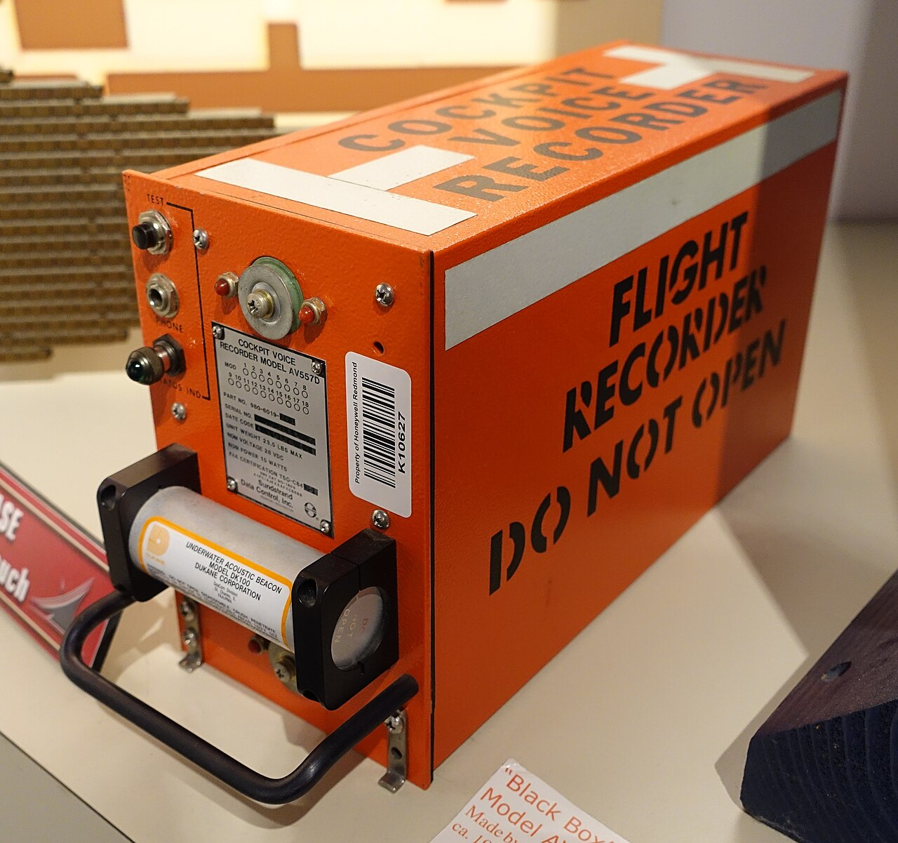

# What to paste into a bug report

*The chapter's payoff: turn a curated Console into evidence a developer trusts. Exact error text and stack, confirmed file:line, Preserve log plus written repro steps, and the text-not-screenshot rule - reused from linux-for-testers, not reinvented.*

> You can read a stack trace's WHAT and WHERE. You can tell a benign red error from a yellow warning
> that predicts next quarter's outage. You can filter a three-hundred-line firehose down to the five
> lines that matter and keep them alive across a redirect. None of that has shipped a single bug fix
> yet, because none of it has left your screen. This note is the payoff move: taking everything the
> last three notes taught you to SEE and turning it into text a developer can trust without
> re-checking your work. And the rule underneath all of it isn't new - it's the exact evidence
> discipline the linux-for-testers chapter already proved for server logs, applied here to a browser
> tab instead of a terminal.

> **In real life**
>
> Think of a flight recorder - the black box. It doesn't summarize a flight. It doesn't write "engine
> seemed a bit off around minute forty." It stores the raw instrument readings, verbatim, at the exact
> second they happened, because investigators need to trust the recording completely or the whole
> device is worthless. Your bug report, built from the Console, works the same way. The error's exact
> text is the raw reading. The file:line is the exact second. The repro steps are the flight plan that
> explains what the aircraft was doing when the reading was taken. A tester who paraphrases the error
> into "something broke on checkout" has thrown the recorder overboard and kept only a hand-written
> note saying the flight was "kind of bumpy." Nobody investigates a crash from a hand-written note when
> the black box was sitting right there, uncopied.

## Four things, already built - now assembled

Nothing in this section is new information; it's an assembly instruction for skills this chapter
already gave you. **The exact error text and full stack** - name, message, every `at ...` frame,
expanded, not summarized - is the WHAT-plus-WHERE discipline the first note in this chapter spent an
entire lesson on; this note assumes you can already get it and focuses only on how it physically
gets into a report. **The confirmed file:line** comes from clicking the link, exactly as before -
never typed from memory, never guessed from the message alone. **Severity context** - is this a
genuine app bug, a benign third-party red herring, or a yellow warning predicting real breakage -
comes from the second note's color-plus-source-plus-wording judgment; a report is stronger when it
states which bucket the entry falls into, not just that an entry exists. **A clean, filtered repro**
comes from the third note: level checkboxes and a text filter isolating the signal, Preserve log
armed before anything that navigates.

What this note adds is the part none of the previous three needed to cover: HOW those four things
become one artifact a stranger can act on without a follow-up message. Two mechanics do almost all
of the work, and both of them are borrowed, not invented here. The first is pairing **Preserve log
with written repro steps** - a preserved Console entry with no accompanying "I clicked X, then Y, at
roughly this point" is a fingerprint with no case file attached to it; the linux-for-testers chapter
called this exact pairing timestamp correlation when it was a server log and your own clock, and the
Console version is the same idea using the same discipline, now inside a browser tab instead of a
terminal. The second is the rule that closes this note: **copy text, never screenshot.** That rule
isn't new either - the `from-log-line-to-bug-report` note in the Linux-for-testers chapter built an
entire mistake callout around exactly this, for log lines instead of Console entries. The mechanism
is identical; only the source of the evidence changed.


*Cockpit voice recorder, National Electronics Museum — Wikimedia Commons, CC0 (Daderot)*
- **'DO NOT OPEN' in stenciled text = paste it verbatim, don't paraphrase it** — This box's whole purpose depends on nobody 'summarizing' what's inside before an investigator sees it - the raw recording only means something unaltered. An error's exact text and full stack trace, pasted into a code block character-for-character, is the same discipline: nothing retyped from memory, nothing smoothed over into a paraphrase.
- **The data plate = the confirmed, specific identifiers** — Model AV557D, a real part number, a real serial - not 'some recorder', an exact identifiable unit. That's the confirmed file:line in a bug report: not just the pasted stack (which sometimes starts inside a library), but the specific app-code frame the tester scanned down to find and named explicitly.
- **The attached acoustic beacon = the note that makes this findable later** — Bolted directly onto the recorder is a separate device with one job: help someone find this exact box later, under conditions where the box alone wouldn't be enough. Preserve log noted explicitly in a bug report does the same work - it tells a developer WHY this evidence survived a redirect instead of vanishing, so they can reproduce the same capture conditions themselves.
- **The carrying handle = ready to hand off, no extra assembly required** — Built to be picked up and carried straight to whoever needs to examine it next - no disassembly, no translation required first. That's what numbered repro steps paired with a severity note do for a ticket: hand it to a developer in a form they can act on immediately, not a pile of clues they have to reassemble themselves.
- **The physical ports = where real data comes OUT, not a photo of the casing** — Nobody investigates a flight recorder by photographing its orange shell - they connect to these actual ports and extract the real data. A screenshot of the Console panel is the equivalent of photographing the shell: it looks like evidence, but the searchable, selectable text extracted through the panel's own copy function is the only thing actually usable afterward.

**From a curated Console to a report a developer trusts on sight - press Play**

1. **Curate first, using everything already built** — Levels cut to Warnings/Errors, Preserve log armed because a redirect is possible, a text filter narrowing to the feature under test. This is the third note's workflow, already running before a single word is written.
2. **Reproduce and capture the exact text** — The bug fires. The tester expands the entry fully, right-clicks for 'Copy message' and 'Copy stack trace' where offered, or selects the visible text directly - never retyping a single character from memory.
3. **Confirm and quote the file:line** — Click the link, confirm it lands on a real, sensible line of app code (not a library frame), and quote that exact file:line as text in the draft - the first note's WHAT-plus-WHERE skill, now landing in a ticket instead of just a head.
4. **Add the severity verdict** — One sentence: is this a confirmed app bug, or does it carry the language of a predictive warning worth flagging as risk rather than a live defect? The second note's judgment call, stated explicitly instead of left for the reader to guess.
5. **Write repro steps that explain the capture** — Numbered actions, paired with roughly when the error fired, plus a line noting Preserve log was on - so anyone reading this later can both reproduce the bug AND reproduce the conditions that captured the evidence in the first place.
6. **Paste as text, submit, done** — Everything above goes into the ticket as selectable text in a code block - no screenshot of the Console anywhere. A developer can search every line of it, in this ticket or against their own logs, without messaging the tester to ask 'can you read that again, it's blurry.'

Build the assembly step yourself - turn a raw Console capture and a set of repro notes into one
report block, programmatically, so you can feel exactly what belongs and what gets left out:

*Try it - assemble a bug-report evidence block from a Console capture (Python)*

```python
capture = {
    "level": "error",
    "source": "checkout.js",
    "name": "TypeError",
    "message": "Cannot read properties of undefined (reading 'total')",
    "frames": [
        "calculateTotal (cart.js:44:19)",
        "checkout (cart.js:12:5)",
        "HTMLButtonElement.onclick (checkout.html:9:1)",
    ],
    "preserve_log_was_on": True,
}

repro_steps = [
    "Add any item to the cart",
    "Apply any valid discount code",
    "Click Place Order",
]

def severity_verdict(capture):
    is_app_file = capture["source"].endswith(".js") and "third-party" not in capture["source"]
    if capture["level"] == "error" and is_app_file:
        return "Confirmed app bug - own code, provably broken"
    if capture["level"] == "warning":
        return "Predictive risk - not a live bug yet"
    return "Needs ownership check before filing"

def build_report_block(capture, repro_steps):
    lines = []
    lines.append("SEVERITY: " + severity_verdict(capture))
    lines.append("")
    lines.append("ERROR TEXT (verbatim):")
    lines.append(capture["name"] + ": " + capture["message"])
    for frame in capture["frames"]:
        lines.append("    at " + frame)
    lines.append("")
    top_frame = capture["frames"][0]
    file_line = top_frame.split("(")[1].rstrip(")")
    lines.append("CONFIRMED FILE:LINE: " + file_line + " (clicked and verified in Sources)")
    lines.append("")
    lines.append("REPRO STEPS:")
    for i, step in enumerate(repro_steps, start=1):
        lines.append("  " + str(i) + ". " + step)
    lines.append("")
    note = "captured with Preserve log ON" if capture["preserve_log_was_on"] else "captured WITHOUT Preserve log - verify evidence is complete"
    lines.append("CAPTURE NOTE: " + note)
    return "\\n".join(lines)

print(build_report_block(capture, repro_steps))

# SEVERITY: Confirmed app bug - own code, provably broken
#
# ERROR TEXT (verbatim):
# TypeError: Cannot read properties of undefined (reading 'total')
#     at calculateTotal (cart.js:44:19)
#     at checkout (cart.js:12:5)
#     at HTMLButtonElement.onclick (checkout.html:9:1)
#
# CONFIRMED FILE:LINE: cart.js:44:19 (clicked and verified in Sources)
#
# REPRO STEPS:
#   1. Add any item to the cart
#   2. Apply any valid discount code
#   3. Click Place Order
#
# CAPTURE NOTE: captured with Preserve log ON
```

Same assembly, same fields, same order, in Java:

*Try it - assemble a bug-report evidence block from a Console capture (Java)*

```java
import java.util.*;

public class Main {
    public static void main(String[] args) {
        String level = "error";
        String source = "checkout.js";
        String name = "TypeError";
        String message = "Cannot read properties of undefined (reading 'total')";
        List<String> frames = List.of(
            "calculateTotal (cart.js:44:19)",
            "checkout (cart.js:12:5)",
            "HTMLButtonElement.onclick (checkout.html:9:1)"
        );
        boolean preserveLogWasOn = true;

        List<String> reproSteps = List.of(
            "Add any item to the cart",
            "Apply any valid discount code",
            "Click Place Order"
        );

        boolean isAppFile = source.endsWith(".js") && !source.contains("third-party");
        String severity;
        if (level.equals("error") && isAppFile) {
            severity = "Confirmed app bug - own code, provably broken";
        } else if (level.equals("warning")) {
            severity = "Predictive risk - not a live bug yet";
        } else {
            severity = "Needs ownership check before filing";
        }

        StringBuilder report = new StringBuilder();
        report.append("SEVERITY: ").append(severity).append("\\n\\n");
        report.append("ERROR TEXT (verbatim):\\n");
        report.append(name).append(": ").append(message).append("\\n");
        for (String frame : frames) {
            report.append("    at ").append(frame).append("\\n");
        }
        report.append("\\n");

        String topFrame = frames.get(0);
        String fileLine = topFrame.substring(topFrame.indexOf("(") + 1, topFrame.length() - 1);
        report.append("CONFIRMED FILE:LINE: ").append(fileLine).append(" (clicked and verified in Sources)\\n\\n");

        report.append("REPRO STEPS:\\n");
        for (int i = 0; i < reproSteps.size(); i++) {
            report.append("  ").append(i + 1).append(". ").append(reproSteps.get(i)).append("\\n");
        }
        report.append("\\n");

        String note = preserveLogWasOn
            ? "captured with Preserve log ON"
            : "captured WITHOUT Preserve log - verify evidence is complete";
        report.append("CAPTURE NOTE: ").append(note);

        System.out.println(report.toString());
    }
}

// SEVERITY: Confirmed app bug - own code, provably broken
//
// ERROR TEXT (verbatim):
// TypeError: Cannot read properties of undefined (reading 'total')
//     at calculateTotal (cart.js:44:19)
//     at checkout (cart.js:12:5)
//     at HTMLButtonElement.onclick (checkout.html:9:1)
//
// CONFIRMED FILE:LINE: cart.js:44:19 (clicked and verified in Sources)
//
// REPRO STEPS:
//   1. Add any item to the cart
//   2. Apply any valid discount code
//   3. Click Place Order
//
// CAPTURE NOTE: captured with Preserve log ON
```

**Console evidence block**: A bug report evidence block built entirely from text the browser already produced verbatim - the exact error name and message, the full stack trace, the confirmed file:line, and a note on whether Preserve log was active during capture - assembled with written repro steps and a stated severity verdict, and containing zero screenshots of the Console itself. The name matters because it names the standard: not 'I described what I saw' but 'here is the recording, unedited, with enough context that you don't have to trust my summary of it.' A developer reading a console evidence block should be able to search every line of it, in this ticket or against their own tooling, the same way they could search a copied server log line - because it IS the same discipline, just captured from a different panel.

> **Tip**
>
> When the browser offers "Copy message" or "Copy stack trace" on a right-click of a Console entry,
> use it instead of manually selecting text. It's faster, it never accidentally drops a frame at the
> edge of a scroll region, and it preserves exact whitespace and punctuation that a hand-selection can
> silently mangle. The same instinct that made you trust a `grep` redirect over a hand-copied log line
> applies here for the same reason: a mechanical copy cannot introduce a transcription error a human
> selection sometimes can.

### Your first time: Your mission: build one complete Console evidence block, start to ticket

- [ ] Curate before you reproduce — On a real app, cut Console levels to Warnings/Errors, arm Preserve log, and set a text filter for the feature you're about to test - the previous note's workflow, running before you write anything.
- [ ] Reproduce and capture verbatim — Trigger the bug. Right-click the entry for Copy message and Copy stack trace if offered, or select the full text directly. Do not paraphrase a single word into your own notes yet.
- [ ] Confirm the file:line by clicking it — Click through to Sources, confirm the line makes sense as app code (not a library frame), and write down the exact file:line as text - not from memory, from the click.
- [ ] State the severity — One sentence: is this a confirmed app bug, or does the message carry predictive language worth flagging as risk instead? Use the color-plus-source-plus-wording judgment from the second note in this chapter.
- [ ] Write repro steps and note Preserve log — Numbered actions, roughly when the error fired relative to them, and one explicit line stating whether Preserve log was on during capture.
- [ ] Paste it all as text, nothing as a screenshot — Assemble the pieces above into one block, in a code block if your tracker supports it. Read it back and ask: could a stranger search every line of this? If yes, it's a Console evidence block, not a description of one.

Six steps, every one of them built from a skill this chapter already gave you - curated capture,
verbatim text, a confirmed location, a stated severity, paired repro steps, and text over pictures,
every time.

- **I pasted the error message but the developer says they can't find it in their own error tracking.**
  You likely paraphrased instead of pasting verbatim, and the exact wording is what error trackers key on for grouping. Go back to the Console, right-click for Copy message specifically (not a retyped version), and paste that exact string - a single dropped word, added space, or changed quote mark is often enough to make automated search miss a match a human eye wouldn't even notice.
- **My repro steps are solid but the developer still says 'cannot reproduce.'**
  Check whether you noted if Preserve log was on and whether the steps are paired with roughly when the error fired, not just what you clicked. A list of actions with no timing or capture-condition context leaves the developer guessing whether they're even looking at the same failure window you were - state the capture conditions explicitly, the same fix the linux-for-testers chapter's timestamp-correlation lesson already covers for server logs.
- **I have a great stack trace but I'm not sure which line to actually quote as THE file:line.**
  Scan down from the top frame for the first line that belongs to the app's own files, not a library or framework internals - the same skill the first note in this chapter built. Quote that frame specifically, and mention the full trace is attached in full below it; don't make a developer hunt through forty lines to find the one frame that's actually theirs to fix.
- **I attached a screenshot because the trace was too long to comfortably paste inline.**
  Length is not a reason to switch to a picture - it's a reason to use a code block or a text attachment, both of which stay searchable. Paste the full trace as a text file or a collapsed code block if your tracker supports it, and quote only the vital few lines (name, message, top app frame) inline. A long trace pasted as text is still infinitely more useful than a short one captured as an image.

### Where to check

Where the pieces of a Console evidence block actually come from, chapter-wide:

- **The Console's expanded entry, right-click menu** - Copy message and Copy stack trace, when offered, beat manual selection every time.
- **The Sources panel, after clicking file:line** - confirms the location is real and lands on the first app-owned frame, not a library's.
- **The severity judgment from color, source, and wording** - stated as one sentence in the report, not left implicit for the reader to re-derive.
- **Preserve log's state during capture** - noted explicitly in the report, the same way the linux-for-testers chapter insists on stating a log's timezone explicitly rather than assuming a reader will guess it right.
- **The report itself, as plain text in a code block** - never a screenshot of the Console, exactly the rule the `from-log-line-to-bug-report` note already proved for server logs.

Tester's habit: **if a developer would have to ask "can you read that again" or "which environment,"
the evidence block was incomplete.** Every question like that is a round-trip a complete block would
have skipped entirely.

### Worked example: from a vague support forward to a same-day fix, using nothing but Console text

1. **What lands on the tester's desk:** a support forward - "customer says the discount code field just spins forever, no error shown to them." No repro steps, no browser, no evidence.
2. **The tester opens DevTools before reproducing anything** - Console tab, Errors and Warnings only, Preserve log on because a spinner-that-never-resolves smells like it might involve a redirect or an async chain worth preserving.
3. **Reproduces on staging**, applying a discount code and clicking Apply. The button spins. Nothing visibly happens. The Console, though, shows a fresh red entry the instant the spin starts: `TypeError: Cannot read properties of undefined (reading 'rate')` at `discount.js:29`.
4. **Confirms the file:line by clicking it** - lands on `return code.rate * cartTotal;` inside a function called `applyDiscount`, called by an `onclick` handler. All app code, no library frames to scan past.
5. **Checks severity** - red, sourced from the app's own `discount.js`, not a third-party script: confirmed app bug, not noise.
6. **Reproduces twice more** to confirm the pattern - fails identically both times, always on the same line, always immediately on clicking Apply.
7. **Assembles the Console evidence block**: severity verdict, the verbatim error text and full stack pasted from Copy stack trace, the confirmed file:line, three-step repro (open cart, enter any discount code, click Apply), a note that Preserve log was on though the error fires before any navigation in this case, and reproduction count (3 of 3).
8. **The report, pasted as text, no screenshot anywhere:** title states the mechanism - "Applying any discount code throws TypeError reading 'rate' at discount.js:29, spinner never resolves" - body carries the block above.
9. **The developer's reply, same afternoon:** "The discount object's shape changed in the last API update and this line never got touched. Fixing now - thanks for the exact line, saved me twenty minutes of digging." The tester never opened `discount.js`, never guessed at the cause, and never took a single screenshot. The Console's own text did all the convincing.

> **Common mistake**
>
> Screenshotting the Console panel because the trace looked complicated or because a picture felt more
> "complete" than a block of pasted text. This is the exact mistake the linux-for-testers chapter
> warned against for terminal output, and it costs the same things here: a screenshot can't be searched
> for the error message, can't be grepped against a codebase or an error tracker, crops out scrollback
> above or below the visible window, and goes blurry exactly where a long property name or a hyphenated
> file path matters most. The Console's text is already selectable, copyable, and exact - taking a
> picture of it instead of copying it is choosing a worse format for no gain. Paste text. Every time.

**Quiz.** A tester finds a Console error, confirms the file:line, and writes a report with a screenshot of the full Console panel attached, captioned 'error is in the screenshot, thanks!' The developer replies asking for the exact error text and asking which browser it happened in. What upgrade fixes both problems in one move?

- [ ] A higher-resolution screenshot cropped tighter around just the error entry
- [x] Replace the screenshot with the error's verbatim text (Copy message / Copy stack trace) pasted in a code block, plus the confirmed file:line and repro steps as text - searchable, and complete enough that browser/environment questions rarely need asking in the first place
- [ ] Reply to the developer restating the error from memory in the ticket's comments
- [ ] Ask the developer to just open DevTools themselves and look for it

*Pasted verbatim text fixes the search problem directly - the developer can now grep or ctrl-F the exact string against their own tooling, which a screenshot never allows regardless of resolution or cropping. It also tends to close the 'which browser/environment' gap because a complete Console evidence block, built the way this chapter teaches, already states repro steps and context as text alongside the error - the kind of information a screenshot's caption rarely carries in full. A tighter screenshot is still an unsearchable picture; restating from memory reintroduces exactly the paraphrasing risk the first note in this chapter already warned against; and asking the developer to go find it themselves defeats the entire purpose of filing a report - the tester already did the finding, and evidence that isn't handed over might as well not have been found at all.*

- **The four things a Console evidence block needs** — The exact error text and full stack (verbatim), the confirmed file:line, a stated severity verdict, and repro steps paired with whether Preserve log was active during capture.
- **Console evidence block** — A report built entirely from text the browser already produced - no screenshots, no paraphrasing - assembled with repro steps and a severity verdict so a stranger can search and trust it without a follow-up message.
- **Why Preserve log's state belongs IN the report, not just in your head** — It tells the developer whether the capture conditions can be trusted and reproduced. Omitting it is the same gap as omitting a log's timezone - the reader is left guessing at something the writer already knew.
- **Text, never screenshot - the shared rule** — Proven first in the linux-for-testers chapter for terminal and log output, reused here for the Console. A screenshot can't be searched, crops out context, and blurs exactly where the detail matters. Pasted text is searchable, complete, and exact every time.
- **Copy message / Copy stack trace over manual selection** — The browser's own right-click copy commands preserve exact text and full frames without the risk of a hand-selection dropping a line at a scroll boundary or mangling whitespace.
- **The self-test before submitting a report** — Could a stranger search every piece of this evidence, and would they need to ask 'which browser' or 'can you read that again'? If either answer is no, the block is incomplete - go back to the Console, not to memory.

### Challenge

Find one real bug (or deliberately break something small on a practice site) and build a complete
Console evidence block from scratch: curate the Console first (levels, Preserve log, text filter),
capture the exact error text and stack via Copy message/Copy stack trace, confirm the file:line by
clicking it, write one severity sentence, write numbered repro steps noting whether Preserve log was
on, and assemble all of it as pasted text with zero screenshots. Time yourself. Finish with one
sentence comparing this block to a report you'd have written before this chapter - what's different,
concretely, not just "more detailed"?

### Ask the community

> Evidence-block question: I'm reporting [the bug in one line]. My Console evidence block so far: [error text / file:line / severity verdict / repro steps / Preserve log state - paste what you have]. The developer's response (if any): [cannot reproduce / needs more info / none yet]. What's missing?

Bring the actual pasted text of what you have, not a description of it. Most 'needs more info'
bounces on Console-sourced reports trace back to one of four gaps this note names directly: paraphrased
instead of verbatim text, an unstated Preserve log condition, an unquoted file:line, or - still, even
now - a screenshot where searchable text belonged.

- [Chrome DevTools - Console reference, including copy commands on entries](https://developer.chrome.com/docs/devtools/console/reference/)
- [MDN - every JavaScript error type, for confirming a message's exact wording](https://developer.mozilla.org/en-US/docs/Web/JavaScript/Reference/Errors)
- [W3C Trace Context - the request-ID discipline this note's repro-pairing habit is borrowed from](https://www.w3.org/TR/trace-context/)
- [ClickUp - how to write a good bug report (step-by-step guide + real examples)](https://www.youtube.com/watch?v=QlSJCCctsnw)

🎬 [How to write a good bug report (step-by-step guide + real examples)](https://www.youtube.com/watch?v=QlSJCCctsnw) (4 min)

- A Console evidence block assembles four things this chapter already taught you to find: verbatim error text and stack, a confirmed file:line, a stated severity verdict, and repro steps.
- Preserve log's state during capture belongs IN the report, not just in your head - it tells a developer whether the evidence can be trusted and the capture conditions reproduced.
- Pair repro steps with roughly when the error fired - an action list with no timing context is the browser-console version of the timestamp correlation the linux-for-testers chapter already proved necessary for server logs.
- Text, never screenshot - the exact rule the from-log-line-to-bug-report note built for terminal output, reused here without changing a single principle, only the source panel.
- The self-test before submitting: could a stranger search every piece of this evidence, and would they still need to ask which browser or ask you to read it again? If either answer is no, go back to the Console, not to memory.


---
_Source: `packages/curriculum/content/notes/browser-devtools-mastery/console/what-to-paste-into-a-bug-report.mdx`_
