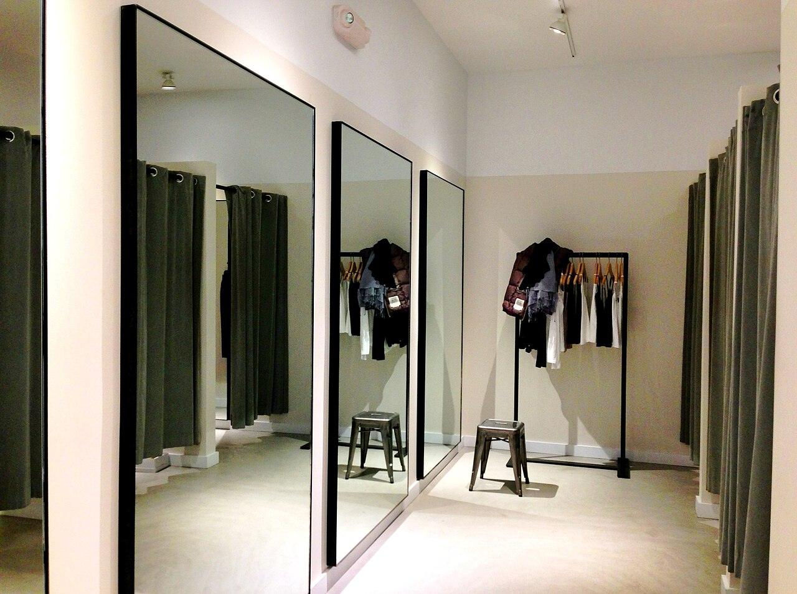

# Editing HTML & CSS live

*Double-click any text or attribute in Elements and rewrite it; tick a checkbox to switch any CSS declaration off. Every edit renders instantly and dies on reload - which makes DevTools the perfect risk-free lab for testing copy, layout, and 'what if' hypotheses without waiting for a dev.*

> Here's a superpower nobody tells manual testers they have: **you can rewrite any page, live, right
> now, no permission required.** Double-click text in the Elements panel and retype it. Double-click
> an attribute and change it. Untick a checkbox in the Styles pane and a CSS declaration switches
> off, page re-rendering instantly. Wondering whether the German translation will overflow that
> button? Type the German in and *look*. Suspect that one margin is causing the misalignment? Turn
> it off and *watch*. No build, no deploy, no "can you spin up a branch?" — a five-second experiment
> instead of a two-day round trip. And the safety net is absolute: **reload the page and every edit
> evaporates.** You're editing the browser's copy, never the server's.

> **In real life**
>
> Live-editing in DevTools is a **fitting room**. You take the jacket in, try it with different
> trousers, roll the sleeves, check the mirror from three angles — and none of it buys anything. Walk
> out of the fitting room (reload the page) and the shop floor (the server) is exactly as it was;
> your experiments touched only the copy in the little cubicle. That's what makes fitting rooms
> useful: *because* nothing is permanent, you can try ridiculous combinations for free. The tester
> who says 'I think this button would overflow in German' is guessing; the tester who walked into the
> fitting room and tried it on has evidence.

\` is big and bold, links are blue and underlined, and buttons look vaguely grey and sad. In the Styles pane it appears as rules labelled 'user agent stylesheet', always at the bottom of the cascade, overridable by everything. Testers meet it in two ways: it explains styling that 'nobody wrote' (margins on paragraphs and headings come from it), and it differs slightly between browsers - one reason a form control looks fine in Chrome and odd in Safari with identical site CSS. You cannot toggle its declarations off, only override them.`}>user agent stylesheet

## Two editable surfaces: the tree and the styles

**Editing the tree.** In the Elements panel, double-click any text node and it becomes an input —
retype it, press Enter, and the page updates. Double-click an attribute value (a `class`, an
`href`, a `disabled`) and edit it the same way; double-click the attribute *name* to change that
too. Right-click a node for the heavier tools: **Edit as HTML** turns the whole element into a
free-text editor, **Delete element** removes it (the page reflows as if it never existed), and
**Force state** fakes `:hover` or `:focus`. Everything re-renders instantly, because you are
mutating the same live DOM the last note taught you to read.

**Editing the styles.** Select a node and the Styles pane lists every CSS rule that matches it,
most specific first — the cascade laid bare, with losing declarations struck through exactly as the
Track A specificity note promised. Hover any declaration and a **checkbox** appears: untick it and
that declaration switches off; tick it back and it returns. Click a value to edit it — and here's
the delight: with a pixel value selected, the **up/down arrow keys** nudge it by 1 (Shift for 10),
so you can literally dial a margin until things align. Click the empty space inside a rule to add
brand-new declarations, or use the `element.style` block at the top to apply an inline style to
just this node.

**And all of it is ephemeral.** These edits live in the browser's memory, in this tab. Reload —
even accidentally, even with a stray F5 — and the server's version comes back untouched, as the
first note's flow showed: HTML arrives, DOM gets rebuilt, your artisanal modifications are gone.
This is a feature twice over: it makes experiments perfectly safe, and it means you must **capture
evidence before reloading** — screenshot the fixed state, note the exact declaration you changed,
copy the values. An edit you didn't record is an experiment that never happened.


*Fitting room, Theory store, Westport, Connecticut — Wikimedia Commons, CC BY-SA 3.0*
- **The tags stay on = nothing is purchased** — Every garment on that rack keeps its price tag: you are trying, not buying. Every DevTools edit works the same way - the server's HTML and CSS files are untouched no matter what you rewrite in the panel. This is why live-editing is completely safe on production sites: you can only ever change YOUR browser's copy of the page.
- **The mirror = instant re-render** — No waiting: change the text, nudge the padding, untick the declaration, and the page redraws immediately - the mirror never asks you to come back tomorrow. The feedback loop for a layout hypothesis drops from 'file a ticket and wait' to about four seconds. Fast loops are what make real experimentation happen.
- **The row of alternatives on the rail = hypothesis testing** — This jacket with those trousers, then the other one: swap one piece at a time and watch what changes in the mirror. Toggle one CSS declaration at a time the same way - if switching off ONE margin fixes the misalignment, you have isolated the offending rule, which is a dramatically better bug report than 'looks off'.
- **The curtain you leave through = reload wipes everything** — Walk out and the room resets for the next customer - nothing you tried leaves with you unless you carry it out deliberately. Reload the page and every edit is gone: your rewritten copy, your toggled styles, your deleted banner. Ephemerality is the safety net AND the trap. Screenshot your evidence BEFORE touching F5.
- **The stools nobody brought = the user agent stylesheet** — Every fitting room comes furnished - stools, hooks, lighting you didn't choose. Every page comes furnished too: browser defaults, listed in the Styles pane as 'user agent stylesheet', are why headings are bold and paragraphs have margins nobody typed. When styling seems to come from nowhere, it comes from here.

**Testing a translation hypothesis in the fitting room - press Play**

1. **The hypothesis** — The checkout button says 'Pay now'. German translations run famously long - 'Jetzt kostenpflichtig bestellen' - and you suspect it will overflow the button on mobile widths. Today this is an opinion. In ninety seconds it will be evidence.
2. **Edit the DOM** — Right-click the button, Inspect, double-click its text, type the German string, press Enter. The live DOM now contains the long label - the exact same mutation a real translation file would cause, minus the two-week localisation cycle.
3. **Watch the layout react** — The button stretches... and at 375px viewport width the text wraps onto a second line, pushing the button over the legal disclaimer below it. There is the defect, reproduced before the German translation even exists. This is shift-left with a double-click.
4. **Probe the fix** — In the Styles pane, try the obvious candidates live: add white-space: nowrap (now it clips - worse), reduce padding (helps, still tight), try a smaller font-size at that breakpoint (fits). You are not writing the fix - you are handing the developer a tested starting point.
5. **Capture, then reload** — Screenshot the overflow, note the viewport width, the string used, and which style change resolved it. THEN reload - everything resets, proving nothing was harmed. File the report: a future-tense bug caught for the cost of one coffee sip.

The ephemerality rule is worth *feeling* in code. Here's a pretend browser: a source of truth (the
server's HTML), a live DOM you can edit, and a reload that rebuilds from source:

*Run it - live edits vs reload (Python)*

```python
# The server's copy - DevTools can NEVER touch this
SERVER_HTML = {"tag": "button", "text": "Pay now", "style": {"padding": "16px"}}

def load_page():
    # A reload deep-copies the server's version into the browser's memory
    return {"tag": SERVER_HTML["tag"],
            "text": SERVER_HTML["text"],
            "style": dict(SERVER_HTML["style"])}

def render(dom, note):
    print(note.ljust(28), "<" + dom["tag"] + ">", repr(dom["text"]),
          "style=" + str(dom["style"]))

# 1) First load - browser copy matches the server
dom = load_page()
render(dom, "after load:")

# 2) DevTools edits: double-click the text, add a declaration, toggle one off
dom["text"] = "Jetzt kostenpflichtig bestellen"   # double-click, retype
dom["style"]["font-size"] = "13px"                # new declaration in Styles pane
dom["style"].pop("padding")                       # untick the padding checkbox
render(dom, "after live edits:")

# 3) The edits exist ONLY in the browser's memory
print("server copy unchanged:      ", SERVER_HTML)

# 4) Reload - the browser rebuilds from the server's copy. Edits: gone.
dom = load_page()
render(dom, "after reload:")

# after load:              <button> 'Pay now' style={'padding': '16px'}
# after live edits:        <button> 'Jetzt kostenpflichtig bestellen' style={'font-size': '13px'}
# server copy unchanged:   {'tag': 'button', 'text': 'Pay now', 'style': {'padding': '16px'}}
# after reload:            <button> 'Pay now' style={'padding': '16px'}
```

Same lesson in Java — note that the reload is just "copy the server's state again", which is
exactly what a real browser does with the freshly fetched HTML:

*Run it - live edits vs reload (Java)*

```java
import java.util.*;

public class Main {
    // The server's copy - immutable as far as the browser is concerned
    static final String SERVER_TEXT = "Pay now";
    static final Map<String, String> SERVER_STYLE = Map.of("padding", "16px");

    static Map<String, Object> loadPage() {
        Map<String, Object> dom = new LinkedHashMap<>();
        dom.put("text", SERVER_TEXT);
        dom.put("style", new LinkedHashMap<>(SERVER_STYLE)); // fresh copy
        return dom;
    }

    static void render(Map<String, Object> dom, String note) {
        System.out.printf("%-22s <button> '%s' style=%s%n",
            note, dom.get("text"), dom.get("style"));
    }

    @SuppressWarnings("unchecked")
    public static void main(String[] args) {
        // 1) First load
        Map<String, Object> dom = loadPage();
        render(dom, "after load:");

        // 2) DevTools edits - text rewrite, new declaration, one toggled off
        dom.put("text", "Jetzt kostenpflichtig bestellen");
        Map<String, String> style = (Map<String, String>) dom.get("style");
        style.put("font-size", "13px");   // added in the Styles pane
        style.remove("padding");          // checkbox unticked
        render(dom, "after live edits:");

        // 3) The server never felt a thing
        System.out.println("server copy unchanged: '" + SERVER_TEXT
            + "' style=" + SERVER_STYLE);

        // 4) Reload rebuilds from the server's copy - edits evaporate
        dom = loadPage();
        render(dom, "after reload:");
        // after load:          <button> 'Pay now' style={padding=16px}
        // after live edits:    <button> 'Jetzt kostenpflichtig bestellen' style={font-size=13px}
        // after reload:        <button> 'Pay now' style={padding=16px}
    }
}
```

> **Tip**
>
> Toggle **one declaration at a time**, like a scientist, not five at once like a raccoon in a bin.
> The checkbox workflow is bisection for CSS (the same halving instinct Track B taught you for
> debugging): symptom present → untick half the suspicious declarations → symptom gone? The culprit
> is in that half. Two more toggles and you can name the exact property causing the bug. A report
> that says 'removing `margin-left: 40px` from `.price-tag` fixes the overlap' gets fixed the same
> day; 'the prices look weird' gets a clarifying question and a week of ping-pong.

### Your first time: Your mission: run four experiments and destroy the evidence

- [ ] Rewrite reality — On any news site, inspect a headline, double-click the text, and rewrite it to something sensible like 'Local tester discovers infinite power'. Admire it. Understand that only you can see it - your DOM, your tab, nobody else's.
- [ ] Break a price with length — On a shop page, replace a short product name with a 60-character one. Watch what wraps, clips, or pushes the price off the card. You just ran the 'long data' test class from your manual testing modules - live, with zero test data setup.
- [ ] Toggle like a scientist — Select a styled element (a button is ideal). In the Styles pane, untick declarations one at a time - background, padding, border-radius - and watch each one's contribution disappear. Struck-through rules are losing the specificity fight, as the Track A selectors note showed.
- [ ] Dial in a value — Click a padding or margin value, then tap the up/down arrow keys to nudge it pixel by pixel (Shift jumps by 10). Find the value where a cramped element starts looking right - note the number; that delta belongs in your bug report.
- [ ] Prove the wipe — Screenshot your masterpiece, then reload. Everything reverts: headline, styles, all of it. Feel the two lessons at once - total safety (you can never break the site) and total impermanence (uncaptured evidence dies with the reload).

You've now edited text, attributes and styles live, isolated a rule by toggling, and watched a reload erase everything — the full fitting-room workflow you'll use weekly for the rest of your career.

- **I made the perfect edit that demonstrates the bug fix... and it is gone.**
  You reloaded (or the page did - some apps refresh themselves, and any navigation counts). Live edits die with the document. There is no undo-history to recover; redo the edit and capture evidence FIRST: screenshot, copy the modified rule, note the values. For CSS you expect to reuse across reloads, DevTools offers workarounds (Snippets, Overrides) - but the habit that saves you is capture-before-reload.
- **I added a CSS declaration in the Styles pane but nothing on the page changed.**
  Check three things in order. Is it struck through? A more specific rule wins - as the Track A specificity note explained, the id column beats everything right of it; try the edit in the element.style block at the top, which outranks stylesheet rules. Typo? An invalid property or value gets a yellow warning triangle and is ignored silently otherwise. Wrong node? You may be styling a child or ancestor of the thing you are looking at - re-check with hover-highlight.
- **I edit the text or style, and half a second later it snaps back on its own - no reload involved.**
  A JavaScript framework re-rendered the component. React, Vue and friends treat the DOM as disposable output: state changes, and the framework rewrites the subtree, stomping your manual edit. You are in a tug-of-war with a robot that does not tire. Edit during a quiet moment (no polling, no animations), or test the hypothesis on a static clone of the markup. This snap-back is itself useful intel: it tells you that subtree is under active framework control.
- **The checkbox toggle on a declaration does nothing at all.**
  The visual effect you are attributing to that rule is coming from somewhere else. Usual suspects: an inline style on the element (element.style outranks the stylesheet rule you toggled), an !important declaration elsewhere, the same property set in a more specific rule further up the pane, or - for margins and default spacing - the user agent stylesheet, whose declarations cannot be unticked, only overridden. Read the whole Styles pane top to bottom; the winning declaration is the one NOT struck through.

### Where to check

Live editing turns 'I wonder...' into 'I checked' across half your daily test charters:

- **Copy and truncation testing** — paste maximum-length names, long emails, other locales' translations into the live DOM and watch fields, cards and buttons cope or fail. No test data setup, no waiting for the localisation drop.
- **Boundary states you cannot easily reach** — 99+ notification badges, four-figure cart counts, a 5-star review with 0 reviews: type the state into the DOM and check the layout NOW, not after three sprints of data engineering.
- **Layout hypotheses** — 'that margin is the problem', 'nowrap would clip it': toggle the declaration and know in seconds. Attach the finding to your defect - as qa-foundations taught, a defect report with a suspected cause travels faster.
- **Hidden and stateful UI** — force :hover / :focus states from the Styles pane to inspect tooltips and hover menus that flee your cursor (last note's disappearing-menu problem, solved properly).
- **Ad-blocker / element-removal robustness** — delete the cookie banner or an overlay node and see whether the page functions without it; overlay-dependent layouts are a real defect class.

Tester's habit: **edit to isolate, never to conclude the app is fine.** A live edit proves what
WOULD fix or break the page - the fix itself still has to land in code and be retested.

### Worked example: the misaligned price the developer could not see

1. **The report queue:** 'Product prices look slightly off on the grid page.' Two developers looked, shrugged, marked it cannot-reproduce. Prices looked fine on their machines. Classic.
2. **The tester reproduces the 'slightly off':** on a narrow laptop screen, the third card in each row shows its price 6-ish pixels lower than its neighbours. Subtle - the kind of defect eyes dismiss and customers subconsciously distrust.
3. **Inspect both a good and a bad card.** Same markup, same classes. So the DOM is identical - the difference must be styling, and something conditional. The Styles pane on the bad card shows one extra matching rule: a .promo-flash class rule adding a 6px top margin... struck through on the developer's wide screens because a media query keeps it inactive above 1200px.
4. **The toggle test:** untick that margin declaration on the bad card. The price snaps into line with its neighbours. Tick it back: 6px sag returns. One checkbox, cause isolated - the exact bisection the tip block preaches.
5. **The edit test for the fix:** click the margin value, arrow-key it from 6 down to 0, then try the developer-friendly alternative - adding align-self: start - to see whether the flex container (badge from the next note's territory) handles it more robustly. Both work; note both.
6. **Capture before reload:** screenshots of broken vs toggled-fixed, the rule name, the media query breakpoint, the viewport width where it triggers. Then reload - page back to broken, as expected, because the fitting room keeps nothing.
7. **The report:** 'Below 1200px, rule .promo-flash (styles.css) applies margin-top: 6px to the price element on every third card; unticking that declaration in DevTools aligns the card. Screenshots attached at 1180px.' Fixed in one commit, no cannot-reproduce round trip - the developers had simply never tested below their monitor width.
8. **The lesson:** 'cannot reproduce' often means 'different conditions'. Live editing let the tester prove WHICH rule, at WHICH width, caused WHAT offset - transforming a vibe ('slightly off') into coordinates. That is the whole job of the Styles pane in defect work.

> **Common mistake**
>
> Forgetting that **only you can see your edits** — and reporting the page as if the world shares
> your fitting room. It sounds absurd until you watch it happen: a tester 'fixes' a broken layout
> live to grab a clean screenshot for documentation, and the screenshot quietly becomes 'evidence'
> that the page works; or someone edits a price to test formatting, forgets, and files a defect
> about the very number they typed. The DOM you mutated is a private hallucination on one tab of one
> machine. Discipline: every screenshot you file should state whether the page is pristine or
> edited, and after any editing session, reload before you continue testing — start your next test
> from the server's truth, not your leftovers.

**Quiz.** A tester unticks a margin declaration in the Styles pane and the layout bug disappears. What has the tester actually proven?

- [x] That this specific declaration causes the misalignment in their browser's current state - strong diagnostic evidence for the report, but no fix exists until a developer changes the real stylesheet and it is retested
- [ ] The bug is fixed - the page now renders correctly, so the ticket can be closed
- [ ] The bug will be fixed for all users once the tester saves the page with Ctrl+S
- [ ] Nothing useful - DevTools changes are fake and prove nothing about the real page

*The toggle is a controlled experiment on the live page: remove one variable (the declaration), observe the symptom vanish, restore it, observe the symptom return. That isolates cause with real confidence - and it is exactly the kind of finding that turns a vague defect into a same-day fix. But the edit lives only in this tab's memory: every other user on earth still has the margin, and a reload restores it for the tester too. Closing the ticket confuses an experiment with a deployment. Ctrl+S does not save DOM or Styles-pane edits back to any server - the browser has no write access to the site's code, which is precisely why live editing is safe. And 'proves nothing' undersells it badly: the change is not fake, it is real CSS applied to the real render - it is just ephemeral and local. The professional framing: live edits produce diagnosis and suggested direction; code changes produce fixes; retesting the deployed fix closes the loop.*

- **Edit text or an attribute in the Elements panel - how?** — Double-click the text node or attribute value and retype; Enter applies, the page re-renders instantly. Right-click -> Edit as HTML for rewriting a whole element; Delete element removes it and the page reflows.
- **Switch a CSS declaration off without deleting it** — Hover the declaration in the Styles pane and untick its checkbox; tick to restore. One-at-a-time toggling is CSS bisection - it isolates exactly which rule causes a visual symptom.
- **What survives a page reload after live editing?** — Nothing. Edits mutate the browser's in-memory DOM/CSSOM only; reload refetches and rebuilds from the server's copy. Safety net and evidence-destroyer in one - capture screenshots and rule names BEFORE reloading.
- **Why can a live edit snap back WITHOUT a reload?** — A JavaScript framework re-rendered that component from its own state (React/Vue treat the DOM as disposable output). The snap-back itself is intel: that subtree is framework-controlled.
- **My added declaration is struck through - meaning?** — It lost the cascade: a more specific rule (or !important, or an inline style) overrides it - the specificity contest from Track A, displayed live. Try element.style at the top of the pane, which outranks stylesheet rules.
- **The user agent stylesheet is...** — The browser's built-in default styles (bold headings, blue links, default margins). Bottom of the cascade, source of 'styling nobody wrote', slightly different per browser, cannot be toggled off - only overridden.

### Challenge

Pick a real signup or checkout form and run a fitting-room test session: (1) replace every label
with its longest plausible translation (German or Finnish are reliable stress tests) and record
which elements survive; (2) find one visual property of the submit button and, by toggling
declarations one at a time, identify every rule that contributes to it - list them; (3) use
arrow-key nudging to answer 'how many pixels of padding can this input lose before it looks
broken?' with an exact number; (4) in either playground, add a second reload cycle that happens
mid-editing and print what got lost. Close with one sentence: why does 'evidence before reload'
deserve a place in your personal testing checklist?

### Ask the community

> Live-edit puzzle: on `[page]` I edited `[text / attribute / declaration]` in DevTools expecting `[result]`. Instead: `[nothing changed / it snapped back / struck through / reverted]`. The element is `[framework-rendered? inline styles? !important nearby?]` - what is overriding or reverting me, and how do I isolate the rule?

Ninety percent of 'my edit did not take' reports are one of four culprits: specificity (struck
through), inline style or !important outranking you, a framework re-render stomping the DOM, or an
accidental reload. Say which symptoms you see and where the winning declaration sits in the Styles
pane, and the diagnosis is usually one message away.

- [Chrome DevTools docs - view and change CSS](https://developer.chrome.com/docs/devtools/css)
- [Chrome DevTools docs - editing the DOM (text, attributes, nodes)](https://developer.chrome.com/docs/devtools/dom)
- [MDN - the cascade, and why some declarations lose](https://developer.mozilla.org/en-US/docs/Web/CSS/Cascade)
- [Kevin Powell - debugging CSS with your devtools, no extensions required](https://www.youtube.com/watch?v=ndeClnyHSo8)

🎬 [Debugging CSS in your devtools - the live-edit workflow](https://www.youtube.com/watch?v=ndeClnyHSo8) (13 min)

- Double-click edits anything: text nodes, attribute values, attribute names. Right-click gives Edit as HTML, Delete element, and Force state (:hover/:focus). Every change re-renders instantly on the live DOM.
- The Styles pane is the cascade made visible: checkbox-toggle any declaration off and on, click values to edit them, arrow-key pixel values up and down, and read struck-through rules as specificity losers.
- Every edit is ephemeral and local - browser memory, this tab only. Reload restores the server's truth, which makes experimentation perfectly safe and makes capture-before-reload a non-negotiable habit.
- Live editing is hypothesis testing without a developer: long translations, boundary-value content, 'is THIS margin the culprit' - answered in seconds, and the isolated rule name upgrades your defect report from vibe to coordinates.
- Edits diagnose; they never fix. Only you see your changes - state in every report whether the page was pristine or edited, and reload before starting the next test.


---
_Source: `packages/curriculum/content/notes/browser-devtools-mastery/elements-and-styles/editing-html-css-live.mdx`_
