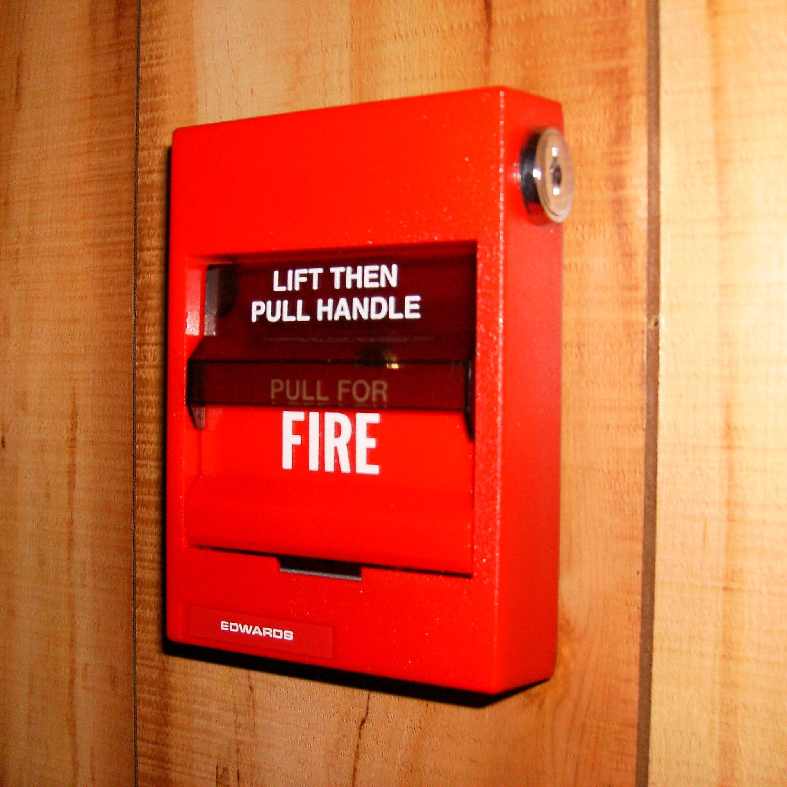

# Priority

*How soon a defect gets worked, decided by business impact and scheduling - a separate question from severity, and the reason a technically small bug can legitimately jump the queue.*

> A typo on the homepage the CEO personally spotted, and a rare crash buried three menus deep that
> almost nobody hits — which gets fixed first? Severity alone can't answer that; the typo is Trivial
> and the crash is Critical, yet plenty of real teams fix the typo today and schedule the crash for
> next sprint, for entirely defensible reasons. Priority is the field that captures those reasons
> explicitly: how soon should this actually get worked, given everything else competing for the same
> limited time.

> **In real life**
>
> A fire alarm pull station doesn't measure how big the fire actually is before it lets you act — its
> entire design is "pull now, sort out the details after." The bright red box, the simple two-step
> instruction, the tamper-resistant cover requiring deliberate intent: all of it is built around
> urgency of RESPONSE, not a technical assessment of exactly how much is burning. Priority works the
> same way in defect management — it's a decision about how urgently to respond, made with business
> judgment in view, not a re-measurement of the defect's own technical size.

**priority**: Priority is a scheduling decision - how soon a defect should be worked, relative to everything else competing for the same limited development time - driven by business impact, visibility, deadlines, and stakeholder urgency rather than by the defect's technical severity alone. A common scale: P0/Urgent (drop everything, fix now), P1/High (this release), P2/Medium (next release or soon), P3/Low (backlog, someday). Priority and severity are independent axes - a Critical-severity bug CAN be low priority (real but affecting almost nobody, scheduled deliberately), and a Trivial-severity bug can be high priority (cosmetic but highly visible to a key stakeholder or customer).

## The four-level scale, read from business context

- **P0 / Urgent** — drop other work now. Usually reserved for things actively harming users or
  revenue in production right now, or blocking an imminent, unmovable release.
- **P1 / High** — fix within this release cycle. Real business cost to waiting, but not
  minute-by-minute urgent.
- **P2 / Medium** — fix soon, next release or two. Real, worth doing, not costing much by waiting a
  bit longer.
- **P3 / Low** — backlog. Worth fixing eventually, genuinely fine to defer indefinitely if something
  else keeps outranking it.

> **Tip**
>
> The fastest priority gut-check: "what happens if this waits one more release?" If the honest answer
> is real, ongoing harm (lost revenue, an actively broken core workflow, a compliance exposure), that's
> P0/P1 territory regardless of how small the technical fix looks. If the honest answer is "basically
> nothing changes," that's P2/P3 territory regardless of how technically satisfying the fix would be
> to finally close out.

> **Common mistake**
>
> Treating every stakeholder request as automatically P0. If everything is Urgent, the label stops
> carrying information, and a genuinely time-critical bug loses its ability to stand out from routine
> requests wearing an inflated label. Priority inflation is the scheduling-side version of severity
> inflation from the previous note — same failure mode, same fix: ask "what specifically happens if
> this waits," and let the honest answer set the level, not the loudest voice in the room.


*Fire Alarm Pull Station — Wikimedia Commons, public domain (Edwardsalarms). [Source](https://commons.wikimedia.org/wiki/File:Fire_Alarm_Pull_Station.JPG)*
- **'PULL FOR FIRE' — a decision to act now, stated plainly** — The box doesn't ask how big the fire is before authorizing action - it exists purely to trigger urgent response. Priority is the same kind of decision: how urgently to act, made independent of a technical size assessment.
- **'LIFT THEN PULL HANDLE' — a deliberate, two-step action** — Not accidental or casual - a real decision requiring intent. Priority should be assigned with the same deliberateness: a specific, stated reason for the urgency level, not a reflexive label.
- **The glass/plastic cover requiring intentional pressure** — A barrier against casual, accidental triggering - the same reason 'everything is P0' fails: if the barrier to declaring urgency is too low, the label stops meaning anything.
- **The bright red color — visible urgency, independent of what's happening inside** — You can't tell the fire's actual size from outside the box, only that someone decided this needs immediate attention. A priority label is exactly this: a visible urgency signal, separate from the technical severity assessment covered in the previous note.
- **The keyed reset cylinder — de-escalation requires a deliberate process too** — Once pulled, resetting it needs an authorized key, not a quiet shrug. A priority escalation, once made, should be deliberately reviewed and explicitly changed if it turns out to be wrong - not silently forgotten.

**The same technical bug, at four different priorities**

1. **P3 / Low** — A rare edge-case bug in a rarely-used export format. Real, but genuinely fine waiting indefinitely - nothing changes if it sits in the backlog.
2. **P2 / Medium** — A minor display glitch on a moderately-used settings page. Worth fixing soon, not costing much by waiting a release.
3. **P1 / High** — A checkout discount code silently fails for one payment provider. Real, ongoing revenue impact - fix this release.
4. **P0 / Urgent** — Login is down for all users in production right now. Drop other work; every minute has a real, measurable cost.
5. **Severity varies independently at every level** — A P0 bug can be Critical (the login outage) or, less often, lower severity with extreme visibility - priority and severity are two separate axes, covered together next.

Priority, like the triage-time ranking earlier in this module, is a function of business signals -
not the defect's technical size. Here's a small script that scores incoming bugs by explicit
business-impact inputs and assigns a priority level from that score alone.

*Run it - assign priority from business-impact signals (Python)*

```python
bugs = [
    {"id": "BUG-701", "actively_harming_production": True, "revenue_impact": True, "stakeholder_flagged": True},
    {"id": "BUG-702", "actively_harming_production": False, "revenue_impact": True, "stakeholder_flagged": False},
    {"id": "BUG-703", "actively_harming_production": False, "revenue_impact": False, "stakeholder_flagged": True},
    {"id": "BUG-704", "actively_harming_production": False, "revenue_impact": False, "stakeholder_flagged": False},
]

def assign_priority(b):
    if b["actively_harming_production"]:
        return "P0"
    if b["revenue_impact"]:
        return "P1"
    if b["stakeholder_flagged"]:
        return "P2"
    return "P3"

for b in bugs:
    print(f"{b['id']}: {assign_priority(b)}")

# BUG-701: P0
# BUG-702: P1
# BUG-703: P2
# BUG-704: P3
```

Same rule in Java, the kind of scoring a triage dashboard might run to pre-sort an incoming batch
before a meeting even starts:

*Run it - assign priority from business-impact signals (Java)*

```java
import java.util.*;

public class Main {
    record Bug(String id, boolean activelyHarmingProduction, boolean revenueImpact, boolean stakeholderFlagged) {}

    static String assignPriority(Bug b) {
        if (b.activelyHarmingProduction()) return "P0";
        if (b.revenueImpact()) return "P1";
        if (b.stakeholderFlagged()) return "P2";
        return "P3";
    }

    public static void main(String[] args) {
        List<Bug> bugs = List.of(
            new Bug("BUG-701", true, true, true),
            new Bug("BUG-702", false, true, false),
            new Bug("BUG-703", false, false, true),
            new Bug("BUG-704", false, false, false)
        );

        for (Bug b : bugs) {
            System.out.println(b.id() + ": " + assignPriority(b));
        }
    }
}

/* BUG-701: P0
   BUG-702: P1
   BUG-703: P2
   BUG-704: P3 */
```

### Your first time: Your mission: assign priority to five bugs using only business signals

- [ ] Reuse the five bugs you severity-rated in the previous note, or gather five fresh ones — Using the same five lets you directly compare how severity and priority diverge (or don't) for each one.
- [ ] For each, answer only business questions — Is it actively harming production right now? Is there a real revenue/compliance impact? Has a specific stakeholder flagged it? Deliberately ignore the technical severity while doing this.
- [ ] Assign P0-P3 and write the one-line business reason — 'P1 - real revenue impact on the discount-code path' beats a bare 'P1'.
- [ ] Compare your severity and priority ratings for all five side by side — Find at least one case where they diverge (high severity/low priority, or the reverse) and write one sentence explaining why that divergence is legitimate.
- [ ] Run the Python playground with your own five bugs — Confirm the script's priority assignment matches your considered read.

You now have five bugs rated on two genuinely independent axes, with at least one real example of
where they pull apart - the exact skill the next note builds directly on.

- **Every incoming bug gets marked P0 or P1 within the first day.**
  This is priority inflation - push for the explicit business question ('what specifically happens if this waits one more release?') before accepting a P0/P1 label, the same discipline the tip callout above describes. If the honest answer is 'not much,' the label should reflect that even under social pressure to escalate.
- **A P0 bug sits unworked for days because everyone assumed someone else picked it up.**
  A priority label alone doesn't create ownership - pair it with the triage note's requirement (an assigned owner and rough timeframe). A P0 with no assigned owner is an incomplete triage decision, not a solved scheduling problem.
- **A low-severity, high-priority bug gets pushback: 'why are we treating a cosmetic bug as urgent?'**
  State the business reason for the priority explicitly and separately from severity - 'Trivial severity, P1 priority because it's on the investor-facing landing page during a funding announcement week' resolves the apparent contradiction by naming exactly what's driving the urgency.
- **Priority keeps getting reassessed reactively every time a different stakeholder asks about a bug.**
  Set priority once, deliberately, at triage, and change it only with an equally deliberate reason logged on the ticket - reactive priority-shuffling driven by whoever asked most recently is a sign the process needs a firmer, written scheduling decision instead of an ad hoc one.

### Where to check

- **The triage meeting's decision log** (see the earlier `triage` note) — priority should be set there, with a stated reason, not reactively in a hallway conversation afterward.
- **Release/sprint planning boards** — a filtered view by priority level is usually how a team actually decides what fits in the current cycle; if P0/P1 items are piling up faster than capacity, that's a real signal worth surfacing, not absorbing silently.
- **Revenue, support-ticket-volume, or usage-analytics dashboards**, if available — concrete numbers ("this affects 40% of daily active sessions") make a priority argument far more defensible than a felt sense of importance.
- **A written priority-level definition**, if your team has one — checking it prevents the same P1/P2 argument from being re-litigated informally every single time.

### Worked example: a low-severity bug legitimately outranks a higher-severity one, in writing

1. **BUG-A:** Critical severity — a data-export feature used by roughly a dozen enterprise accounts
   occasionally produces a corrupted file. Real, serious, no workaround. Affects a small, specific
   population.
2. **BUG-B:** Trivial severity — the company logo renders slightly misaligned on the signup page,
   which is currently receiving heavy traffic from a just-launched national ad campaign.
3. At triage: BUG-A is set **P2** — genuinely serious, but the affected accounts have been
   individually notified with a manual workaround, and a proper fix needs a full week of engineering
   time that would delay the ad campaign's launch page work.
4. BUG-B is set **P0** — a highly visible, easily fixed cosmetic issue on the exact page a major,
   time-boxed marketing spend is actively driving traffic to, right now.
5. Both decisions are written on their tickets with the actual reasoning, not just the labels — so a
   stakeholder questioning why the "small" bug got fixed first can read the real business logic
   directly, instead of assuming severity was ignored by mistake.

**Quiz.** A team lead says: 'This bug is only Trivial severity, so it should automatically be low priority too.' What's the most accurate response?

- [ ] Agree - severity and priority should generally track each other for consistency
- [x] Disagree - severity and priority are independent axes; a Trivial-severity bug can legitimately be high priority if it carries real business urgency (high visibility, stakeholder impact, timing), just as this note's worked example shows
- [ ] Agree, but only if the bug has existed for less than a week
- [ ] Disagree, but only because priority should always be set higher than severity as a safety margin

*This note's core point, reinforced by the worked example, is that severity and priority are genuinely independent - a technically small (Trivial) defect can carry real, urgent business reasons to fix it fast (high visibility during a campaign, a stakeholder's direct ask with a real reason behind it), and a technically serious (Critical) defect can be scheduled with lower priority for defensible reasons (small affected population, workaround in place, competing deadline). Option one wrongly assumes they should track together - that assumption is exactly what leads teams to either inflate severity to justify urgency, or ignore real urgency because severity looks small. Option three invents an arbitrary time-based exception not supported anywhere in the note. Option four proposes a mechanical rule (priority always higher) that removes the actual judgment call this note is built around - sometimes priority IS lower than severity would suggest, as BUG-A in the worked example shows just as validly as BUG-B does in the other direction.*

- **Priority — definition** — A scheduling decision: how soon a defect should be worked relative to everything else competing for the same limited time, driven by business impact and stakeholder urgency - not by technical severity alone.
- **The four-level priority scale** — P0/Urgent (drop everything, active harm now), P1/High (this release, real cost to waiting), P2/Medium (soon, next release or two), P3/Low (backlog, fine to defer).
- **The fastest priority gut-check** — 'What happens if this waits one more release?' Real ongoing harm trends P0/P1; 'basically nothing changes' trends P2/P3, regardless of how technically satisfying the fix would be.
- **Priority inflation and its fix** — If everything is marked P0, the label stops carrying information. Fix: ask the explicit 'what happens if it waits' question and let the honest answer set the level, not the loudest request.
- **Why severity and priority can legitimately point in opposite directions** — A Critical bug can be low priority (real but affecting few people, workaround exists, competing deadline); a Trivial bug can be high priority (cosmetic but highly visible during a specific business moment).
- **Why a priority label alone doesn't finish a triage decision** — It still needs an assigned owner and rough timeframe (from the earlier `triage` note) - a P0 with nobody actually assigned to it is an incomplete decision, not a solved scheduling problem.

### Challenge

Using the same five bugs from your severity FirstTime exercise, write both ratings side by side in a
small table: severity, priority, and a one-line reason for each. Circle any row where the two ratings
point in noticeably different directions, and write two honest sentences defending why that specific
divergence is legitimate (not an error). Then open the Python playground above, add your five bugs
with the three business-signal fields, and confirm the assigned priorities match your considered
final call for each.

### Ask the community

> I set this bug's priority to `[your priority]` for this reason: `[your business reasoning]`, even though its severity is `[severity]`. A colleague thinks the priority should match the severity more closely. How would you weigh this specific tradeoff?

Naming the SPECIFIC business signal (revenue, a deadline, a stakeholder, visibility) gets a much more
useful answer than a general "is this the right priority?" - specifics are what actually make a
priority call defensible or not.

- [BrowserStack — priority's role in the bug triage process](https://www.browserstack.com/guide/bug-triage-process)
- [Software Testing Help — setting priority in a triage meeting](https://www.softwaretestinghelp.com/defect-triage-process-meeting/)
- [Software Development Engineer in Test — Priority and Severity in Software Testing](https://www.youtube.com/watch?v=X2MGQt8eJUk)

🎬 [Priority and Severity in Software Testing — Software Development Engineer in Test](https://www.youtube.com/watch?v=X2MGQt8eJUk) (12 min)

- Priority is a scheduling decision - how soon to work a bug, driven by business impact and urgency, not by technical severity alone.
- Four levels: P0/Urgent (active harm now), P1/High (this release), P2/Medium (soon), P3/Low (backlog).
- The fastest gut-check: what happens if this waits one more release? Real ongoing harm trends P0/P1; genuinely nothing trends P2/P3.
- Priority inflation (everything marked P0) destroys the label's meaning the same way severity inflation does - ask the explicit business question and let the honest answer set the level.
- Severity and priority are independent axes and can legitimately point in opposite directions - a Trivial bug can be P0, a Critical bug can be P2, for real, defensible business reasons stated explicitly on the ticket.


## Related notes

- [[Notes/defect-management/severity-vs-priority/severity|Severity]]
- [[Notes/defect-management/severity-vs-priority/combinations|Combinations]]
- [[Notes/defect-management/severity-vs-priority/who-sets-what|Who sets what]]
- [[Notes/defect-management/the-bug-life-cycle/triage|Triage]]


---
_Source: `packages/curriculum/content/notes/defect-management/severity-vs-priority/priority.mdx`_
