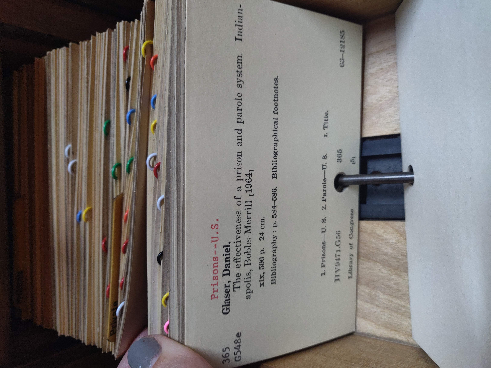

# Bugzilla

*The plain, structured, unglamorous open-source tracker Mozilla has run since 1998 - proof that a defect life cycle needs rigor and searchable fields, not a polished UI, to actually work.*

> Bugzilla has tracked real, high-stakes defects for Mozilla and countless open-source projects since
> 1998 — older than most testers reading this note — using an interface that has never chased visual
> polish. That's not a weakness; it's the whole point worth learning from. Everything this module has
> covered (states, workflow, severity, priority) works on plain text fields and a rigid structure, with
> zero glamour, because the ideas were never about the UI in the first place.

> **In real life**
>
> Pull open a library card catalog drawer: dense, plain, typewriter-set text on every card — no color,
> no decoration — yet every card follows an identical, strict structure (subject heading, classification
> number, full bibliographic detail), physically threaded on a metal rod that keeps thousands of cards
> in one unbreakable, searchable order. Colored plastic tabs mark groups without needing a fancy
> redesign. Nothing about this system is visually impressive, and nothing about it needs to be — the
> rigor is in the structure, not the presentation. Bugzilla is a card catalog for defects: plain,
> strict, and reliable for exactly that reason.

**Bugzilla**: Bugzilla is a free, open-source defect-tracking system originally built by Netscape/Mozilla in 1998, still actively used by Mozilla, the Linux kernel, LibreOffice, and many other large open-source projects. It implements the same core defect life cycle concepts as any tracker (states, severity, priority, assignment) through a plain, structured, field-heavy interface with a long-standing reputation for function over visual design. Its longevity - Bugzilla predates Jira by roughly six years - makes it a useful reference point: the underlying defect-management concepts this module teaches were solid enough to run unchanged on the same open-source tool for over two decades.

## The same concepts, plainer fields

- **Status and Resolution** — Bugzilla splits what many trackers merge into one status field: a
  `Status` (UNCONFIRMED, NEW, ASSIGNED, RESOLVED, VERIFIED, CLOSED, REOPENED) plus a separate
  `Resolution` (FIXED, DUPLICATE, WONTFIX, INVALID, WORKSFORME) once resolved — mapping almost exactly
  onto this module's states-of-a-bug (the "moving toward fixed" path) and exit ramps (Duplicate,
  Rejected/Invalid, Deferred/Wontfix, Cannot Reproduce/Worksforme).
- **Severity** — a plain dropdown: blocker, critical, major, normal, minor, trivial, enhancement —
  directly the four-to-six-level scale this module's severity note covers, just with Bugzilla's own
  specific labels.
- **Priority** — P1 (highest) through P5, set independently of severity, same as this module's
  priority note describes.
- **Component and Product** — Bugzilla organizes bugs by Product (a whole project, like "Firefox")
  and Component (a specific piece, like "Bookmarks & History") — a structured categorization that
  most modern trackers replicate as labels or custom fields.

> **Tip**
>
> Bugzilla's advanced search ("Bugzilla queries") is genuinely powerful precisely because every field is
> plain, structured, and consistently named — no free-text guessing required. A tester learning to
> construct a real query (status:RESOLVED AND resolution:FIXED AND component:X) is practicing the exact
> same structured-thinking skill that makes any tracker's filters useful, Jira's JQL included.

> **Common mistake**
>
> Dismissing Bugzilla as "outdated" because its interface looks plain next to Jira's. The underlying
> rigor — strict fields, a real audit history, powerful structured search — is often MORE consistent
> than a heavily-customized Jira project where every team configures fields differently. Plain and
> consistent beats flexible and inconsistent for the specific job of tracking defects reliably across
> a huge, long-running project.


*Card catalog at the Indiana State Library — Wikimedia Commons, CC BY-SA 4.0 (TBurmeister, WMF). [Source](https://commons.wikimedia.org/wiki/File:Card_catalog_at_the_Indiana_State_Library_-_interior_view_of_catalog_cards.jpg)*
- **The pulled card's structured fields — plain, strict, complete** — Subject heading, classification number, full bibliographic detail, in a fixed order every card follows - no decoration, no ambiguity about what goes where. Bugzilla's plain fields (Status, Severity, Priority, Component) follow the same strict, unglamorous discipline.
- **Colorful plastic tabs — component/category marking, low-tech but effective** — Groups of cards marked at a glance without needing a visual redesign of the whole system. Bugzilla's Product/Component fields do the same categorization job with plain text instead of color, but the same underlying function.
- **The metal rod — a rigid, simple, reliable ordering mechanism** — Every card is threaded on the same rod, in a fixed sequence nothing can silently reorder or lose. Bugzilla's sequential bug ID numbering works the same way - simple, rigid, and reliable since 1998.
- **A dense stack of many similar cards — decades of accumulated, searchable history** — Thousands of records in one drawer, still individually findable by structured fields. Bugzilla has tracked Mozilla's defects this way since 1998 - the plain structure is exactly what keeps a huge, old dataset searchable.
- **Plain black-and-red typewriter text, zero decoration** — Function over form, on purpose - nothing here needs to look impressive to work reliably. This is Bugzilla's whole design philosophy in one photograph.

**This module's concepts, in Bugzilla's own field names**

1. **UNCONFIRMED / NEW** — This module's New/Confirmed states - a bug just reported, not yet triaged or trusted.
2. **ASSIGNED** — Same concept as this module's Assigned state - one named developer now owns it.
3. **RESOLVED + Resolution: FIXED** — The developer's Fixed claim - Bugzilla splits the STATE (Resolved) from the REASON (Resolution: Fixed vs Duplicate vs Wontfix vs Invalid).
4. **VERIFIED** — The tester's independent check - this module's Verified/Closed, the same separation-of-roles principle from the-workflow.
5. **REOPENED** — Bugzilla has an explicit Reopened status - the same backward edge this module's reopen-and-duplicate note describes, named identically.

Bugzilla's search power comes from every field being plain and consistently named - which means a
query is just a structured filter, not a guess. Here's a small script that filters a batch of
bug-shaped records the way a real Bugzilla query would.

*Run it - filter bugs the way a Bugzilla query would (Python)*

```python
bugs = [
    {"id": 1001, "status": "RESOLVED", "resolution": "FIXED", "component": "Bookmarks", "severity": "major"},
    {"id": 1002, "status": "RESOLVED", "resolution": "DUPLICATE", "component": "Bookmarks", "severity": "normal"},
    {"id": 1003, "status": "NEW", "resolution": "", "component": "Sync", "severity": "critical"},
    {"id": 1004, "status": "RESOLVED", "resolution": "FIXED", "component": "Sync", "severity": "trivial"},
]

def bugzilla_query(bugs, status=None, resolution=None, component=None):
    results = bugs
    if status:
        results = [b for b in results if b["status"] == status]
    if resolution:
        results = [b for b in results if b["resolution"] == resolution]
    if component:
        results = [b for b in results if b["component"] == component]
    return results

query_result = bugzilla_query(bugs, status="RESOLVED", resolution="FIXED", component="Sync")
print(f"Query: status=RESOLVED AND resolution=FIXED AND component=Sync")
print(f"Matches: {[b['id'] for b in query_result]}")

query_result2 = bugzilla_query(bugs, status="NEW")
print(f"\\nQuery: status=NEW")
print(f"Matches: {[b['id'] for b in query_result2]}")

# Query: status=RESOLVED AND resolution=FIXED AND component=Sync
# Matches: [1004]
#
# Query: status=NEW
# Matches: [1003]
```

Same structured filter in Java, the kind of query a Bugzilla REST API client would build before
sending it off as an actual HTTP request:

*Run it - filter bugs the way a Bugzilla query would (Java)*

```java
import java.util.*;
import java.util.stream.*;

public class Main {
    record Bug(int id, String status, String resolution, String component, String severity) {}

    static List<Bug> bugzillaQuery(List<Bug> bugs, String status, String resolution, String component) {
        return bugs.stream()
            .filter(b -> status == null || b.status().equals(status))
            .filter(b -> resolution == null || b.resolution().equals(resolution))
            .filter(b -> component == null || b.component().equals(component))
            .collect(Collectors.toList());
    }

    public static void main(String[] args) {
        List<Bug> bugs = List.of(
            new Bug(1001, "RESOLVED", "FIXED", "Bookmarks", "major"),
            new Bug(1002, "RESOLVED", "DUPLICATE", "Bookmarks", "normal"),
            new Bug(1003, "NEW", "", "Sync", "critical"),
            new Bug(1004, "RESOLVED", "FIXED", "Sync", "trivial")
        );

        List<Bug> result1 = bugzillaQuery(bugs, "RESOLVED", "FIXED", "Sync");
        System.out.println("Query: status=RESOLVED AND resolution=FIXED AND component=Sync");
        System.out.println("Matches: " + result1.stream().map(Bug::id).collect(Collectors.toList()));

        List<Bug> result2 = bugzillaQuery(bugs, "NEW", null, null);
        System.out.println();
        System.out.println("Query: status=NEW");
        System.out.println("Matches: " + result2.stream().map(Bug::id).collect(Collectors.toList()));
    }
}

/* Query: status=RESOLVED AND resolution=FIXED AND component=Sync
   Matches: [1004]

   Query: status=NEW
   Matches: [1003] */
```

### Your first time: Your mission: file a practice bug in Bugzilla and map its fields to this module

- [ ] Find a public Bugzilla instance you can browse (Mozilla's bugzilla.mozilla.org is open to the public for viewing) — You don't need an account to search and read real, live bugs from a huge, long-running open-source project.
- [ ] Search for any resolved bug and read its Status AND Resolution fields together — Confirm you can tell whether it was Fixed, a Duplicate, or Wontfix just from those two plain fields - no guessing from a description.
- [ ] Find one bug that was Reopened — Read its comment history - does it explain WHY it was reopened, matching the three reasons from this module's reopen-and-duplicate note?
- [ ] Construct one real search query using Status, Resolution, and Component together — Confirm the results match what you'd expect - this is the exact structured-query skill this note's tip callout describes.
- [ ] Run the Python playground with your own bug data — Structure a few bugs with Bugzilla-style fields and confirm the query function filters them the way you expect.

You now have hands-on experience with the oldest tracker still in wide active use, and direct proof
that this module's concepts hold up on a completely different, much plainer interface.

- **You're not sure whether a Bugzilla bug is actually fixed just from its Status field.**
  Always check Resolution alongside Status - RESOLVED alone doesn't say HOW; Resolution (FIXED vs DUPLICATE vs WONTFIX vs INVALID vs WORKSFORME) is where that specific answer lives, matching this module's exit-ramp distinctions exactly.
- **A search returns far more or fewer results than expected.**
  Check each field's exact allowed value (Bugzilla fields are usually strict enums, not free text) - a status or resolution typo in a query silently returns nothing, rather than erroring, which can look like 'no bugs match' when the real issue is a query typo.
- **You're used to Jira's flexible custom fields and find Bugzilla's rigid structure limiting.**
  That rigidity is often the point on a huge, long-running project - a strict, unchanging field structure keeps decades of bugs consistently searchable in a way heavily-customized, frequently-changed Jira fields sometimes don't.
- **You need to compare Bugzilla concepts to a completely different tracker your new team uses.**
  Map fields the same way this note does: find that tool's equivalent of Status+Resolution split, severity scale, priority scale, and categorization (component/product) - the concepts transfer even when the exact field names and UI don't.

### Where to check

- **bugzilla.mozilla.org** — a real, public, huge Bugzilla instance anyone can browse and search without an account, genuinely useful for seeing real severity/priority/status data at scale.
- **The Bugzilla documentation** (bugzilla.org) — covers the exact field definitions and query syntax this note only summarizes.
- **A bug's "History" tab** — same audit-log concept as any tracker, showing every field change with a timestamp and the person who made it.
- **The advanced search / query builder page** — the concrete interface for the structured queries this note's Python/Java playgrounds simulate.

### Worked example: tracing a real open-source bug's full Bugzilla life cycle

1. A Firefox user reports: bookmarks fail to sync across devices under a specific network condition.
   Filed as **UNCONFIRMED**, Component: Sync, Severity: normal (the reporter's own guess).
2. A triager reproduces it, moves it to **NEW**, and — after investigating a bit — revises Severity
   to **major** (sync failing silently affects real user data, no visible error to warn them).
3. Assigned to a developer; moves to **ASSIGNED**. Priority set separately to **P2** by the
   component's lead, based on how many user reports have come in for the same root cause.
4. Developer fixes it, marks **RESOLVED**, Resolution: **FIXED**, linked to the actual code commit.
5. A QA contributor retests against a nightly build containing the fix, confirms it holds, marks
   **VERIFIED** — the same independent-check principle from this module's the-workflow note, playing
   out on a tool built years before that note's vocabulary existed.
6. Three months later, a regression in an unrelated sync-related change breaks the same case again.
   A user reopens the original bug (not a new one) — status flips to **REOPENED**, preserving the
   entire original investigation instead of starting over, exactly the value this module's
   reopen-and-duplicate note describes.

**Quiz.** A Bugzilla bug shows Status: RESOLVED but its Resolution field is blank/not yet set. What does this most likely mean?

- [ ] The bug is definitely fixed and ready to close - Resolution is just optional extra detail
- [x] This is an inconsistent or incomplete state - Resolution is meant to accompany RESOLVED and specify HOW (Fixed, Duplicate, Wontfix, Invalid, Worksforme); a resolved bug with no resolution reason is missing exactly the information that tells you what actually happened
- [ ] It means the bug was rejected as invalid
- [ ] It means the bug is a duplicate of another bug

*This note explicitly describes Bugzilla's Status/Resolution split as a STATE plus a REASON pair - Status says the bug reached a resolved state, but Resolution is what specifies which of the several different meanings that carries (Fixed vs Duplicate vs Wontfix vs Invalid vs Worksforme), each with a genuinely different implication for anyone reading the bug later. A blank Resolution on a Resolved bug is an incomplete record, not a meaningful state in its own right. Option one wrongly treats Resolution as optional detail rather than the field carrying the actual meaningful distinction. Options three and four each guess at ONE specific resolution value with no evidence for that particular one over any other - the actual answer is that the field is simply missing, not that any particular value should be inferred from its absence.*

- **Bugzilla — definition** — A free, open-source defect tracker built by Netscape/Mozilla in 1998, still actively used by Mozilla, the Linux kernel, and many large open-source projects - plain, structured, field-heavy, function over visual design.
- **Bugzilla's Status/Resolution split** — Status (UNCONFIRMED/NEW/ASSIGNED/RESOLVED/VERIFIED/CLOSED/REOPENED) is separate from Resolution (FIXED/DUPLICATE/WONTFIX/INVALID/WORKSFORME), set once resolved - the STATE plus the REASON, as two distinct fields.
- **Bugzilla's severity and priority scales** — Severity: blocker/critical/major/normal/minor/trivial/enhancement. Priority: P1 (highest) through P5 - independently set, same two-axis principle as this module's severity/priority chapter.
- **Why Bugzilla's plainness is a strength, not a weakness** — Strict, consistently-named fields make structured search genuinely powerful with zero guessing - and keep decades of accumulated bugs on a huge project reliably searchable, sometimes more consistently than a heavily-customized modern tracker.
- **How Bugzilla maps to this module's core vocabulary** — UNCONFIRMED/NEW = New/Confirmed; ASSIGNED = Assigned; RESOLVED+FIXED = the developer's Fixed claim; VERIFIED = the tester's independent check; REOPENED = the same backward edge as this module's Reopened state, named identically.
- **Bugzilla's age as a proof point** — Predates Jira by roughly six years and still runs Mozilla's real defect tracking today - concrete evidence that this module's underlying concepts (states, severity, priority, structured search) don't depend on any particular tool's UI to work.

### Challenge

Browse bugzilla.mozilla.org (no account needed to search). Find three real bugs: one RESOLVED/FIXED,
one RESOLVED/DUPLICATE, and one REOPENED. For each, read its full comment history and write one
sentence summarizing what actually happened, using this module's vocabulary (states, severity,
priority, workflow roles) rather than Bugzilla's own field names. Then open the Python playground
above, add your three real bugs' actual field values, and confirm a query you construct returns
exactly the bug(s) you expect.

### Ask the community

> I'm comparing Bugzilla's field structure (`[describe what you found]`) to `[your team's tracker]`. Is there a common mapping other teams use when moving between the two, or specific fields that don't translate cleanly?

Bugzilla's Status/Resolution split in particular doesn't always have a clean one-to-one match in
other trackers - naming the specific field you're trying to map gets a much more useful answer than
asking generally how the two tools compare.

- [Bugzilla.org — official project site and documentation](https://www.bugzilla.org/)
- [Mozilla's public Bugzilla instance — browse real, live bugs](https://bugzilla.mozilla.org/)
- [Tech Badshah — Introduction to Bugzilla](https://www.youtube.com/watch?v=PNOT4MAaj_U)

🎬 [Introduction to Bugzilla — Tech Badshah](https://www.youtube.com/watch?v=PNOT4MAaj_U) (6 min)

- Bugzilla is a free, open-source tracker running since 1998, still actively used by Mozilla and many major open-source projects - plain and structured by design, not by neglect.
- Its Status/Resolution split cleanly separates the STATE (Resolved) from the REASON (Fixed/Duplicate/Wontfix/Invalid) - a useful concrete example of this module's states and exit ramps.
- Severity and priority are independently set fields, same two-axis principle this module's earlier chapter covers, just with Bugzilla's own specific scale labels.
- Bugzilla's plainness enables genuinely powerful structured search - every field is a strict, consistently-named value, not free text to guess at.
- Bugzilla's longevity is real evidence this module's underlying concepts don't depend on any specific tool's visual design to work.


---
_Source: `packages/curriculum/content/notes/defect-management/tools/bugzilla.mdx`_
