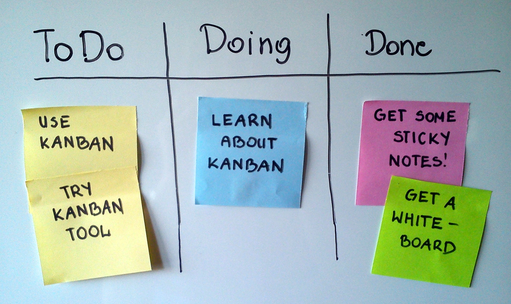

# JIRA basics

*Jira digitizes exactly the board-and-cards concept from a whiteboard kanban board - issue types, a configurable workflow, and fields for severity/priority - the industry's most common tracker, worth knowing even if your team uses something else.*

> Open almost any software team's bug tracker today and there's a real chance it's Jira. Not because
> it's the only good option — it isn't — but because it became the default that most teams, and most
> job postings, assume you already know. Learning its shape (issue types, statuses, fields) isn't about
> loyalty to one vendor; it's the fastest way to walk into a new team's tracker, whatever it's called,
> and already recognize what you're looking at.

> **In real life**
>
> Draw three columns on a whiteboard — To Do, Doing, Done — stick a colored note under each with a
> short label, and you already have the entire mental model Jira is built on. A note is an issue.
> Its column is its status. Its color could be its type (bug, task, story). Moving it left to right is
> the workflow from earlier in this module. Jira didn't invent this idea — it digitized a whiteboard
> practice teams were already doing by hand, then added searching, history, and permissions on top.

**Jira**: Jira is Atlassian's issue-tracking and project-management tool, the most widely used bug/task tracker in the software industry. Its core objects: an issue (a single tracked item - a Bug, Task, or Story, distinguished by issue type), a status (the issue's current state on a configurable board, matching the workflow concept from earlier in this module), and fields (structured data on the issue - severity, priority, assignee, and any custom field a team adds). A Jira 'board' is a visual, column-based view of issues grouped by status - the literal digital equivalent of the whiteboard-and-sticky-notes practice many teams used before adopting it.

## The core objects, mapped to what you already know

- **Issue** — one tracked item. An issue TYPE (Bug, Task, Story, Epic) says what KIND of work it is;
  a bug report from earlier in this module becomes one Bug-type issue.
- **Status** — exactly the states-of-a-bug concept from ch1, configured per project. Jira's default
  workflow ships with something close to To Do / In Progress / Done, and most teams extend it toward
  the fuller life cycle (Confirmed, Assigned, Fixed, Retest, Verified) this module covers.
- **Fields** — severity, priority, assignee, and any custom field a team adds. The six-field bug
  report anatomy from chapter 2 maps almost directly onto a well-configured Jira issue's fields.
- **Board** — a column view of issues by status. A Kanban board shows continuous flow; a Scrum board
  adds fixed-length sprints on top of the same underlying issue/status model.

> **Tip**
>
> The fastest way to get oriented in an unfamiliar Jira project: open one real Bug-type issue and find
> its status field's dropdown. The options listed ARE that project's specific workflow — the exact
> allowed transitions from wherever the issue sits right now, the same "workflow as a directed graph"
> concept from the-workflow note, just rendered as a dropdown instead of a diagram.

> **Common mistake**
>
> Assuming every Jira project uses the same workflow, issue types, or field names. Jira is deeply
> configurable per project — one team's "Bug" severity field might be a dropdown with five levels,
> another's a free-text field nobody fills in consistently. Never assume; open a real issue and read
> what's actually there before making claims about "how Jira works" on a specific team.


*A Scrum board suggesting to use Kanban — Wikimedia Commons, CC BY-SA 3.0 (Jeff.lasovski). [Source](https://commons.wikimedia.org/wiki/File:Simple-kanban-board-.jpg)*
- **A sticky note — one issue** — A single tracked item with a short label. In Jira: one issue, with a type (Bug/Task/Story) and a key like PROJ-142.
- **The 'To Do' column header — a status** — Not a folder, a STATE the note currently occupies. In Jira: the status field, and the column an issue's board card currently sits in.
- **The vertical dividing lines — workflow boundaries** — A note physically moves across these lines as work progresses - it can't be in two columns at once. This is the-workflow note's directed graph, drawn as literal lines on a board instead of an abstract diagram.
- **Different colored notes — issue types or fields** — Color-coding by category (Jira does this with issue-type icons: a red bug icon, a blue task icon, a green story icon) - a fast visual sort without reading every label.
- **The whole board, drawn by hand on a whiteboard** — This entire concept predates any specific software - Jira digitized exactly this practice, adding search, history, permissions, and fields on top of the same core idea.

**A bug report becoming a Jira issue**

1. **The six-field report (ch2)** — Title, environment, repro steps, expected/actual, evidence, severity - written up as prose or a template.
2. **Filed as a Bug-type issue** — Title becomes the issue summary; repro steps, expected/actual, and evidence go in the description field.
3. **Severity and priority fields set** — Structured dropdown fields, not just prose - filterable and reportable across the whole project.
4. **Lands on the board at 'To Do' / 'New'** — Visible on the team's board, in the leftmost column matching its current status.
5. **Moves across the board as the workflow (ch1) runs** — Assigned, In Progress, Fixed, Retest, Verified/Closed - the same life cycle from earlier in this module, now visualized as a moving card.

Jira's REST API models the same objects this note describes - an issue is just structured data with
a type, status, and fields. Here's a tiny script that builds one, the same shape a real API call would
send, so the underlying structure is visible instead of hidden behind a UI.

*Run it - build a Jira-shaped issue payload from a bug report (Python)*

```python
bug_report = {
    "title": "Login fails with a 500 error when password contains an apostrophe",
    "environment": "Chrome 126, staging",
    "repro_steps": ["Go to /login", "Enter valid email + password with an apostrophe", "Click Sign in"],
    "expected": "Redirected to /dashboard",
    "actual": "Stays on /login, console shows 500 from /api/auth/login",
    "severity": "Major",
    "priority": "P1",
}

def to_jira_issue(report, project_key):
    description_lines = [
        f"*Environment:* {report['environment']}",
        "",
        "*Steps to Reproduce:*",
    ] + [f"# {step}" for step in report["repro_steps"]] + [
        "",
        f"*Expected:* {report['expected']}",
        f"*Actual:* {report['actual']}",
    ]
    return {
        "fields": {
            "project": {"key": project_key},
            "summary": report["title"],
            "issuetype": {"name": "Bug"},
            "description": "\\n".join(description_lines),
            "customfield_severity": report["severity"],
            "priority": {"name": report["priority"]},
        }
    }

issue = to_jira_issue(bug_report, "QAM")
print(f"Project: {issue['fields']['project']['key']}")
print(f"Issue type: {issue['fields']['issuetype']['name']}")
print(f"Summary: {issue['fields']['summary']}")
print(f"Severity: {issue['fields']['customfield_severity']}, Priority: {issue['fields']['priority']['name']}")
print("Description:")
print(issue["fields"]["description"])

# Project: QAM
# Issue type: Bug
# Summary: Login fails with a 500 error when password contains an apostrophe
# Severity: Major, Priority: P1
# Description:
# *Environment:* Chrome 126, staging
#
# *Steps to Reproduce:*
# # Go to /login
# # Enter valid email + password with an apostrophe
# # Click Sign in
#
# *Expected:* Redirected to /dashboard
# *Actual:* Stays on /login, console shows 500 from /api/auth/login
```

Same builder in Java, closer to what a real integration (a test framework auto-filing failures)
might actually construct before POSTing to Jira's REST API:

*Run it - build a Jira-shaped issue payload from a bug report (Java)*

```java
import java.util.*;

public class Main {
    public static void main(String[] args) {
        String title = "Login fails with a 500 error when password contains an apostrophe";
        String environment = "Chrome 126, staging";
        List<String> reproSteps = List.of(
            "Go to /login",
            "Enter valid email + password with an apostrophe",
            "Click Sign in"
        );
        String expected = "Redirected to /dashboard";
        String actual = "Stays on /login, console shows 500 from /api/auth/login";
        String severity = "Major";
        String priority = "P1";
        String projectKey = "QAM";

        StringBuilder description = new StringBuilder();
        description.append("*Environment:* ").append(environment).append("\\n\\n");
        description.append("*Steps to Reproduce:*\\n");
        for (int i = 0; i < reproSteps.size(); i++) {
            description.append(i + 1).append(". ").append(reproSteps.get(i)).append("\\n");
        }
        description.append("\\n*Expected:* ").append(expected).append("\\n");
        description.append("*Actual:* ").append(actual);

        System.out.println("Project: " + projectKey);
        System.out.println("Issue type: Bug");
        System.out.println("Summary: " + title);
        System.out.println("Severity: " + severity + ", Priority: " + priority);
        System.out.println("Description:");
        System.out.println(description);
    }
}

/* Project: QAM
   Issue type: Bug
   Summary: Login fails with a 500 error when password contains an apostrophe
   Severity: Major, Priority: P1
   Description:
   *Environment:* Chrome 126, staging

   *Steps to Reproduce:*
   1. Go to /login
   2. Enter valid email + password with an apostrophe
   3. Click Sign in

   *Expected:* Redirected to /dashboard
   *Actual:* Stays on /login, console shows 500 from /api/auth/login */
```

### Your first time: Your mission: map a real (or practice) Jira project's board to this module's concepts

- [ ] Get access to any Jira instance - a free Atlassian trial, a practice project, or your team's real one — Jira offers a free tier for small teams, sufficient for exploring the basics.
- [ ] Open the board view and list every column — Match each column name to a state from this module's ch1 - which one is 'New,' which is 'Verified/Closed,' which are exit ramps (Rejected/Duplicate)?
- [ ] Open one Bug-type issue and list every field it has — Match each to the six-field bug report anatomy from ch2 - which field is the environment, which is severity, which is priority?
- [ ] Create one practice issue using a real bug you've reproduced — Fill in every field deliberately, using this module's standards, not just whatever the UI defaults to.
- [ ] Run the Python playground with your own bug report — Confirm the generated payload structure matches the fields your real Jira project actually uses.

You now have a working map between this module's concepts and one real tool's specific
implementation of them - the exact translation skill that transfers to any tracker you meet next.

- **A Jira project's severity field doesn't match this module's four-level scale (Critical/Major/Minor/Trivial).**
  That's expected and fine - Jira's fields are project-configurable, and different teams name levels differently (P1-P4, Blocker/Critical/Major/Minor/Trivial, or a custom scale). Map their actual levels to this module's concepts rather than assuming the names must match exactly.
- **You can't find a 'severity' field at all - only 'priority'.**
  Some teams genuinely don't separate the two fields, collapsing severity and priority into one - which this module's earlier notes would flag as a real gap. This is worth raising as a process observation, not something to just work around silently.
- **An issue's status dropdown shows far fewer options than you expected from the life cycle in ch1.**
  Check the project's actual configured workflow (often under project settings, if you have access) rather than assuming a missing status is a mistake - many teams intentionally simplify to fewer states than the full life cycle this module describes.
- **You're asked to use Jira but a job posting or team mentions a different tool entirely.**
  The concepts in this note (issue, status, fields, board) transfer almost directly to Azure DevOps, Linear, and most modern trackers - learn the CONCEPT here, then spend ten minutes mapping the new tool's specific vocabulary onto it, exactly like the FirstTime exercise above.

### Where to check

- **A project's board settings** (if you have admin access) — shows the actual configured workflow and columns, more reliable than inferring it from the board view alone.
- **An issue's "History" or "Activity" tab** — the same audit-log concept from ch1's states-of-a-bug note, showing exactly who changed what and when.
- **Atlassian's own documentation** — kept current as Jira's UI changes; a faster, more reliable reference than a specific tutorial video that may show an older interface.
- **A team's onboarding doc or wiki**, if one exists — often documents the team's SPECIFIC field meanings and workflow, which generic Jira knowledge alone won't tell you.

### Worked example: translating a filed bug into Jira, field by field

1. Six-field report from ch2: title "Export never completes for accounts with more than 10,000
   rows," environment "production, any browser," repro steps (3 numbered actions), expected "a CSV
   downloads within ~30 seconds," actual "spinner runs indefinitely," evidence (a screen recording),
   severity "High."
2. In Jira: **Issue type** = Bug. **Summary** = the title, verbatim. **Description** = environment +
   repro steps + expected/actual, formatted with Jira's markup (numbered lists render as an actual
   numbered list on the issue page).
3. **Attachments** = the screen recording, uploaded directly to the issue - evidence stays attached
   to the ticket permanently, not linked to an external file that can go missing.
4. **Severity** (a custom field on this project) = High. **Priority** = set separately by the product
   owner at triage, per the who-sets-what note - P1, because it blocks a real (if less common)
   customer workflow.
5. **Status** starts at "New," and as work progresses, moves through this project's configured
   workflow toward "Verified" - visible on the board the whole team already watches, no separate
   status update needed.

**Quiz.** A tester new to a team's Jira project assumes 'the severity field works the same way it did at my last job' and sets it without checking. What's the most accurate assessment of this approach?

- [ ] Reasonable - severity is a standardized Jira feature that works identically across all projects
- [x] Risky - Jira's fields, including severity, are configured per project; the safer approach is opening a few existing issues first to see how THIS project's severity field is actually used before setting it on a new one
- [ ] Irrelevant - severity doesn't matter as long as priority is set correctly
- [ ] Fine, as long as the tester used the exact same values (Critical/Major/Minor/Trivial) as their last job

*This note explicitly warns against assuming every Jira project uses the same fields, names, or workflow - Jira's configurability per project is one of its defining characteristics, and a severity field's exact levels, meaning, or even existence can differ significantly between projects. Option one wrongly treats Jira's flexibility as if it were rigid standardization. Option three contradicts this entire module's insistence that severity and priority are both meaningful, independent signals - dismissing one isn't supported anywhere in this content. Option four assumes the SPECIFIC LABELS matter more than actually checking what this project's field is configured to mean - even if the labels happen to match, their actual definitions might not, which is exactly why checking existing issues first (this note's recommended approach) is the safer habit regardless of label similarity.*

- **Jira — definition** — Atlassian's issue-tracking tool, the industry's most widely used bug/task tracker - core objects are issues (typed items), statuses (configurable states), fields (structured data), and boards (column views by status).
- **The whiteboard-to-Jira mapping** — A sticky note = an issue. A column = a status. The note's color = an issue type. Moving a note across the board = a workflow transition (this module's ch1 concept, digitized).
- **Why you can't assume Jira 'works the same way' across projects** — Jira is deeply configurable per project - workflows, fields, and issue types can all differ. Always open a real issue in the specific project before making assumptions.
- **The fastest way to learn an unfamiliar Jira project's workflow** — Open one issue and check its status dropdown - the options shown ARE that project's actual configured workflow, the same directed-graph concept from the-workflow note.
- **How this module's six-field bug report anatomy maps to Jira** — Title → Summary; environment/repro steps/expected/actual → Description; evidence → Attachments; severity/priority → their respective fields (names and scales vary by project).
- **Why learning Jira's CONCEPTS matters even if a team uses a different tool** — Issue/status/fields/board concepts transfer almost directly to Azure DevOps, Linear, and most modern trackers - the specific vocabulary changes, the underlying model rarely does.

### Challenge

Get access to any Jira instance (a free trial is sufficient). Create a practice project, then file
one real bug you've reproduced as a properly-filled Bug issue - title as summary, environment and
repro steps in the description, evidence attached, severity and priority set deliberately. Then open
the project's workflow configuration (or infer it from the status dropdown) and draw it as a diagram,
the same way you did for your own team's tracker in the-workflow note's Challenge.

### Ask the community

> I'm new to a Jira project and trying to understand its specific setup: `[describe what you've found - fields, workflow, issue types]`. Is there a standard way teams typically configure this, or does it vary too much to generalize?

Jira configuration varies enormously by team - the most useful answers usually come from people who
can point to a SPECIFIC common pattern (e.g. "most teams add a custom severity field since Jira
doesn't ship one by default") rather than a general "it depends."

- [Atlassian — official Jira guides](https://www.atlassian.com/software/jira/guides)
- [Atlassian — Jira workflow configuration guide](https://www.atlassian.com/software/jira/guides/issues/workflows)
- [Jira Bro — Jira Tutorial for QA Testers](https://www.youtube.com/watch?v=F1FcTI2VDeQ)

🎬 [Jira Tutorial for QA Testers — Jira Bro](https://www.youtube.com/watch?v=F1FcTI2VDeQ) (18 min)

- Jira digitizes the whiteboard kanban concept: an issue is a card, a status is a column, fields are structured data, a board is the column view - the industry's most common tracker, worth knowing even on a different tool.
- Jira is deeply configurable per project - never assume workflows, field names, or scales match across different projects without checking a real issue first.
- This module's concepts map directly: the-workflow's directed graph is the status dropdown's options; the six-field bug report anatomy maps onto an issue's summary, description, attachments, and severity/priority fields.
- The fastest orientation trick in an unfamiliar project: open one issue, read its status dropdown for the workflow, and its fields for what's actually tracked.
- Learning the CONCEPTS (issue/status/fields/board) transfers to almost any modern tracker - the vocabulary changes, the underlying model rarely does.


---
_Source: `packages/curriculum/content/notes/defect-management/tools/jira-basics.mdx`_
