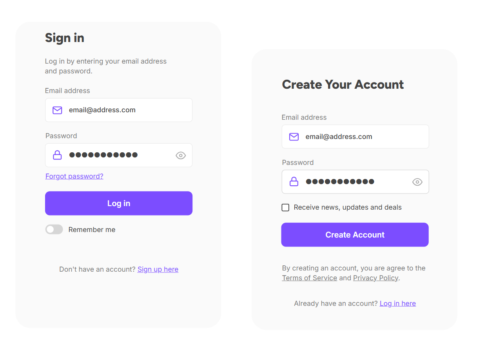

# Accounts & signing in

*An account isn't a place your stuff lives — it's a claim the server checks every time you knock. What signing in actually does, why you stay logged in, and the session bugs testers hunt.*

> You've made hundreds of accounts and probably never asked the obvious question: when
> you "log in," where do you go? Nowhere. You don't move an inch. You knock on a server's
> door, prove you're allowed in, and it hands you a wristband so it doesn't have to
> re-check you at every step. That wristband — how it's issued, how long it lasts, and how
> it gets stolen — is the entire story of online accounts, and it's a story every tester
> ends up debugging. Let's read it properly.

> **In real life**
>
> Signing in is **getting a wristband at a festival.** At the gate you show your ticket
> once (username + password). The staff check it, and instead of making you show the
> ticket at every stage, food stall, and toilet, they snap a wristband on you. For the
> rest of the day, the wristband *is* your proof — nobody re-checks your ticket. That
> wristband is a **session**: A small token the server gives your browser after login, sent automatically with every later request so you don't re-enter your password each click. Usually stored as a cookie..
> Lose it, or let someone copy it, and they walk around as you — no ticket required. The
> whole security of your account is really the security of that wristband.

## What an account actually is

An account is not a folder with your name on it. It's a **row in the server's database**
that says "this identity is allowed to do these things," plus a way to prove you're that
identity. Signing in is the proving. It has two halves people constantly confuse:

- **Authentication** — proving *who you are*. "I am priya@example.com, and here's my
  password to prove it." This is the login form.
- **Authorization** — deciding *what you're allowed to do* once you're proven. "You're
  logged in, but you're a free-tier user, so no admin panel for you."

Auth-entication is the gate; auth-orization is which rooms your wristband opens. Testers
check both, and mixing them up is the source of a whole class of security bugs (a user
who's authenticated but reaches something they were never authorized for).


*Login & signup form example — Wikimedia Commons, CC0. [Source](https://commons.wikimedia.org/wiki/File:Login_%26_signup_form_example.png)*
- **Username — your identity claim** — This is you saying WHO you are. It's not secret — usernames and emails are semi-public. On its own it proves nothing; anyone can type your email. The proof comes next. Testers check: does the app leak whether an email is registered here (a privacy bug), and does it treat Email vs email the same?
- **Password — the secret that proves it** — The one part only you should know. The server never stores this as-is — it stores a scrambled hash (the passwords note explains). It travels encrypted (the https note). If a site can email you your actual password, run: they're storing it in plain text, which is a serious defect.
- **Forgot password — the account's back door** — Recovery is part of sign-in, and it's often the WEAKEST part. If resetting your password only needs access to your email, then your email account is the real key to everything. Testers hammer this flow: can the reset link be reused? Does it expire? Can I reset someone else's account? Some of the scariest bugs live right here.
- **Remember me — the long wristband** — Checked, your session lasts days or weeks instead of ending when you close the tab. Convenient, and a real risk on a shared or public computer — that long wristband stays on for the next person. This checkbox is a security-vs-convenience trade the user makes, and testing that it actually behaves as labelled is a real case.
- **Log in — where the wristband is issued** — Click, and the server checks your identity + secret, and if they match, creates a session and hands your browser the wristband (a cookie). Everything before this is a claim; this button is where the claim is verified and access begins. The Network tab shows the exact moment the session cookie is set.
- **Create account — the very first step** — Signup is where the identity is born. Testers check it hard: weak-password acceptance, duplicate emails, what happens with a 200-character name or an emoji, and whether the confirmation email actually arrives. A signup that accepts 'a' as a password is a bug you can find in ten seconds.

## Why you don't re-type your password every click

Because that would be miserable, and because the wristband exists. After a successful
login the server stores a session and gives your browser a matching token, usually as a
cookie. From then on your browser attaches that token to every request automatically —
so the server recognizes you without asking again. Log out, and the server throws the
session away (the wristband is cut off); the token in your browser becomes worthless.

That's the happy version. The interesting version — the tester's version — is all the
ways the wristband misbehaves: it doesn't expire when it should, it survives a logout,
it works from a different device it shouldn't, or a page forgets to check it at all.

**What happens the moment you click Log in — press Play**

1. **📤 Credentials sent (encrypted)** — Your username and password travel to the server inside the https tunnel (the padlock note). On the wire they're scrambled — nobody on the coffee-shop Wi-Fi can read them. If this were plain http, your password would be readable. It isn't, and that matters.
2. **🔍 The server checks the secret** — It looks up your identity, scrambles the password you sent the same way it scrambled the stored one, and compares the two scrambles. It never compares raw passwords because it never HAS your raw password. Match → proceed. No match → 'incorrect password', deliberately vague about which half was wrong.
3. **🎟️ A session is created** — On success, the server makes a session record ('this token = priya, logged in at 9:04') and sends your browser the matching token as a cookie. The wristband is now on. This is the single most important moment in the whole flow.
4. **🔁 Every later request carries it** — Your browser automatically attaches the cookie to every request to that site. The server sees the token, recognizes you, and skips the login. This is why you click around freely — the wristband is being flashed silently, thousands of times.
5. **🚪 Logout throws it away** — Log out and the server DELETES the session — even if a copy of the token still existed somewhere, it now points at nothing. A logout that only clears your browser but leaves the server session alive is a real, testable bug: the wristband was pocketed, not cut off.

*Try it — a tiny login + session system (and the logout bug)*

```python
# The whole model in 25 lines: verify once, issue a token, check the token after.

users = {'priya': 'hash_of_correct_password'}   # server stores a HASH, never the raw password
sessions = {}                                    # active wristbands: token -> username

def fake_hash(pw):
    return 'hash_of_' + pw                        # pretend hashing

def login(username, password):
    if users.get(username) == fake_hash(password):
        token = 'tok-' + username + '-abc123'     # a real one is long and random
        sessions[token] = username
        print('login OK  -> wristband issued:', token)
        return token
    print('login FAILED -> no wristband')
    return None

def visit(token):
    who = sessions.get(token)
    print('request with', token, '->', ('welcome ' + who) if who else 'DENIED: not logged in')

def logout(token):
    sessions.pop(token, None)                      # cut the wristband off SERVER-SIDE
    print('logout -> session destroyed')

t = login('priya', 'correct_password')
visit(t)                       # welcome priya -- the wristband works
bad = login('priya', 'wrong')  # no wristband
visit('tok-attacker-xyz')      # DENIED -- a made-up token is worthless
logout(t)
visit(t)                       # DENIED now -- THIS is what a correct logout must do
print()
print("The bug testers hunt: a logout that clears the browser cookie but forgets")
print("the sessions.pop() line. The old token still maps to priya on the server,")
print("so a copied wristband keeps working after 'logout'. Try deleting the")
print("logout() line above and re-running -- the last visit would still say welcome.")
```

> **Tip**
>
> See your own wristband: on any site you're logged into, open Inspect → Application (or
> Storage) → Cookies. You'll see entries — one of them is your session token, often named
> `session`, `sid`, or `auth`. Delete it and reload: you're logged out, because the
> wristband is gone. That single experiment makes sessions real. And for testers it's a
> tool: clearing the session cookie is the fastest way to test 'logged-out' behaviour of
> any page without hunting for a logout button.

### Your first time: First time? Take your accounts apart safely

- [ ] Find the session cookie on a site you use — Inspect → Application → Cookies. Spot the one that looks like a long random string (session/sid/auth). That's your wristband, sitting in your browser right now.
- [ ] Log out and watch it vanish — Click logout, then re-check Cookies. The session token should be gone or changed. If a suspicious one lingers, that's worth noticing — a logout should not leave a live wristband behind.
- [ ] Check where you're signed in — Google, Apple, Facebook and most big services have a 'devices' or 'active sessions' page in settings. Look at it — you may find old phones and browsers still holding wristbands. Sign the strangers out.
- [ ] Test 'keep me logged in' — Log in WITHOUT ticking it, close the browser fully, reopen, return to the site. Are you logged out (correct for un-ticked)? Now try WITH it ticked. You just tested a real feature the way a QA would.
- [ ] Read a 'wrong password' message — Type a real email with a wrong password. A good site says 'incorrect username or password' — deliberately vague. If it says 'that password is wrong' (confirming the email exists), you've found a user-enumeration weakness. Notice which one it is.

Ten minutes and accounts stop being magic — they're wristbands you can see, delete, and
reason about.

- **“I logged in but it immediately bounces me back to the login page.”**
  The wristband isn't sticking. Usual causes: the browser is blocking the session cookie (third-party cookie settings, or the site is misconfigured), your device clock is wildly wrong (cookies are time-based and can look already-expired), or the login succeeded but the redirect landed somewhere that couldn't read the cookie. Check the Network tab: did the login response actually try to SET a cookie, and did the next request SEND it back? That set-then-send pair is the whole mechanism; find which half is missing.
- **“I logged out but I'm still logged in on another tab / after hitting back.”**
  A real bug worth reporting. Logout must destroy the session ON THE SERVER, not just in one tab. If the back button or a second tab still shows you logged in, either the server session wasn't killed (the sessions.pop bug from the CodePlayground) or the page is showing cached content. Reproduce with the Network tab: after logout, does a fresh request get rejected (good) or served (bug)? Data leaking after logout is a serious finding, especially on shared computers.
- **“It keeps logging me out every few minutes and I have to sign in again.”**
  The opposite problem: the session expires too aggressively, or a new session is issued and the old one invalidated on every request (a token-rotation bug). Annoying for users, and a real usability defect. Check whether it correlates with switching tabs, IP changes (VPN?), or a specific action. 'Logged out unexpectedly' is a legitimate bug ticket, not just bad luck.
- **“The password reset link I got isn't working / worked twice.”**
  Reset flows are security-critical and frequently broken. A reset link should be single-use and short-lived. If yours worked a second time, or still works an hour later, that's a real vulnerability (a leaked or forwarded email becomes a permanent key). If it never works, check whether you requested a newer one (older links usually invalidate) or the link got truncated by your email client. Testers probe this flow deliberately — it's a favourite of attackers.

### Where to check

Testing sign-in, or debugging your own account trouble:

- **Application → Cookies** — is a session token set after login, sent on later requests, and cleared on logout? This one panel shows the whole wristband lifecycle.
- **The Network tab at the moment of login** — does the response SET a session cookie? Does the very next request carry it back? A broken login is almost always a missing half of that pair.
- **The 'wrong password' message** — vague ('username or password') is good; specific ('no such user' / 'wrong password') leaks which accounts exist. A real, common finding.
- **Active-sessions / devices page** — in the app's settings. Confirms whether logout and 'sign out everywhere' actually revoke sessions server-side.
- **The reset-password flow** — is the link single-use, time-limited, and unable to reset an account that isn't yours? The highest-stakes part of sign-in.

### Worked example: the logout that didn't — a session bug, found in five minutes

A tester is checking a banking-style app on a shared library computer scenario. The
report to write starts as a hunch: "does logout really log out?"

1. **Log in, then open the Network tab.** Watch the login response — it sets a cookie named `sid`. Note its value. The wristband is on, and you can see it.
2. **Click Logout.** The UI returns to the login screen. Looks fine. But looks aren't a test.
3. **Replay a logged-in request with the old wristband.** In the Network tab, find a request that only works when logged in (like `/account/balance`), right-click → Replay (or just hit Back and reload). It still returns the balance. The old `sid` still works. **The server never destroyed the session.**
4. **Confirm the severity.** On a shared computer, the next user hits Back and sees the previous person's bank balance. That's not a glitch — it's data exposure after logout, high severity, and exactly the scenario logout exists to prevent.
5. **The report:** "Logout clears the UI but does not invalidate the server session: the pre-logout session cookie continues to authorize requests after logout (verified by replaying `/account/balance` post-logout — 200 with real data). Expected: server destroys the session so the old cookie returns 401. Repro + Network trace attached. Severity: high (data exposure on shared devices)."
6. **Why the happy-path tester missed it:** they clicked logout, saw the login screen, and moved on. The screen was honest; the server was not. Testing the *wristband* instead of the *screen* is the whole difference, and it came straight from understanding what a session is.

> **Common mistake**
>
> Believing "I closed the tab, so I'm logged out." Closing a tab usually does NOT end a
> session — especially with 'keep me logged in' ticked, the wristband survives in the
> browser and the server keeps the session alive for days. On your own laptop, fine. On a
> shared, public, or borrowed computer, that lingering wristband is exactly how accounts
> get hijacked: the next person reopens the browser and walks straight into your email.
> The habit that actually protects you is deliberate: click Log Out (which should cut the
> wristband server-side), and on public machines use a private/incognito window that
> forgets everything when closed. 'I closed it' is not 'I logged out' — and the gap
> between them is where account takeovers live.

**Quiz.** After you successfully log in, what is the server-issued 'session' actually for?

- [ ] It permanently stores your password in the browser so login is faster next time
- [x] It's a temporary token (usually a cookie) your browser sends with every later request, so the server recognizes you without re-checking your password each click
- [ ] It encrypts the whole website so no one can see it
- [ ] It's a backup copy of your account data kept on your device

*The session is the festival wristband: after you prove yourself once, the server hands your browser a token it flashes automatically on every later request, so you're not re-typing your password constantly. It is NOT your password stored (a good server never keeps your raw password anywhere), not encryption of the site (that's https, a separate thing), and not a data backup. Understanding the session as a revocable wristband explains logout, 'keep me logged in', session expiry, and the whole family of 'still logged in after logout' bugs testers hunt.*

- **Account** — A row in the server's database saying 'this identity may do these things', plus a way to prove you're that identity. Not a folder your files live in — a claim the server checks.
- **Authentication vs authorization** — Authentication = proving WHO you are (the login). Authorization = what you're ALLOWED to do once proven. The gate vs which rooms your wristband opens. Bugs live in the gap.
- **Session (the wristband)** — A token the server issues after login, sent by your browser with every later request so you don't re-enter your password. Usually a cookie. Logout should destroy it server-side.
- **Why you stay logged in** — Your browser auto-attaches the session token to every request; the server recognizes it and skips the login. 'Keep me logged in' just makes that token last days instead of one session.
- **Password reset = the back door** — Recovery is part of sign-in and often the weakest link. Reset links must be single-use and short-lived; if your email is enough to reset everything, your email is the real master key.
- **Logout bug** — If logout only clears the browser but leaves the server session alive, a copied token keeps working. Test by replaying a logged-in request after logout — it should be rejected.

### Challenge

Audit your own front door. (1) Open your most important account (email) and find its
'active sessions / devices' page — sign out anything you don't recognize. (2) On any
site, find the session cookie in Application → Cookies, delete it, and confirm you're
logged out. (3) Trigger a password-reset email to yourself and inspect the link: does it
expire, and does using it once stop it working again? (4) Test one site's 'wrong
password' message and classify it as vague (good) or leaky (names whether the account
exists). Write one sentence per finding. You've just run the sign-in test suite on your
own life.

### Ask the community

> Sign-in question: on [site], after I [log in / log out / reset], I expected [X] but got [Y]. Application→Cookies shows [session cookie state]. The Network tab at login shows [cookie set? sent back?]. On logout the old request is [rejected/served]. What's happening?

Include whether the session cookie is set at login and whether an old request is rejected
after logout — those two facts separate 'login is broken', 'logout is broken', and 'it's
working, the cache is stale', which are three completely different bugs.

- [GCFGlobal — accounts & staying safe online](https://edu.gcfglobal.org/en/internetsafety/creating-strong-passwords/1/)
- [Cloudflare Learning — authentication vs authorization](https://www.cloudflare.com/learning/access-management/what-is-authentication/)
- [Cookies, sessions & tokens explained](https://www.youtube.com/watch?v=NlvngHl0cdc)

🎬 [Cookies, sessions & tokens explained in 12 minutes](https://www.youtube.com/watch?v=NlvngHl0cdc) (12 min)

- An account is a claim the server checks, not a folder your files live in. Signing in proves the claim; the server then issues a session.
- Authentication proves WHO you are (login); authorization decides what you're ALLOWED to do. Bugs cluster where an authenticated user reaches something they were never authorized for.
- The session is a wristband: a token your browser sends automatically with every request so you don't re-enter your password. Logout must destroy it server-side.
- 'Keep me logged in' extends the wristband to days — convenient on your laptop, dangerous on shared machines. Closing a tab is not logging out.
- Password reset is the account's back door and often the weakest link: reset links must be single-use and time-limited, or a forwarded email becomes a permanent key.


---
_Source: `packages/curriculum/content/notes/digital-literacy-and-safety/accounts-passwords-and-2fa/accounts-and-sign-in.mdx`_
