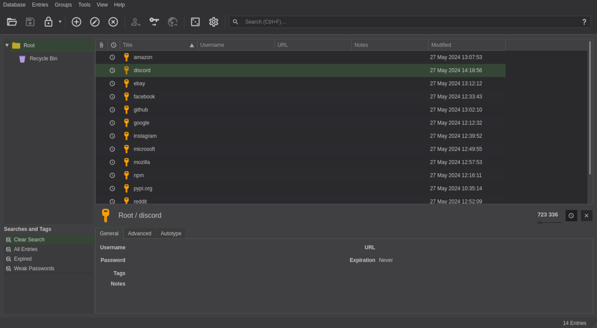

# Password managers

*The tool that makes 'a long unique password per site' actually possible. What a password manager is, why one master password is safer than a hundred memorized ones, and the objections that don't hold up.*

> The last note left you with an impossible homework assignment: a long, unique,
> random password for every single site — dozens, maybe hundreds of them. Nobody can
> remember that. Nobody should try. The whole point of this note is that you don't have to:
> you remember exactly one password, and a small program remembers all the rest, generates
> them stronger than you ever could, and even types them for you. It sounds like putting
> all your eggs in one basket. By the end you'll understand why one very good basket beats
> a hundred flimsy ones.

> **In real life**
>
> A password manager is a **safe with one key.** Instead of hiding a hundred valuables in
> a hundred bad spots around the house (under the mat, in a drawer, the same spot as last
> time), you put them all in one strong safe and carry one key. Yes, the key matters
> enormously — lose it and you're locked out; let someone copy it and they're in. But that
> one strong lock, guarded well, beats a hundred weak hiding spots an intruder already
> knows. The safe is a **password manager**: An encrypted database of all your passwords, unlocked by a single master password. The app generates, stores, and auto-fills a unique strong password for every site.;
> the key is your master password; and the whole security question narrows from "are all
> hundred of my passwords good?" to "is my one master password good, and is it backed up?"

## What it actually does

A password manager is an encrypted vault plus three habits it performs for you:

1. **Generates** a long random unique password for each site — the kind no human invents
   and no dictionary contains (`k7#mV9$pL2qXr4Tz`). You never see or type it; the app does.
2. **Stores** them all encrypted, unlocked only by your one master password. Encrypted
   means that even if someone steals the vault file, it's meaningless gibberish without
   the master key.
3. **Fills** them in automatically when you visit the matching site — which is also a
   quiet anti-phishing superpower, as you'll see.

You go from remembering a hundred passwords (badly, reused) to remembering one (well).
That's not a small convenience — it's the difference between the impossible advice of the
last note and advice you can actually follow.


*Screenshot: KeePassXC 2.7 — Wikimedia Commons, CC BY-SA 4.0 (Vitaly Zdanevich). [Source](https://commons.wikimedia.org/wiki/File:KeePassXC-2-7-7-list-of-accounts.png)*
- **One entry per site — each password UNIQUE** — amazon, discord, github, google… every account is its own entry with its own long random password. This is the reuse problem from the last note, solved by storage instead of memory. A breach of one site now exposes only that one entry — the blast radius the last note warned about, contained.
- **The lock — one master password guards it all** — Lock the vault and every entry is encrypted gibberish until you re-enter your master password. That single password is the ONE you must make long, unique, and never forget (a passphrase — see the last note). It's the key to the safe; guard it accordingly and back it up.
- **Add / generate — passwords you never invent** — New account? The manager generates something like k7#mV9$pL2qXr4Tz — longer and more random than any human. You never memorize it, never type it, never even see it most of the time. The tool does the one thing humans are worst at: being random.
- **Search — hundreds of logins, found instantly** — With every account stored, you need to find them fast. Search does it. This is why the manager scales where memory can't: 3 accounts or 300, the effort of using it stays the same. That flat effort is exactly why unique-per-site finally becomes realistic.
- **Weak / reused password audit** — Good managers scan your own vault and flag passwords that are weak, reused, or appeared in a known breach. It turns the last note's manual audit into a button. Testers will recognize this as the tool auditing itself — a health check on your whole credential set.
- **The hidden password field** — Passwords sit hidden, revealed only when you deliberately show or copy them. Combined with auto-fill, this means you can use a login for years without ever seeing its password — which is precisely why it can be gibberish only a machine could love.

## Why one master password is safer, not riskier

The instinctive objection: "isn't putting everything behind one password dangerous?"
It feels right and it's backwards. Compare honestly:

- **Without a manager:** a hundred passwords you have to remember, so you reuse and
  simplify them, so one breach cascades everywhere (the last note's reuse disaster), and
  you have no idea which are weak. Many weak locks, all pickable, some already picked.
- **With a manager:** one password you make genuinely strong and protect carefully, plus
  ninety-nine random uncrackable unique ones you never have to think about. One strong
  lock, deliberately guarded, and everything behind it is bank-vault grade.

The manager concentrates the risk into one place — and a single place you can actually
defend (long master passphrase, plus 2FA on the vault itself, next note) is far safer
than risk smeared thinly across a hundred places you can't. Concentrated-and-defended
beats scattered-and-weak. That's the whole argument, and it holds.

**Signing into a site with a password manager — press Play**

1. **🔑 Unlock the vault once** — At the start of your session you enter your ONE master password. The vault decrypts in memory. This is the only password you'll type all day — everything else the manager handles. Make this one count; it's the key to the whole safe.
2. **🌐 Visit a site's login page** — You go to github.com/login. The manager notices the site and finds the matching entry. Crucially it matches on the REAL domain — which is why it also quietly protects you from phishing (a lookalike domain won't match, so it won't auto-fill; that silence is a warning).
3. **✨ Auto-fill the credentials** — One click (or automatically) and the manager types the long random password for you. You never see it, never mistype it, never have to know it. The password can be gibberish precisely because a human never handles it.
4. **🆕 New account? Generate on the spot** — Signing up somewhere new, the manager offers a freshly generated unique password and saves it as you create the account. Effortless uniqueness — the thing that was impossible by memory is now the default with zero extra work.
5. **🔒 Lock it back up** — Step away and the vault re-locks (on a timer, or when you lock your screen). Everything returns to encrypted gibberish until the next master-password unlock. The safe door swings shut on its own — one of the settings worth checking is how fast.

*Try it — why one strong master beats a hundred weak reused passwords*

```python
# Model the real-world outcome of two strategies against ongoing breaches.

sites = ['email', 'bank', 'shopping', 'social', 'forum', 'game', 'news', 'work']

# Strategy A: reuse one memorable password everywhere (no manager)
reused = 'Summer2024!'
without_manager = {s: reused for s in sites}

# Strategy B: manager generates a unique random one per site
def generate(i):  # pretend-random unique per site
    return 'x9Q' + str(i) + 'z!Lm' + str(i * 7) + 'Rt'
with_manager = {s: generate(i) for i, s in enumerate(sites)}

# The 'forum' gets breached (small sites get breached constantly).
breached_password = without_manager['forum']
print('The forum is breached. Attackers now hold:', repr(breached_password))
print()

print('WITHOUT a manager -- try that password everywhere (credential stuffing):')
fallen = [s for s, pw in without_manager.items() if pw == breached_password]
print('   accounts opened:', fallen)
print('   -> all', len(fallen), 'accounts, including your BANK and EMAIL. Total cascade.')
print()

print('WITH a manager -- try the leaked forum password everywhere:')
fallen2 = [s for s, pw in with_manager.items() if pw == breached_password]
print('   accounts opened:', fallen2 if fallen2 else '[]  -- none. The leaked password')
print('   matches nothing else, because every site has a different one.')
print()
print('Same breach, same attacker. The manager turned a total account cascade')
print('into a single forgettable forum you can reset over coffee. THAT is why')
print('one guarded master password beats a hundred you had to remember.')
```

> **Tip**
>
> Start today with the accounts that matter most, not all hundred at once (that's how
> people give up). Pick a reputable manager — Bitwarden and KeePassXC are free and
> well-regarded; the ones built into Apple, Google and Firefox are a fine, zero-effort
> start. Install it, then over a week let it save logins as you naturally sign in. First
> thing to move: your EMAIL password (the master key that resets everything else), made
> unique and strong. You don't need a big migration weekend — you need to stop reusing on
> the accounts that would hurt most, and the manager makes each fix a ten-second habit.

### Your first time: First time? Stand up a password manager in fifteen minutes

- [ ] Pick one and install it — Bitwarden (free, cross-platform), KeePassXC (free, offline), or the one built into your browser/phone. Any reputable manager beats no manager. Don't agonize over the choice — start.
- [ ] Create a STRONG master password — This is the one you must remember and never reuse. Make it a long passphrase (last note): four or five random words. Write it on paper and store that paper somewhere safe until it's memorized — losing the master locks you out of everything.
- [ ] Save one login by using it — Log into a site normally; the manager offers to save it. Say yes. That's one account in the vault. Painless.
- [ ] Let it generate one new password — On a low-stakes site, change your password and use the manager's generator. Watch it create something no human would — and save it automatically. You just made an uncrackable unique password with zero mental effort.
- [ ] Run the security/health check — Most managers have a 'weak/reused/breached' report. Run it. It'll show you exactly which of your old passwords to fix first — turning the last note's manual audit into a prioritized to-do list.

Fifteen minutes and you have a vault, one strong master, and a ranked list of what to fix
next. The impossible homework is now a habit.

- **“What if I forget my master password? Am I locked out of everything?”**
  Mostly yes — and that's by design: if the company could recover it, so could an attacker. So plan ahead, don't panic later. Options: write the master on paper and store it physically safe (a drawer at home beats a weak digital password), set up the manager's emergency-access or account-recovery feature if it has one, and keep an emergency kit / recovery code where you keep important documents. The fix is preparation, not recovery. Treat the master like a house key you cannot re-cut.
- **“Isn't the manager itself a single point of failure — what if IT gets hacked?”**
  Reputable managers store your vault ENCRYPTED with your master password, which they never have. So even a breach of the company hands attackers encrypted gibberish, not your passwords — as long as your master is strong (a leaked vault with a weak master CAN be cracked, which is the whole reason the master must be a long passphrase). Add 2FA to the vault itself (next note) and even a stolen encrypted vault plus a guessed master isn't enough. Defense in depth, on the one thing that matters.
- **“Auto-fill isn't filling on this site.”**
  Often a feature, not a bug: if the manager doesn't recognize the domain, it won't fill — and that can mean you're on a lookalike phishing site, not the real one (the manager matches the true domain; your eyes should double-check). Legit reasons it also happens: the site uses an unusual login field, loads the form late, or is a different domain than the one you saved. Check the URL first (is it really the right site?), then update the saved entry's URL if the site genuinely changed.
- **“I'm worried about putting all my passwords in one app I don't fully trust.”**
  Reasonable instinct — so choose trustworthy and verify. Prefer well-audited, reputable managers (open-source ones like Bitwarden and KeePassXC can be independently inspected). KeePassXC keeps the vault as a local file you control entirely, if you'd rather not use a cloud. And weigh it honestly against the status quo: 'all passwords in one encrypted vault' is far safer than 'the same weak password reused across a hundred sites', which is what you almost certainly have now. Perfect isn't on the menu; much-better is.

### Where to check

Setting up or trusting a password manager:

- **Master password strength** — is it a long unique passphrase? Everything rests on this one. It's the only password whose strength you must personally guarantee.
- **Vault backup / recovery** — is the master written somewhere physically safe, and is emergency access or a recovery code set up? Forgetting it with no backup means real lockout.
- **2FA on the vault itself** — does the manager support a second factor (next note)? Turn it on. It protects the one basket holding all your eggs.
- **The weak/reused/breached report** — run it; it prioritizes which old passwords to replace. The fastest security win available to most people.
- **Auto-fill domain matching** — does it fill only on the real site? That silent refusal on a lookalike domain is a genuine anti-phishing feature; trust the silence.

### Worked example: from a hundred reused passwords to a defended vault — a realistic week

Someone finally decides to fix their passwords after a scare. Not a heroic weekend — a
realistic week, which is the only kind that sticks:

1. **Day 1: install and master.** Install Bitwarden, create a five-word master
   passphrase, write it on paper in a drawer. One strong lock now exists. Total time: ten minutes.
2. **Day 1: secure email first.** Change the email password (the master key that resets
   everything else) to a manager-generated unique one. The single most important account
   is now uniquely protected. If nothing else happened this week, this alone shrank the risk hugely.
3. **Days 2–5: save as you go.** Just let the manager save each login as you naturally
   sign into things. No migration marathon — normal life quietly populates the vault. By
   Friday it holds the twenty sites you actually use.
4. **Day 5: run the health check.** The report flags eleven reused passwords and three
   that appeared in breaches. Now there's a ranked list, not a vague dread. Fix the
   breached three immediately (bank, shopping, an old email) with generated uniques.
5. **Day 6: 2FA the vault.** Turn on two-factor authentication for the manager itself
   (next note), so even a stolen encrypted vault plus a guessed master isn't enough.
6. **The outcome:** one strong master password remembered, the important accounts each
   uniquely and randomly protected, the reuse cascade broken, and a tool that fixes the
   rest at ten seconds each. The impossible homework from the last note became a habit —
   which was always the only way it was going to get done.

> **Common mistake**
>
> Protecting a password manager with a weak or reused master password. The manager's whole
> security model rests on that one key: it encrypts your entire vault with it and the
> company never learns it, which is exactly why a strong master makes even a stolen vault
> useless — and a weak master makes the vault a single juicy target. Reusing your master
> password somewhere else is the worst version: now the master to ALL your accounts is
> sitting in some other site's breach-able database. The master password must be the
> strongest, most unique, most carefully guarded password you own — a long passphrase used
> nowhere else, backed up on paper, and protected with 2FA. Get that one right and the
> manager is a fortress. Get it wrong and it's a single lock on everything you have.

**Quiz.** Why is storing all your passwords in one manager safer than remembering them, despite the 'single basket' worry?

- [ ] Because the manager hides your passwords where hackers can't look
- [x] Because it replaces a hundred weak, reused, memorizable passwords with one strong master you can actually defend, plus ninety-nine unique random ones a breach can't cascade through
- [ ] Because password managers can never be hacked
- [ ] Because it makes your passwords shorter and easier to type

*The single-basket worry gets the risk exactly backwards. Without a manager you have many weak locks (reused, simplified so you can remember them) — the actual disaster. With one, you concentrate the risk into a single place you can genuinely defend: one long master passphrase, ideally plus 2FA, guarding a vault of unique random passwords that no breach can chain through. Managers CAN be targeted, but reputable ones store the vault encrypted with a master they never hold, so a strong master keeps even a stolen vault useless. Concentrated-and-defended beats scattered-and-weak — and it makes the impossible 'unique password per site' finally realistic.*

- **Password manager** — An encrypted vault that generates, stores, and auto-fills a unique strong password per site, all unlocked by one master password. Turns 'unique per site' from impossible to automatic.
- **The single-basket answer** — One strong, guarded master password + unique random passwords per site beats a hundred weak reused ones. Concentrated-and-defended beats scattered-and-weak.
- **The master password** — The one you must remember, make a long unique passphrase, back up on paper, and protect with 2FA. Everything rests on it; the company never learns it.
- **Why a breached manager is survivable** — Reputable managers store the vault ENCRYPTED with your master (which they never have). A stolen vault is gibberish unless the master is weak — so the master must be strong.
- **Auto-fill = anti-phishing** — The manager fills only on the REAL matched domain. On a lookalike phishing site it stays silent and won't fill — treat that refusal as a warning to check the URL.
- **Where to start** — Install one, set a strong master, secure your EMAIL password first (it resets everything), then let it save logins as you go and run the weak/reused report. A week, not a weekend.

### Challenge

Actually install one — reading about safes doesn't lock anything. (1) Install a reputable
password manager (Bitwarden, KeePassXC, or your browser/phone's built-in). (2) Set a
five-word passphrase master and write it somewhere physically safe. (3) Move ONE account
— your email — to a manager-generated unique password. (4) Run the manager's weak/reused/
breached report and write down how many it flags. You've now done the single highest-value
security action available to a normal person, and turned the last note's impossible
homework into a ten-second-per-site habit. Next note: lock the vault itself with 2FA.

### Ask the community

> Password manager question: I'm using [manager] and [what happened — auto-fill won't fill / worried about lockout / unsure how to start / a health-check flag I don't understand]. My setup: master is [strong passphrase? reused?], 2FA on the vault [yes/no], backup [yes/no]. What should I do?

Say whether your master password is a unique strong passphrase and whether you've backed
it up — those two facts decide almost every password-manager question, because they're
the whole security model in two answers.

- [Bitwarden — getting started (free, reputable)](https://bitwarden.com/help/getting-started-webvault/)
- [KeePassXC — docs (free, offline, open-source)](https://keepassxc.org/docs/)
- [How password managers work — Computerphile](https://www.youtube.com/watch?v=w68BBPDAWr8)

🎬 [How password managers work — Computerphile](https://www.youtube.com/watch?v=w68BBPDAWr8) (9 min)

- A password manager generates, stores (encrypted), and auto-fills a unique strong password per site — making the impossible 'unique everywhere' advice actually followable.
- One strong, defended master password beats a hundred weak reused ones: it concentrates risk into a single place you can genuinely protect, behind unique passwords no breach can cascade through.
- Reputable managers encrypt the vault with a master they never hold, so even a stolen vault is gibberish — provided the master is a long unique passphrase (and ideally 2FA-protected).
- Auto-fill is quiet anti-phishing: it fills only on the real matched domain, so its silence on a lookalike site is a warning to check the URL.
- Start small: install one, set a strong backed-up master, secure your email password first, then let it save logins as you go and run the weak/reused report.


---
_Source: `packages/curriculum/content/notes/digital-literacy-and-safety/accounts-passwords-and-2fa/password-managers.mdx`_
