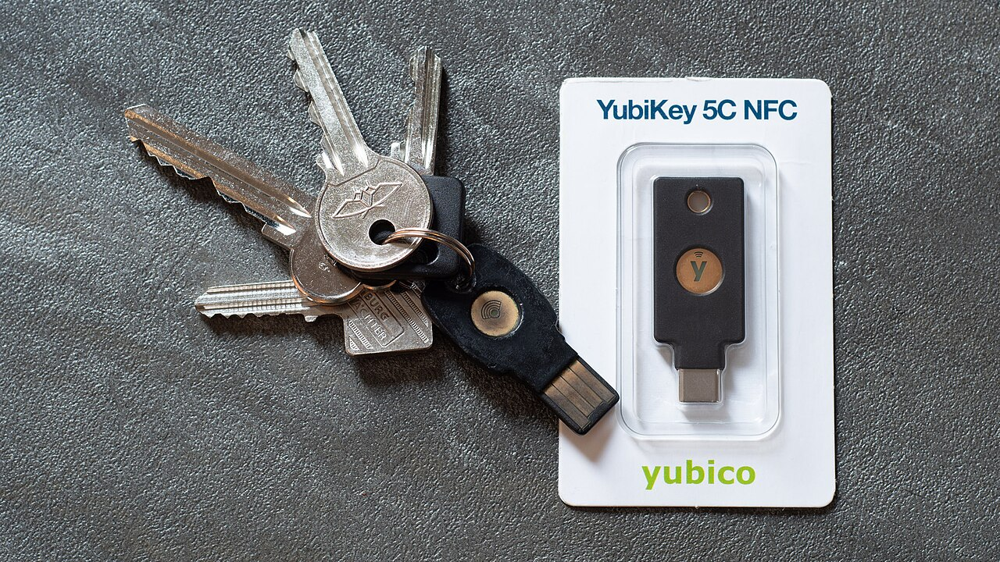

# Two-factor authentication

*A password can be stolen; a second factor means stealing it isn't enough. What 2FA is, why an app or a key beats a text message, and the recovery codes that stop it locking you out.*

> Here's the uncomfortable truth the last three notes were building toward: even a long,
> unique, manager-generated password can be stolen — phished, keylogged, or leaked in a
> breach you never hear about. So the best password in the world is still a single lock,
> and single locks get picked. Two-factor authentication adds a second, completely
> different lock — one an attacker can't pick from the other side of the planet. It's the
> highest-value five-minute security upgrade you will ever make, and by the end of this
> note you'll know which kind to use and how to never get locked out by it.

> **In real life**
>
> Two-factor authentication is **a lock plus a key you physically hold.** A password is
> something you *know* — and anything you know can be copied without you noticing: watched,
> guessed, phished, leaked. A second factor is something you *have* — your phone, a little
> hardware key — and to steal that, an attacker has to physically take it from you. A thief
> in another country can guess your password; they cannot reach into your pocket. That's
> the entire idea: pair something you know with something you have, and a stolen password
> alone becomes **a second factor**: A one-time code or physical device required in addition to your password. Even if your password is stolen, the attacker can't log in without this second, separate factor.
> short of useless.

## The three kinds of proof

Security people sort authentication into three "factors," and 2FA just means using two
different ones together:

- **Something you know** — a password, a PIN. Copyable at a distance. This is factor one,
  and everything before this note was about making it strong.
- **Something you have** — your phone (running an authenticator app), a hardware security
  key, a one-time code. Requires physical possession to steal.
- **Something you are** — a fingerprint, a face scan. Convenient, and increasingly the
  everyday face of the "something you have" (unlocking the device that holds your keys).

Two-factor means combining two *different* categories — know + have. Two passwords isn't
2FA (both are "know"). Password + phone code is, because a remote attacker with your
password still lacks the phone. That difference in *category* is the whole strength.


*Photo: Daniel Aleksandersen — Wikimedia Commons, CC BY 4.0. [Source](https://commons.wikimedia.org/wiki/File:YubiKey_5C_NFC.jpg)*
- **A hardware security key — the strongest factor** — This little device is 'something you have' in its purest form. To log in, you plug it in or tap it — proving physical possession. It's the gold standard because it also resists phishing: the key cryptographically checks the real site's identity and refuses to authenticate to a lookalike. A remote attacker with your password has nothing without this in hand.
- **Ordinary house keys — you already trust this idea** — You've trusted physical keys your whole life: possession = access, and you keep a spare. A security key is exactly that logic for your accounts. The mental model isn't new — it's the front-door key you already understand, applied to your email and bank.
- **The connector — plug in or tap (NFC)** — You authenticate by inserting the key (USB-C here) or tapping it to your phone (NFC). A physical action, deliberately — you can't tap a key you don't have, and malware on the far side of the world can't fake the tap. The friction IS the security.
- **On a keyring — carry it, and keep a backup** — It lives on your keychain like any key, which means (like any key) it can be lost. That's why the golden rule of 2FA is to register a SECOND factor or save recovery codes: never let one loseable object be the only way into your accounts. Backup is not optional; it's the difference between security and lockout.

## Not all second factors are equal

When a site offers 2FA, you're usually choosing between these, worst to best:

1. **SMS text codes** — a code texted to your phone. Better than nothing, but the
   weakest: attackers can hijack your phone number (SIM-swapping) and intercept the text.
   Use it only if it's the sole option.
2. **Authenticator apps (TOTP)** — an app (Google Authenticator, Authy, or your password
   manager) generates a fresh 6-digit code every 30 seconds, computed on your device with
   no network needed. Far safer than SMS: nothing to intercept, no phone number to hijack.
   This is the sweet spot for most people.
3. **Hardware security keys / passkeys** — a physical key, or a "passkey" stored in your
   phone/manager, that proves possession cryptographically AND resists phishing (it checks
   the real site). The strongest, and increasingly the easy default.

The upgrade order for a normal person: turn on *any* 2FA today (huge win over none), prefer
an authenticator app over SMS, and use a hardware key or passkey on your most important
accounts (email first — it's the master key that resets everything else).

**Logging in with 2FA — and where the attacker gets stuck — press Play**

1. **🔑 Enter password (factor 1)** — You type your password — or your manager fills it. This is 'something you know'. An attacker who phished or leaked it has exactly this much: the first lock, open. In a pre-2FA world, they'd now be in. Not anymore.
2. **📱 Site asks for the second factor** — Instead of letting you in, the site now demands the second proof: a code from your app, a tap of your key, a passkey confirmation. This is the wall a remote attacker hits — they have your password but not the thing in your pocket.
3. **🔢 You provide 'something you have'** — You open your authenticator app and read the current 6-digit code, or tap your security key. It's generated on / proven by a device only you physically hold. No network, nothing to intercept for TOTP; physical possession for a key.
4. **✅ Both factors match — you're in** — Password AND second factor check out, so the session is created (the wristband from the accounts note). Two different categories of proof, both satisfied. This is the login that's genuinely hard to fake remotely.
5. **🚫 The attacker, meanwhile, is stuck** — They have your password and get to the second-factor screen — and stop. They can't produce a code from an app on YOUR phone or a tap of a key in YOUR pocket. A leaked password, which used to mean game over, is now just noise. That's the entire value of 2FA in one frame.

*Try it — why a stolen password isn't enough once 2FA is on*

```python
# Model an attacker who has fully stolen your password. Watch 2FA stop them.

account = {
    'password': 'a-strong-unique-passphrase',   # even a GOOD password...
    'twofa_enabled': True,
}

def phone_code_now(is_owner):
    # the current authenticator code exists only on the OWNER's device
    return '481920' if is_owner else None   # attacker's device shows nothing

def login(entered_password, entered_code, is_owner):
    if entered_password != account['password']:
        return 'DENIED: wrong password'
    if account['twofa_enabled']:
        real_code = phone_code_now(is_owner)
        if entered_code != real_code or real_code is None:
            return 'DENIED: password OK, but second factor missing/wrong'
    return 'ACCESS GRANTED'

print('You (owner), password + your app code:')
print('   ', login('a-strong-unique-passphrase', '481920', is_owner=True))
print()
print('Attacker who fully stole your password, but has no code:')
print('   ', login('a-strong-unique-passphrase', '000000', is_owner=False))
print()
print('Attacker guessing the 6-digit code:')
import_note = '   (a fresh code every 30s + lockouts make guessing hopeless)'
print('   ', login('a-strong-unique-passphrase', '123456', is_owner=False))
print(import_note)
print()
print("The attacker has your EXACT password and still can't get in. That is the")
print("whole point: 2FA turns 'password stolen = account lost' into 'password")
print("stolen = attacker stuck at the second wall'. Turn it on where it hurts most.")
```

> **Tip**
>
> Turn on 2FA for your email FIRST, right now, before anything else — it's a five-minute
> job and your email is the master key that can reset every other account you own. Look in
> the account's Settings → Security for "two-factor", "2-step verification", or
> "authentication". Choose an authenticator app over SMS if offered. And the instant you
> enable it, the site shows you a set of **recovery/backup codes** — save those (password
> manager or printed and stored safely) before you close the page. Ninety percent of "2FA
> locked me out" horror stories are just "I didn't save the recovery codes." Do that one
> thing and 2FA is pure upside.

### Your first time: First time? Turn on 2FA without ever locking yourself out

- [ ] Install an authenticator app — Google Authenticator, Authy, or the 2FA feature built into your password manager. This will hold the rotating codes for all your accounts in one place.
- [ ] Enable 2FA on your email first — Settings → Security → two-factor/2-step. Email is the master key that resets everything else, so it's the highest-value account to protect. Choose 'authenticator app', not SMS, if both are offered.
- [ ] Scan the QR code with the app — The site shows a QR code; scan it in your authenticator app. The account now appears there, generating a fresh 6-digit code every 30 seconds. That's your 'something you have', set up.
- [ ] SAVE THE RECOVERY CODES — The site shows one-time backup codes right after setup. Save them in your password manager or print and store them safely. These get you in if you lose your phone. This step is the whole difference between 'protected' and 'locked out'.
- [ ] Add 2FA to your other key accounts — Repeat for your bank, your password manager itself, and social accounts. Each takes a couple of minutes. Email and the password manager are the two that matter most — do those without fail.

Fifteen minutes, and your most important accounts now need something a remote attacker
physically cannot have — with recovery codes saved so future-you never gets locked out.

- **“I lost my phone — the one with my authenticator app. Am I locked out?”**
  This is exactly what recovery codes are for — if you saved them, use one to log in, then re-set-up 2FA on your new phone. No codes saved? Try the account's 'lost your authenticator?' recovery flow (often email or identity verification), or a second registered factor if you added one. The real fix is upstream: save recovery codes at setup AND register a second factor, so one lost object is never the only door. Some apps (Authy, and password-manager-based 2FA) also sync across devices, which sidesteps this entirely.
- **“The 6-digit code keeps being rejected as wrong.”**
  Almost always a clock problem: TOTP codes are time-based, so if your phone's clock is off by more than about 30 seconds, every code looks wrong. Fix: set the phone's date/time to automatic/network time. Also make sure you're reading the code for the RIGHT account (authenticator apps list many) and entering it before the 30-second timer resets. If it still fails, your account's 2FA may have been reset — use a recovery code.
- **“A site only offers SMS 2FA — is that safe enough?”**
  SMS is the weakest factor (vulnerable to SIM-swap attacks where someone hijacks your phone number), but it's still far better than NO second factor — turn it on if it's the only option. Where the account is important and offers a choice, prefer an authenticator app or hardware key. And protect the phone number itself: many carriers offer a port-out / SIM-swap PIN. Weak 2FA beats no 2FA; just don't stop at SMS for your email or bank if better is available.
- **“I got a 2FA code I didn't request.”**
  Take it seriously — it usually means someone has your PASSWORD and is trying to log in, and only the second factor is stopping them. Do NOT enter or share the code (that's how attackers trick you into completing THEIR login — no legitimate service asks you to read a code to a caller). Instead: change that account's password immediately (it's compromised), confirm 2FA is on, and check for any unfamiliar active sessions. The unrequested code is 2FA doing its job — heed the warning.

### Where to check

Setting up 2FA, or judging an account's protection:

- **Which factor type** — hardware key / passkey (best) > authenticator app (great) > SMS (weakest but better than none). Prefer app-or-key for email and money.
- **Recovery codes saved** — did you store the backup codes at setup? This is the single most-skipped step and the cause of most lockouts.
- **A second registered factor** — is there more than one way in (a backup key, or app-sync)? One loseable object should never be the only door.
- **Email and password manager first** — are your two master accounts (email resets everything; the manager holds everything) both 2FA-protected? Non-negotiable.
- **Unrequested code alerts** — an unexpected 2FA prompt means your password is likely compromised. Treat it as a signal to change that password, not as noise.

### Worked example: the phished password that went nowhere — 2FA earning its keep

A user falls for a convincing phishing email and types their real email password into a
fake login page. Password fully stolen. Here's why it doesn't become a disaster:

1. **The attacker has the password.** They go to the real Gmail, enter the stolen
   password — correct — and reach the second-factor screen. In a pre-2FA world, they'd
   now own the account (and, via email resets, everything else). This is the moment 2FA
   exists for.
2. **They're asked for the code, and they're stuck.** Gmail wants the current
   authenticator code — which is generated only on the victim's physical phone. The
   attacker doesn't have the phone, so they cannot proceed. The password, alone, bought
   them nothing.
3. **The victim gets a warning.** Their phone shows a 'someone is trying to sign in'
   prompt / an unrequested code. That's the tell: the password is compromised, even though
   the account isn't. 2FA converted a silent breach into a loud alarm.
4. **The clean recovery.** The victim changes the email password (now known-compromised)
   to a new manager-generated unique one, confirms 2FA is still on, and checks for
   unfamiliar sessions (the accounts note's skill). Damage: zero. Time: ten minutes.
5. **The counterfactual.** Without 2FA, that one phished password would have opened the
   email, and from the email the attacker would reset the bank, the socials, everything —
   the full cascade. 2FA is the wall that turned a catastrophe into a password change.
6. **The lesson:** a strong password can still be stolen; 2FA is what makes stealing it
   not enough. That's why it's the highest-value five-minute upgrade in this whole module —
   and why email and your password manager get it first.

> **Common mistake**
>
> Enabling 2FA and not saving the recovery codes — then losing your phone and locking
> yourself out of your own account, sometimes permanently. 2FA's strength (only YOUR device
> can produce the second factor) is also its risk: lose that device with no backup and you
> become the attacker who can't get in. The fixes are all one-time and boring: save the
> recovery/backup codes at setup (in your password manager, or printed and stored safely),
> register a SECOND factor where you can (a backup key, or an app that syncs across
> devices), and never let a single loseable object be the only way into an account that
> matters. 2FA should make you safer, not one dropped phone away from lockout — and the
> difference is entirely those recovery codes you were shown for ten seconds during setup.

**Quiz.** Why does two-factor authentication protect you even if your password is completely stolen?

- [ ] It changes your password automatically after every login
- [x] It requires a second proof from a DIFFERENT category — something you physically have (a phone code or key) — which a remote attacker with only your password cannot produce
- [ ] It hides your password so it can never be stolen in the first place
- [ ] It makes your password longer

*2FA's power is that the second factor is a different CATEGORY of proof — 'something you have' (a code on your phone, a tap of a key) rather than another 'something you know'. A password can be phished, leaked, or guessed from anywhere on Earth; a factor you physically hold cannot be, without stealing the object itself. So an attacker who fully steals your password still hits a wall at the second-factor screen. It doesn't change or hide your password (those are different ideas) — it adds an independent second lock that a remote attacker can't reach, turning 'password stolen = account lost' into 'password stolen = attacker stuck'.*

- **Two-factor authentication (2FA)** — Requiring a second proof, from a different category, on top of your password. Even a fully stolen password isn't enough without the second factor.
- **The three factors** — Something you KNOW (password), something you HAVE (phone code, hardware key), something you ARE (fingerprint/face). 2FA = two DIFFERENT categories. Two passwords isn't 2FA.
- **Factor strength order** — Hardware key / passkey (best, phishing-resistant) > authenticator app / TOTP (great, offline codes) > SMS (weakest, SIM-swap risk, but beats nothing).
- **Recovery codes** — One-time backup codes shown at 2FA setup. Save them (manager or printed). They get you in if you lose your device — skipping this causes most 2FA lockouts.
- **Enable order** — Email first (master key that resets everything), then your password manager, then bank and socials. Prefer an authenticator app or key over SMS.
- **Unrequested 2FA code** — Means someone likely has your password and is being blocked by the second factor. Don't enter/share it — change that password and check sessions. 2FA turned a silent breach into an alarm.

### Challenge

Wall off your two master accounts tonight. (1) Install an authenticator app. (2) Enable
2FA on your EMAIL with the app (not SMS) — and save the recovery codes before closing the
page. (3) Enable 2FA on your PASSWORD MANAGER too — it holds everything, so it earns a
second lock. (4) Write down where you stored each account's recovery codes. You've now
made your two most important accounts require something a remote attacker physically
cannot have, with a backup so you never lock yourself out. That is the highest
security-per-minute action in this entire module.

### Ask the community

> 2FA question: on [account], I set up [SMS / authenticator app / hardware key] and [what happened — code rejected / lost my device / got an unrequested code / only SMS offered]. Recovery codes saved: [yes/no]. Second factor registered: [yes/no]. What should I do?

Say whether you saved recovery codes and whether you have a second factor registered —
those two facts decide every 2FA question, because they're the difference between a
five-minute fix and a permanent lockout.

- [CISA — more than a password (why & how to turn on MFA)](https://www.cisa.gov/MFA)
- [GCFGlobal — account security basics](https://edu.gcfglobal.org/en/internetsafety/creating-strong-passwords/1/)
- [What is two-factor authentication?](https://www.youtube.com/watch?v=0mvCeNsTa1g)

🎬 [What is two-factor authentication?](https://www.youtube.com/watch?v=0mvCeNsTa1g) (2 min)

- A strong password can still be stolen; 2FA adds a second, different lock so a stolen password alone isn't enough. It's the highest-value five-minute security upgrade there is.
- The factors are something you know, have, and are; 2FA combines two DIFFERENT categories. Two passwords isn't 2FA — password plus phone code is.
- Prefer hardware keys or authenticator apps over SMS (which is SIM-swap-vulnerable); but any 2FA beats none. Protect email and your password manager first.
- Save the recovery codes at setup and register a second factor — skipping this is what turns 2FA into a lockout when you lose your phone.
- An unrequested 2FA code means your password is likely compromised and the second factor is holding the line — change that password rather than ignoring it.


---
_Source: `packages/curriculum/content/notes/digital-literacy-and-safety/accounts-passwords-and-2fa/two-factor-auth.mdx`_
