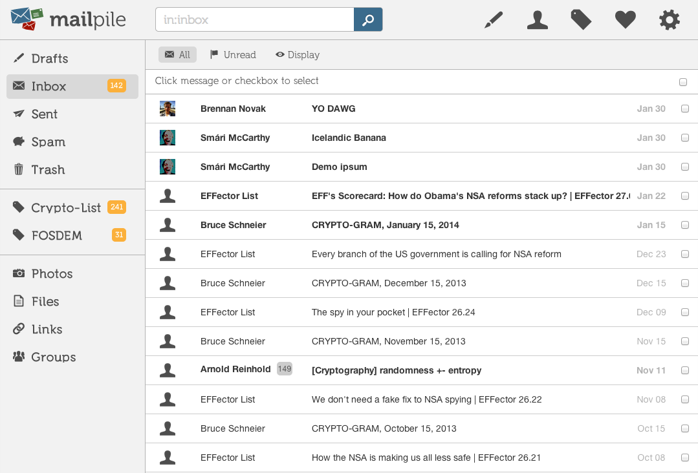

# Collaboration tools

*Slack, Jira, Confluence, Git. The tools aren't the skill — writing so that a stranger can act without asking you a question is the skill, and it's the one that gets testers promoted.*

> Two bug reports. The first: *"Login is broken, please fix."* The second: *"POST /api/login
> returns 200 but `Set-Cookie` omits `SameSite`; Safari 17 drops the cookie, so the next
> request is unauthenticated. Repro in 3 steps below. Chromium unaffected."* The first one
> generates four Slack messages, a meeting, and two days of delay. The second is fixed before
> lunch by someone who never spoke to you. **A collaboration tool is not a place to have a
> conversation. It is a place to make conversations unnecessary.**

> **In real life**
>
> Writing in a shared tool is **leaving a note for someone who will read it at 3am, alone, in
> a language they're tired in, with no way to ask you anything.** That person might be a
> colleague in another timezone. It might be a new hire in eight months. It is very often
> *you*, having forgotten everything. Every question your note fails to answer becomes a
> message, and every message costs someone their concentration — the most expensive resource
> in software, and the only one nobody budgets for.

## The four tools, and what each one is actually for

People misuse these constantly, and the misuse is always the same shape: putting durable
information in an ephemeral place.

| Tool | Is for | Not for |
|---|---|---|
| **Slack / Teams** | Ephemeral coordination. "Deploying now." | Decisions. Anything you'll need in six months. |
| **Jira / Linear** | One unit of work, its state, its evidence | Discussion that should be a document |
| **Confluence / Notion** | Durable knowledge. How the system works. | Anything with a state that changes |
| **Git** | The truth about the code, and *why* | — |

The failure mode is one sentence: **a decision made in Slack does not exist.** It scrolls
away, it isn't searchable in practice, nobody joining the team will ever find it, and in
four months two people will remember it differently and both will be sincere. If you decide
something in a chat, the decision isn't done until it's written somewhere that doesn't
scroll.


*Mailpile inbox — Wikimedia Commons, CC BY-SA 3.0. [Source](https://commons.wikimedia.org/wiki/File:Mailpile-inbox.png)*
- **The title is the whole ticket, for most readers** — Most people will only ever read the title — in a list, in a standup, in a release note. 'Bug in checkout' tells them nothing and forces a click. 'Checkout: POST /api/charge fires twice on one click, double-charging' tells them severity, area and cause before they open it.
- **Evidence beats adjectives** — 'Sometimes slow' is an adjective. '4.2s to first byte on /api/cart, p95, screenshot + HAR attached' is evidence. Adjectives start arguments about severity; numbers end them. Attach the HAR, the screenshot, the exact curl.
- **The thread is where decisions go to die** — A 40-message thread that reaches a conclusion has produced knowledge that will be lost within a week. Someone must write the conclusion where it persists — the ticket, the doc, the ADR — and link back. If nobody does, the thread was a meeting nobody scheduled.
- **@here costs a room its concentration** — Every broadcast interrupts everyone. A developer pulled out of deep work loses far more than the seconds it took to read you. Ask the one person who can answer, and ask them a question that contains everything they need.
- **Write for the stranger at 3am** — Your reader is tired, in another timezone, has no context, and cannot ask you anything. That reader is also you, in six months, having forgotten everything. Write so they never need to reach you — that is the entire discipline, and it is what seniority looks like in writing.

**The same bug, filed two ways — press Play**

1. **Version A: 'Login is broken, please fix.'** — It's filed at 5pm. Priority unset, no environment, no steps, no evidence. It is a request for a conversation disguised as a ticket, and the conversation cannot start until someone is awake.
2. **The cost begins immediately** — The developer reads it next morning: 'broken how?' Slack. You're asleep now — different timezone. He picks up something else. Your bug waits, not because it's unimportant, but because it isn't actionable and he cannot make it so alone.
3. **Day two: the meeting** — Fifteen minutes, four people, to establish what could have been three lines of text. Sixty minutes of human attention spent transferring information that already existed inside one person's head at the moment they filed the ticket.
4. **Version B: the same bug, written once, properly** — 'Safari 17: POST /api/login returns 200, Set-Cookie lacks SameSite, cookie dropped, next request 401. Chromium unaffected. Repro: 1) Safari private window 2) log in 3) refresh. HAR attached. Suspect commit a3f91c.'
5. **It's fixed before you wake up** — The developer never messaged you. Not because they're antisocial, but because you had already answered every question they were going to ask. That is what a good ticket IS: a pre-emptive answer to a conversation, written by the only person who could have written it.

*Try it — score a bug report before you file it*

```python
CHECKS = [
    ("title names the symptom AND the area",  "someone can triage it from a list, without clicking"),
    ("exact steps to reproduce",              "the reader can see it themselves, alone"),
    ("expected vs actual",                    "otherwise 'is that not just how it works?'"),
    ("environment (browser, OS, version)",    "half of all bugs are one browser"),
    ("evidence (screenshot / HAR / curl)",    "adjectives argue, evidence ends it"),
    ("severity with a reason",                "'high' means nothing; 'blocks checkout' means everything"),
    ("what you already ruled out",            "stops them repeating your work"),
]

report_a = {c[0]: False for c in CHECKS}
report_a["title names the symptom AND the area"] = False

report_b = {c[0]: True for c in CHECKS}

def score(name, r):
    have = sum(r.values())
    print(f"\\n{name}: {have}/{len(CHECKS)}")
    for check, why in CHECKS:
        if not r[check]:
            print(f"   MISSING: {check}")
            print(f"            -> {why}")
    # each missing item is, empirically, at least one round-trip message
    missing = len(CHECKS) - have
    return missing

a = score("'Login is broken, please fix'", report_a)
b = score("The written-once report", report_b)

print()
print(f"Report A: {a} unanswered questions -> ~{a} messages -> across timezones,")
print(f"          that is {a} DAYS of latency before work can start.")
print(f"Report B: {b} unanswered questions -> fixed without anyone messaging you.")
print()
print("The information was identical. One person spent 6 extra minutes writing.")
print("The other spent 2 days of someone else's calendar not writing it.")
```

## Git is a collaboration tool, and the commit message is the point

Nobody thinks of Git this way, which is why commit messages are so bad. But the diff already
tells the reader *what* changed — it's right there. The one thing a diff can never say is
**why**, and "why" is the only thing anyone will need in two years when they're deciding
whether it's safe to delete your code.

```
bad:   "fix bug"
bad:   "update UserService.java"     <- the diff already said this
good:  "auth: send SameSite=Lax on the session cookie

        Safari 17 drops cookies with no SameSite attribute, so the
        session was lost on the request after login. Chromium defaults
        to Lax and masked this for eight months."
```

The second one is a note to a stranger at 3am. It is also, verbatim, most of a bug report.

> **Tip**
>
> Before you post any question in a chat, write it out — then reread it and ask: **could
> someone answer this without asking me anything?** Usually you'll find you left out the error
> message, or which environment, or what you already tried. Fixing that takes thirty seconds
> and often answers your own question before you press send. This single habit is most of what
> people mean when they call someone "good to work with."

asynchronous communication

### Your first time: Your mission: write one report nobody has to reply to

- [ ] Find a real bug, anywhere — Your own product, or a site you use. Something reproducible. You'll need to have actually seen it, not imagined it.
- [ ] Write the title so it survives a list — Symptom AND area. Someone in standup must triage it without clicking. 'Checkout: Add to cart silently fails on Safari' — not 'cart bug'.
- [ ] Write steps a stranger can follow — Number them. Include the starting state. Then hand it to someone who has never seen the bug and watch them fail — that's where your steps are ambiguous.
- [ ] Attach evidence, not adjectives — Screenshot, HAR file, the exact curl. 'Slow' is an argument; '4.2s TTFB, p95' is a fact. Facts don't get triaged down.
- [ ] Reread it as the 3am stranger — Every question you can still ask, answer it now. When you can't find another question, file it. Count the follow-up messages you receive — the target is zero.

A report that needs no follow-up is the single most visible signal of seniority a tester produces, and it takes six extra minutes.

- **We decided this in Slack and now nobody can find it.**
  A decision made in chat does not exist. Chat is ephemeral by design — it scrolls, its search is poor in practice, and no new joiner will ever encounter it. The decision isn't done until it's written where it persists: the ticket, the doc, or an ADR in the repo. Then link the thread to it, not the other way around. Do this at the moment of deciding; nobody ever comes back and does it later.
- **My bug got closed as 'cannot reproduce' and I know it's real.**
  Your steps assumed something you had and they didn't: a logged-in state, a specific browser, a long name in a fixture, a particular viewport width, a zoom level. Add every environment variable you can name, then attach a HAR or a video. Better still, reproduce it with a `curl` — that removes the browser from the argument entirely, and nobody can close a curl command as unreproducible.
- **I ask a question in Slack and wait a day for an answer.**
  Look at the shape of your question. If the answer requires them to ask you something first — 'which environment?', 'what was the error?' — you've spent a round trip before any thinking happened. Across timezones, a round trip is a day. Front-load everything: what you did, what you expected, what happened, the exact error, what you already ruled out.
- **The ticket has 40 comments and I can't tell what was decided.**
  It became a chat. The fix is a discipline, not a tool: whoever reaches the conclusion edits it into the description, at the top, dated. The comments become the audit trail; the description becomes the truth. Without this, the ticket is a transcript of a meeting nobody attended and everyone must now read.
- **@here for something only one person can answer.**
  You interrupted everyone to reach one of them. Deep work is expensive to re-enter, and you've charged a whole room for it. Ask the person. If you don't know who — ask in the channel *without* the @here, and phrase the question so that the right person self-selects because you gave them enough to recognise it as theirs.

### Where to check

Before you press send, on anything:

- **The title** — can someone triage this from a list, without opening it?
- **The unanswered-question test** — reread as a stranger. Every question you can still ask is a round trip you have just bought.
- **Evidence attached?** — screenshot, HAR, curl, exact error text. Not adjectives.
- **Is this durable or ephemeral?** — if you'll want it in six months, it does not go in chat.
- **The commit message** — the diff says *what*. Did you say *why*?
- **`@here`** — do you need everyone, or one person whose name you haven't looked up?

Tester's habit: **write for the person who cannot reach you.** Not out of politeness — for
throughput. Every question your writing fails to answer costs someone else a context switch,
and across a timezone it costs a day. Six minutes of your writing is the cheapest thing in
the entire system.

### Worked example: how a tester got promoted for writing things down

1. **She was not the best bug-finder on the team.** She said so herself. Two colleagues found more, and found harder ones.
2. **What she did differently:** every bug she filed contained the exact steps, the environment, a screenshot, the network evidence, and one line saying what she had already ruled out.
3. **The measurable effect nobody was measuring.** Her tickets were fixed, on average, in under a day. Her colleagues' averaged four — not because their bugs were harder, but because each one began with a developer asking a question, and waiting.
4. **She noticed a pattern in the questions** she *did* get, and started answering them pre-emptively. Within two months she was getting almost none.
5. **Then she went after the durable stuff.** Every decision reached in Slack, she wrote into the ticket or the wiki, with a link and a date. Nobody asked her to. It took perhaps ten minutes a day.
6. **Six months later** a new engineer joined and shipped meaningfully in his first week — because everything he needed was written down, in the places you'd look for it. He said so, publicly, in his first retro.
7. **What her manager saw**, without ever articulating it: her work compounded. Her colleagues' work was excellent and evaporated. Hers stayed, and made other people faster while she was asleep.
8. **She was promoted.** In the discussion, nobody said "she writes clearly." They said "things go faster when she's involved," and "we can find things now," and "onboarding got easier." Those are all the same sentence.
9. **The uncomfortable, useful truth.** Technical skill is table stakes and it is visible. Writing is invisible, feels like overhead in the moment, is the first thing dropped under pressure, and it is what turns individual competence into a team that gets faster. The tools in this note are trivial. The habit is not, and it is the one that gets you paid.

> **Common mistake**
>
> Treating writing as overhead — the tax you pay after the real work of finding the bug. It is
> the opposite. Finding a bug that nobody can act on has produced nothing; the value was never
> in the finding, it was in the *transfer*, and the transfer is the writing. A tester who finds
> ten bugs and files them badly has generated ten conversations and, several days later, some
> fixes. A tester who finds five and writes them precisely has generated five fixes and no
> conversations. The second one is more valuable, is trusted more, and — this is the part that
> stings — will be told they have "great instincts," when what they actually have is the
> discipline to spend six more minutes at the keyboard when they'd rather move on.

**Quiz.** Your team reaches an important architectural decision in a Slack thread. Everyone agrees. What still needs to happen?

- [ ] Nothing — everyone agreed and it's searchable
- [ ] Pin the message so people can find it
- [x] Write the decision somewhere durable — the ticket, the wiki, or an ADR in the repo — and link the thread to it. Chat is ephemeral by design: it scrolls, its search fails in practice, and nobody joining in six months will ever encounter it. An unwritten decision does not exist.
- [ ] Schedule a meeting to confirm it

*This is the single most common and most expensive collaboration failure in software, and it looks exactly like success at the time — everyone agreed, so the work feels finished. Four months later two people remember it differently, both sincerely, and neither can produce evidence. Pinning (option 2) helps the six people already in the channel and nobody else; a new joiner does not read pinned messages in a channel they have not thought to open. The decision must live where someone would *look* for it, and the thread links to that — never the reverse.*

- **The rule that governs all four tools** — Never put durable information in an ephemeral place. A decision made in Slack does not exist until it's written where it doesn't scroll.
- **The unanswered-question test** — Reread your message as a stranger. Every question you can still ask is one round trip — across timezones, one day of latency.
- **What a bug title is for** — Triage from a list, without clicking. Symptom AND area. Most readers will never open the ticket.
- **Evidence vs adjectives** — 'Slow' starts an argument about severity. '4.2s TTFB, p95, HAR attached' ends it. Attach the curl, the HAR, the exact error text.
- **What a commit message is for** — The diff already says *what* changed. Only you can say *why* — which is the only thing anyone needs in two years.
- **The cost of `@here`** — You interrupt a whole room to reach one person. Deep work is expensive to re-enter; you charged everyone for it.
- **The 40-comment ticket** — It became a chat. Whoever reaches the conclusion edits it into the description, at the top, dated. Comments are the audit trail, not the truth.
- **Why writing gets you promoted** — Your work compounds while you sleep and makes others faster. Nobody says 'she writes well' — they say 'things go faster when she's involved'.

### Challenge

Take the last bug you filed, or the last question you asked in a chat. Reread it as a
stranger at 3am with no context and no way to reach you. Write down every question you can
still ask of it. Now rewrite it so that list is empty, and time how long the rewrite took —
it will be about six minutes. Then count how many messages the original actually generated.
That ratio is the whole argument, and you'll never need to be told this again.

### Ask the community

> Draft check: here's a bug report I'm about to file — [paste it]. What questions can you still ask me after reading it? I'm trying to get that list to zero before I file.

This is the single best use of a community for a junior tester, and almost nobody does it.
Strangers make excellent stand-ins for the 3am reader, because they genuinely have none of
your context and no way to guess at it. Every question they ask is one your developer would
have asked tomorrow — except this way it costs you nothing but a rewrite.

- [Joel Spolsky — painless bug tracking (still the clearest thing written on it)](https://www.joelonsoftware.com/2000/11/08/painless-bug-tracking/)
- [Architecture Decision Records — where decisions go so they survive](https://adr.github.io/)
- [How to write a Git commit message](https://cbea.ms/git-commit/)
- [GitLab — asynchronous communication, from a fully remote company](https://about.gitlab.com/company/culture/all-remote/asynchronous/)

🎬 [Writing bug reports that get fixed](https://www.youtube.com/watch?v=vtIzMaLkCaM) (10 min)

- Never put durable information in an ephemeral place. A decision made in Slack does not exist until it's written where it doesn't scroll.
- Write for the stranger at 3am who cannot reach you. Every question your writing fails to answer costs a round trip — across timezones, a day.
- Evidence, not adjectives. 'Slow' starts an argument; a HAR file and a p95 number end it.
- Git is a collaboration tool. The diff says what changed; only the commit message can say why, and that's the part someone needs in two years.
- Writing feels like overhead and is the whole job. Finding a bug nobody can act on has produced nothing — the value is in the transfer.


---
_Source: `packages/curriculum/content/notes/digital-literacy-and-safety/everyday-tools/collaboration-tools.mdx`_
