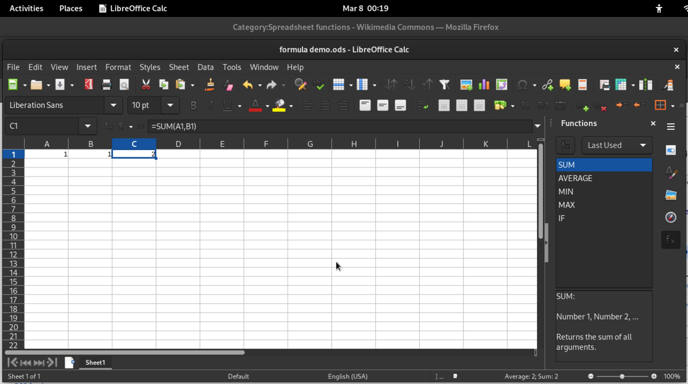

# Documents

*A document is a file format wearing a page. Knowing which format you're in — and who can see the tracked changes you forgot to accept — is a professional survival skill.*

> In 2003 the UK government published a dossier about Iraq's weapons capability. Someone
> examined the Word file's revision log — metadata the document carried invisibly — and
> recovered the names of the four officials who had edited it, along with the fact that whole
> passages had been copied from a graduate student's thesis. **Nobody leaked anything. The
> document told on itself.** Every file you send carries more than the words you can see, and
> "Save As PDF" is not a way of removing it.

> **In real life**
>
> A document is a **shipping container, not a page.** You look at the page because that's what
> the lid shows you. Inside, packed around your words, are the previous drafts, the comments
> you resolved, the name of every machine that touched it, the deleted paragraph where you
> called the client difficult, and a hidden column of data you thought you'd removed. Sending a
> document is sending the whole container. Most people believe they are sending a photograph of
> the lid.

## Formats, and what each one actually is

Testers meet documents constantly — specs, test plans, evidence, reports — and the format
choice quietly decides what's possible:

| Format | Really is | Good for | Trap |
|---|---|---|---|
| `.docx` | A **zip file** of XML | Editing, tracked changes | Carries revision history, author names, comments |
| `.pdf` | A description of a *fixed page* | Final, unchangeable output | Text can still be extracted; "flattened" ≠ redacted |
| `.md` | Plain text with light markup | Anything version-controlled | No layout control at all |
| `.txt` | Bytes | Logs, evidence, forever | No structure, no encoding guarantees |
| Google Doc | A **database**, not a file | Real-time collaboration | Version history is permanent and visible |

Rename a `.docx` to `.zip` and open it. It's a folder of XML files. That is not a metaphor —
that is literally what a Word document is, and it's why it can carry so much you never see.


*LibreOffice Calc — Wikimedia Commons, CC0. [Source](https://commons.wikimedia.org/wiki/File:SUM_formula_in_LibreOffice_Calc.png)*
- **The toolbar lies about what a document is** — It shows fonts and margins, so you think in pages. The file thinks in markup, metadata, and revision history. Almost every embarrassing document leak comes from believing the toolbar's version of reality.
- **Tracked changes and comments travel with the file** — You resolved them. They're still in the container — resolving hides a comment from the view, it does not remove it from the file. Before sending anything outside your organisation: Inspect Document, and remove document properties and personal information. Every office suite has this and almost nobody runs it.
- **Hidden rows, hidden columns, white text** — Hiding is a display setting. The data is right there in the XML for anyone who unzips it or clicks 'unhide'. This is how salary tables and unredacted client lists get published — the sender genuinely believed the data was gone because they could no longer see it.
- **'Save As PDF' is not redaction** — Drawing a black rectangle over text in a PDF puts a black rectangle ON TOP of the text. Select it, copy it, paste it — there it is. Real redaction deletes the underlying characters. Courts and newspapers have published secrets this way, repeatedly, for twenty years.
- **Version history is the real audit trail** — In Google Docs it's permanent and visible to every editor: who wrote what, and when they deleted it. This is a feature, and it is also a reason to think before you type something spicy into a shared doc at 6pm on a Friday.

**The test plan that told on its author — press Play**

1. **You write a test plan in Word** — Along the way you leave a comment: 'the auth module is a disaster, whoever wrote this should not be near production.' You resolve it later. It disappears from the margin. You feel it is gone, because it is no longer visible, and visible is the only sense you have.
2. **You paste in a table from an old client's report** — It carries their formatting, their document's styles, and — in the XML — traces of its origin. You delete the rows you don't need. Deleted rows in a pasted object are not always deleted from the file.
3. **You hide two columns of internal cost data** — Right-click, Hide. They vanish from the page. They remain in the file, complete, and one right-click from anyone who receives it. Hiding is a view setting, not a delete.
4. **You 'Save As PDF' and email it to the client** — You believe this flattens everything. It does not. PDF preserves text layers, and many exporters carry document properties — author, company, the machine's user account — straight across.
5. **The client's procurement team opens the properties** — Author: your name. Company: yours. They copy the black-boxed figure straight out of the PDF. Nobody hacked anything. The document was, the entire time, exactly what it always was: a container, honestly reporting its contents.

*Try it — what's actually inside a .docx*

```python
# A .docx is a ZIP archive. Not "like" one. It IS one.
docx_contents = [
    "[Content_Types].xml",
    "_rels/.rels",
    "word/document.xml",           # <- the words you can see
    "word/comments.xml",           # <- every comment, incl. 'resolved' ones
    "word/people.xml",             # <- names of everyone who commented
    "docProps/core.xml",           # <- author, last modified by, company
    "docProps/app.xml",            # <- total editing time, template used
    "word/settings.xml",           # <- rsid revision-save identifiers
    "word/media/image1.png",       # <- images at FULL original resolution
]

visible = {"word/document.xml"}

print("What the reader thinks they received:")
for f in docx_contents:
    if f in visible: print(f"    {f}")

print("\\nWhat they actually received:")
for f in docx_contents:
    tag = "" if f in visible else "   <-- invisible in the page view"
    print(f"    {f}{tag}")

print()
print("Try it for real:  cp report.docx report.zip && unzip report.zip")
print()
hidden = len(docx_contents) - len(visible)
print(f"{hidden} of {len(docx_contents)} files carry things you never chose to send.")
print("'Cropping' an image in Word usually just hides the edges: word/media/")
print("still holds the ORIGINAL. People have leaked what was outside the crop.")
```

## The tester's document discipline

Three habits, and they take about ten seconds each:

1. **Before sending outside the team:** run *Inspect Document* (Word) or *Check Accessibility & Document Properties*. Remove personal info, comments, revision history. Every office suite has this, buried, and it exists precisely because this is a known, recurring, expensive failure.
2. **For evidence, prefer plain formats.** A `.txt` or `.md` log has no metadata to leak, no version to break, and will open in forty years. Your PDF viewer might not.
3. **For anything version-controlled, write Markdown.** Test plans in `.docx` cannot be diffed, cannot be reviewed in a pull request, and their "track changes" is a worse version of what `git` gives you for free.

> **Tip**
>
> Rename any `.docx` to `.zip` and open it, right now, on a document you wrote. Look in
> `docProps/core.xml` and `word/comments.xml`. It takes fifteen seconds and it will
> permanently change how you feel about attaching Word documents to emails — not because
> anything is broken, but because you will finally have seen what you have been sending
> all along.

metadata

### Your first time: Your mission: open a document and look inside it

- [ ] Take a .docx you wrote — Any one. Copy it, so you can't damage the original: `cp report.docx report-copy.zip`.
- [ ] Unzip it and read the folder — `unzip report-copy.zip -d peek && ls -R peek`. You are now looking at what a Word document has always been: a folder of XML.
- [ ] Open `docProps/core.xml` — Your name. Your company. The machine account. When it was created and by whom, and how long you spent on it.
- [ ] Open `word/comments.xml` — Every comment, including the ones you resolved. Resolving hides them from the view; it does not remove them from the file.
- [ ] Crop an image, save, and look in `word/media/` — The original, uncropped image is still there in most cases. People have leaked what was outside the crop. Now you know why.

You have just seen the difference between the page and the file, and you will never confuse them again.

- **The formatting explodes when someone else opens my document.**
  Fonts and layout engines differ between machines and versions. Word on Windows and Word on Mac do not paginate identically, and a font you have and they don't will be silently substituted, reflowing everything. If layout must be exact, send a PDF. If content matters more than layout, send Markdown — and stop pretending a `.docx` is a fixed page, because it never was.
- **I redacted a PDF but people can still read the text.**
  You drew a black rectangle over it. The characters are still in the text layer, one Ctrl+A and Ctrl+C away. Real redaction removes the underlying content — use a tool with an actual Redact function, then verify by selecting all and pasting into a plain text editor. Newspapers, law firms and governments have published secrets this way for two decades. Verify, every time; the check takes ten seconds.
- **I hid the columns with the internal pricing before sending it.**
  Hiding is a view setting. The data is fully present, one right-click from anyone. The same is true for white text on a white background, rows filtered out of view, and cells behind an image. If data must not be sent, **delete it and save a copy** — never hide it. Then reopen the copy and confirm.
- **Two people edited the doc and one person's changes vanished.**
  Two people were editing a *file*, not a document — each had their own copy, and the last save won. This is exactly the problem Google Docs and Office 365 co-editing solve, by making the document a database on a server rather than a file on a disk. If you're emailing `plan-v2-final-FINAL-jm.docx` around, you have chosen the failure mode.

### Where to check

Before any document leaves your organisation:

- **File → Info → Inspect Document** (Word) — removes personal info, comments, revision history. Buried on purpose? No. Just buried.
- **Document properties** — author, company, last modified by. Check what they say.
- **Unzip the `.docx`** — the definitive answer. `docProps/core.xml` and `word/comments.xml`.
- **In a PDF: Ctrl+A, Ctrl+C, paste into a text editor** — the ten-second redaction check. If you can paste the secret, so can they.
- **Unhide everything** before you send: rows, columns, sheets, filtered views.

Tester's habit: **treat every document you send as a file, not a page.** You would never ship
a build without checking what's in the bundle. A `.docx` is a bundle, it is going to someone
outside your company, and unlike a build, nobody reviews it.

### Worked example: the QA report that priced the contract

1. **The situation:** a QA consultancy sends a client a defect report as a PDF. Professional, branded, thorough. It wins them nothing, and they never learn why.
2. **What happened at the client's end:** procurement opened the PDF's document properties. Author: `j.smith`. Company: the consultancy. Title, still unchanged from the template: `internal-margin-model-v4`.
3. **The template had been reused.** Someone had built the report from an old internal costing spreadsheet's exported cover page, changed the visible text, and saved as PDF.
4. **The client selected the report's summary table and pasted it into a text editor.** Underneath a white-filled cell — invisible on screen, present in the text layer — was a leftover row: `blended day rate (internal): £310 · quoted: £780`.
5. **Nothing was hacked.** The consultancy's own tools reported their own contents, accurately, to anyone who asked. The PDF was doing precisely what a PDF does.
6. **What would have caught it, in ten seconds:** open the finished PDF, Ctrl+A, Ctrl+C, paste into a plain text editor, and *read what comes out*. That is the entire check. It reveals white text, covered text, and anything behind an image, because it reads the text layer rather than the picture.
7. **What would have prevented it entirely:** never build an external document from an internal one. Start from an empty file. Copying formatting is not worth carrying an unknown container's contents into a client's hands.
8. **The QA lesson, and it's exact.** This is the same discipline as manifest secrecy in a build: *the thing you ship contains more than the thing you see*. You already grep your bundles for internal strings. The report you email is a bundle too, and nobody is grepping it.

> **Common mistake**
>
> Believing that "Save As PDF" flattens a document. It converts the page description; it does
> not necessarily strip metadata, and it certainly does not remove text hidden under
> rectangles, behind images, or coloured white. PDF was designed to preserve a text layer —
> that's how search and screen readers work, and it's a feature you actually want. The mistake
> is treating a *preservation* format as a *destruction* format. If you need something gone,
> delete it in the source, save a fresh copy, and then verify by selecting all and pasting into
> a plain text editor. The check costs ten seconds. Not doing it has cost people contracts,
> court cases, and jobs.

**Quiz.** You draw a black rectangle over sensitive text in a PDF and send it. What has the recipient received?

- [ ] A properly redacted document
- [ ] A document with the text removed and replaced by a black box
- [x] A document containing the original text, with a black rectangle drawn on top of it. Selecting all and copying retrieves the text — PDF preserves a text layer by design. Real redaction deletes the underlying characters.
- [ ] It depends on the PDF reader

*PDF preserves a text layer on purpose — that's how search, copy-paste and screen readers work, and you want that. The rectangle is a drawing object placed above it, like a sticky note on a page: it hides the text from your eye and from nothing else. Ctrl+A, Ctrl+C, paste into a plain text editor and the secret comes straight out. This exact mistake has published military documents, court filings and settlement figures, repeatedly, for over twenty years. The ten-second verification is: paste it somewhere plain and read what you get.*

- **What a .docx actually is** — A ZIP archive of XML. Rename it to .zip and unzip it. `word/comments.xml`, `docProps/core.xml`, and full-resolution originals of 'cropped' images.
- **Resolved comments** — Hidden from the view, still in the file. Resolving is not deleting. Run Inspect Document before sending externally.
- **Hiding rows/columns** — A view setting. The data is fully present and one right-click away. To remove data: delete it, save a copy, reopen and verify.
- **Why 'Save As PDF' isn't redaction** — PDF preserves a text layer by design. A black rectangle sits on top. Ctrl+A, Ctrl+C, paste into a plain text editor — that's the check.
- **The ten-second redaction verification** — Open the final PDF, select all, copy, paste into a plain text editor, read it. Catches white text, covered text, and text behind images.
- **Metadata** — Author, company, machine account, editing time, template name, every comment, tracked changes, uncropped images. Not hidden maliciously — it makes the software work.
- **Format for evidence** — Plain text or Markdown. No metadata to leak, diffable, reviewable in a PR, and still openable in forty years.
- **`plan-v2-final-FINAL-jm.docx`** — The symptom of emailing files instead of collaborating on a document. Last save wins; someone's work vanishes.

### Challenge

Take a `.docx` you wrote, copy it to `.zip`, unzip it, and read `docProps/core.xml` and
`word/comments.xml`. Then take any PDF you've produced, select all, copy, and paste it into a
plain text editor — read what comes out and compare it to what you thought you'd sent. Do
both before you next attach a document to an email. Fifteen seconds each, and one of them
will eventually save you from a conversation you very much do not want to have.

### Ask the community

> Document question: sending [format] to [internal/external]. It contains [tracked changes / comments / hidden rows / redactions]. I ran: [Inspect Document / unzipped it / select-all-copy check]. What came out: [paste]. Recipient can/cannot see [thing].

Say which check you actually ran, not which you intended to. 'I saved it as PDF' is the
answer that precedes almost every one of these incidents, and someone will tell you — kindly,
and before your client does — that it isn't a check at all.

- [Microsoft — Inspect Document: removing hidden data and personal information](https://support.microsoft.com/en-us/office/remove-hidden-data-and-personal-information-by-inspecting-documents-presentations-or-workbooks-356b7b5d-77af-44fe-a07f-9aa4d085966f)
- [NSA — hidden data and metadata in documents (the definitive, alarming reference)](https://www.nsa.gov/portals/75/documents/what-we-do/cybersecurity/professional-resources/ctr-hidden-data-in-word-and-pdf.pdf)
- [The 'Dodgy Dossier' — when a Word file's revision log made the news](https://en.wikipedia.org/wiki/Dodgy_Dossier)

🎬 [What's really inside a Word document](https://www.youtube.com/watch?v=DBXfL6JLbBs) (9 min)

- A `.docx` is a ZIP of XML. It carries author names, resolved comments, revision history and the uncropped originals of your images.
- Hiding rows, whitening text, and drawing black rectangles are all *view* changes. The data is still in the file and one keystroke from the reader.
- 'Save As PDF' preserves a text layer — that's a feature. It is a preservation format, never a destruction format.
- The ten-second check before anything leaves the building: open the final file, select all, copy, paste into a plain text editor, and read what you actually sent.
- Same discipline as a build manifest: the thing you ship contains more than the thing you see. You grep your bundles. Nobody greps the report you email.


---
_Source: `packages/curriculum/content/notes/digital-literacy-and-safety/everyday-tools/documents.mdx`_
