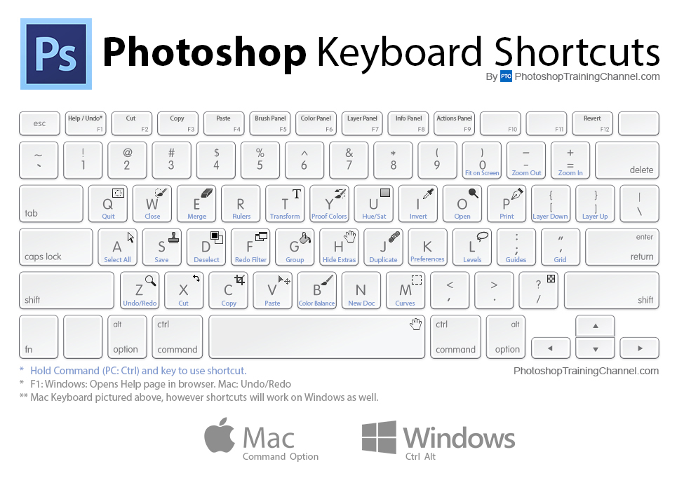

# Efficiency tips

*Real efficiency isn't doing things faster. It's noticing what you do forty times a day, and refusing to do it by hand the forty-first.*

> There is a famous cartoon: a person pushing a cart with square wheels, waving away someone
> offering round ones. *"No thanks, too busy."* It is funny for about a second and then it
> stops being funny, because you are that person, and the square wheel is the thing you have
> retyped every morning for eight months. **The tragedy isn't that you don't know a better
> way. It's that being busy is exactly the state in which you cannot notice you need one.**

> **In real life**
>
> Efficiency advice usually sounds like **"run faster."** But the person who arrives first
> rarely ran faster — they noticed the road bent, and cut the corner while everyone else
> followed the tarmac. Speed is what you optimise when you have run out of ideas about the
> route. And most of the time, in most jobs, the route is stupid and nobody has looked at it
> in years because everyone is busy running.

## The three questions that generate every real efficiency win

Forget productivity systems. There are three questions, and they're in priority order:

**1. Can I not do this at all?**
The fastest task is the one that shouldn't exist. That daily report nobody reads. The
screenshot you paste into a ticket that already has a video. Ask who consumes the output —
sometimes the honest answer is nobody, and has been for a year.

**2. Can a machine do this?**
If you do it more than about ten times and it has no judgment in it, it's a script.
Not a *good* script. A four-line one, in whatever language is nearest.

**3. Can I do it in fewer motions?**
Only now do shortcuts, snippets and templates matter. This is the *last* question, and the
productivity industry sells it as the first, because the first two don't need anything sold.

Most people skip straight to three, optimising the execution of a task that shouldn't exist.


*Keyboard shortcuts — Wikimedia Commons, CC BY-SA 4.0. [Source](https://commons.wikimedia.org/wiki/File:Keyboard-shortcuts-photoshop.jpg)*
- **The repetition you've stopped noticing** — The test that flags real waste isn't 'is this slow?' — it's 'have I done this exact sequence before?' Repetition becomes invisible fast. If you can perform it while thinking about lunch, it's a candidate for a script, and you'll never notice it unprompted.
- **Ten times is the threshold** — Under ten repetitions, automating usually costs more than it saves — and that's a real answer, not a cop-out. Over ten, and especially if it recurs weekly, the script pays for itself and keeps paying while you sleep. Count before you build.
- **Judgment cannot be scripted (and shouldn't be)** — 'Does this look right?' is judgment. 'Copy the order id from column B into the search box' is not. Automate the second and protect your attention for the first — that's the entire point of the exercise, not the minutes saved.
- **Templates: the cheapest automation there is** — A bug report template is a script written in prose. It takes ten minutes to write once, ends the argument about what a report should contain, and quietly raises the quality of every report anyone on the team writes afterwards.
- **The 'I'll remember' trap** — You will not remember. The command you worked out at 2am, the exact curl that reproduced the bug, the sequence that cleared the cache. Write them into a scratch file with a comment. Future you is a stranger who will be very grateful and slightly annoyed.

**Forty minutes a day, for eight months — press Play**

1. **Monday: the manual chore** — Every morning, a tester exports a CSV from the admin panel, opens it, filters for failed orders, copies the ids into a text file, and pastes them into a Slack channel. Twelve minutes. It's simple, so it never feels worth fixing.
2. **The trap: it's too small to complain about** — Twelve minutes is beneath the threshold at which anyone escalates. It never appears in a retro. It never blocks a release. It is invisible precisely because it is small, and it is now load-bearing infrastructure held together by one person's morning.
3. **Eight months later, add it up** — 12 minutes × ~170 working days = about 34 hours. Four full working days, spent moving text from one window to another, by someone hired to think about how software fails.
4. **The script that replaces it** — The admin panel's CSV comes from an API. Twenty lines of Python: fetch, filter, post to a Slack webhook. Two hours to write, including the hour spent finding the endpoint in the Network tab — a skill from Module 3, used here.
5. **The payoff nobody predicted** — The two hours pay for themselves in ten days. But the real win is that the script runs at 6am, so failed orders are in Slack before anyone arrives, and it never forgets on a Friday. The chore didn't get faster. It stopped existing, and got better at the same time.

*Try it — should you automate this, honestly?*

```python
def should_automate(minutes_each, times_per_week, hours_to_build, weeks=52):
    saved_per_year = minutes_each * times_per_week * weeks / 60
    cost = hours_to_build
    if saved_per_year <= cost:
        return f"NO -- saves {saved_per_year:.0f}h/yr, costs {cost}h. Do it by hand."
    payback_weeks = cost / (minutes_each * times_per_week / 60)
    return f"YES -- saves {saved_per_year:.0f}h/yr, pays back in {payback_weeks:.0f} weeks"

tasks = [
    # task,                         mins, per week, hours to build
    ("Daily failed-order report",     12,  5,  2),
    ("Rename 3 files before a demo",   2,  1,  3),
    ("Reset test DB before each run",  4, 20,  1),
    ("Write the quarterly summary",   90,  0.08, 6),   # once a quarter
    ("Copy 200 ids into a form",      45,  0.25, 4),   # monthly
]

for name, m, f, h in tasks:
    print(f"{name:34} {should_automate(m, f, h)}")

print()
print("Note the second one: 3 hours to save 1.7h/yr. The correct answer is NO,")
print("and engineers get this wrong constantly -- automating is more FUN than")
print("renaming three files, so we build the tool and call it efficiency.")
print()
print("And the honest caveat the arithmetic hides: a script must be MAINTAINED.")
print("Add ~20% of build cost per year. Anything with a payback longer than")
print("about a year is a hobby project wearing a business case.")
```

## The tester's specific efficiency wins

Generic advice is generic. These are the ones that pay in this job:

- **A bug report template.** Steps, expected, actual, environment, evidence. Write it once, into a snippet expander or just a pinned note. It ends the "what should I include?" question forever, and it raises everyone's floor.
- **A scratch file per investigation.** Every command, every curl, every observation, timestamped. The bug you're chasing at 4pm will need what you saw at 11am, and you will not remember it.
- **Saved DevTools snippets.** The Sources panel lets you save a JavaScript snippet and run it on any page with two keys. Your "find all divs with click handlers" one-liner shouldn't be retyped weekly.
- **A curl that reproduces the bug.** The moment you have one, the front end is out of the argument (Module 4, ch1). Save it in the ticket.
- **Text expansion for the fifteen strings you type constantly.** Your test email pattern. The staging URL. The `data-testid` you always search for.

> **Tip**
>
> Keep a file called `friction.md` and add one line to it every single time something annoys
> you — no fixing, no judgment, just the line. After two weeks, read it. The item you wrote
> down eleven times is your automation target, and you would never have identified it from
> memory, because each individual instance was too small to remember. **You cannot fix what
> you cannot see, and the whole difficulty of efficiency is that repetition makes itself
> invisible.**

toil

### Your first time: Your mission: find your square wheel

- [ ] Create `friction.md` today — Anywhere. One line every time something annoys you. Do not fix anything yet. Do not judge whether it's worth writing. Just write it.
- [ ] Two weeks of lines, no fixing — The discipline is in NOT solving them as they arrive — you'll fix the loud ones and miss the frequent ones, and frequency is what matters.
- [ ] Count the repeats — Read it. Something will appear eight or eleven times. That's your square wheel, and you'd never have named it from memory because each instance was too small to remember.
- [ ] Run the arithmetic before you build — Minutes × frequency × 52, versus hours to build, plus 20% per year to maintain. If it says no, the answer is no. Write that down too — it's a decision, not a failure.
- [ ] Automate exactly one thing — The top item. Badly. Four lines. A script that works and is ugly beats a framework that's elegant and unfinished, and you'll rewrite it anyway once you understand the problem.

You've now found a real efficiency win by measurement rather than by vibes, and rejected at least one that felt urgent and wasn't.

- **I spent three hours automating something that takes two minutes a week.**
  Almost everyone technical does this, because automating is more enjoyable than the chore. Run the arithmetic *before* you open the editor: minutes × frequency × 52 versus build hours, plus maintenance. If the numbers say do it by hand, do it by hand. Building the tool was recreation, and that's fine — just don't file it as efficiency.
- **My script broke and now nobody can do the task at all.**
  Automation replaced the knowledge, not just the labour. Anything that runs unattended needs: a comment saying what it does and why, a note of what to do when it fails, and someone other than you who has run it once. An undocumented script is a single point of failure wearing a productivity costume.
- **I'm busy all day and can't point to anything I finished.**
  Classic toil. It's manual, repetitive, automatable, and scales with the system — so it grows quietly until it consumes the day. You cannot fix it from inside the busy state, because busyness is exactly what prevents you noticing the pattern. Keep `friction.md` for two weeks; the data will show you what your memory won't.
- **I automated the wrong step and it made things slower.**
  You optimised question three (fewer motions) without asking questions one and two. Before scripting anything: does this task need to exist at all, and who reads its output? A great many automated reports are read by nobody, and automating them made a pointless task permanent and invisible.

### Where to check

Efficiency is found in records, not in introspection:

- **`friction.md`** — the only reliable instrument. Memory systematically under-reports small repeated pain.
- **Your shell history** (`history | sort | uniq -c | sort -rn | head`) — the commands you actually run, ranked. It is frequently a surprise.
- **Your browser history at 9am** — the same three tabs, every morning? That's a bookmark folder, or a script.
- **The arithmetic** — minutes × frequency × 52, versus build hours plus 20%/year maintenance. Do it before you build, not after.
- **The output's reader** — for any recurring report: who reads this? Ask them. Sometimes the honest answer ends the task entirely.

Tester's habit: **when you catch yourself doing something for the third time, stop and write
it down.** Not automate it — *write it down*. The decision to automate needs a count, and you
cannot count what you never recorded. The counting is the skill; the scripting is the easy
part.

### Worked example: the report nobody read

1. **The chore:** every Monday, a QA engineer spent ninety minutes producing a test-coverage report — exporting from three tools, merging in a spreadsheet, formatting, emailing it to a distribution list of fourteen people.
2. **Ninety minutes × 52 weeks = 78 hours a year.** Two full working weeks, and it had run for three years.
3. **He decided to automate it.** Estimated four days. This is the point at which the story usually becomes a proud blog post about the script.
4. **Instead, he asked question one first: who reads this?** He emailed the fourteen recipients and asked, plainly, what they used it for.
5. **Four replied.** Three said they didn't read it. The fourth said she read exactly one number — the percentage of critical paths covered — and only before a release, not weekly.
6. **He never wrote the script.** He replaced ninety minutes a week with a single number, posted to Slack before releases, produced by one existing query. About four minutes, six times a year.
7. **Total saving: 78 hours a year, of which the automation would have captured perhaps 70** — at a cost of four days to build and a permanent maintenance burden, to keep producing something nobody was reading.
8. **The uncomfortable arithmetic.** Had he skipped to question three and simply automated it, he would have been *celebrated*. There'd have been a script, a cron job, a demo. The waste would have become invisible, permanent, and someone else's problem to maintain in three years' time.
9. **The lesson.** Automation makes a task cheap. It also makes it *permanent*, and it hides it. Before you make something permanent, find out whether it should exist — because the most efficient version of a useless task is not a fast one. It's no task at all.

> **Common mistake**
>
> Optimising the execution of a task you never questioned. This is the entire failure mode of
> productivity culture: a beautifully automated pipeline producing a report nobody reads, a
> perfectly templated ticket for a process that shouldn't require a ticket, a shortcut for a
> menu item that shouldn't exist. It *feels* like progress because something got faster and you
> can measure it — and unlike deleting the task, it leaves an artifact you can show people.
> Ask, in order: can I not do this, can a machine do this, can I do it in fewer motions. The
> industry sells you the third. The first two are free and they're where the wins are.

**Quiz.** A weekly 90-minute report takes 78 hours a year. Automating it would take 4 days. What should you do first?

- [ ] Automate it — it pays back in under three weeks
- [x] Ask who reads the report and what they use it from. If nobody reads it, automation makes a useless task permanent, invisible, and someone's maintenance burden. The fastest version of an unnecessary task is no task.
- [ ] Do it faster manually with better spreadsheet skills
- [ ] Delegate it to a junior tester

*The arithmetic in option 1 is correct and the decision is still wrong — which is what makes this trap so effective. Automating first *feels* rigorous, pays back fast, and produces an artifact you can show people. But it locks in the task forever and hides its cost inside a cron job that someone must maintain in three years. Question one ('can I not do this at all?') costs one email and can delete the whole thing. Option 4 is the worst answer available: it preserves the waste and moves it onto someone with less power to question it.*

- **The three questions, in order** — 1. Can I not do this at all? 2. Can a machine do it? 3. Can I do it in fewer motions? Most people start at 3.
- **The automation arithmetic** — minutes × frequency × 52 vs build hours, plus ~20% of build cost per year to maintain. Run it BEFORE opening the editor.
- **Toil (SRE definition)** — Manual, repetitive, automatable, tactical, no enduring value, and it SCALES with the system. That last property is why it eats teams.
- **`friction.md`** — One line every time something annoys you, no fixing for two weeks. The item written eleven times is your target — memory would never have surfaced it.
- **Why automating first is a trap** — It makes a task cheap AND permanent AND invisible. Automate a useless report and you've built a maintenance burden to produce nothing.
- **What can never be automated** — Judgment. 'Does this look right?' Automate the copying so your attention is free for the noticing.
- **The tester's five wins** — Bug report template, per-investigation scratch file, saved DevTools snippets, a curl that reproduces the bug, text expansion.
- **The 'I'll remember' trap** — You won't. The 2am curl, the exact repro sequence. Write it into a scratch file with a comment, for the stranger who is future you.

### Challenge

Start `friction.md` today and write one line every time something irritates you for two
weeks — no fixing allowed. Then run `history | sort | uniq -c | sort -rn | head -20` and
compare: what your shell says you do, versus what you *think* you do. They will disagree.
Pick the top repeated item, run the arithmetic honestly, and either automate it in under an
hour or write down, explicitly, why you decided not to. The decision not to automate is the
one nobody records, and it's worth as much as the script.

### Ask the community

> Automation sanity check: task takes [N] minutes, [M] times per week. Estimated build time [H] hours. Who consumes the output: [names/nobody/unknown]. What breaks if it just... stops: [answer honestly]. Already tried deleting it: [y/n]

That last pair of questions is the whole review. If you can't name who reads the output, and
nothing breaks when it stops, you don't have an automation problem — you have a task that has
outlived whatever created it, and the correct script is zero lines long.

- [Google SRE — eliminating toil (the origin of the term, and still the best treatment)](https://sre.google/sre-book/eliminating-toil/)
- [xkcd 1205 — 'Is It Worth The Time?', the automation arithmetic as a table](https://xkcd.com/1205/)
- [xkcd 1319 — 'Automation', the honest counterpoint](https://xkcd.com/1319/)

🎬 [When to automate, and when automating is procrastination](https://www.youtube.com/watch?v=OeoLm4qWx3s) (10 min)

- Ask in order: can I not do this at all, can a machine do it, can I do it in fewer motions. The industry sells the third; the wins are in the first two.
- Run the arithmetic before you build: minutes × frequency × 52 against build hours plus ~20%/year maintenance. Sometimes the honest answer is 'do it by hand'.
- Automation makes a task cheap, permanent, and invisible. Never make something permanent before checking whether it should exist.
- You cannot fix friction you can't see, and repetition makes itself invisible. Keep `friction.md` for two weeks and let the count tell you, not your memory.
- Automate the copying, never the judgment. The point is to free attention for 'does this look right?' — not to save minutes.


---
_Source: `packages/curriculum/content/notes/digital-literacy-and-safety/keyboard-and-typing/efficiency-tips.mdx`_
