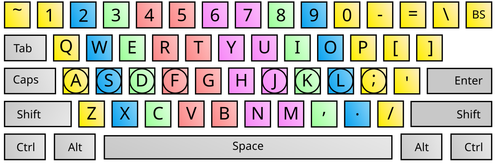

# Touch typing

*Typing without looking is not a party trick. It's the difference between writing down what you observed and losing it — and in QA, the thing you didn't write down never happened.*

> Here is the bug report a hunt-and-peck tester writes: *"login broken."* Here is the one a
> touch typist writes: *"POST /api/login returns 200 but the Set-Cookie header has
> `Secure` without `SameSite`; Safari drops it, so the next request is unauthenticated.
> Repro: Safari 17, private window, steps below."* Same person. Same brain. Same bug.
> **The difference is that one of them could type as fast as they could think, and the other
> had to choose between watching the screen and writing the sentence.**

> **In real life**
>
> Hunt-and-peck typing is **reading a book by moving your finger along each line.** It works.
> Every word arrives. But you are spending so much attention on the *mechanism* of reading
> that there is none left for the *meaning* — and you'll never notice the sentence three
> paragraphs up that contradicts this one. Fluent typing, like fluent reading, isn't about
> speed. It's about the attention that speed frees up.

## Why this is a QA skill and not a life-skills filler

The unglamorous truth of testing is that **most of the job is writing**. Bug reports. Test
cases. Repro steps. Slack messages that convince a developer. Notes taken *while* the bug is
still on screen, because the moment you reload, it's gone.

That last one is the killer. Testing happens in a state of fragile attention: you have an
observation on screen, a hypothesis in your head, and about four seconds before you do
something that destroys the evidence. If capturing that observation requires you to look at
your hands, you will do one of two things — and both are bad. You'll skip the note, or
you'll lose the thread you were pulling.

Being able to type without looking means you can **narrate while you observe**. That's the
whole skill.


*Touch typing finger positions — Wikimedia Commons, GPL. [Source](https://commons.wikimedia.org/wiki/File:Touch_typing.svg)*
- **The home row — where your hands live** — Left fingers on A S D F, right fingers on J K L semicolon. Every other key is reached from here and returned to. You are not memorising 100 key positions; you are memorising 8 anchors and a set of short journeys away from them.
- **F and J have a bump. Feel it.** — Run your index fingers along the home row: two keys have raised ridges. They exist so you can find home position without looking, in the dark, mid-thought. Almost nobody has been told they're there, and they've been on every keyboard you've ever owned.
- **Each finger owns a column** — The colour coding is a territory map: each finger is responsible for a diagonal column of keys. It feels arbitrary and slow for about two weeks. Then it becomes the reason you can type a bug report while watching the Network tab.
- **The right hand's home is J K L ;** — Note that the right index finger owns both J and H and often M, N, U, Y. More keys, same finger. Load is not evenly distributed — which is exactly why 'just use two fingers faster' plateaus, and correct fingering doesn't.
- **Thumbs: space, and nothing else** — Both thumbs rest on the space bar; one strikes it. Give thumbs any other job and you've broken the anchor. This is the rule people quietly break first, usually by reaching for a modifier key with a thumb.
- **Accuracy first, always. Speed is a byproduct.** — A typo you fix costs a keystroke to make, a moment to notice, a Backspace, and a retype — call it four keystrokes for one error. Practising for speed at 90% accuracy is practising to be slower. Slow down until you're at 98%, then let speed arrive on its own.

**Where the observation goes — press Play**

1. **You see it. The price flickers from £40 to £45.** — It happened once, about 200ms after load. You are now holding a fragile, unreproduced observation, and the clock is running: the next thing you do will probably destroy it.
2. **The hunt-and-peck tester looks down** — To write 'price flickers' they must find the keys. Their eyes leave the screen for six seconds. When they look back, the page has settled, the Network tab has scrolled, and the flicker is a memory of a memory.
3. **The touch typist types without looking** — 'price 40 -> 45 approx 200ms after load, no reload' appears in their notes while their eyes stay on the Network tab. They watch a second XHR land at exactly the moment the price changes. That correlation is the entire root cause and it was visible for one second.
4. **One of them now has a hypothesis** — 'A second request overwrites the rendered price.' They test it: Ctrl+Shift+P → disable JavaScript → reload. Price stays at £40. Confirmed. This took forty seconds and it happened because they had attention left over.
5. **The other files 'price is sometimes wrong'** — It goes into the backlog. It cannot be reproduced by anyone who wasn't watching that exact second. Six weeks later a customer complains about being overcharged, and the whole investigation starts again from nothing.

*Try it — why accuracy beats speed, with arithmetic*

```python
def effective_wpm(raw_wpm, accuracy):
    # Every error costs: notice it, Backspace over it, retype it.
    # Conservatively ~4 keystrokes of work for 1 wrong keystroke.
    error_rate = 1 - accuracy
    overhead = 1 + (error_rate * 4)
    return raw_wpm / overhead

profiles = [
    ("hunt & peck, careful",   22, 0.97),
    ("hunt & peck, fast",      30, 0.88),
    ("touch typist, learning", 35, 0.94),
    ("touch typist, sloppy",   75, 0.90),
    ("touch typist, accurate", 65, 0.98),
]

print(f"{'profile':26} {'raw':>5} {'acc':>6} {'effective':>10}")
print("-"*52)
for name, wpm, acc in profiles:
    print(f"{name:26} {wpm:>5} {acc:>6.0%} {effective_wpm(wpm,acc):>9.1f}")

print()
sloppy  = effective_wpm(75, 0.90)
careful = effective_wpm(65, 0.98)
print(f"The 'sloppy' typist is 10 wpm FASTER on paper ({75} vs {65})")
print(f"and {careful-sloppy:.1f} wpm slower in reality ({sloppy:.1f} vs {careful:.1f}).")
print()
print("This is why every typing tutor nags about accuracy. Errors don't just")
print("cost the fix -- they cost the INTERRUPTION. You looked away from the")
print("bug to correct a typo, and the bug is what you were supposed to watch.")
```

## How to actually learn it (and the honest cost)

Two weeks of feeling stupid. That's the price, and nobody advertises it.

1. **Learn the home row and don't leave it.** `asdf jkl;`. Find the bumps on F and J by feel.
2. **Cover your hands.** A tea towel over them. If you can see them, you will look, and you will never stop looking.
3. **Accuracy target 98%, speed target irrelevant.** Type slower than feels reasonable. Much slower.
4. **Fifteen minutes a day, not two hours on Sunday.** This is motor learning; it consolidates in sleep, not in marathons.
5. **Expect to be slower than hunt-and-peck for about ten days.** This is the part where everyone quits. Your old method is a local maximum, and getting off it requires going downhill first.

> **Tip**
>
> The measurement that matters is not words per minute — it's **whether you can type a full
> sentence while reading something else on screen.** Test it directly: open the Network panel,
> watch the requests, and type a description of what you see without looking down. If you can,
> you're done, whatever your wpm says. If you can't, no amount of raw speed will help, because
> raw speed with your eyes on the keys is still zero attention on the bug.

motor learning

### Your first time: Your mission: two weeks, fifteen minutes

- [ ] Find F and J by feel — Right now, without looking. Two raised bumps. They have been on every keyboard you have ever touched and nobody told you what they were for.
- [ ] Cover your hands — A tea towel, a cardboard box, anything. Non-negotiable. If your hands are visible you will glance at them and the two weeks never end.
- [ ] Fifteen minutes, daily, on a real tutor — keybr.com or monkeytype. Not two hours on a Sunday — motor learning consolidates during sleep, so daily beats intense.
- [ ] Hold 98% accuracy, ignore speed entirely — If accuracy drops below 98%, slow down. Practising errors trains the errors. Your wpm will look humiliating for ten days.
- [ ] Then test the thing that actually matters — Open a Network panel, watch it, and type what you see without looking down. That's the skill. WPM was only ever a proxy for it.

Two weeks of feeling stupid buys you a career of writing bug reports while your eyes stay on the bug.

- **I'm two weeks in and slower than when I started.**
  Correct and expected. Your old method was a local maximum — practised for years, and you must go downhill to leave it. The crossover is usually around days 10–14. Almost everyone who abandons touch typing does so inside that window, which means they paid the entire cost and collected none of the benefit.
- **My speed has stopped improving.**
  Nearly always accuracy, not speed. Check the number: if you're at 92%, one keystroke in twelve is being made, noticed, deleted and remade — a hidden tax on every line. Slow down until you're at 98% and speed returns on its own. Plateaus are almost never solved by trying harder at the thing that plateaued.
- **I keep looking at my hands even when I know the keys.**
  Cover them physically. Willpower loses this fight for everyone. Glancing is not a discipline problem; it's a cheap reward your brain will keep taking as long as the option exists. Remove the option.
- **I can type prose fine but code and terminal commands destroy me.**
  Different skill, and nobody warns you. Brackets, semicolons, underscores, pipes and the top-number-row symbols barely appear in prose drills. Practise those explicitly — most tutors have a punctuation or code mode. Otherwise you'll have fluent English and hunt-and-peck `grep`.

### Where to check

Unusually for these notes, the panel to check is you:

- **The F and J bumps** — can you find home position without looking? Right now?
- **Your accuracy percentage** — not your wpm. Below 98% means you're practising errors.
- **The real test:** watch the Network panel and type a sentence about what you see. Eyes never leave the screen.
- **Your bug reports** — go and read three you wrote last month. Are they short because the bug was simple, or because typing was expensive?

Tester's habit: **notice when you stop writing things down.** That moment — where you think
"I'll remember this" and don't open the notes file — is almost always the friction of typing
talking, not a real judgment about what's worth recording. The observation you skipped is the
one the developer will ask about.

### Worked example: the flicker that only one person ever saw

1. **The setup:** an intermittent overcharge. Customers occasionally billed £45 instead of £40. Unreproducible. Four testers had tried. It had been open eleven weeks.
2. **The fifth tester loads the page and watches it.** She sees the price render as £40 and become £45. It takes about 200 milliseconds. She sees it *once*.
3. **This is the entire investigation, and it lasts one second.** Whatever she does next determines whether eleven weeks becomes twelve.
4. **She types, without looking:** `40 -> 45, ~200ms post-load, no reload, network tab showed a 2nd XHR at same moment`. Her eyes never leave the Network panel. She watches that second request land while she writes about it.
5. **Had she looked down**, the panel would have scrolled, the flicker would have been over, and she would have written "price sometimes wrong" — which is what the four previous testers wrote, and it is exactly as useful as it sounds.
6. **From the note, the hypothesis is obvious:** a second request overwrites the rendered price. She confirms it in forty seconds — `Cmd+Shift+P` → disable JavaScript → reload → the price stays £40.
7. **The root cause:** a currency-conversion script, added for a European launch, re-renders prices after load using a cached exchange rate. For UK customers it multiplied by 1.125 and wrote the result back. Only fired when the script won a race against the main bundle — hence "intermittent."
8. **The report she filed** named the request, the timing, the disable-JavaScript proof, and the exact script. It was fixed in a day.
9. **The uncomfortable part.** She is not a better tester than the other four. She saw the same thing they did. She simply did not have to choose between *watching* it and *writing it down* — and that choice, made four times by four competent people, is what eleven weeks of a customer-facing overcharge was made of.

> **Common mistake**
>
> Chasing words per minute. WPM is a proxy, and once you can type without looking it stops
> measuring anything you care about — the tester typing 90wpm at 90% accuracy is slower, in
> real work, than the one at 65wpm and 98%, and both of them write identical bug reports if
> their eyes stay on the screen. The number to optimise is not on any typing test: **can you
> capture an observation without looking away from it?** Everything else — the drills, the
> home row, the accuracy nagging — exists only to buy you that. Once you have it, stop
> practising and go find bugs.

**Quiz.** Tester A types 75wpm at 90% accuracy. Tester B types 65wpm at 98%. Who writes a bug report faster, and why?

- [ ] A — 10 wpm is 10 wpm
- [x] B. Every error costs roughly four keystrokes of work (notice, backspace, retype), so A's one-in-ten error rate imposes a hidden tax that more than erases the 10wpm advantage. Worse, each correction pulls attention off the bug that's still on screen.
- [ ] They're identical once you average it out
- [ ] A, but only on short reports

*Run the arithmetic from the playground: A's effective rate falls to about 54wpm, B's to about 60. The 'faster' typist is slower. But the real cost isn't in the arithmetic at all — it's that every correction is an interruption, and in testing the thing you're interrupted from is a live observation that may not survive a reload. Accuracy isn't a virtue drilled into you by pedantic typing tutors for its own sake; it's the thing that keeps your attention on the screen.*

- **Why touch typing is a QA skill** — Most of testing is writing, and the crucial writing happens while a fragile observation is still on screen. Looking at your hands destroys it.
- **The F and J bumps** — Raised ridges letting you find home position by feel, without looking. On every keyboard you've ever used.
- **Home row** — `asdf` left, `jkl;` right. Eight anchors; every other key is a short journey away and back.
- **Accuracy vs speed** — One error costs ~4 keystrokes (notice, backspace, retype) plus an interruption. 65wpm@98% beats 75wpm@90% in real work.
- **The honest cost** — About two weeks of being slower than before. The crossover is days 10–14, which is exactly when most people quit.
- **Why 15 min daily beats 2 hrs weekly** — Motor learning consolidates during sleep. Frequency beats duration.
- **The test that actually matters** — Can you type a sentence about the Network panel while watching the Network panel? Not WPM.
- **The skill nobody warns you about** — Code and terminal typing — brackets, semicolons, pipes, symbols. Prose drills never teach them. Practise them separately.

### Challenge

Find the bumps on F and J right now, without looking. Then cover your hands with a tea towel
and type this sentence: "the price changed from 40 to 45 about 200ms after load." Time it.
Now do it again with your eyes on a different window — a video, a Network panel, anything.
If the second attempt collapses, you've just measured the exact gap this note is about, and
you know what fifteen minutes a day is buying.

### Ask the community

> Typing practice check-in: day [N] of touch typing. Raw speed [X] wpm, accuracy [Y]%. Old hunt-and-peck speed was [Z] wpm. Biggest problem: [looking down / specific keys / punctuation / plateau]. Can I type while watching another window: [yes/no/sort of]

Post your accuracy, not just your speed — it's the number that predicts whether you'll break
through or plateau, and it's the one people leave out because it's the unflattering one. And
if you're on day 8 and slower than you started, say so: someone will tell you that's exactly
where they were, which is the only thing that gets anyone to day 15.

- [keybr.com — adapts to the keys you personally get wrong](https://www.keybr.com/)
- [monkeytype — clean, and has a code/punctuation mode](https://monkeytype.com/)
- [TypingClub — structured from absolute zero](https://www.typingclub.com/)

🎬 [Learning to touch type as an adult: the two-week trough](https://www.youtube.com/watch?v=PDLLIQ3G4_A) (8 min)

- Touch typing is a QA skill because testing is mostly writing, and the writing that matters happens while a fragile observation is still on screen.
- Home row `asdf jkl;`, anchored by the raised bumps on F and J. Eight anchors, not a hundred key positions.
- Accuracy beats speed by arithmetic: an error costs about four keystrokes plus an interruption. 65wpm@98% outruns 75wpm@90%.
- It costs roughly two weeks of being slower than before. The crossover is days 10–14 — precisely when people quit and lose the whole investment.
- The real test isn't words per minute. It's whether you can write down what you're seeing without looking away from it.


---
_Source: `packages/curriculum/content/notes/digital-literacy-and-safety/keyboard-and-typing/touch-typing.mdx`_
