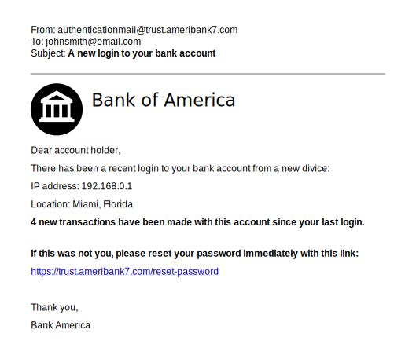

# Phishing & scams

*Attackers rarely break the lock — they trick you into opening it. How phishing works, the five tells that unmask almost any scam, and why the calm habit of checking beats every clever filter.*

> Every note so far made your accounts harder to break into. This one is about the attack
> that skips the lock entirely and knocks politely on the front door, wearing your bank's
> uniform, asking you to open up. Phishing doesn't crack passwords — it convinces you to
> hand them over. It's how most real accounts actually fall, it works on smart people
> having a busy day, and the defense isn't a smarter filter or a stronger password. It's a
> five-second habit you're about to learn and never lose.

> **In real life**
>
> Phishing is a **con artist in a delivery uniform.** They don't pick your lock — they ring
> the bell, hold up a clipboard, say "urgent package, just sign here," and count on you
> being busy enough not to check the uniform. The uniform (a familiar logo), the clipboard
> (an official-looking email), and the urgency ("sign NOW") are the whole trick. It's
> **phishing**: Tricking a person into revealing passwords, card numbers, or clicking a malicious link by impersonating someone they trust — a bank, a boss, a delivery company. It attacks the human, not the software.:
> an attack on you, not your software. No firewall stops a con you invited in. Only the
> habit of checking the uniform does.

## Why the con works on smart people

Phishing doesn't target stupidity — it targets *hurry* and *emotion*. A good scam
manufactures a feeling that shoves the thinking part of your brain aside:

- **Urgency** — "Your account will be closed in 24 hours." Panic skips scrutiny.
- **Fear** — "Suspicious login detected. Someone has your password." Fear makes you click before reading.
- **Authority** — a boss, a bank, the government. We're trained to comply with authority fast.
- **Reward** — "You've won." "Refund waiting." Greed lowers the guard just as well as fear.

Notice the pattern: every one is an *emotional lever* designed to make you act before you
check. Which hands you the antidote — not being smarter, but being *slower*. The scam
needs you rushing; the defense is a deliberate pause. That's why the whole skill fits in
one sentence: **when a message makes you feel urgency, that feeling is the signal to
slow down and verify, not speed up and click.**


*Illustration: Example bank phishing email — Wikimedia Commons, CC BY 4.0. [Source](https://commons.wikimedia.org/wiki/File:Example_bank_phishing_email.svg)*
- **The sender address — tell #1** — 'authenticationmail@trust.ameribank7.com'. Read the domain right-to-left (the URL note's rule): the real bank does not send from 'ameribank7.com'. Scammers register lookalike or plausible-sounding domains because the display NAME can say anything. Always check the actual address, not the friendly name it shows.
- **The impersonated logo — tell #2** — A Bank of America logo, copied in seconds — a logo proves nothing, anyone can paste one. Brand impersonation is the uniform in the analogy. The presence of a familiar logo should raise your scrutiny, not lower it, because it's the cheapest part of the con to fake.
- **'Dear account holder' — tell #3** — A generic greeting. Your real bank knows your name and uses it. Mass phishing goes to thousands at once, so it can't personalize — 'Dear customer / account holder / user' is the sound of a bulk con. A real, personal salutation isn't proof of safety, but a generic one is a genuine warning.
- **Manufactured urgency — tell #4** — 'reset your password immediately'. The whole email is engineered to make you act NOW: unfamiliar login, transactions you didn't make, fix-it-this-instant. Urgency is the con's engine. The correct response to 'do this immediately' is precisely to NOT — to stop and verify through your own channel.
- **The link — tell #5, the payload** — 'https://trust.ameribank7.com/reset-password'. This is where they harvest your password: a fake login page on a domain that isn't your bank. Hover (don't click) to see the real destination. NEVER log in via a link in an email — open a new tab and type the bank's address yourself. This one habit defeats most phishing outright.
- **The mistakes — 'divice', 'Bank America'** — A typo ('divice') and the wrong name ('Bank America' instead of Bank of America). Real institutions proofread; scams often don't, and the errors are a gift. But don't rely on them — many modern scams are flawless. Spelling mistakes confirm a phish; their absence never confirms safety.

## The five tells (and the one habit that beats all of them)

Read any suspicious message against these:

1. **Sender address** — not the display name, the real address. Lookalike or wrong domain? Phish.
2. **Generic greeting** — "Dear customer" instead of your name? Suspicious.
3. **Urgency or threat** — act now, account closing, legal trouble? The engine of every scam.
4. **The link's real destination** — hover to reveal it; does the domain match the real site? Read it right-to-left.
5. **Unusual request** — a password, a code, a payment, a gift card? Legit organizations don't ask this way.

But here's the thing that matters more than the checklist: you will be busy, tired, and
distracted the day a good one arrives, and you won't run a five-point audit. So internalize
the ONE habit that makes the checklist optional: **never act on the message's own links or
numbers — verify through a channel you already trust.** Bank email says there's a problem?
Don't click — open your banking app or type the bank's address yourself. Boss asks for
gift cards by text? Call them. That single reflex — go to the source yourself — defeats
phishing even when every tell is perfect.

**A phishing attack, step by step — and where you break it — press Play**

1. **🎣 The bait arrives** — An email, text, or DM impersonating someone you trust — bank, delivery service, boss, a platform you use. It looks right because logos and layouts are trivial to copy. This is the delivery-uniform moment: the costume is on.
2. **😰 The emotional hook** — It manufactures urgency or fear or reward: 'account suspended', 'package held', 'you've won', 'the CEO needs this NOW'. The feeling is the weapon — it's engineered to make you act before the thinking part of your brain catches up.
3. **🔗 The trap link** — A link to a fake login page that looks pixel-perfect, on a lookalike domain. Or an attachment carrying malware (next note). The page's only job is to capture what you type — your password, your card, your 2FA code — and send it to the attacker.
4. **⌨️ You enter your details — OR you don't** — This is the fork. Type your password into the fake page and it's stolen instantly. But if your habit is 'never log in via an emailed link — go to the site myself', the trap catches nothing. The whole attack lives or dies on this one decision.
5. **🛡️ Verified through your own channel = defused** — You didn't click. You opened your banking app directly (no alert there), or called the real number, or checked the sender against reality. The con needed your trust and your hurry; you gave it neither. Attack over — and you barely spent a minute.

*Try it — a phishing detector that scores the five tells*

```python
# Score a message against the five tells. This is the checklist, automated.

def phishing_score(sender_domain, expected_domain, greeting, has_urgency, link_domain, asks_for_secret):
    flags = []
    if sender_domain != expected_domain:
        flags.append('Sender domain is ' + sender_domain + ', not ' + expected_domain)
    if greeting.lower() in ('dear customer', 'dear account holder', 'dear user'):
        flags.append('Generic greeting (no real name)')
    if has_urgency:
        flags.append('Manufactured urgency / threat')
    if link_domain != expected_domain:
        flags.append('Link goes to ' + link_domain + ', not ' + expected_domain)
    if asks_for_secret:
        flags.append('Asks for a password / code / payment')
    return flags

# The bank email from the image:
flags = phishing_score(
    sender_domain='ameribank7.com',
    expected_domain='bankofamerica.com',
    greeting='Dear account holder',
    has_urgency=True,
    link_domain='ameribank7.com',
    asks_for_secret=True,
)

print('Message scored against the five tells:')
for f in flags:
    print('  [!]', f)
print()
print('Flags raised:', len(flags), 'of 5')
print()
if len(flags) >= 2:
    print('VERDICT: phishing. Do NOT click. If you bank there, open the app')
    print('yourself and check -- never through this email.')
print()
print("But remember: a PERFECT phish scores 0 flags. That's why the real rule")
print("isn't 'count the flags' -- it's 'verify through your own channel, always'.")
print("The checklist catches the sloppy ones; the habit catches the good ones.")
```

> **Tip**
>
> Make one reflex automatic and you're 90% protected: **never log in or pay through a link
> someone sent you.** Bank, PayPal, your work login, a delivery fee — if a message wants you
> to sign in or pay, close it, open a new tab, and type the address yourself (or use the
> official app). It costs ten seconds and it neutralizes the entire trap, because the con
> depends on you using THEIR link to THEIR fake page. The same goes for phone calls: if
> 'your bank' calls about fraud, hang up and call the number on the back of your card. Real
> institutions will never mind you verifying; only scammers need you to act right now,
> through them.

### Your first time: First time? Learn to read a suspicious message

- [ ] Find a real one in your spam folder — Open your email's spam/junk folder — there's always a phishing example in there. Don't click anything; just read it as a specimen. Real examples teach faster than descriptions.
- [ ] Check the sender's actual address — Click or tap the sender name to reveal the real email address behind the friendly display name. Is the domain the real company, read right-to-left? Almost always it isn't. This is tell #1, confirmed with your own eyes.
- [ ] Hover a link WITHOUT clicking — On a computer, hover the mouse over a link (don't click) — the real destination shows at the bottom of the screen. On mobile, press and hold to preview. Compare the domain to the real site. Mismatch = trap.
- [ ] Spot the emotional lever — Name the feeling it's trying to create: urgency, fear, greed, authority. Once you can NAME the manipulation, it stops working on you. 'This is trying to make me panic' is a thought scammers can't survive.
- [ ] Practice the verify-yourself reflex — Pick a legit alert you've actually gotten (a real bank notification). Instead of clicking it, open the app directly and confirm the info is there. Rehearse the habit on a real message so it's automatic on a fake one.

Ten minutes with real specimens and you'll spot phishing faster than any filter — because
you're reading intent, not just keywords.

- **“I think I just clicked a phishing link / entered my password on a fake page.”**
  Act fast but calmly. 1) Change that account's password immediately — from the REAL site, typed yourself (a manager makes this instant). 2) If you reused that password anywhere, change it there too (the reuse cascade from earlier). 3) Turn on 2FA if it wasn't already — even a phished password is useless to them without your second factor (the 2FA note's whole point). 4) Watch the account for unfamiliar activity and check active sessions. Clicking once isn't catastrophe if you move quickly — and 2FA may have already saved you.
- **“The email looks EXACTLY like my real bank — logo, layout, everything perfect.”**
  That's normal — good phishing is pixel-perfect, because copying a logo and layout is trivial. Which is exactly why you don't judge by appearance. Check the sender's real address and the link's real domain (read right-to-left), and above all: don't act through the email at all. Open your banking app or type the address yourself. A perfect-looking email that wants you to click IS the danger; verify through your own channel and the perfection becomes irrelevant.
- **“It came by text / WhatsApp / a DM, not email — is that still phishing?”**
  Yes — 'smishing' (SMS) and social-media phishing are booming, and people trust texts more than email, which is exactly why scammers moved there. Same tells, same defense: unknown/urgent message with a link or a request = verify through your own channel, never through the message. 'Your package has a fee, pay here' texts and 'hi mum, I lost my phone, send money' messages are this, industrialized. The medium changed; the con and the cure did not.
- **“Someone claiming to be tech support / my bank called and wants remote access or a code.”**
  Hang up — this is vishing (voice phishing), and it's a scam nearly every time. No real bank, Microsoft, or government agency calls to demand remote access, a password, a 2FA code, or payment in gift cards. The 2FA code point matters: reading a code to a caller completes the ATTACKER's login (that unrequested code was 2FA warning you). Hang up, then call back on an official number you look up yourself — never the number they gave you. Urgency + 'don't tell anyone' + gift cards = certainty it's a con.

### Where to check

Deciding whether a message is a phish:

- **The real sender address** — click the display name to reveal it; read the domain right-to-left against the real company. Not the friendly name.
- **The link's real destination** — hover (desktop) or long-press (mobile) to preview; does the domain match? Never judge a link by its visible text.
- **The emotional lever** — name it (urgency/fear/greed/authority). Naming the manipulation disarms it.
- **The request** — password, code, payment, gift card, remote access? Legit organizations never ask this way. An unusual ask is a near-certain tell.
- **Your own trusted channel** — the master check: verify through the official app / a number you look up / typing the address yourself. This defeats even a flawless phish.

### Worked example: the 'CEO' who needed gift cards — a scam unmasked in one call

A new employee gets an urgent email: from the CEO, asking them to quietly buy $500 in
gift cards for a client and send the codes — "I'm in meetings, can't call, need this in
the next hour, keep it between us." Here's the calm walk-through:

1. **Name the levers.** Authority (the CEO), urgency (next hour), secrecy (keep it
   between us), and an unusual request (gift cards). That's four tells at once — the
   emotional-manipulation stack of a classic 'CEO fraud' scam.
2. **Check the sender address.** The display name says the CEO; the real address is
   ceo.office@gmail.com, not the company domain. Tell confirmed — but even without this,
   the request alone should trigger the habit.
3. **Apply the one rule: verify through your own channel.** Don't reply to the email.
   Message the CEO on the company's real chat, or ask a colleague: "Did you email me about
   gift cards?" Ten seconds.
4. **The answer:** "No — that's a scam, thanks for checking. Please report it." The CEO
   never sent it. The 'secrecy' demand existed precisely to stop this verification call.
5. **Why it nearly worked:** a brand-new employee, eager to impress the boss, under a
   manufactured clock, told to keep quiet. Zero technical hacking — pure human engineering.
   The gift-card detail is the giveaway: they're untraceable and irreversible, which is
   why every scam of this shape ends in gift cards, crypto, or wire transfers.
6. **The lesson:** the strongest passwords and best 2FA in the world wouldn't have helped
   here — the attack never touched a system, it targeted a person. The only defense was the
   human habit of verifying through a trusted channel. That habit is this note.

> **Common mistake**
>
> Trusting a message because it LOOKS official — right logo, right colors, right layout,
> even the right tone. Appearance is the single cheapest thing for an attacker to fake and
> therefore the single worst thing to trust. Logos are copied in seconds, sender display
> names can say literally anything, and a competent phish is visually indistinguishable
> from the real thing. Real safety comes from the parts they can't easily fake and you can
> easily check: the actual sender domain, the link's real destination, and — above all —
> verifying through a channel you opened yourself rather than one the message handed you. If
> you learn one reflex from this entire module, make it this: an unexpected message asking
> you to log in, pay, or share a code is guilty until you've verified it through your own
> trusted channel. Looking official is not being official.

**Quiz.** A text from 'your bank' says fraud was detected and to secure your account via the link. What's the safest response?

- [ ] Click the link quickly — fraud is urgent and every second counts
- [x] Ignore the text entirely and open your banking app (or call the number on your card) to check directly — never act through the message's own link
- [ ] Reply to the text asking if it's really the bank
- [ ] Click the link but only look, don't enter anything

*The whole scam depends on you using ITS link to ITS fake page under manufactured urgency — so the safe move is to refuse that channel entirely and verify through one you trust: your banking app, or the number printed on your card. Clicking 'just to look' still lands you on the attacker's page (and some pages attack via the click itself), replying only confirms your number is live to a scammer, and rushing is exactly the panic the message engineered. Real fraud alerts survive you checking through the official app; only scams need you to click their link right now. When a message creates urgency, that feeling is the signal to slow down and verify, not to hurry and click.*

- **Phishing** — Tricking a person into revealing secrets or clicking a malicious link by impersonating someone they trust. Attacks the human, not the software — so no firewall stops it, only a habit.
- **The five tells** — Wrong sender domain, generic greeting, manufactured urgency/threat, link to a mismatched domain, an unusual request (password/code/payment). Two or more = phish.
- **The one habit that beats all** — Never act through the message's own links or numbers. Verify through a channel you open yourself — the real app, a number you look up, typing the address. Defeats even a perfect phish.
- **The emotional levers** — Urgency, fear, authority, reward. The scam manufactures a feeling to make you act before thinking. Naming the feeling ('this wants me to panic') disarms it.
- **Variants** — Smishing (SMS), vishing (phone calls), social-media DMs — same con, different medium. 'Package fee', 'hi mum send money', 'tech support needs remote access' are these, industrialized.
- **If you clicked** — Change that password from the real site immediately, change any reuse of it, enable 2FA (a phished password is useless without the second factor), and watch for unfamiliar activity.

### Challenge

Go phishing — for specimens. (1) Open your spam folder and find one real phishing email;
identify all five tells in it without clicking anything. (2) Check its sender's true
address and hover its link to reveal the real destination. (3) Name the emotional lever
it's pulling. (4) Rehearse the reflex on a legit alert you've gotten: instead of clicking
it, open the app directly and confirm the info. Write down the five tells you found and
the fake domain. You've just trained the exact instinct that stops the attack most likely
to actually reach you — and it works on smart, busy people precisely because they skip
this ten-minute practice.

### Ask the community

> Phishing question: I got a [email/text/call/DM] claiming to be [who], asking me to [click/pay/share a code]. The real sender address is [paste], the link's real domain is [paste], and it's using [urgency/fear/authority/reward]. Is this a scam, and did I do anything risky?

Include the real sender domain and the link's real destination (read right-to-left) — those
two facts unmask almost every phish instantly, and 'it looked official' tells no one
anything, because looking official is the one part that's free to fake.

- [GCFGlobal — avoiding spam & phishing (with examples)](https://edu.gcfglobal.org/en/internetsafety/avoiding-spam-and-phishing/1/)
- [US FTC — how to recognize and report phishing](https://www.ftc.gov/phishing)
- [What is phishing and how does it work?](https://www.youtube.com/watch?v=Y7zNlEMDmI4)

🎬 [What is phishing and how the attack works](https://www.youtube.com/watch?v=Y7zNlEMDmI4) (4 min)

- Phishing attacks the person, not the software: it tricks you into opening the lock by impersonating someone you trust. No firewall stops it — only a habit does.
- It works through emotional levers — urgency, fear, authority, reward — designed to make you act before thinking. Naming the feeling disarms it; slowing down beats it.
- The five tells: wrong sender domain, generic greeting, manufactured urgency, mismatched link destination, an unusual request. Two or more means phish.
- The one habit that beats even a perfect phish: never act through the message's own links or numbers — verify through a channel you open yourself (the real app, a looked-up number).
- If you slip and click, move fast: change that password from the real site, change any reuse, and rely on 2FA — a phished password is useless without your second factor.


---
_Source: `packages/curriculum/content/notes/digital-literacy-and-safety/staying-safe-online/phishing-and-scams.mdx`_
