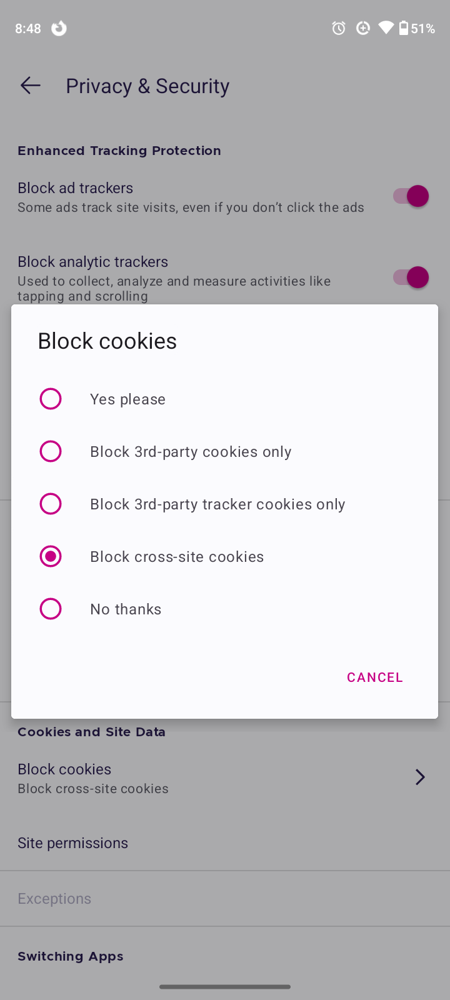

# Privacy basics

*You're not paying for most apps because you ARE the payment. What data you leak, how tracking follows you across the web, and the handful of settings that take back most of your privacy in ten minutes.*

> Ask yourself an uncomfortable question: how does a free app with no ads, run by a company
> with hundreds of employees, make money? It doesn't run on good vibes. If a service is free
> and you're not the customer, you're the inventory — your attention, your habits, your
> location, and a startlingly detailed profile of who you are, sold to people who want to
> influence you. This note isn't about paranoia or going off-grid. It's about knowing what
> you're trading, and taking back the parts you never meant to give away — most of it with a
> few settings you can change tonight.

> **In real life**
>
> Using the free web is like **shopping in a store that follows you home.** You browse, you
> buy, fine — but this store also notes every aisle you lingered in, follows you to every
> OTHER store you visit, remembers it forever, and sells the dossier to anyone who'll pay to
> sell you things. The thing quietly doing the following is a
> **tracker**: A small piece of code or data (often a third-party cookie or script) that records your activity across many different websites and links it into a profile of you, usually to target ads.,
> and it rides along on most pages you visit. You can't make the store forget you entirely,
> but you can pull the blinds — block the followers, limit what you hand over, and stop being
> quite so easy to profile. That's privacy in practice: not invisibility, but control.

## What you're actually leaking

Most people picture "my data" as their password or card number. The valuable stuff is
quieter and constant:

- **Where you go** — every site you visit, often linked across sites by trackers into one
  timeline of your interests, worries, and purchases.
- **Where you physically are** — location from your phone, precise enough to know your
  home, work, and routine.
- **What you do** — what you tap, how long you read, what you almost bought, what you
  searched at 2 a.m.
- **Who you are** — age, likely income, relationships, health concerns, politics —
  inferred from all of the above, often more accurately than your friends know.

None of that feels like "giving away data" in the moment, which is exactly why it works.
The business model of the free web is turning that quiet stream into a profile and renting
your attention to advertisers. Understanding that isn't cynicism — it's the context that
makes the settings below worth changing.


*Screenshot: Firefox Focus privacy settings — Wikimedia Commons, MPL 2.0 (Mozilla). [Source](https://commons.wikimedia.org/wiki/File:Firefox_Focus_Privacy_and_security_screenshot.png)*
- **Block ad trackers — the followers, off** — 'Some ads track site visits even if you don't click the ads.' That's the quiet truth: you don't have to interact with an ad to be tracked by it — merely loading a page that contains it is enough. Turning this on cuts the cross-site followers. It's the single most impactful privacy toggle in any browser.
- **Block analytic trackers — the watchers, off** — 'Used to collect, analyze and measure activities like tapping and scrolling.' Beyond WHERE you go, trackers record HOW you behave on a page. Blocking analytics trackers stops much of that behavioral profiling. You lose nothing you'd miss; the site still works.
- **Block cookies — the cross-site distinction** — The key choice: 'block cross-site cookies' or '3rd-party trackers'. A first-party cookie (the site remembering YOUR login) is useful. A third-party cookie is a tracker from another company riding along to follow you elsewhere. Block the third-party/cross-site ones and you keep convenience while cutting most tracking.
- **'Block cross-site cookies' — the sane default** — Selected here — the sweet spot. It keeps sites working (your logins survive) while stopping cookies from following you between sites. 'Block all' is more private but breaks some logins; 'allow all' is a tracker's dream. Cross-site blocking is the setting most people should choose and forget.
- **Site permissions — what each site can reach** — Camera, microphone, location, notifications — permissions you granted, often without thinking, in some forgotten pop-up. This is where you audit and revoke them. A flashlight app does not need your location; a random site does not need your microphone. Review these; the defaults leak more than you'd choose.

## Cookies, trackers, and "you are the product"

A quick demystification, because the words get thrown around:

- **First-party cookie** — set by the site you're actually on, to remember useful things
  (you're logged in, your cart, your language). These are mostly benign and helpful.
- **Third-party cookie / tracker** — set by *another* company whose code the site embedded
  (an ad network, an analytics firm). The same tracker rides on thousands of sites, so it
  stitches your activity across all of them into one profile. This is the tracking that
  matters, and it's what the browser settings above cut.

The reason this exists at all is the free-web bargain: services give you a product for no
money and recoup it by profiling you and selling advertisers access to that profile. It's
not evil, but it's not free either — you pay in data and attention. Privacy settings don't
opt you out of the internet; they just make you a much less detailed product.

**How a tracker follows you across the web — press Play**

1. **🛒 You visit a shopping site** — You look at running shoes. The page includes an ad-network tracker (third-party) alongside the shop's own code. The tracker drops a cookie / notes your device and records: this person looked at running shoes. You clicked nothing; loading the page was enough.
2. **📰 Later, you read the news** — A totally different site — but it embeds the SAME ad network's tracker. It recognizes your device from before and adds: also reads sports news, in the evening, on mobile. Your profile is being assembled across unrelated sites by a company you never visited on purpose.
3. **🧩 The profile assembles** — Across dozens of sites, the tracker links it all: interests, schedule, location, income bracket, what you almost bought. You never filled in a form — it was inferred from behavior. This dossier is the actual product being sold.
4. **🎯 You get targeted** — Now those running shoes 'follow you around the internet' as ads, and you're sorted into audiences for everything from politics to payday loans. Sometimes it's convenient; sometimes it's manipulation aimed precisely at your inferred weaknesses. Either way, you didn't choose it.
5. **🛡️ Blocking trackers breaks the chain** — Turn on tracker/third-party-cookie blocking (the settings above) and the SAME tracker can't recognize you across sites — each visit stays separate, the profile can't assemble. You didn't leave the internet; you just stopped handing out a coherent dossier. That's the whole win.

*Try it — watch a tracker build a profile, then watch blocking break it*

```python
# A single tracker sees you on many sites. Model the profile it assembles.

class Tracker:
    def __init__(self, blocked=False):
        self.blocked = blocked
        self.profile = {}          # what it has learned about 'you'

    def sees(self, site, activity):
        if self.blocked:
            print('  [blocked] ' + site + ': tracker cannot link this visit')
            return
        self.profile.setdefault(site, []).append(activity)
        print('  [tracked] ' + site + ': ' + activity)

visits = [
    ('shoe-shop.com',  'viewed running shoes'),
    ('news-site.com',  'read sports news at 11pm'),
    ('health-site.com','searched knee pain'),
    ('bank-blog.com',  'read about loans'),
]

print('WITHOUT tracker blocking:')
t = Tracker(blocked=False)
for site, act in visits: t.sees(site, act)
print('  => assembled profile:', dict(t.profile))
print('     (runner, evenings, knee trouble, loan-curious -- a sellable dossier)')
print()

print('WITH tracker blocking on:')
t2 = Tracker(blocked=True)
for site, act in visits: t2.sees(site, act)
print('  => assembled profile:', dict(t2.profile), '<- nothing linked. Each visit stayed separate.')
print()
print("Same four visits. The only difference is one setting. Blocking doesn't")
print("hide you from each site individually -- it stops ONE company from")
print("stitching your whole life together across all of them.")
```

> **Tip**
>
> Ten minutes buys back most of your privacy — no lifestyle change required. (1) In your
> browser settings, turn on tracker blocking / block cross-site (third-party) cookies —
> Firefox and Brave do this well by default; Chrome and Safari have settings for it. (2)
> Audit app permissions on your phone (Settings → Privacy): revoke location, microphone, and
> camera from apps that have no business needing them. (3) Use private/incognito windows for
> anything you don't want linked to your main profile — they don't make you anonymous, but
> they don't keep cross-site cookies either. (4) Consider a privacy-respecting search engine
> (DuckDuckGo) for a quick, zero-effort reduction in profiling. None of this is 'going off
> grid' — it's just closing the blinds.

### Your first time: First time? Take back your privacy in one sitting

- [ ] Turn on tracker blocking in your browser — Settings → Privacy. Enable 'block trackers' / 'block cross-site cookies'. Firefox and Brave are strong here; Safari has 'Prevent cross-site tracking'; Chrome has tracking-protection settings. One toggle, most of the benefit.
- [ ] Audit your phone's app permissions — Settings → Privacy (or per-app). Look at which apps have Location, Microphone, Camera, Contacts. Revoke anything that makes no sense — a game with your location, a photo filter with your contacts. Set location to 'while using' at most.
- [ ] Do a reverse ad-check — Notice an ad that's eerily specific — something you looked at once, now following you. That's tracking, made visible. Seeing it is the point: the profile is real, and the settings above are what break it.
- [ ] Try a private window — Open a private/incognito window and browse. It won't keep cross-site cookies or history. Not anonymity (your network and the sites still see you), but a clean, unlinked session — useful for shopping you don't want profiled.
- [ ] Switch one search to DuckDuckGo — Try DuckDuckGo for a week. It doesn't build a profile from your searches. If the results work for you, make it your default — a zero-effort, permanent reduction in one of the biggest data streams you produce.

One sitting, five changes, and you've gone from fully-profiled to substantially-private —
without giving up a single thing you actually use.

- **“I turned on strict blocking and now some sites are broken / won't log me in.”**
  Over-strict cookie blocking (blocking ALL cookies, not just cross-site) can break logins, because a site needs its OWN (first-party) cookie to remember you (the accounts note's session). Fix: choose 'block cross-site / third-party cookies' rather than 'block all' — that stops trackers while keeping first-party logins working. If one site still breaks, most browsers let you add a per-site exception. You want the sane middle, not the nuclear option.
- **“Ads are following me around with something I only looked at once.”**
  That's retargeting — a tracker recorded your interest and now serves it everywhere via cross-site cookies. It's the profile working exactly as designed. The fix is the settings above: block trackers / cross-site cookies, and the recognition chain breaks. You can also clear cookies to reset current profiles, and (on some platforms) opt out of ad personalization in your Google/Apple/Facebook account settings — worth doing once.
- **“An app is asking for permissions that have nothing to do with what it does.”**
  A flashlight wanting your location, a photo editor wanting your contacts — this is a data grab, not a feature. Deny it: most apps work fine with permissions denied, and if one refuses to function without an unreasonable permission, that's a reason to find a better app, not to give in. Grant the minimum: 'while using the app' for location, deny microphone/camera unless the app's core purpose obviously needs them.
- **“Is private/incognito mode actually private? Am I anonymous?”**
  Common and important misunderstanding: incognito mode only stops YOUR device from saving history and cross-site cookies for that session. It does NOT hide you from the websites you visit, your internet provider, your employer/school network, or make you anonymous. It's a clean, unlinked session — useful — not a cloak. For real anonymity you'd need much more (and it's rarely what people actually need). Use incognito for what it is: not-profiled-locally, not invisible.

### Where to check

Taking back your privacy — the highest-value places to look:

- **Browser tracker/cookie settings** — turn on 'block trackers' / 'block cross-site cookies'. The single biggest reduction in cross-site profiling.
- **Phone app permissions** (Settings → Privacy) — revoke location/mic/camera/contacts from apps that don't genuinely need them. Set location to 'while using'.
- **Account ad/privacy settings** — Google, Apple, Facebook et al. let you turn off ad personalization and review the data they hold. A one-time cleanup.
- **First-party vs third-party cookies** — keep the former (logins), block the latter (trackers). 'Block cross-site' is the setting that does exactly this.
- **What you post yourself** — the biggest privacy leak is often voluntary. Assume anything posted is permanent and public; that's a setting in your own habits.

### Worked example: the vacation ad that revealed the whole machine

Someone mentions to a friend they're thinking about visiting Japan — never searched it,
just talked about it near their phone. Days later, Japan flight ads everywhere. 'My phone
is listening!' Let's reason it out, because the truth is more interesting:

1. **The instinct (listening) is usually wrong, and the reality is scarier.** Constant
   audio recording would be huge, detectable data traffic — researchers look, and rarely
   find it. What's actually happening needs no microphone at all.
2. **The profile did it.** The friend they talked to searched Japan flights on a shared
   Wi-Fi, or is a linked contact; the person had lingered on travel content weeks ago;
   their location patterns and demographics match 'about to book a trip'. Trackers
   assembled a 'likely to travel to Japan' inference from behavior across many sites.
3. **Coincidence plus confirmation bias finishes the job.** You see a hundred ads a day and
   ignore them; the one that matches a recent thought leaps out and feels like magic. The
   profile is good enough that these 'how did they KNOW' moments are common without any
   listening.
4. **What actually reduces it:** the same settings — block cross-site trackers, limit app
   permissions (including microphone, to be safe and to kill the worry), turn off ad
   personalization. The eerie ads thin out because the profile gets thinner.
5. **The real lesson:** you don't need to be recorded to be known. Your behavior, location,
   and connections, tracked across the web and cross-referenced, predict you well enough to
   feel like mind-reading. That's not paranoia fuel — it's the reason the boring privacy
   settings are worth the ten minutes. The machine runs on data you leak, and you can leak
   less.

> **Common mistake**
>
> Assuming 'I have nothing to hide, so privacy doesn't matter.' Privacy isn't about hiding
> wrongdoing — it's about not being manipulated, profiled, and sorted without your knowledge
> or consent. The detailed profile built from your behavior is used to target you: ads tuned
> to your inferred insecurities, prices adjusted to what you'll pay, political messages aimed
> at your fears, and occasionally worse (data brokers sell profiles that enable scams and
> discrimination). 'Nothing to hide' quietly accepts that a stranger should get to know your
> income, health worries, location, and habits and use them to influence you — which,
> phrased honestly, almost nobody actually agrees with. You lock your front door not because
> you're a criminal but because what's inside is yours. Privacy is that door for your data,
> and the settings in this note are the lock.

**Quiz.** You block third-party (cross-site) cookies but keep first-party cookies. What's the effect?

- [ ] Every website stops working because cookies are essential
- [x] Sites you use still work and remember your login (first-party), but trackers can no longer follow you ACROSS different sites to build one profile (third-party)
- [ ] You become completely anonymous online
- [ ] It only hides your data from the government

*This is the sweet spot. First-party cookies are set by the site you're actually on and do useful things — keep you logged in, remember your cart — so keeping them means sites keep working. Third-party (cross-site) cookies are set by other companies (ad networks, analytics) whose code rides along on many sites, letting one tracker stitch your activity across all of them into a profile — so blocking those breaks the cross-site tracking while costing you nothing you'd notice. It doesn't make you anonymous (the sites and your network still see you) and isn't about the government — it's about stopping commercial profiling. 'Block cross-site cookies' is the setting that does exactly this.*

- **The free-web bargain** — If a service is free and you're not the customer, you're the product. It profiles your behavior and rents your attention to advertisers. You pay in data, not money.
- **Tracker** — Third-party code/cookie that records your activity across MANY sites and links it into one profile, usually for ad targeting. The same tracker rides on thousands of sites.
- **First-party vs third-party cookies** — First-party: set by the site you're on, remembers your login/cart (useful, keep). Third-party/cross-site: another company's tracker following you between sites (block these).
- **The one setting** — 'Block cross-site / third-party cookies' + tracker blocking. Keeps logins working, breaks cross-site profiling. Biggest privacy win for the least effort.
- **App permissions** — Location, mic, camera, contacts — granted in forgotten pop-ups. Audit and revoke from apps that don't need them; set location to 'while using'. A flashlight needs none of these.
- **Incognito ≠ anonymous** — Private mode only stops YOUR device saving history/cross-site cookies for that session. Sites, your ISP, and your network still see you. Clean session, not a cloak.

### Challenge

Close the blinds in one sitting. (1) Turn on tracker / cross-site-cookie blocking in your
browser. (2) Audit your phone's app permissions and revoke location, mic, or camera from
three apps that don't need them. (3) Find one 'account ad settings' page (Google, Facebook,
or Apple) and turn off ad personalization. (4) Switch your default search to DuckDuckGo for
a week and see if you even notice. Write down which three apps you de-permissioned and one
tracker/ad you noticed following you. You've just made yourself a dramatically less
detailed product — without giving up anything you actually use.

### Ask the community

> Privacy question: I noticed [eerily targeted ad / an app wanting odd permissions / a site tracking me / unsure if incognito is private]. My setup: browser tracker blocking [on/off], the app permission in question is [what], and I did [what]. What's happening and what should I change?

Say what tracking or permission you actually observed and what your current browser/app
settings are — 'block cross-site cookies is off' versus 'on' changes the whole answer,
because most privacy questions come down to which trackers and permissions you've already
cut.

- [GCFGlobal — understanding browser tracking](https://edu.gcfglobal.org/en/internetsafety/understanding-browser-tracking/1/)
- [EFF Surveillance Self-Defense — practical privacy guides](https://ssd.eff.org/)
- [Cookies explained (the tracking mechanism)](https://www.youtube.com/watch?v=NlvngHl0cdc)

🎬 [Cookies explained — the mechanism behind tracking](https://www.youtube.com/watch?v=NlvngHl0cdc) (12 min)

- If a service is free and you're not the customer, you're the product: it profiles your behavior and rents your attention. You pay in data, not money.
- Trackers (third-party cookies/scripts) follow you across many sites and stitch your activity into one profile used to target and manipulate you.
- Block cross-site (third-party) cookies and trackers while keeping first-party cookies — sites still work and remember your login, but the cross-site profiling breaks. Biggest win, least effort.
- Audit app permissions (location, mic, camera) and revoke what apps don't genuinely need; incognito mode is a clean local session, not anonymity.
- 'Nothing to hide' misses the point: privacy is about not being profiled and manipulated without consent — the boring settings are the lock on your data's front door.


---
_Source: `packages/curriculum/content/notes/digital-literacy-and-safety/staying-safe-online/privacy-basics.mdx`_
