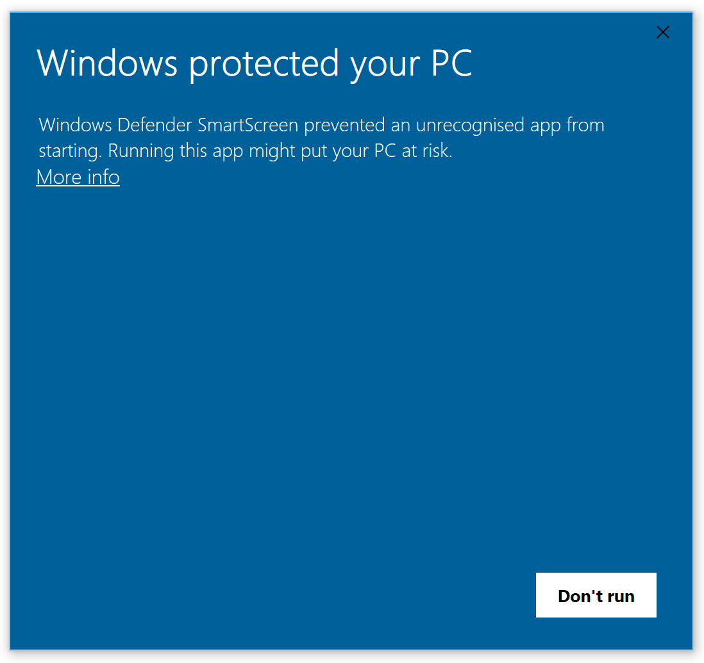

# Safe downloads

*Most malware doesn't break in — you install it. Where dangerous files come from, why 'free' and 'cracked' are the two most expensive words online, and the checks that keep your machine clean.*

> Here's the plot twist about viruses: your computer almost never catches one. You *feed*
> it one — by double-clicking a file you chose to download. The scary movie image of
> malware sneaking through the walls is mostly fiction; the real story is a person clicking
> "Run" on something they wanted, from somewhere they shouldn't have trusted. Which is
> oddly good news: if the danger comes through a door you open, then knowing which doors to
> keep shut is the entire defense. This note is that set of doors.

> **In real life**
>
> A download is **eating food from a stranger.** From a sealed package at a reputable shop
> (the official app store, the software maker's own site), it's almost certainly fine. From
> an unmarked container handed to you in an alley because it's "free" (a random download
> site, a cracked program, an email attachment you didn't expect), you have no idea what's
> in it — and by the time you find out, you've swallowed it. **Malware**: Malicious software — viruses, ransomware, spyware, trojans. Software written to harm you or steal from you, usually delivered as a file you're tricked into running.
> is the poison in the alley container. The defense isn't a stronger stomach (antivirus,
> the next note, is only a backup); it's the simple habit of eating from reputable
> kitchens. Where a file comes from matters far more than what it claims to be.

## Where malware actually comes from

Almost all of it arrives through a handful of doors you can learn to recognize:

- **"Free" versions of paid things** — free Photoshop, cracked games, pirated movies,
  "premium unlocked" apps. The bait is the price; the payload is the malware. If you're
  not paying with money, you may be paying with your machine.
- **Fake download buttons** — a page with five giant green "Download" buttons, four of
  which are ads/malware and one of which (small, plain) is the real file. Sketchy sites
  monetize your confusion.
- **Unexpected email attachments** — the phishing note's cousin: an invoice, a "delivery
  receipt", a resume you didn't ask for. Opening it runs the payload.
- **Fake installers and updates** — "Your Flash Player is out of date, click to update"
  (Flash has been dead since 2020). Real updates come from the software itself or the OS,
  never a random web pop-up.

Notice the common thread: every one is an *untrusted source* dressed up as a desirable or
urgent download. The fix is upstream of any scanner — control the source.


*Windows protected your PC (SmartScreen) — Wikimedia Commons, Public domain. [Source](https://commons.wikimedia.org/wiki/File:Windows_protected_your_pc.png)*
- **'Windows protected your PC' — the OS stopped it** — Not your browser: the operating system, at the moment you tried to RUN the file. Download and execution are two separate checks, and this is the second one. Reaching this screen means the file is already on your disk — the danger is the next click, not the download.
- **'prevented an unrecognised app from starting'** — Read the actual words. Not 'this is a virus' — 'unrecognised'. SmartScreen checks a reputation database: has this exact file been seen, signed, and downloaded widely before? A brand-new file, or one from a developer who never paid for a code-signing certificate, is unrecognised. Rare plus executable plus unexpected source is the danger trifecta — but 'unrecognised' alone also describes plenty of legitimate niche software.
- **'More info' — where the dangerous button hides** — This is the whole design. The dialog shows you ONE button, and it is the safe one. 'Run anyway' exists, but only after you click this link — a deliberate speed bump, because the people who get infected are the people who click without pausing. The attacker's entire remaining plan is to talk you through clicking here. If a stranger, a popup or an 'IT support' caller is telling you how to get past this screen, that is the attack, in progress, right now.
- **'Don't run' — the safe default, and the only visible button** — Nothing is lost by pressing it. The file stays on disk; you can always fetch the real thing from the official source afterwards. 'When in doubt, throw it out' costs nothing and prevents almost every self-inflicted infection. Make this your reflex on any unexpected or flagged file.
- **The X — closing is also declining** — Dismissing the dialog does NOT run the app. There is no 'accidentally allowed it' path here, which is good design worth noticing: the destructive action requires two deliberate clicks and a link, while every lazy exit is safe. Compare that to the dialogs your own product ships.

## The two most expensive words online: "free" and "cracked"

The strongest predictor of a malware infection isn't a weak antivirus — it's a visit to
get software without paying for it. Cracked apps, keygens, pirated media, and "premium
unlocked" downloads are the number-one delivery channel for malware, and the reason is
simple economics: someone has to profit from giving you a $600 program for free, and the
profit is your machine — ransomware, a botnet, stolen passwords, mined crypto. The "free"
download is the bait in a trap where you are the product.

This isn't a lecture about piracy ethics; it's a threat model. The same instinct that
says "an unmarked pill from a stranger is a bad idea" should fire at "cracked Adobe suite,
free download, no virus we promise." Reputable software from reputable sources — official
sites, real app stores — is the boring habit that prevents the dramatic disaster.

**Deciding whether to open a download — press Play**

1. **📥 A file wants to be downloaded** — An attachment, a download button, an 'update' pop-up. Before anything else, one question: did I deliberately go looking for this, from a source I chose? Or did it come to me, unexpected? Unexpected downloads start on the back foot.
2. **🏛️ Check the SOURCE first** — Is it the official site (the software maker's own domain) or a real app store (Apple, Google, Microsoft)? Or a random download portal, an email attachment, a 'free/cracked' site? Source is 90% of the decision — a clean-looking file from a bad source is still a bad bet.
3. **📄 Check the FILE TYPE** — Is it an executable (.exe/.msi/.dmg/.apk) — a program that can do anything? Or a document? Executables from anywhere but an official source deserve deep suspicion. And an .exe disguised with a document icon, or 'invoice.pdf.exe', is a classic trick — check the real extension.
4. **🔬 Doubt? Scan it before opening** — Upload the file to virustotal.com — it checks against 70+ antivirus engines for free without running it. Not foolproof (brand-new malware can slip through), but a strong second opinion on anything you're unsure about. Scan first, open second.
5. **✅ Official source + expected + scanned = open** — Deliberately sought, from the official source, right file type, and (if unsure) scanned clean — now it's reasonable to open. The check took thirty seconds. The infection it prevents can cost your files, your passwords, or a ransom. Cheap insurance.

*Try it — a download risk-scorer built from the real signals*

```python
# Score a download's risk from the signals that actually predict malware.

def download_risk(source, file_ext, was_expected, browser_flagged):
    risk = 0
    reasons = []
    trusted_sources = ('official-site', 'app-store')
    if source not in trusted_sources:
        risk += 3; reasons.append('untrusted source (' + source + ')')
    if source in ('cracked-site', 'random-portal', 'email-attachment'):
        risk += 2; reasons.append('high-risk source type')
    executables = ('.exe', '.msi', '.dmg', '.pkg', '.apk', '.bat', '.scr')
    if file_ext in executables:
        risk += 2; reasons.append('executable file (can run anything)')
    if not was_expected:
        risk += 2; reasons.append('unexpected / came to me')
    if browser_flagged:
        risk += 3; reasons.append('browser/OS flagged it')
    return risk, reasons

cases = [
    ('the real thing', 'official-site', '.dmg', True,  False),
    ('cracked Photoshop', 'cracked-site', '.exe', False, True),
    ('surprise invoice.exe', 'email-attachment', '.exe', False, True),
]
for name, src, ext, expected, flagged in cases:
    r, why = download_risk(src, ext, expected, flagged)
    verdict = 'OPEN (low risk)' if r <= 1 else ('CAUTION' if r <= 4 else 'DO NOT OPEN')
    print(name.ljust(22), 'risk', r, '->', verdict)
    for w in why: print('      -', w)
    print()
print("The pattern: an executable, unexpected, from an untrusted source, that the")
print("browser flagged, is the malware jackpot. The real thing from an official")
print("source barely registers. Source and expectation matter more than the scan.")
```

> **Tip**
>
> Two free habits stop almost every self-inflicted infection. First: **get software from
> the source, always** — go to the maker's official website (type it yourself) or a real app
> store, never a 'download XYZ free' portal that ranks high because it pays for ads. Second:
> **when unsure, scan before you open** — drop the file (or paste a download link) into
> virustotal.com, which runs it past 70+ antivirus engines without executing it, for free.
> And a bonus reflex for attachments: nobody legitimate sends you a .exe by email. An
> executable attachment is a red flag by itself, regardless of who it claims to be from.

### Your first time: First time? Build safe-download instincts

- [ ] Find the OFFICIAL source for one app — Pick software you use and find the maker's real website (search the name + 'official site', check the domain is really theirs). Bookmark it. Next time you need it, you go here — not to whatever download portal ranks first.
- [ ] Learn to read a file extension — Turn on 'show file extensions' in your OS settings if hidden. Practice spotting executables (.exe, .msi, .dmg, .apk) vs documents. Watch for double extensions like 'photo.jpg.exe' — the real type is the LAST one, and that one's a program.
- [ ] Scan a file on VirusTotal — Go to virustotal.com and upload any harmless file (or paste a download link). See the report from dozens of engines. Now you know the tool exists and how to use it BEFORE the day you actually need it on a suspicious file.
- [ ] Recognize a fake download page — Search for any 'free' download and notice the page with five 'Download' buttons — most are ads/malware. The real link is usually small and plain. Learn to feel the sketchiness of these pages; that instinct is protection.
- [ ] Read a real browser warning — If you ever see 'this file is uncommon and may be dangerous', read it as the safety net it is. Practice the reflex: flagged + unsure = Delete, then re-get from the official source. Never hunt for the 'keep anyway' option on a file you didn't fully trust.

Fifteen minutes and downloading stops being a gamble — you'll source from official
kitchens and scan the questionable plates before tasting.

- **“My browser blocked a download I actually want — how do I know if it's safe?”**
  First, respect the warning enough to check rather than just overriding it. Where did it come from? If it's the OFFICIAL source (the maker's own site or a real app store), it's likely a false positive — new or niche software is sometimes flagged just for being 'uncommon'. Verify you're on the real domain, then you can proceed with more confidence, ideally after a VirusTotal scan. If it came from anywhere else — a portal, a 'free/cracked' site, an email — believe the warning and delete it. The source decides whether the block is overcautious or lifesaving.
- **“I think I ran something bad — my computer is slow / pop-ups / files renamed.”**
  Act quickly. 1) Disconnect from the internet (Wi-Fi off) to stop it phoning home or spreading. 2) Run a full scan with your antivirus / the built-in one (Windows Defender is solid; next note covers this). 3) If files are encrypted with a ransom demand, do NOT pay — disconnect, and seek reputable help; paying rarely returns files and funds the next attack. 4) Change important passwords FROM A DIFFERENT, CLEAN DEVICE (the infected one may be logging your keystrokes). 5) When in doubt about a serious infection, a full OS reinstall from a clean backup is the reliable cure. Prevention was cheaper; recovery is still possible.
- **“An email attachment looks like a normal document — is it safe to open?”**
  Depends on two things: did you expect it, and what's the real file type? An unexpected attachment, even from a known contact (whose account may be compromised), deserves suspicion — this is the phishing note in file form. Check the true extension (watch for 'invoice.pdf.exe'). Documents can also carry danger: if a Word/Excel file asks you to 'Enable Macros/Editing' to see content, that's a classic malware trigger — don't. When unsure, confirm with the sender through another channel before opening, or scan it on VirusTotal first.
- **“A website says my computer is infected and I need to download their cleaner NOW.”**
  That pop-up IS the scam — a website cannot actually scan your computer, so any page claiming 'VIRUS DETECTED, download our fix' is lying to make you install THEIR malware (this is 'scareware', the phishing note's urgency trick applied to downloads). Don't download anything it offers, don't call any number it shows. Close the tab (force-quit the browser if it won't close). Your real antivirus lives on your computer, not in a web pop-up. The 'cure' it's pushing is the disease.

### Where to check

Before opening any download:

- **The source, first and most** — official site (typed/bookmarked) or a real app store? Or a portal / 'free-cracked' site / unexpected attachment? Source is most of the risk.
- **The real file extension** — executable (.exe/.msi/.dmg/.apk) or document? Watch for double extensions ('file.pdf.exe' — the last one is the truth). Turn on 'show extensions'.
- **Was it expected** — did you go get it, or did it come to you? Unexpected downloads and attachments start guilty.
- **The browser/OS warning** — a flag means uncommon or known-bad. Heed it; delete and re-get from official rather than overriding.
- **VirusTotal** (virustotal.com) — scan the file or link against 70+ engines when unsure. A strong second opinion, without running the file.

### Worked example: the free game that cost everything — a ransomware trace

Someone downloads a 'free' copy of a $60 game from a site that promised 'no virus, 100%
working'. Two days later, every document has a weird extension and a note demands $400 in
crypto. Here's what happened, and what should have:

1. **The source was the whole mistake.** Not an official store — a piracy site whose
   business model is monetizing downloads. 'Free paid software' is the single highest-risk
   category online, precisely because someone must profit, and the profit is the victim.
2. **The file was an executable.** A .exe that had to be run to 'install the game'. Running
   it ran the ransomware with the user's full permissions — which is why executables from
   untrusted sources are the danger. A document couldn't have done this so easily.
3. **The warnings were overridden.** The browser flagged it ('uncommon, possibly
   harmful'); the user clicked past to 'Run anyway' because they wanted the game. Every
   safety net fired and was ignored in sequence. The system tried to help four times.
4. **The correct response now:** disconnect from the internet, do NOT pay (payment rarely
   recovers files and funds more attacks), and restore from a clean backup — which is why
   the backup habit from the cloud-storage note quietly saved people who had one. Without a
   backup, the files may simply be gone.
5. **What would have prevented all of it:** getting the game from an official store (or not
   at all), never running a flagged executable from a piracy site, and — the safety net —
   a recent backup. Not one of these is technical wizardry; they're the boring habits this
   note is made of.
6. **The lesson:** the malware didn't break in. It was downloaded, from a bad source, as
   an executable, past four warnings. Every link in that chain was a door the user opened —
   and every one is a door this note teaches you to keep shut.

> **Common mistake**
>
> Chasing 'free' versions of paid software — the single most reliable way to infect your own
> computer. Cracked apps, keygens, 'premium unlocked' downloads, and pirated media are the
> number-one malware delivery channel on the internet, for an unavoidable reason: giving away
> expensive software has to pay for itself somehow, and the payment is your machine —
> ransomware, stolen passwords, a spot in a botnet, mined cryptocurrency. The person offering
> you $600 of software for free is not your friend; you are the product, and the 'no virus,
> we promise' banner is part of the con. This isn't about piracy morality — it's a threat
> model. The boring alternative (official sources, real app stores, paying for or finding
> genuinely free/open-source tools) is what keeps the dramatic disaster from ever starting.
> Free-and-cracked are the two most expensive words online.

**Quiz.** What single factor most reliably predicts whether a download is dangerous?

- [ ] The file's size — big files are more dangerous
- [x] The SOURCE it came from — an official site or real app store is far safer than a random portal, a 'free/cracked' site, or an unexpected attachment
- [ ] Whether the file has a colorful icon
- [ ] How fast it downloads

*Source is most of the risk. The same file is safe from the maker's official site and dangerous from a piracy portal — because malware is delivered by dressing an untrusted source up as a desirable or urgent download. Size, icon, and speed tell you nothing (an icon is trivially faked, and 'invoice.pdf.exe' wears a document icon on purpose). Get software from official sources and real app stores, treat unexpected attachments and 'free/cracked' downloads as guilty, check the real file extension, and scan on VirusTotal when unsure. Where a file comes from matters far more than what it claims to be.*

- **How malware really arrives** — Not by breaking in — by you running a downloaded file. 'Free/cracked' software, fake download buttons, unexpected attachments, fake 'update' pop-ups. Malware is fed to a machine, not caught.
- **Malware** — Malicious software (viruses, ransomware, spyware, trojans) written to harm or steal from you, usually delivered as a file you're tricked into running.
- **The #1 rule: source** — Official site (typed/bookmarked) or a real app store = safe. Random portal, 'free/cracked' site, unexpected attachment = dangerous. Source is ~90% of the decision.
- **Executables are riskiest** — .exe/.msi/.dmg/.pkg/.apk are programs — running one lets it do anything your account can. Watch for double extensions ('file.pdf.exe' — the last one is the truth).
- **'Free' and 'cracked'** — The #1 malware delivery channel. Giving away paid software profits from YOUR machine — ransomware, stolen passwords, botnets. Not friends; a trap where you're the product.
- **VirusTotal + Delete reflex** — Unsure? Scan the file/link at virustotal.com (70+ engines, no execution). Flagged or unexpected? Delete it and re-get from the official source — 'when in doubt, throw it out' costs nothing.

### Challenge

Harden your download habits tonight. (1) Turn on 'show file extensions' in your OS and
practice spotting executables vs documents. (2) Find and bookmark the OFFICIAL site for two
apps you use, so you never source them from a portal again. (3) Scan any file on
virustotal.com to learn the tool before you need it. (4) Search a 'free download' of some
paid software (don't download) and count the fake 'Download' buttons on the page — feel the
sketchiness. Write down the two official sites you bookmarked and one fake-download tactic
you spotted. You've just closed the doors that let in most self-inflicted malware.

### Ask the community

> Download question: I want to download [what] and got it from [source]. The file is [extension], I [did/didn't] expect it, and my browser [did/didn't] flag it. VirusTotal says [result if scanned]. Is it safe to open?

Lead with the SOURCE and the file EXTENSION — 'official app store, .dmg' versus 'free-
crack site, .exe' answers the safety question before anyone reads the rest, because where
it came from and whether it's an executable are the two signals that actually predict risk.

- [GCFGlobal — how to avoid malware](https://edu.gcfglobal.org/en/internetsafety/how-to-avoid-malware/1/)
- [VirusTotal — scan a file or link against 70+ engines (free)](https://www.virustotal.com/)
- [How scams and malicious files reach you](https://www.youtube.com/watch?v=XBkzBrXlle0)

🎬 [How online scams and malicious files reach you](https://www.youtube.com/watch?v=XBkzBrXlle0) (6 min)

- Malware is almost always downloaded and run by you, not sneaked in — which means knowing which sources to trust is the whole defense.
- The source predicts the risk: official sites and real app stores are safe; random portals, 'free/cracked' sites, and unexpected attachments are dangerous.
- Executables (.exe/.msi/.dmg/.apk) are the riskiest file type because running one lets it do anything your account can — watch for disguised double extensions.
- 'Free' and 'cracked' software is the number-one malware delivery channel: giving away paid software profits from your machine. You are the product.
- When unsure: heed browser warnings, scan on VirusTotal, and default to Delete-and-re-get-from-official. Antivirus (next note) is only the backup to these habits.


---
_Source: `packages/curriculum/content/notes/digital-literacy-and-safety/staying-safe-online/safe-downloads.mdx`_
