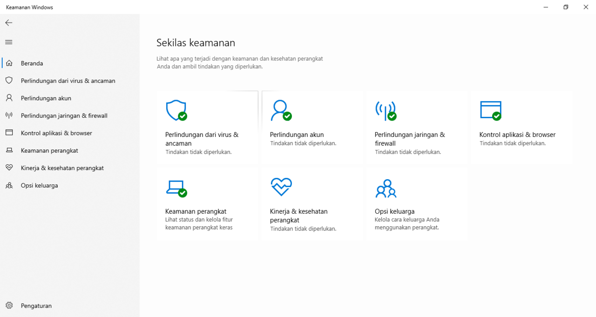

# Updates & antivirus

*The boring 'Update now' button is the most powerful security tool you own — and the antivirus you already have is probably enough. Why patching beats everything, and why you rarely need to buy protection.*

> The single most effective security action in this entire module isn't a clever password or
> a hardware key. It's clicking the "Update now" button you keep dismissing. Most successful
> attacks don't use some genius new exploit — they walk through a hole that was found, fixed,
> and announced *months ago*, on machines whose owners hit "Remind me later" one too many
> times. The second most effective action costs nothing too: realizing the antivirus already
> built into your computer is, for most people, all you need. This note is about the two
> defenses you're most likely to neglect and least likely to have to pay for.

> **In real life**
>
> A software update is **fixing a lock the burglars already know how to pick.** When a
> weakness is discovered in software, it gets publicly documented — which means the fix AND
> the attack are announced at the same time. The update is the new, un-pickable lock; until
> you install it, your door still has the old one, and every burglar has read the manual on
> how to open it. The fix for a known hole is called a
> **security patch**: A software update that closes a specific known security hole (a vulnerability). Once a patch is released, the flaw is public — so unpatched machines are actively easier to attack, not just theoretically.,
> and 'I'll update later' is 'I'll keep the lock everyone knows how to pick, a while longer.'
> Attackers count on exactly that delay.

## Why 'update later' is the expensive choice

Here's the uncomfortable mechanic: when a vulnerability is patched, the patch itself tells
attackers what the hole was. Security researchers and criminals both read the release
notes. So the moment an update ships, a race starts — defenders installing it versus
attackers rushing to exploit everyone who hasn't. Every day you delay, you're on the losing
side of a race you didn't know you'd entered.

The numbers are stark: the large majority of successful breaches exploit vulnerabilities for
which a patch was *already available but not applied*. Not mysterious zero-day genius —
just unpatched machines. Which flips the usual feeling about updates: they're not an
annoying interruption to your work, they're the highest-return security habit you have, and
the interruption is the price of not being the easy target. Turn on automatic updates and
the whole problem mostly solves itself while you sleep.


*Screenshot: Windows Security dashboard — Wikimedia Commons, Public domain. [Source](https://commons.wikimedia.org/wiki/File:Windows_defender.png)*
- **Virus & threat protection — already built in** — This is the antivirus that ships free with the operating system (Windows Defender on Windows; macOS has its own quiet protections). For the vast majority of people it's genuinely enough — it's well-regarded, always on, and updates itself. You very likely do NOT need to buy a separate antivirus, despite what the pop-ups insist.
- **The green check — 'no action needed'** — Green means protected: real-time scanning is on and definitions are current. This is the state you want, and checking it takes five seconds. The reassuring part: if you keep the OS updated and this green, you've done most of what antivirus can do for you, for free.
- **Where you run a manual scan** — The virus & threat protection section lets you run an on-demand scan if you're worried about a specific file or after a scare (the safe-downloads note). Real-time protection catches most things automatically; the manual scan is your 'check this now' button for peace of mind.
- **Firewall — a different layer** — Antivirus checks files; the firewall controls network connections in and out. Both ship built-in and both should stay green. Security is layers: updates close known holes, antivirus catches malicious files, the firewall guards the network door. No single one is 'the' protection — together they're defense in depth.
- **One dashboard, kept current by updates** — This whole security system is part of the operating system — which is exactly why OS updates matter: they patch not just apps but the security tools and the OS itself. An up-to-date system with the built-in protection green is, for most people, the entire antivirus strategy they need.

## The antivirus truth nobody selling antivirus will tell you

Your computer almost certainly came with capable antivirus already built in and running —
Windows Defender is genuinely good and independently well-rated; macOS has layered
protections of its own. For a normal person with sensible download habits (the previous
note), that built-in protection plus keeping everything updated is, honestly, enough. The
loud pop-ups insisting you must buy a premium suite are often the least trustworthy things
on your screen — and some 'free antivirus' downloads are malware wearing a security costume.

This reframes antivirus correctly: it's the *backup*, not the front line. Your habits are
the front line — get software from official sources, don't run flagged executables, don't
click phishing links, keep everything patched. Antivirus catches what slips past those.
A person with good habits and the built-in antivirus is far safer than a person with
careless habits and an expensive suite, because most infections are invited in, and no
scanner reliably catches what you personally chose to run.

**The lifecycle of a vulnerability — and where updating saves you — press Play**

1. **🕳️ A flaw exists (unknown)** — Some software has a security hole nobody has noticed yet. You're technically exposed, but so is everyone, and no one is exploiting it because no one knows. This is the calm before — and it doesn't last.
2. **🔍 The flaw is discovered** — A researcher (or a criminal) finds it. If a good-faith researcher, they quietly tell the vendor first. A fix gets built. So far, still relatively safe — the hole isn't public yet.
3. **📢 The patch ships — and goes public** — The vendor releases an update. But publishing the fix ALSO reveals the hole to everyone, including attackers who now know exactly what to target. The race starts here: this is the moment 'update now' vs 'later' actually matters.
4. **🏃 Attackers hunt the unpatched** — Within hours or days, automated tools scan the internet for machines that haven't installed the patch. Unpatched = a known, documented, easy target. Most real breaches happen right here, to people who delayed a fix that already existed.
5. **✅ You updated — you're off the board** — Because your updates are automatic (or you clicked promptly), the hole is closed before the hunters reach you. The exploit that's compromising the procrastinators does nothing to you. You won the race by not treating it as optional. That's the whole value of 'update now'.

*Try it — the patch race, and why delay is the risk*

```python
# When a patch ships, attackers race to exploit whoever hasn't applied it.
# Model two users: one auto-updates, one delays.

patch_released_day = 0
exploit_widespread_day = 2   # attackers weaponize public patches fast

def outcome(name, days_until_user_updates):
    if days_until_user_updates <= exploit_widespread_day:
        status = 'SAFE  -- patched before attackers arrived'
    else:
        exposed = days_until_user_updates - exploit_widespread_day
        status = 'BREACHED -- was an unpatched known target for ' + str(exposed) + ' day(s)'
    print(name.ljust(22), 'updates on day', days_until_user_updates, '->', status)

print('A vulnerability is patched on day 0. Attacks go wide by day 2.')
print()
outcome('Auto-update user', 0)     # applies it the day it ships
outcome('Updates weekly', 5)
outcome('\"Remind me later\" x10', 14)
print()
print('The flaw was the SAME for all three. The only variable was delay.')
print('This is why ~most breaches exploit an ALREADY-PATCHED hole: the fix')
print('existed, the victim just had not installed it. Auto-update turns this')
print('race into one you win automatically, without thinking about it.')
```

> **Tip**
>
> Do two things and you've handled 90% of this note. First: **turn on automatic updates**
> everywhere — your operating system (Windows Update / macOS Software Update / phone system
> updates), your browser (it usually self-updates — let it), and your apps (enable auto-update
> in the app store). Set them to install overnight and stop thinking about it. Second: **check
> that your built-in antivirus is on and green** (Windows Security / macOS is handled quietly)
> and do NOT rush out to buy a suite — you probably don't need one. Ignore any web pop-up
> screaming that you're infected and must download a cleaner; that's the scam, not the
> solution. Automatic updates plus the built-in protection is a genuinely strong, genuinely
> free security posture.

### Your first time: First time? Set 'update itself' and forget it

- [ ] Turn on OS automatic updates — Windows: Settings → Windows Update → turn on automatic. Mac: System Settings → General → Software Update → enable automatic. Phone: Settings → System/Software update → automatic. This one setting patches the most important layer while you sleep.
- [ ] Let your browser auto-update — Chrome, Firefox, Edge, Safari all update themselves — don't disable it. Your browser is your most-exposed program (it runs code from every site you visit), so its patches matter most. Just relaunch when it asks.
- [ ] Enable app auto-updates — In your phone's app store and on desktop, turn on automatic app updates. Apps have holes too, and the ones you use daily are worth keeping current without manual effort.
- [ ] Check your built-in antivirus is green — Windows: open 'Windows Security' and confirm 'Virus & threat protection' shows a green check. Mac: protections are on by default. Confirm it's running — and resist buying a paid suite you likely don't need.
- [ ] Ignore (and recognize) the fake-virus pop-ups — A web page claiming 'YOUR PC IS INFECTED, download our cleaner' is always a scam (a website can't scan your computer). Close the tab; never download what it offers. Your real antivirus lives on your machine, not in a browser pop-up.

Fifteen minutes of toggles and your machine now patches its own locks automatically and
watches for threats for free — the two neglected defenses, handled.

- **“Updates take forever and always interrupt me at the worst time.”**
  Fair, and fixable. Set 'active hours' so updates install overnight or when you're not working (Windows and Mac both support this). Keep the machine plugged in and on when you step away so it can finish. Yes, occasionally an update forces a restart — but weigh a ten-minute reboot against being the easy target for a known exploit. The interruption is real; being breached is worse. Schedule it, don't skip it.
- **“A pop-up says my computer is badly infected and I must download a cleaner / call a number.”**
  That is the scam, full stop — scareware. A website cannot scan your computer, so any page claiming to have found viruses is lying to make you install THEIR malware or hand money to a fake 'support' line. Don't download anything, don't call the number. Close the tab (force-quit the browser if it traps you; reopen and don't restore tabs). Then, if you want reassurance, run YOUR real built-in antivirus. The pop-up's 'cure' is the disease.
- **“Do I need to buy antivirus? The free trial that came with my laptop expired.”**
  Almost certainly not. The trial that expired is a paid product nudging you to subscribe; meanwhile the operating system's OWN antivirus (Windows Defender / macOS protections) is already there, free, always current, and well-rated. Let the trial lapse and confirm the built-in one is on. Buying a suite adds marginal benefit for most people and sometimes adds bloat. Your download habits and updates do far more for your safety than any paid scanner.
- **“An old device / program won't get updates anymore — is that a problem?”**
  Yes, and it's worth taking seriously: 'end of life' software stops receiving security patches, so newly-discovered holes are NEVER fixed — it only gets more dangerous over time as exploits accumulate. For an old phone or OS past support, the safe move is to upgrade or replace it, or at least stop using it for anything sensitive (banking, email). An unpatched, unsupported device on your network is a permanent open door. Retire it from important tasks.

### Where to check

Keeping the two neglected defenses handled:

- **Automatic updates: on** — OS, browser, and apps. The highest-return security setting; confirm it's enabled and set to install off-hours.
- **Built-in antivirus: on and green** — Windows Security / macOS protections. Confirm it's running; you very likely don't need a paid one.
- **The firewall: on** — usually on by default (green in the same dashboard). A second layer guarding network connections.
- **End-of-life software** — anything no longer receiving updates (old phones/OS) is a growing risk; upgrade or stop using it for sensitive things.
- **Fake-infection pop-ups: ignored** — a web page can't scan your PC. Recognize scareware and close it; never download its 'cleaner'.

### Worked example: the breach that a two-month-old patch would have stopped

A small organization gets hit — files encrypted, ransom demanded, operations down. The
post-mortem is depressingly common, and every step traces back to this note:

1. **The entry point was a known vulnerability.** The attackers used an exploit for a
   server flaw that had been patched by the vendor two months earlier. Nothing novel — a
   documented, fixed hole.
2. **The patch existed but wasn't applied.** The update had been available for eight weeks.
   It kept getting deferred — 'we'll schedule the reboot next maintenance window' — and the
   window kept slipping. The door stayed unlocked long after the new lock was delivered.
3. **Automated tools found them.** Attackers don't hand-pick victims for known exploits;
   they scan the whole internet for unpatched machines and hit every match. An unpatched,
   internet-facing system is found in hours, not by luck but by industrial scanning.
4. **Antivirus wasn't the missing piece.** People asked 'didn't the antivirus catch it?' —
   but this wasn't a downloaded file to scan; it was a network exploit of an unpatched hole.
   No scanner closes a hole only a patch can close. Updates and antivirus defend different
   things; this was an updates failure.
5. **What would have prevented it:** applying the patch when it shipped — ideally
   automatically. A ten-minute maintenance reboot two months earlier versus days of
   downtime, a ransom, and lost data. The cheapest security action, skipped, became the
   most expensive incident.
6. **The lesson, scaled down to you:** the same mechanic runs on your laptop and phone.
   'Update later,' repeated, is how known holes stay open long enough for the automated
   hunters to walk in. Auto-update is you winning that race in your sleep — which is exactly
   why it's the highest-value habit in this whole module.

> **Common mistake**
>
> Treating updates as an optional annoyance to defer indefinitely, while treating antivirus as
> the thing that keeps you safe. It's backwards. Updates are the front-line defense — they
> close known holes that attackers are actively exploiting, and 'the large majority of
> breaches use an already-available patch that wasn't applied' is the whole story of most real
> attacks. Antivirus is the backup that catches malicious files, not the network exploits and
> unpatched holes that cause most breaches. So the person who diligently runs a paid antivirus
> but clicks 'remind me later' on every update for months has optimized the backup and
> neglected the front line. Flip it: turn on automatic updates (the powerful, free,
> set-and-forget defense), keep the built-in antivirus green (also free), and put your real
> effort into the habits from the last few notes. The boring 'Update now' button is the most
> underrated security tool you own.

**Quiz.** Why does 'the large majority of breaches exploit an already-patched vulnerability' make updating so important?

- [ ] Because updates add new features that distract attackers
- [x] Because once a patch ships, the flaw becomes public knowledge — so every day you delay installing it, your machine is a known, documented, easy target that automated tools actively hunt
- [ ] Because antivirus stops working if you don't update it
- [ ] Because old software runs slower

*Publishing a patch also reveals the hole it fixes — to defenders and attackers alike. So the moment an update ships, a race begins: install it, or become a known target that automated tools scan the internet to find and exploit. Most real breaches aren't clever zero-days; they're unpatched machines hit through holes that were fixed weeks or months earlier. That's why 'update later' is genuinely the risky choice and automatic updates are the single highest-return security habit — they win the race for you without you thinking about it. It's not about features or speed, and antivirus (which defends a different layer) can't close a hole that only a patch can.*

- **Security patch** — An update that closes a specific known security hole. Once released, the flaw is PUBLIC — so unpatched machines become documented, actively-hunted targets, not just theoretically exposed.
- **Why 'update later' is risky** — Publishing a patch reveals the hole. Most breaches exploit an already-available patch that wasn't applied. Every day of delay = a known easy target. Auto-update wins the race for you.
- **The antivirus truth** — The built-in antivirus (Windows Defender / macOS protections) is free, always on, well-rated, and enough for most people. You rarely need a paid suite; some 'free antivirus' downloads are malware.
- **Front line vs backup** — Updates + good habits are the front line (close holes, avoid bad files). Antivirus is the backup that catches what slips past. Most infections are invited in — no scanner reliably catches what you chose to run.
- **Scareware** — A web pop-up claiming 'YOUR PC IS INFECTED, download our cleaner / call this number' is always a scam — a website can't scan your PC. Close the tab; never download its 'fix'.
- **The two-toggle defense** — 1) Turn on automatic updates (OS, browser, apps) to install off-hours. 2) Confirm the built-in antivirus is on and green. Free, set-and-forget, and covers most of the risk.

### Challenge

Automate your two neglected defenses tonight. (1) Turn on automatic updates for your OS,
your browser, and your phone's apps — set them to install overnight. (2) Open your built-in
security dashboard (Windows Security / macOS) and confirm virus protection and the firewall
are green. (3) If a paid antivirus trial is nagging you, note that you likely don't need it.
(4) Look up whether any device you own is past its update support ('end of life') — if so,
plan to stop using it for banking and email. Write down what you set to auto-update and
whether your built-in antivirus is green. You've just handled the highest-return, lowest-
effort security habit there is — the one most people skip.

### Ask the community

> Updates/antivirus question: on [device/OS], I'm unsure about [auto-updates / whether I need paid antivirus / a scary pop-up / an old unsupported device]. Right now automatic updates are [on/off], my built-in antivirus is [green/unknown], and [what prompted the question]. What should I do?

Say whether automatic updates are on and whether your built-in antivirus is green — those
two facts answer most questions here, because for the large majority of people 'auto-update
on + built-in antivirus green' IS the correct, complete, free security setup.

- [GCFGlobal — how to update your software](https://edu.gcfglobal.org/en/basic-computer-skills/how-to-update-your-software/1/)
- [National Cybersecurity Alliance — why & how to update](https://www.staysafeonline.org/articles/software-updates)
- [The importance of software updates](https://www.youtube.com/watch?v=I21PMZwL0fI)

🎬 [The importance of software updates](https://www.youtube.com/watch?v=I21PMZwL0fI) (2 min)

- Updating is the highest-return security habit you have: most breaches exploit holes for which a patch already existed but wasn't applied. Turn on automatic updates everywhere.
- Publishing a patch reveals the flaw, so 'update later' makes you a known, actively-hunted target. Auto-update wins that race for you, off-hours, without thinking.
- The antivirus built into your OS (Windows Defender / macOS protections) is free, always on, and enough for most people — you rarely need to buy a suite.
- Updates and good habits are the front line; antivirus is the backup that catches what slips past. Most infections are invited in, which no scanner reliably stops.
- Fake 'your PC is infected' pop-ups are scareware — a website can't scan your computer. Close the tab; never download its 'cleaner'.


---
_Source: `packages/curriculum/content/notes/digital-literacy-and-safety/staying-safe-online/updates-and-antivirus.mdx`_
