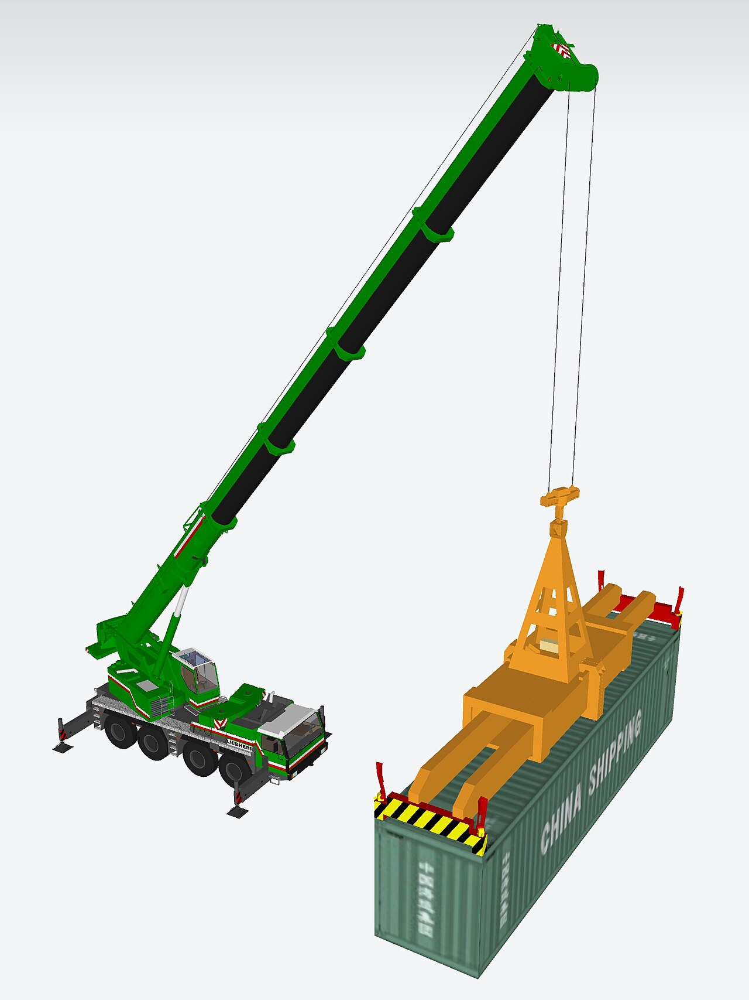

# Install Docker and make the first run

*Verify the client-daemon boundary, run a pinned hello-world container, and capture enough evidence to distinguish installation failures from image and runtime failures.*

> Seeing a Docker version proves the CLI binary runs. It does not prove the daemon is reachable, the image can be pulled, or a container process can start.

> **In real life**
>
> The CLI is a remote control; the Docker daemon is the appliance. Reading the brand on the remote does not prove the appliance has power.

**client-daemon boundary**: Docker uses a client-server architecture: the CLI sends API requests to a Docker daemon, which manages images, networks, volumes, and containers locally or remotely.

## Prove each layer

1. Install Docker Desktop on supported desktop systems or Docker Engine through the supported Linux path.
2. Run `docker version`; require both Client and Server sections.
3. Run `docker info` and inspect server platform, architecture, and storage.
4. Pull and run a deliberate image reference such as `hello-world:latest` for learning.
5. Inspect the stopped container and remove it after collecting evidence.

> **Tip**
>
> Follow the current platform-specific install page. Package names, virtualization requirements, and supported versions change.

> **Common mistake**
>
> Adding users to the Linux `docker` group without recognizing that it grants root-level daemon control.


*Mobile container crane — Kcida10, CC0 1.0. [Source](https://commons.wikimedia.org/wiki/File:Mobile_container_crane.jpeg)*
- **Client request** — The CLI asks the daemon to create and start a container.
- **Daemon work** — The engine pulls layers, configures isolation, and launches the process.
- **Visible result** — Logs and exit status show whether the workload actually ran.

**What hello-world proves**

1. **CLI reaches daemon** — The API request crosses the configured Docker context.
2. **Daemon resolves image** — A local image is used or registry layers are pulled.
3. **Container is created** — Filesystem, network, and process configuration are prepared.
4. **Process writes output and exits** — Logs persist on the stopped container until removal.

*Run it — classify first-run evidence (Python)*

```python
checks = {"client": True, "server": True, "process_exit": 0}
for name, value in checks.items():
    status = "PASS" if value is True or value == 0 else "FAIL"
    print(f"{name}: {status}")

# client: PASS
# server: PASS
# process_exit: PASS
```

*Run it — classify first-run evidence (Java)*

```java
import java.util.*;
public class Main {
  public static void main(String[] args) {
    Map<String,Integer> checks = new LinkedHashMap<>();
    checks.put("client", 1); checks.put("server", 1); checks.put("process_exit", 0);
    checks.forEach((name, value) -> {
      boolean pass = name.equals("process_exit") ? value == 0 : value == 1;
      System.out.println(name + ": " + (pass ? "PASS" : "FAIL"));
    });
  }
}
/* client: PASS
   server: PASS
   process_exit: PASS */
```

### Your first time: Your mission: make a traceable first run

- [ ] Use the official install path — Select the page for your exact OS and architecture.
- [ ] Verify client and server — Capture `docker version` without secrets.
- [ ] Run a named hello-world container — A name makes later inspection unambiguous.
- [ ] Inspect exit and logs, then remove — Prove the lifecycle rather than stopping at terminal output.

Your installation evidence now reaches the workload process.

- **The client prints a version but cannot connect.**
  Start Docker Desktop or the daemon, then inspect the active Docker context and socket permission.
- **Pull times out or returns unauthorized.**
  Check proxy, DNS, registry reachability, rate limits, and credential configuration.
- **Image platform does not match the host.**
  Choose a multi-platform image or an explicit supported platform and record emulation use.

### Where to check

- `docker context show` and `docker context inspect`.
- Client and Server sections of `docker version`.
- Docker Desktop diagnostics or Linux daemon logs.
- `docker inspect` for exit code, error, platform, and image.

### Worked example: the misleading version check

1. A new laptop prints a Docker CLI version.
2. Every `docker run` returns “cannot connect to the Docker daemon.”
3. `docker context show` reveals a stale remote context.
4. QA selects the intended local context and verifies the Server section.
5. The named hello-world container exits zero and its logs are captured.

**Quiz.** What does `docker version` prove only when it shows both Client and Server sections?

- [ ] Every image is safe
- [x] The CLI can communicate with a Docker daemon
- [ ] All containers are running
- [ ] The host matches production

*The Server section requires a successful client-daemon exchange; it does not prove broader parity or image safety.*

- **Docker client** — CLI or API consumer that sends requests.
- **Docker daemon** — Server that manages container objects and processes.
- **Docker context** — Named endpoint and connection configuration used by the client.

### Challenge

Document a four-check installation smoke test that distinguishes CLI, daemon, registry, and container-process failures.

### Ask the community

> `docker version` shows `[sections]`; context is `[name]`; first-run error is `[exact text]`. Which boundary failed?

Remove tokens, usernames, and private registry details.

- [Docker Docs — Install Docker Engine](https://docs.docker.com/engine/install/)
- [Docker Docs — Docker Desktop](https://docs.docker.com/desktop/)

🎬 [Docker Tutorial for Beginners [FULL COURSE in 3 Hours] — TechWorld with Nana](https://www.youtube.com/watch?v=3c-iBn73dDE) (166 min)

- A CLI version alone does not prove daemon connectivity.
- Install from the current official path for the exact platform.
- The first run should verify registry, runtime, logs, and exit status.
- Docker daemon access is security-sensitive.


## Related notes

- [[Notes/docker-and-containers-for-testers/containers-in-plain-words/images-containers-and-registries|Images, containers & registries]]
- [[Notes/docker-and-containers-for-testers/docker-hands-on/run-exec-logs-and-stop|Run / exec / logs / stop]]
- [[Notes/docker-and-containers-for-testers/docker-hands-on/ports-and-volumes|Ports & volumes]]


---
_Source: `packages/curriculum/content/notes/docker-and-containers-for-testers/containers-in-plain-words/install-and-first-run.mdx`_
