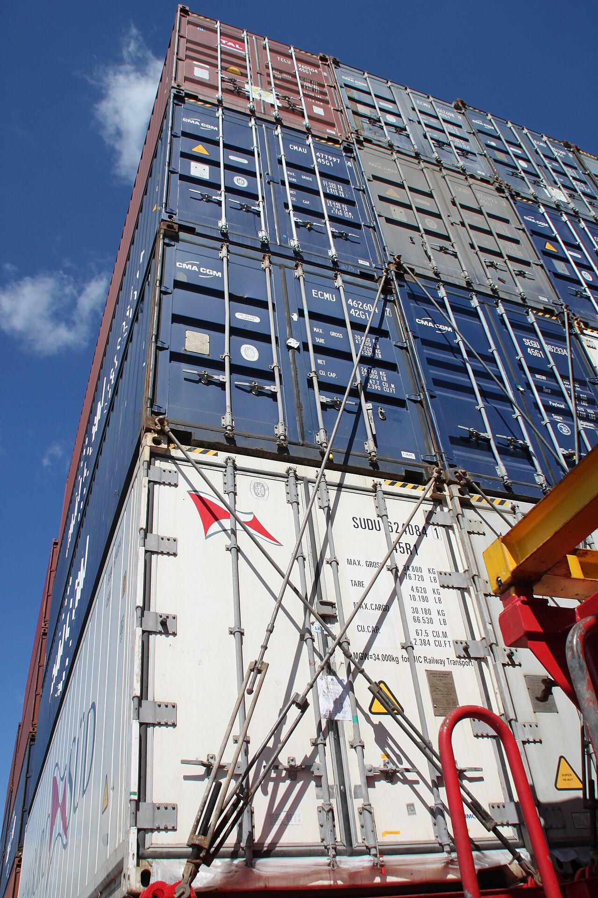

# Ports and volumes

*Separate container ports from host publishing, and separate ephemeral writable layers from bind mounts and managed volumes.*

> `EXPOSE 8080` does not publish port 8080, and deleting a container does not necessarily delete its volume. Those two misconceptions create unreachable services and mysteriously persistent test data.

> **In real life**
>
> Port publishing is a forwarding address from host to container. A volume is a storage locker whose lifetime is independent of the tenant.

**runtime attachment**: Port publishing maps a host address and port to a container port. A volume is Docker-managed persistent storage; a bind mount maps a specific host path; the container writable layer is ephemeral with the container.

## Make attachments explicit

- `-p 127.0.0.1:8080:80` maps host loopback port 8080 to container port 80.
- Omitting the host IP can publish on all host interfaces, depending on configuration.
- `--mount type=volume,src=testdb,dst=/var/lib/data` uses managed storage.
- `--mount type=bind,src=/absolute/path,dst=/work,readonly` exposes a host path.
- Remove test volumes deliberately when clean-state semantics require it.

> **Tip**
>
> Prefer `--mount` in teaching and CI because type, source, destination, and read-only intent are visible.

> **Common mistake**
>
> Publishing a database to every host interface just because a local test needs loopback access.


*Containers on MS Alexander B — Eduard47, CC BY-SA 4.0. [Source](https://commons.wikimedia.org/wiki/File:Frachtschiffreise13_Container_auf_Feederschiff_MS_%22Alexander_B%22_Ladungssicherung.jpg)*
- **Host endpoint** — Published host address controls where clients can connect.
- **Container endpoint** — Traffic is forwarded to the port where the process listens.
- **Persistent attachment** — Mounted storage can outlive the container that used it.

**Request and data paths**

1. **Client calls host port** — The published address is the external entry point.
2. **Docker forwards traffic** — The mapping targets a container IP and port.
3. **Service handles request** — The process must listen on the target interface and port.
4. **Writes reach mounted storage** — A volume or bind mount controls persistence beyond the writable layer.

*Run it — render explicit attachments (Python)*

```python
port = {"host": "127.0.0.1:8080", "container": 80}
mount = {"type": "volume", "source": "testdb", "target": "/data"}
print(f'{port["host"]} -> container:{port["container"]}')
print(f'{mount["type"]}:{mount["source"]} -> {mount["target"]}')

# 127.0.0.1:8080 -> container:80
# volume:testdb -> /data
```

*Run it — render explicit attachments (Java)*

```java
public class Main {
  public static void main(String[] args) {
    System.out.println("127.0.0.1:8080 -> container:80");
    System.out.println("volume:testdb -> /data");
  }
}
/* 127.0.0.1:8080 -> container:80
   volume:testdb -> /data */
```

### Your first time: Your mission: prove networking and persistence separately

- [ ] Run a service with a loopback-only port — Use an explicit host and container port.
- [ ] Inspect the published mapping — Confirm the runtime mapping rather than reading Dockerfile EXPOSE.
- [ ] Write a marker into a named volume — Then replace the container using the same volume.
- [ ] Remove the volume and recreate — Prove the difference between persistent and clean state.

You have independently tested connectivity and data lifetime.

- **The host port is open but the request fails.**
  Confirm the app listens on the container target port and not only its loopback interface.
- **A host port is already allocated.**
  Choose a free host port or let Docker assign one, then discover it from inspect output.
- **Fresh containers contain old test data.**
  List attached volumes and remove or uniquely name the test volume when clean state is required.

### Where to check

- `docker port` and inspect `NetworkSettings.Ports`.
- Application bind address inside the container.
- `docker volume inspect` and container mount metadata.
- Host path permissions for bind mounts.

### Worked example: the database that remembered

1. QA removes and recreates a database container before every suite.
2. Old rows remain because every replacement mounts the same named volume.
3. Inspect shows the volume source and database target path.
4. Clean-state jobs receive unique volumes and remove them after evidence capture.
5. Persistence tests intentionally reuse a named volume and assert retained data.

**Quiz.** What does Dockerfile `EXPOSE 80` do by itself?

- [ ] Publishes host port 80
- [x] Documents an intended container port without publishing it
- [ ] Opens every firewall
- [ ] Creates a volume

*Publishing is a runtime choice made with `-p` or `--publish`; EXPOSE is image metadata.*

- **Published port** — Host address and port forwarded to a container port.
- **Volume** — Docker-managed storage with lifecycle independent of a container.
- **Bind mount** — A specific host path mapped into a container.

### Challenge

Demonstrate one ephemeral-write test and one persistence test, with commands proving exactly which storage layer held the marker.

### Ask the community

> Host mapping is `[mapping]`; process listens on `[address:port]`; mounts are `[mounts]`. Why is `[request/data]` behaving unexpectedly?

Include inspect excerpts without sensitive paths.

- [Docker Docs — Port publishing and mapping](https://docs.docker.com/engine/network/port-publishing/)
- [Docker Docs — Volumes](https://docs.docker.com/engine/storage/volumes/)
- [Docker Docs — Bind mounts](https://docs.docker.com/engine/storage/bind-mounts/)

🎬 [Docker Tutorial for Beginners [FULL COURSE in 3 Hours] — TechWorld with Nana](https://www.youtube.com/watch?v=3c-iBn73dDE) (166 min)

- Published host and container ports are different endpoints.
- EXPOSE metadata does not publish a port.
- Volumes persist independently; bind mounts expose host paths.
- Scope network exposure and storage cleanup deliberately.


## Related notes

- [[Notes/docker-and-containers-for-testers/docker-hands-on/run-exec-logs-and-stop|Run / exec / logs / stop]]
- [[Notes/docker-and-containers-for-testers/docker-hands-on/environment-variables-and-networks|Environment variables & networks]]
- [[Notes/docker-and-containers-for-testers/docker-hands-on/debugging-a-container|Debugging a container]]


---
_Source: `packages/curriculum/content/notes/docker-and-containers-for-testers/docker-hands-on/ports-and-volumes.mdx`_
