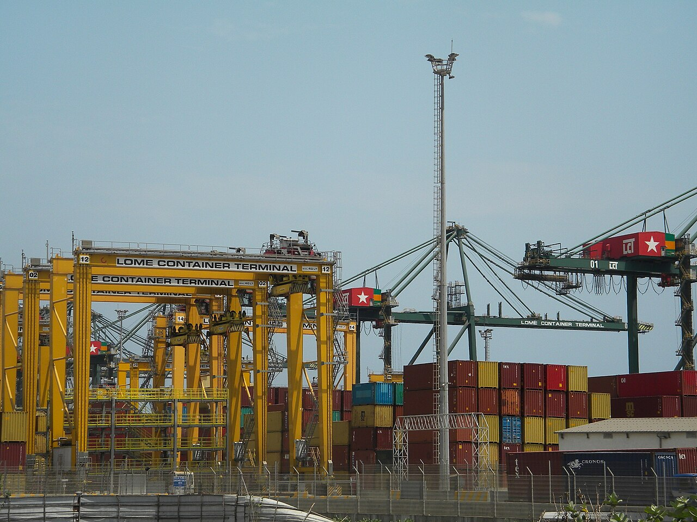

# Run, exec, logs, and stop

*Control a container lifecycle without confusing image creation, process execution, log retrieval, graceful stopping, and removal.*

> `docker exec` does not start a stopped container, and `docker stop` does not delete one. Most beginner confusion disappears when you follow the main process and object state separately.

> **In real life**
>
> A container is a theatre performance: `run` creates the stage and starts the lead actor, `exec` brings another actor onto an active stage, `logs` reads recorded dialogue, and `stop` asks the lead to finish.

**container lifecycle**: The container lifecycle moves through created, running, paused, restarting, and exited states. Its main process determines whether it is running; removal is a separate action.

## Commands with distinct jobs

- `docker run --name web -d IMAGE` creates and starts a new container.
- `docker exec web COMMAND` starts an additional process only while `web` runs.
- `docker logs --timestamps web` reads the configured logging stream.
- `docker stop --time 10 web` sends the stop signal, then kills after the timeout.
- `docker rm web` removes an exited container; `--rm` automates removal after exit.

> **Tip**
>
> Name containers in exercises, inspect exit codes after stopping, and use `--rm` only when evidence is captured elsewhere.

> **Common mistake**
>
> Using `exec` to patch a failing service. That change is unrepeatable and disappears with the container.


*Déplacement de containers au port — houaito affo daniel, CC BY-SA 4.0. [Source](https://commons.wikimedia.org/wiki/File:D%C3%A9placement_de_containers_au_port.jpg)*
- **Create and run** — A new container starts its configured main process.
- **Observe and enter** — Logs and exec inspect a currently running workload.
- **Stop then remove** — Process termination and object deletion are separate transitions.

**A controlled diagnostic lifecycle**

1. **Run named container** — Create and start with declared options.
2. **Observe logs** — Follow application output with timestamps.
3. **Exec a read-only probe** — Inspect process, files, or network without patching.
4. **Stop gracefully** — Allow the main process to handle its stop signal.
5. **Inspect exit, then remove** — Preserve evidence before cleanup.

*Run it — model lifecycle transitions (Python)*

```python
state = "created"
for command, next_state in [("run", "running"), ("exec probe", "running"), ("stop", "exited")]:
    state = next_state
    print(f"{command} -> {state}")

# run -> running
# exec probe -> running
# stop -> exited
```

*Run it — model lifecycle transitions (Java)*

```java
public class Main {
  public static void main(String[] args) {
    String[][] steps = {{"run", "running"}, {"exec probe", "running"}, {"stop", "exited"}};
    for (String[] step : steps) System.out.println(step[0] + " -> " + step[1]);
  }
}
/* run -> running
   exec probe -> running
   stop -> exited */
```

### Your first time: Your mission: operate one clean lifecycle

- [ ] Run a named detached container — Choose a small service image and explicit version.
- [ ] Read timestamped logs — Identify startup completion in application output.
- [ ] Exec one read-only command — Confirm the process runs inside the existing container.
- [ ] Stop, inspect exit, and remove — Keep state transitions distinct.

You can now explain what changed after every command.

- **`docker exec` says the container is not running.**
  Inspect state, exit code, error, and logs; start or recreate only after diagnosing the main process.
- **Stop ends in a forced kill.**
  Check signal handling, PID 1 behavior, and whether the timeout is realistic for cleanup.
- **Logs are empty.**
  Confirm the app writes to stdout/stderr and inspect its configured logging driver.

### Where to check

- `docker ps -a` for status.
- `docker inspect --format` for state, exit code, and error.
- `docker logs --timestamps --since ...` for application output.
- Daemon events when lifecycle timing is disputed.

### Worked example: the container that stopped immediately

1. QA runs a service detached and assumes it is healthy.
2. `docker exec` fails because the main process already exited.
3. `docker ps -a` shows exit code 1.
4. Logs reveal a missing required environment variable.
5. QA recreates with declared configuration instead of patching the stopped object.

**Quiz.** What does `docker exec` do?

- [ ] Creates a new image
- [x] Starts another process inside a running container
- [ ] Restarts any stopped container
- [ ] Deletes container logs

*Exec requires a running container and launches an additional process in its namespaces.*

- **run** — Create and start a new container.
- **exec** — Start an additional process in a running container.
- **stop** — Request graceful termination, then force after timeout.

### Challenge

Capture a timeline containing create, start, log, exec, stop, exit, and remove events for one container.

### Ask the community

> Container `[name]` moved from `[state]` to `[state]`; exit code is `[code]`; last logs are `[lines]`. Which process transition explains it?

Remove secrets before sharing logs.

- [Docker Docs — docker container run](https://docs.docker.com/reference/cli/docker/container/run/)
- [Docker Docs — docker container exec](https://docs.docker.com/reference/cli/docker/container/exec/)
- [Docker Docs — docker container logs](https://docs.docker.com/reference/cli/docker/container/logs/)

🎬 [Docker Tutorial for Beginners [FULL COURSE in 3 Hours] — TechWorld with Nana](https://www.youtube.com/watch?v=3c-iBn73dDE) (166 min)

- Run creates and starts; exec adds a process to a running container.
- Logs expose stdout and stderr through the logging driver.
- Stop and remove are separate operations.
- Inspect exit evidence before cleanup.


## Related notes

- [[Notes/docker-and-containers-for-testers/containers-in-plain-words/install-and-first-run|Install & first run]]
- [[Notes/docker-and-containers-for-testers/docker-hands-on/ports-and-volumes|Ports & volumes]]
- [[Notes/docker-and-containers-for-testers/docker-hands-on/debugging-a-container|Debugging a container]]


---
_Source: `packages/curriculum/content/notes/docker-and-containers-for-testers/docker-hands-on/run-exec-logs-and-stop.mdx`_
