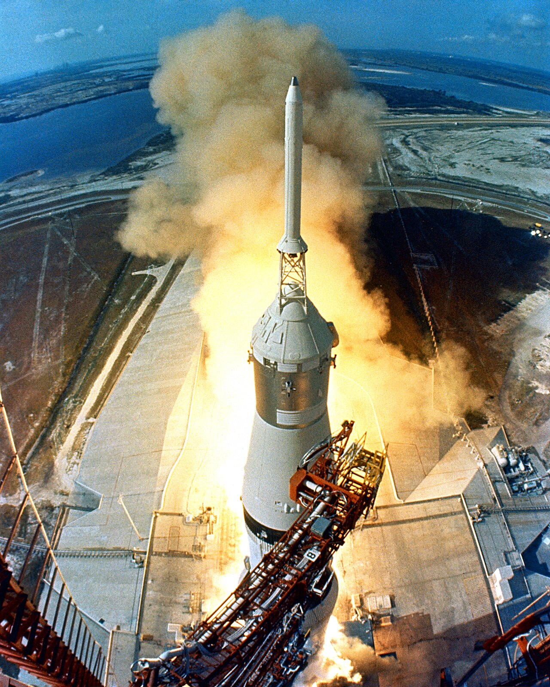

# Multi-stage builds

*Separate compilation, testing, and runtime concerns in one Dockerfile. Copy only approved artifacts into a lean final stage and prove that build tools and secrets stayed behind.*

> A rocket discards the machinery that has finished its job. Shipping a compiler, package cache, test data, and source beside a finished artifact is the container equivalent of carrying spent boosters into orbit.

> **In real life**
>
> Each `FROM` starts a stage. A named build stage creates and tests the payload; a later runtime stage copies only that payload and leaves the workshop behind.

**multi-stage build**: A Dockerfile pattern with multiple FROM instructions, where later stages selectively copy artifacts from earlier stages or external images. Only the selected final stage is exported as the image by default.

## Separate build trust from runtime trust

- Name stages with `AS build`, `AS test`, and `AS runtime` instead of relying on numeric positions.
- Install compilers and development dependencies in a builder stage.
- Run unit or packaging checks in an explicit test stage that CI can target.
- Copy a narrow artifact path with `COPY --from=build`, not the builder filesystem wholesale.
- Use a runtime base that contains only what the process genuinely needs.
- Compare contents and vulnerability findings between builder and final image.

> **Tip**
>
> Use `docker build --target test .` to stop at a named verification stage. A production build can then target the lean runtime stage without duplicating Dockerfiles.

> **Common mistake**
>
> Assuming multi-stage automatically makes an image safe. A broad `COPY --from=build / /` simply transfers the entire workshop into the supposedly clean final stage.


*Apollo 11 Launch2 — NASA, Wikimedia Commons, public domain. [Source](https://commons.wikimedia.org/wiki/File:Apollo_11_Launch2.jpg)*
- **Builder stage** — Heavy tools create, compile, and test the artifact.
- **Transfer boundary** — COPY --from selects the exact payload that crosses into runtime.
- **Runtime stage** — The final stage carries only the process and its necessary runtime support.

**A testable multi-stage pipeline**

1. **Resolve builder base** — A tool-rich image provides compiler and package manager.
2. **Restore dependencies** — Stable manifests make this expensive step cacheable.
3. **Compile and package** — Source becomes a versioned artifact.
4. **Target the test stage** — CI proves behavior before promotion.
5. **Copy only the artifact** — The runtime stage excludes source, compiler, and caches.

*Run it — enforce the artifact allowlist (Python)*

```python
builder = {"app.jar", "source.zip", "maven-cache", "test-report.xml"}
allowlist = {"app.jar"}
runtime = builder & allowlist
print("builder:", ", ".join(sorted(builder)))
print("runtime:", ", ".join(sorted(runtime)))
print("excluded:", ", ".join(sorted(builder - runtime)))

# builder: app.jar, maven-cache, source.zip, test-report.xml
# runtime: app.jar
# excluded: maven-cache, source.zip, test-report.xml
```

*Run it — enforce the artifact allowlist (Java)*

```java
import java.util.*;
public class Main {
  public static void main(String[] args) {
    Set<String> builder = new TreeSet<>(List.of("app.jar", "source.zip", "maven-cache", "test-report.xml"));
    Set<String> runtime = new TreeSet<>(builder);
    runtime.retainAll(Set.of("app.jar"));
    Set<String> excluded = new TreeSet<>(builder);
    excluded.removeAll(runtime);
    System.out.println("builder: " + String.join(", ", builder));
    System.out.println("runtime: " + String.join(", ", runtime));
    System.out.println("excluded: " + String.join(", ", excluded));
  }
}
/* builder: app.jar, maven-cache, source.zip, test-report.xml
   runtime: app.jar
   excluded: maven-cache, source.zip, test-report.xml */
```

### Your first time: Your mission: prove the boundary

- [ ] Name builder, test, and runtime stages — Make stage intent stable even when instructions are reordered.
- [ ] Build the test target — Run docker build --target test and require its checks to pass.
- [ ] Build the final runtime target — Copy only the artifact and required runtime files.
- [ ] Compare both stages — Inspect image size, packages, user, source presence, and vulnerability results.

The useful result is an evidence-backed boundary, not merely a smaller number.

- **COPY --from reports that the source path does not exist.**
  Inspect the producer stage's WORKDIR and artifact path; stage filesystems do not inherit host paths implicitly.
- **The final image still contains source and package caches.**
  Narrow COPY --from to explicit artifacts and inspect the runtime filesystem and history.
- **A debug target builds unexpectedly during production builds.**
  Check stage dependencies; BuildKit skips unrelated stages but must build every ancestor of the selected target.

### Where to check

- `docker build --target STAGE --progress=plain .` for stage-specific failures.
- `docker image history IMAGE` for the final-stage layer chain.
- `docker run --rm --entrypoint sh IMAGE` when a shell exists, to inspect runtime contents.
- An SBOM or image scanner to compare package inventory and findings.

### Worked example: the lean image that could not start

1. A Java service compiled successfully in a JDK builder and copied its JAR into `scratch`.
2. The image was tiny, but it lacked a Java runtime and failed immediately.
3. The team changed the final base to a pinned JRE image, copied the JAR, selected a non-root user, and used exec-form entrypoint.
4. CI built a test target first, then scanned and smoke-tested the runtime target.
5. Size decreased relative to the original JDK image without deleting a required runtime dependency.

**Quiz.** What is exported by default from a multi-stage Dockerfile?

- [ ] Every stage as one merged image
- [x] Only the final selected stage
- [ ] Only the first builder stage
- [ ] No stage until docker compose runs

*The final stage is exported by default, or another stage can be selected explicitly with --target.*

- **Named stage** — A stage introduced with FROM ... AS name and referenced by COPY --from=name or --target name.
- **Runtime boundary** — The selective copy from tool-rich build stages into the final execution image.
- **Target build** — A build stopped at a chosen named stage for testing, debugging, or alternate output.

### Challenge

Create a test stage that fails on one deliberate test defect, then confirm the runtime target is never promoted when that stage fails.

### Ask the community

> My final stage still contains `[unexpected item]`. The producing stage and COPY --from lines are `[details]`. What boundary should I narrow?

Include the relevant stage definitions and sanitized image inventory.

- [Docker Docs — Multi-stage builds](https://docs.docker.com/build/building/multi-stage/)
- [Dockerfile reference — COPY](https://docs.docker.com/reference/dockerfile/#copy)

🎬 [Day 3: Multi-Stage Docker Build — Mohammad Shaker](https://www.youtube.com/watch?v=ajetvJmBvFo) (19 min)

- Every FROM begins a distinct stage with its own filesystem state.
- Named stages make targets and copy boundaries resilient to reordering.
- A test stage gives CI a first-class verification target.
- Selective copying keeps tools, source, caches, and secrets out of runtime.
- A small image must still contain every required runtime dependency.


## Related notes

- [[Notes/docker-and-containers-for-testers/dockerfiles-and-compose/writing-a-dockerfile|Writing a Dockerfile]]
- [[Notes/docker-and-containers-for-testers/dockerfiles-and-compose/compose-app-and-database|Compose: app + database]]
- [[Notes/docker-and-containers-for-testers/dockerfiles-and-compose/disposable-test-environment|A disposable test environment]]


---
_Source: `packages/curriculum/content/notes/docker-and-containers-for-testers/dockerfiles-and-compose/multi-stage-builds.mdx`_
