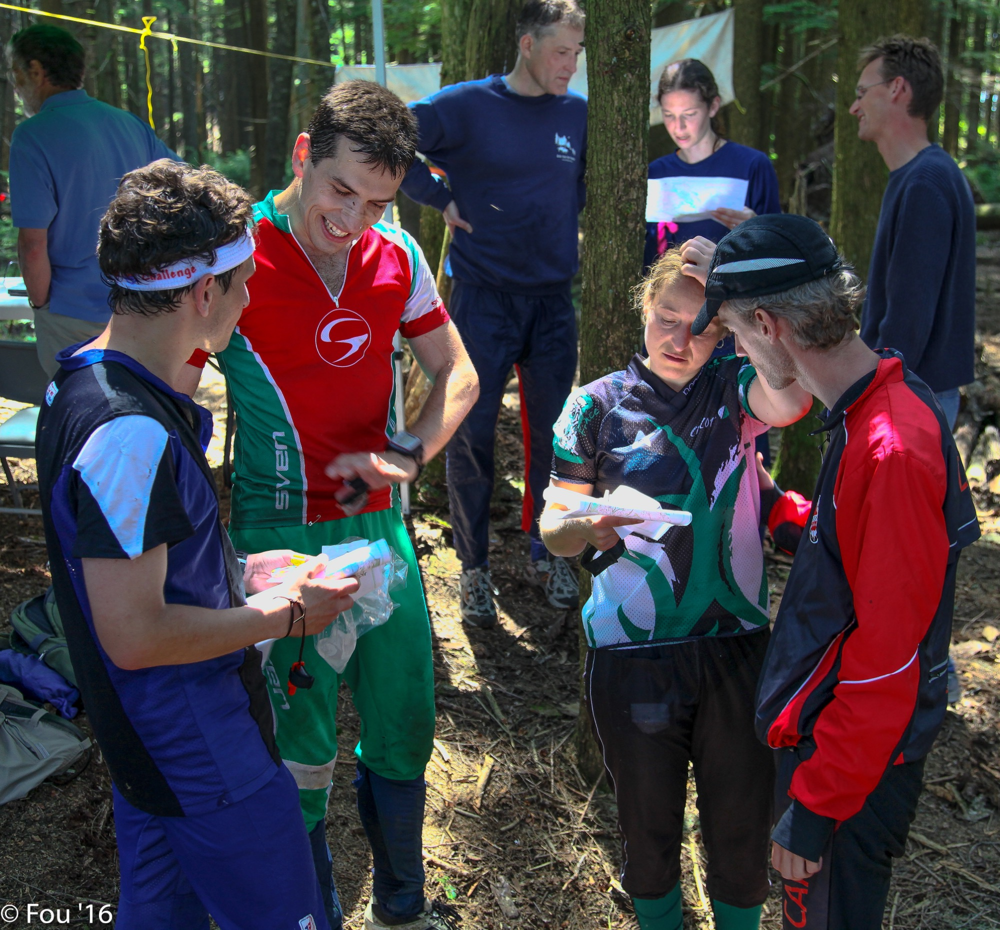

# Pairing and ensemble testing

*One driver, one or more navigators asking questions instead of typing - pairing and ensemble testing catch the assumptions a solo exploratory session never notices it's making. When a second head genuinely beats one, and when it just doubles the bill.*

> You've been exploring the same feature alone for forty minutes. You've built a mental model of how
> it behaves, you've stopped being surprised by it, and - this is the dangerous part - you've stopped
> trying the things that model tells you won't matter. That's not laziness. That's just what a
> functioning brain does after enough repetition: it compresses experience into assumptions so it can
> move faster, and every assumption it compresses is, by definition, a thing you've quietly stopped
> testing. Nobody can see this happening from outside, including you. The session notes still look
> thorough. The charter still looks covered. And somewhere in the twenty percent of the input space
> your model silently wrote off as "not worth trying," a real bug is sitting there, patient, waiting
> for the one person on the team who hasn't built your exact assumptions yet to walk in and ask the
> question you stopped asking twenty minutes ago. That person is a navigator. This note is about
> deliberately putting them next to you.

> **In real life**
>
> A rally car's cockpit has two seats for a reason that has nothing to do with company policy. The
> driver's entire attention is consumed by the immediate few seconds - the wheel, the pedals, the
> patch of gravel directly ahead - and that narrow focus is exactly what makes them fast. It also
> makes them blind to everything outside it. The co-driver isn't there to hold a spare tire. They're
> reading pace notes a stage earlier than the car has arrived, calling out "hairpin left, tightens,
> don't cut it" before the driver can even see the bend, because the driver's job requires a kind of
> tunnel vision that would be fatal without a second person deliberately looking further out. Neither
> seat is the "real" one. A driver without a co-driver on an unfamiliar stage is guessing blind at
> speed; a co-driver without a driver has excellent notes and a car going nowhere. Exploratory testing
> has the same cockpit. The person with their hands on the keyboard is necessarily narrow - deep in
> the immediate next click, the field in front of them, the result they just saw. The navigator's whole
> job is to be looking further out, asking the question the driver's own narrowed focus has no
> attention left to ask.

**pairing and ensemble testing**: Exploratory testing performed by two or more people at once instead of one, splitting the work into a DRIVER (hands on the keyboard, executing the immediate next action) and one or more NAVIGATORS (not typing, watching the driver's actions and results, asking questions, suggesting untried paths, and flagging things worth a closer look). Pairing is two people, one driver and one navigator, usually swapping roles partway through a session. Ensemble testing (also called mob testing) extends the same shape to a small group - one driver at a time, several navigators contributing at once - and is typically reserved for higher-stakes or cross-functional sessions rather than everyday charters. Both are still exploratory testing: a charter, a time box, and session notes still apply exactly as they do solo. The only thing that changes is how many minds are actively questioning the driver's next move while it's still being chosen.

## Why a solo driver can't see their own blind spot

Here's the mechanism, stated plainly: exploratory testing's entire value comes from a tester's live
judgment choosing what to try next, and judgment is built out of assumptions the tester has already
formed about how the product behaves. That's not a flaw in the technique - it's what lets one person
move fast through a feature instead of trying every input combinatorially. But it has a specific,
structural cost. The moment you decide "the search filters probably don't interact weirdly with
sort order," you stop trying combinations that would test that belief, and from that point on your
exploration is shaped by a hypothesis you're no longer checking. This is the same mechanism as
**confirmation bias**, covered in full back in
[the tester's mindset](/notes/qa-foundations/what-is-qa/the-testers-mindset) - the tendency to keep
searching in the direction that already confirms what you believe, rather than the direction that
would disprove it. Solo exploratory testing doesn't cause confirmation bias. It just removes the one
thing that reliably interrupts it: another person who hasn't formed your exact assumptions yet and
has no reason to protect them.

A navigator's questions work precisely because they come from OUTSIDE the driver's accumulated model.
"What happens if you clear that filter instead of changing it?" "Didn't the last screen say something
about a limit - does this respect it?" "You tried that twice and got two different results, did you
notice?" None of these are exotic test-design techniques. They're the ordinary observations of
someone whose attention hasn't been narrowed by the last forty minutes of hands-on repetition. The
driver could, in principle, ask themselves the same questions - but they mostly won't, for the same
reason a writer can't proofread their own sentence as easily as someone seeing it for the first time.
Fresh eyes aren't smarter eyes. They're just not yet compressed into the same shortcuts.

## Driver and navigator: the actual mechanics

A paired session still starts exactly like a solo one: a charter, a time box, and a shared
understanding of what's being explored, the same shape covered back in
[charters](/notes/exploratory-testing/session-based-test-management/charters) and
[time-boxed sessions](/notes/exploratory-testing/session-based-test-management/time-boxed-sessions).
What changes is the division of labor once the clock starts. One person - the driver - has sole
control of the keyboard and mouse, and executes. The other - the navigator - does not touch the
keyboard. Their job is entirely verbal: watch what's happening, think one step ahead and one step
sideways of what the driver is doing, and say the question out loud the instant it forms, before it
gets forgotten or talked out of existing. A navigator who stays silent for ten minutes isn't being
polite - they're not doing the job. The value of the role is the friction of the interruption, not
the absence of one.

The driver, in turn, has one extra discipline beyond normal solo exploring: think out loud. Say what
you're about to try and why, out loud, before you try it - not because the navigator can't see the
screen, but because voicing the assumption behind an action is what gives the navigator something
concrete to question. "I'm going to check the discount field next because I already tested the
quantity field" hands the navigator a specific claim - "already tested" - that they can immediately
probe: tested how, tested with what, tested against what result? Roles typically swap every fifteen
to twenty minutes, or at a natural charter boundary, so both people get time behind the keyboard and
neither settles into a permanently passive seat. A pairing session that never rotates roles isn't
really pairing - it's one person exploring while another person watches, which captures very little
of the actual mechanism this note is describing.

## Pairing vs ensemble: how many navigators is enough

Ensemble (mob) testing takes the same driver-navigator shape and adds more navigators - sometimes
three or four, occasionally a whole cross-functional group: a tester, a developer, a designer, a
product owner, all watching one driver work through one charter together. The value compounds in a
specific way: each additional person brings a genuinely different set of assumptions, so a developer
navigator might flag "that error code isn't one we actually throw anywhere, where did it come from?"
while a designer navigator flags "that spacing is inconsistent with the rest of the flow, is that
intentional?" - questions a solo tester, or even a testing pair, might never generate because neither
one has that person's specific background. The cost compounds just as fast: four people's time
consumed by one person's keyboard is expensive, and most of that group is, at any given moment,
watching rather than acting.

That cost is exactly why ensemble testing gets reserved for specific situations rather than run as
the default: onboarding a new team member onto an unfamiliar feature by having them drive while
several people navigate; investigating a genuinely confusing, hard-to-reproduce bug where more
perspectives shorten the hunt; or exploring a brand-new, high-risk feature where cross-functional
eyes catch problems no single discipline would notice alone. Everyday charter work - the bulk of a
sprint's exploratory testing - stays solo or paired, because ensemble's real cost (several people's
time, every session) only pays for itself when the stakes or the confusion are high enough to justify
it. Pairing is the everyday upgrade over solo; ensemble is the occasional, deliberate escalation, not
a bigger-is-always-better ladder.


*At the BC Orienteering Championships on Sumas Mountain — everybody discusses their route choices, Fraser Valley, BC — CC BY-SA 2.0 (Murray Foubister)*
- **The one competitor actually holding the map = the driver** — Only one set of hands actually controls the shared reference point - one person holds it, one person's judgment decides what happens with it next. Ensemble testing works the same way: many voices, but exactly one driver at the keyboard at any moment, so the exploring stays coherent instead of turning into several people fighting for the mouse.
- **The person leaning in close, pointing at the map = a navigator with a different assumption** — Each person examining the same map notices something different - the route they'd have taken, a hazard they'd have flagged, a shortcut they spotted. That's the entire value of adding navigators: each one questions from a genuinely different place.
- **The map itself = the charter** — Everyone in each small huddle is looking at the exact same terrain, the same course, agreed before the discussion started. Ensemble testing without a shared charter isn't a richer exploration - it's several people examining different things while standing in the same room, which is the mob-testing failure mode this note warns about.
- **A second pair, off to the side, having their own separate discussion = pairing scaling naturally, not merging into one crowd** — Not one giant group trying to reach consensus - several smaller, focused pairs, each genuinely productive on its own. This is pairing's natural shape: two people per conversation, not everyone crowding around one map at once.
- **More competitors in the background doing the same thing = this is routine practice, not a rare event** — This kind of close, paired post-race comparison happens constantly here - it's a normal, expected part of how these competitors improve, not an occasional escalation reserved for special cases.

**A relay handoff mid-session - watch the baton, not the runner**

1. **Driver A starts the charter, navigator watches and stays quiet** — First few minutes: driver A explores a refund form's currency field the obvious way - enter a valid amount, submit, confirm the refund posts. Navigator is watching, forming their own first impressions, not interrupting yet.
2. **The navigator's first real question lands** — Driver A is about to move to the next field. Navigator: 'wait - you entered a positive amount, what does a negative one do here, is that even blocked?' Driver A hadn't planned to try it - the question redirects the very next move.
3. **The redirected move finds something** — Driver A tries a negative refund amount. The form accepts it silently and the backend processes it as a positive charge instead of a refund - a real bug, found because the navigator's question, not the driver's own plan, sent the cursor there.
4. **The baton passes: roles swap** — Fifteen minutes in, driver and navigator swap seats. The former navigator now drives, and immediately starts testing based on THEIR assumptions - which are different again, because they were the one watching, not the one who'd been typing.
5. **The new driver's fresh assumptions surface a second lead** — Now driving, the former navigator tries a refund amount with more decimal places than the currency supports - a case the first driver, deep in whole-number thinking, never considered. Two people, two different blind spots, two different findings from the same charter.

Here's the blind-spot mechanism made concrete: a driver's own move list, shaped by what they've
already assumed, versus that same list with one navigator's challenge question added - watch which
run actually catches the bug:

*Run it - a solo driver's moves vs a navigator's one added question (Python)*

```python
# The product under test: a search results page with a price filter, a
# category filter, and a sort control, plus a results-count badge.
def run_search_session(moves):
    state = {"price_min": 0, "price_max": 9999, "sort": "relevance", "category": None}
    bugs = []
    for move in moves:
        kind = move[0]
        if kind == "set_price":
            state["price_min"], state["price_max"] = move[1], move[2]
        elif kind == "clear_price":
            state["price_min"], state["price_max"] = 0, 9999
        elif kind == "sort":
            state["sort"] = move[1]
        elif kind == "set_category":
            state["category"] = move[1]

        invalid_price = state["price_min"] > state["price_max"]

        if kind == "sort" and invalid_price:
            # THE BUG: the sort endpoint doesn't re-validate the price range -
            # it silently ignores the (invalid) price filter and returns
            # real matching results based on category alone.
            count = 12 if state["category"] else 42
        elif invalid_price:
            count = 0
        elif state["category"]:
            count = 12
        else:
            count = 42

        # The badge trusts the price filter's validity and shows 0 whenever
        # the price filter is invalid, regardless of what the sort endpoint
        # (with its validation-bypass bug) actually returned.
        badge = 0 if invalid_price else count

        if badge != count:
            bugs.append("count badge frozen at " + str(badge) + " after sorting past a zero-result filter, real count is " + str(count))

    return bugs

# SOLO: the driver's own moves, shaped entirely by their own assumptions -
# reasonable, ordinary, nothing adversarial.
solo_moves = [
    ("set_category", "shoes"),
    ("sort", "price_asc"),
    ("clear_price",),
    ("sort", "relevance"),
]

# PAIRED: the same driver, same hands on the keyboard, but a navigator sits
# in and asks one question the driver's own train of thought never reached:
# "what if a filter returns nothing at all, then you sort?"
navigator_challenge = [
    ("set_price", 500, 10),   # min > max on purpose -> deliberately zero results
    ("sort", "price_asc"),    # navigator: "now sort - does the badge catch up?"
]

print("SOLO session (driver's own moves only):")
solo_bugs = run_search_session(solo_moves)
print(" ", solo_bugs if solo_bugs else "no bugs found - every move stayed inside the driver's own assumptions")

print()
print("PAIRED session (driver's moves, then the navigator's one added question):")
paired_bugs = run_search_session(solo_moves + navigator_challenge)
print(" ", paired_bugs if paired_bugs else "no bugs found")

print()
print("Same driver, same keyboard, same charter. The only difference between")
print("the two runs is a second person asking a question the driver's own")
print("train of thought never arrived at on its own.")

# SOLO session (driver's own moves only):
#   no bugs found - every move stayed inside the driver's own assumptions
#
# PAIRED session (driver's moves, then the navigator's one added question):
#   ['count badge frozen at 0 after sorting past a zero-result filter, real count is 12']
#
# Same driver, same keyboard, same charter. The only difference between
# the two runs is a second person asking a question the driver's own
# train of thought never arrived at on its own.
```

Same shape in Java - notice `runSearchSession` never changes between the two calls; only the moves
fed into it differ, exactly the way a navigator changes what gets tried without touching the code
under test:

*Run it - a solo driver's moves vs a navigator's one added question (Java)*

```java
import java.util.*;

class Main {
    record Move(String kind, Integer a, Integer b) {
        Move(String kind) { this(kind, null, null); }
    }

    static List<String> runSearchSession(List<Move> moves) {
        int priceMin = 0, priceMax = 9999;
        String category = null;
        List<String> bugs = new ArrayList<>();

        for (Move move : moves) {
            switch (move.kind()) {
                case "set_price" -> { priceMin = move.a(); priceMax = move.b(); }
                case "clear_price" -> { priceMin = 0; priceMax = 9999; }
                case "set_category" -> category = "shoes";
                default -> {} // "sort" carries no state change here
            }

            boolean invalidPrice = priceMin > priceMax;

            int count;
            if (move.kind().equals("sort") && invalidPrice) {
                // THE BUG: the sort endpoint doesn't re-validate the price range -
                // it silently ignores the (invalid) price filter and returns
                // real matching results based on category alone.
                count = category != null ? 12 : 42;
            } else if (invalidPrice) {
                count = 0;
            } else if (category != null) {
                count = 12;
            } else {
                count = 42;
            }

            // The badge trusts the price filter's validity and shows 0 whenever
            // the price filter is invalid, regardless of what the sort endpoint
            // (with its validation-bypass bug) actually returned.
            int badge = invalidPrice ? 0 : count;

            if (badge != count) {
                bugs.add("count badge frozen at " + badge + " after sorting past a zero-result filter, real count is " + count);
            }
        }
        return bugs;
    }

    public static void main(String[] args) {
        // SOLO: the driver's own moves, shaped by their own assumptions.
        List<Move> soloMoves = List.of(
            new Move("set_category"),
            new Move("sort"),
            new Move("clear_price"),
            new Move("sort")
        );

        // PAIRED: same moves, plus the navigator's one added question -
        // force a zero-result filter, then sort right after it.
        List<Move> paired = new ArrayList<>(soloMoves);
        paired.add(new Move("set_price", 500, 10));
        paired.add(new Move("sort"));

        System.out.println("SOLO session (driver's own moves only):");
        List<String> soloBugs = runSearchSession(soloMoves);
        System.out.println("  " + (soloBugs.isEmpty() ? "no bugs found - every move stayed inside the driver's own assumptions" : soloBugs));

        System.out.println();
        System.out.println("PAIRED session (driver's moves, then the navigator's one added question):");
        List<String> pairedBugs = runSearchSession(paired);
        System.out.println("  " + (pairedBugs.isEmpty() ? "no bugs found" : pairedBugs));

        System.out.println();
        System.out.println("Same driver, same keyboard, same charter. The only difference is a");
        System.out.println("second person asking a question the driver never arrived at alone.");
    }
}

/* SOLO session (driver's own moves only):
     no bugs found - every move stayed inside the driver's own assumptions

   PAIRED session (driver's moves, then the navigator's one added question):
     [count badge frozen at 0 after sorting past a zero-result filter, real count is 12]

   Same driver, same keyboard, same charter. The only difference is a
   second person asking a question the driver never arrived at alone. */
```

> **Tip**
>
> If you only take one habit from pairing into your solo sessions, take this: before you move on from
> any area, ask yourself out loud the exact question a navigator would ask - "what did I just decide
> NOT to try, and why?" You won't catch everything a real second person would, because you can't
> un-know your own assumptions the way a genuinely fresh set of eyes can. But naming the assumption out
> loud, even to an empty room, interrupts the same silent compression that lets confirmation bias run
> unchecked. It's a weaker substitute for a navigator, not a replacement - use it on the sessions you
> genuinely have to run alone, and reach for a real second person whenever the charter is high-risk
> enough to justify it.

### Your first time: Your mission: feel the difference a navigator's question makes

- [ ] Run the Python solo session alone and confirm it finds nothing — Read the four moves. Notice they're all individually reasonable - nothing careless about them. That's the point: a competent solo driver still has a shape to their exploring, and the bug sits just outside that shape.
- [ ] Run the paired version and watch the same code catch the bug — Nothing about run_search_session changed between the two calls. Only the moves changed - because a navigator asked a question the driver's own plan never reached. That's the entire mechanism of pairing, made visible in two function calls.
- [ ] Write your own navigator question for a feature you tested solo recently — Pick a real session from memory. Write one sentence a navigator might have asked that you didn't ask yourself - something that pokes at an assumption you didn't realize you'd made. If you can't think of one, that's worth noticing too.
- [ ] Pair on a real fifteen-minute charter with a teammate, and swap roles once — Pick a small, real feature. One of you drives, one navigates, using a written charter. At the ten-minute mark, swap. Notice which findings came from the driver's own plan and which came from the navigator's question - keep that split honest in your head, not just on paper.
- [ ] Decide, in one sentence, when you'd escalate to ensemble instead of a pair — Name one real situation from your own team - onboarding, a confusing bug, a high-risk new feature - where a THIRD or FOURTH person watching would plausibly be worth the extra cost. If you can't name one, that's a sign your team's risk profile doesn't currently need ensemble testing, and that's a legitimate answer too.

You've now watched the exact mechanism - a driver's own assumptions bounding what gets tried, and a
navigator's question breaking past that bound - and felt where the line sits between pairing being
worth the second person's time and not.

- **The navigator sits silently for most of the session, occasionally glancing at their phone, and the pair produces roughly the same findings a solo session would have.**
  A silent navigator isn't navigating - they're watching, which captures none of the mechanism this note describes. Set an explicit expectation before starting: the navigator's job is to voice a question or observation at least every few minutes, out loud, the moment it forms. If a navigator genuinely has nothing to add for long stretches, that's a signal they may not be the right second person for this particular charter's domain.
- **Roles never swap - the same person drives for the entire session, every session, and the other person is always relegated to watching.**
  A pairing setup that never rotates is quietly training one person to be permanently passive, and it loses half the value: the driver's assumptions never get interrupted by taking the navigator's seat themselves. Set a rotation point before starting - a fixed time, like fifteen minutes, or a natural charter boundary - and actually swap the keyboard, not just the conversation.
- **A four-person ensemble session gets scheduled for an ordinary, low-risk charter, and half the room is visibly checked out within ten minutes.**
  Ensemble testing's cost is real and constant - every added navigator is another person's full attention consumed by one driver's keyboard. Reserve it for the situations that actually justify the cost: onboarding, a confusing hard-to-reproduce bug, or a genuinely high-risk new feature. Ordinary charter work belongs solo or paired; save ensemble for when the stakes or the confusion earn it back.
- **A navigator's questions keep getting waved off mid-session with 'good idea, let's note it for later' and the session ends with a long list of untried suggestions.**
  A navigator's question only does its job if it changes the very next move, the same way the co-driver's pace note only matters called out before the bend, not after. 'Later' is where good questions go to be forgotten - if a question is worth asking, it's worth the driver actually trying it, right then, even briefly, before moving on. Genuinely out-of-scope ideas belong in the session notes for a future charter, not as a growing pile of things this session never actually looked at.

### Where to check

You can tell whether pairing is actually happening, or just being scheduled and called that:

- **Who's talking, and how often** - a healthy pair has the navigator speaking at least every few minutes; long silent stretches mean the navigator has quietly become an audience.
- **Whether the keyboard changes hands** - check the session notes or ask directly; if one person always drives, the session isn't rotating and is losing half its value.
- **Whether findings get attributed to a question or a plan** - the strongest pairing sessions can point at specific findings and say "that came from a navigator's question," not just "we found some bugs together."
- **What ensemble sessions get scheduled for** - onboarding, confusing bugs, and high-risk new features are good uses; a recurring weekly ensemble session on routine, well-understood work is usually the cost outrunning the value.
- **Whether the charter and time box still exist** - a pair or ensemble with no written charter and no time limit has stopped being structured exploratory testing and become an unstructured group hang, however good the intentions.

Tester's habit: at the ten-minute mark of any paired session, ask out loud "what have we tried that
came from your assumptions, and what's come from mine?" - if the honest answer is "everything came
from the driver," the navigator isn't doing their job yet.

### Worked example: the checkout bug three solo sessions missed and one paired session found in twenty minutes

1. **The setup:** a checkout page had been explored solo, separately, by three different testers
   over two sprints, each running a full charter against it. All three sessions found real bugs -
   a broken coupon field, a currency formatting glitch, a slow image load - and all three closed
   clean, no other issues flagged.
2. **The trigger:** a support ticket reports that some customers are being charged twice for the
   same order, intermittently, with no clear repro steps. Nobody's solo session had ever surfaced
   anything like it.
3. **The decision:** instead of a fourth solo session, the lead pairs two testers on a fresh charter
   - "explore checkout under network interruption and rapid repeated submission" - specifically
   because three independent solo passes hadn't found it, suggesting whatever caused it sat outside
   what any one person's assumptions had led them to try.
4. **The pairing session:** the driver clicks "place order" once, normally, and it works. The
   navigator, watching, asks: "what if the confirmation is slow and you click it again before
   anything changes on screen?" The driver hadn't planned to try that - nothing about the charter's
   wording specifically named double-clicking.
5. **The find:** a second click on "place order," fired before the button visually disabled, submits
   a second order with the same cart contents. The button's disabled state was being set slightly
   too late relative to when the click handler fired - invisible on a fast connection, common on a
   slow one, exactly matching the intermittent double-charge reports.
6. **Why three solo sessions missed it:** each solo tester's own mental model of "place order" was
   "click it, it works, move on" - a reasonable assumption after one successful click, and nothing
   in a normal exploratory rhythm challenges a button that visibly works. It took a second person,
   watching without that exact assumption already formed, to ask the one question that broke it.
7. **What happened to the charter afterward:** the specific repro - rapid double-click before the
   button visually disables - became session notes attached to the bug report, and once the fix
   shipped, it became exactly the kind of well-understood, repeatable finding worth locking into a
   regression check, the subject this module closes on.
8. **The lesson:** this wasn't a skill gap. All three solo testers were competent and thorough within
   their own charter. The bug lived specifically in the blind spot solo exploration structurally
   can't see from inside itself - and a second person's differently-shaped assumptions is what
   exposed it, in twenty minutes, after two sprints of solo work hadn't.

> **Common mistake**
>
> Treating pairing as a training exercise for the junior person, with the senior tester permanently in
> the driver's seat "showing them how it's done." That inversion throws away the entire mechanism this
> note describes: the value isn't in the senior tester's hands on the keyboard, it's in a second set of
> assumptions colliding with the driver's in real time - and if the junior person never drives, their
> different assumptions never actually get exercised against the product, only narrated at from the
> sidelines. The fix is mechanical and cheap: rotate the seat on a fixed schedule regardless of seniority,
> every single pairing session, no exceptions for rank. A junior navigator asking "why did you skip that
> field?" is doing exactly the job this note describes; a junior driver trying the thing the senior
> navigator wouldn't have thought to try is doing it too - and neither happens if one person is
> permanently assigned to type.

**Quiz.** A pair has been exploring a feature for twenty minutes. The navigator has said almost nothing, and the driver has been typing the entire time without pausing to explain their reasoning. What is the most accurate read of this session?

- [ ] This is a healthy, efficient pairing session - the navigator is simply confident the driver knows what they're doing
- [x] This is functionally a solo session with an extra person present - the navigator's silence and the driver's lack of narration mean neither is generating the friction pairing depends on
- [ ] This is a problem with the driver's typing speed, not with how the pair is working together
- [ ] This is fine as long as the two of them swap roles at the very end of the session

*Pairing's entire value comes from a navigator's differently-shaped assumptions colliding, out loud, with the driver's live choices - which requires the driver to voice what they're about to try and why, and the navigator to actually question it. Twenty silent minutes from the navigator and zero narration from the driver means neither half of that mechanism is happening; the session has the ROSTER of a pair but the SHAPE of a solo run, quietly losing exactly the blind-spot-catching value this note describes. Option one mistakes silence for confidence rather than recognizing it as absent friction. Option three misdiagnoses the problem as a skill issue (typing speed) rather than a role issue (nobody is questioning). Option four treats a single end-of-session swap as sufficient, but the value pairing offers comes from ongoing real-time challenge throughout the session, not a role change after the exploring is already finished.*

- **Pairing and ensemble testing - definition** — Exploratory testing with more than one person: one DRIVER at the keyboard executing, one or more NAVIGATORS watching and questioning without typing. Pairing is two people; ensemble (mob) testing extends the same shape to a small group. Still uses a charter and a time box exactly like solo exploring.
- **Why a solo driver can't catch their own blind spot** — Live judgment compresses experience into assumptions as a session goes on - useful for speed, but everything an assumption rules out silently stops being tried. This is the same mechanism as confirmation bias, and a solo session has nothing built in to interrupt it.
- **The driver's extra discipline in a pair** — Think out loud - say what you're about to try and why before doing it. This gives the navigator a concrete claim to question, rather than leaving them watching silent actions with nothing to challenge.
- **Pairing vs ensemble - when to use which** — Pairing is the everyday upgrade over solo exploring - low added cost, catches individual blind spots. Ensemble (mob) testing adds several navigators and multiplies the cost accordingly - reserve it for onboarding, confusing hard-to-reproduce bugs, or high-risk new features, not routine charter work.
- **The failure mode that erases pairing's value** — A silent navigator and a non-narrating driver produce a session with a pair's roster but a solo session's shape - the friction that catches blind spots never actually happens. Rotate roles, narrate the reasoning, and voice questions the moment they form, not at the end.
- **How pairing differs from a debrief** — A debrief happens AFTER a session ends, reviewing what a solo tester already did, covered in debriefing and coverage. Pairing happens DURING the session itself, in real time, before a move is even made - it changes what gets tried, not just what gets reported afterward.

### Challenge

Pick a feature you've already explored solo, ideally recently enough that your session notes still
exist. Recruit a teammate (or, if none is available, a rubber-duck stand-in you narrate to out loud)
and run a fresh fifteen-minute paired session against the SAME feature, with a written charter and
one role swap at the halfway mark. Afterward, write two lists side by side: what your solo session
found, and what the paired session found. Circle anything in the paired list that came specifically
from a navigator's question rather than the driver's own plan - and write one sentence naming the
assumption that question broke.

### Ask the community

> Pairing and ensemble testing: at my `[company / team]`, exploratory testing is `[always solo / occasionally paired / never paired, no time for it]`. The situation I'm weighing: `[describe - e.g. a confusing recurring bug, onboarding a new hire, a high-risk feature launch]`. What's held me back from pairing so far: `[scheduling, cost, skepticism from a manager, something else]`. Is this a good candidate for pairing or ensemble testing, or is solo still the right call here?

The clearest answers usually name the specific risk being weighed - a confusing bug, a knowledge
gap, a high-stakes launch - rather than just "should we pair more." Describe what's made solo
exploring insufficient in this specific case, and the community can usually tell you fast whether a
second set of eyes is worth the cost here, and whether it should be one navigator or several.

- [Satisfice - James Bach's exploratory testing resources, including session-based approaches](https://www.satisfice.com/exploratory-testing)
- [Ministry of Testing - articles on pairing, mobbing, and collaborative testing practices](https://www.ministryoftesting.com/articles)
- [Martin Fowler - On Pair Programming, the driver/navigator mechanics this note adapts for testing](https://martinfowler.com/articles/on-pair-programming.html)
- [Bran van der Meer — Driver/Navigator style of Pair Programming](https://www.youtube.com/watch?v=jqGmL6Hf23k)

🎬 [Driver/Navigator style of Pair Programming](https://www.youtube.com/watch?v=jqGmL6Hf23k) (15 min)

- Pairing and ensemble testing split exploratory work into a driver (hands on the keyboard) and one or more navigators (watching, questioning, not typing) - still a charter, still time-boxed, exactly like solo exploring.
- A solo driver can't see their own blind spot: live judgment compresses into assumptions as a session runs, and everything an assumption rules out silently stops getting tried - the same mechanism as confirmation bias, with nothing built in to interrupt it.
- The mechanism only works if both roles actually work: the driver narrates their reasoning out loud, and the navigator voices questions the moment they form, then roles rotate on a fixed schedule.
- Pairing is the everyday upgrade over solo exploring; ensemble (mob) testing multiplies both the perspectives and the cost, so it's reserved for onboarding, confusing bugs, and high-risk new features rather than routine charter work.
- Pairing happens live, during the session, changing what gets tried in the moment - which is a different job from a debrief, which reviews what already happened after the fact.


---
_Source: `packages/curriculum/content/notes/exploratory-testing/reporting-exploratory-work/pairing-and-ensemble-testing.mdx`_
