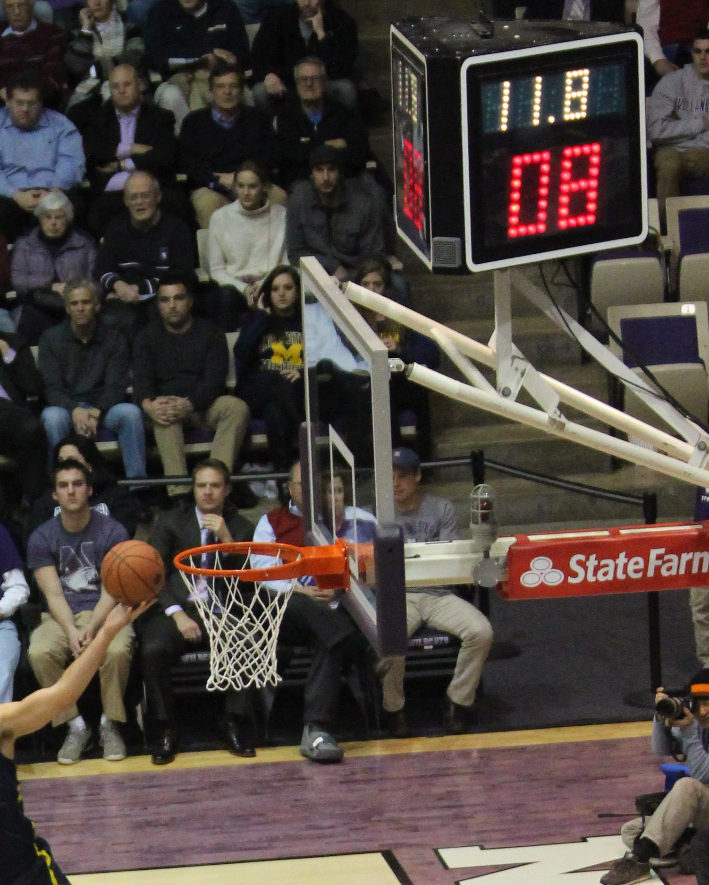

# Time-boxed sessions: SBTM's core unit

*A session is a fixed block of time - usually 60, 90, or 120 minutes - with a start, an uninterrupted middle, and a stop. Why the box matters more than the number, and how it turns exploration into something you can schedule.*

> Ask a tester "how long did you test the checkout flow for" and in most shops you'll get a shrug.
> Ask a session-based tester the same question and you get a number, because the number was decided
> *before* they started clicking. A **session** is the unit that session-based test management is
> named after: a fixed block of time, typically 60, 90, or 120 minutes, with a clean start, an
> uninterrupted middle, and a hard stop. That's the whole invention — and it sounds almost too small
> to matter. It isn't. Without the box, exploratory testing is an activity you can't schedule,
> can't compare, and can't defend when someone asks how much testing actually happened this sprint.
> With it, "exploratory" and "measurable" stop being opposites.

> **In real life**
>
> A timed sports match. A boxing round doesn't end because the fighters feel finished — it ends
> because three minutes passed, full stop, whatever's happening when the bell rings. That fixed
> duration is exactly why two different rounds can be compared: round three against round seven,
> fighter A against fighter B, this Saturday against last month. Nobody times a sparring session by
> vibes ("we'll stop when it feels done") and then tries to compare it to a match that ran the same
> way — the numbers wouldn't mean anything. A time-boxed testing session works on the same principle:
> the clock, not the tester's sense of completion, decides when the session ends, and that single
> rule is what makes one session comparable to the next.

**session**: A fixed, uninterrupted block of time (commonly 60, 90, or 120 minutes in session-based test management) devoted to exploring against a single charter. A session has three phases: setup (a few minutes to read the charter and prepare), the test itself (uninterrupted execution - no meetings, no context-switching), and a debrief afterward. The FIXED duration, agreed before the session starts, is what makes sessions comparable to each other and reportable as a unit of work - contrast with unstructured exploratory testing, where duration and scope both drift freely and no two testing periods can be meaningfully compared.

## Why a box, and why that box has three parts

The time-box isn't about discipline for its own sake — it solves a specific, practical problem.
Exploratory testing is inherently variable: two testers given the same feature will follow
different leads, notice different things, and could in principle keep going forever, because there
is always one more input to try. Left completely open-ended, "explore the checkout flow" produces
a testing period of unknown length that can't be scheduled against a sprint, can't be compared to
last week's session, and can't be reported as "we covered two hours of checkout risk this week."
The fixed duration converts an open-ended activity into a countable one. A **session**, not "some
testing happened," is the unit a lead can put in a spreadsheet.

Inside that fixed duration, a session has three phases, and each one earns its place. **Setup** is
a few minutes at the start to read the charter, get the right environment or test data ready, and
orient — this time counts *inside* the box, not as free extra minutes tacked on before the clock
starts. The **test itself** is the uninterrupted middle: no stand-up, no Slack replies, no "quick
question" from a teammate, because context-switching is exactly what destroys the deep attention
exploratory testing depends on. And the **stop** is a hard boundary — when the clock hits zero, the
session ends, whatever state the tester is in, and whatever they've found or haven't found gets
carried into the debrief as-is. A round that runs long because the fighter "was about to land one"
isn't a timed round anymore.

Why 60, 90, or 120 minutes specifically, and not fifteen or eight hours? A short session barely
survives setup — by the time the environment's ready and the charter's re-read, there's nothing
left to explore. An unbounded session (a whole day, "keep going until you're satisfied") reintroduces
exactly the scheduling and fatigue problems the time-box exists to solve: focus degrades, notes
drift, and nobody can plan around a testing period whose end time is a feeling. The 60–120 minute
range is a practical sweet spot — long enough to get past setup and into real depth, short enough
that a lead can schedule three sessions into an afternoon and human attention doesn't collapse
before the bell rings.


*Shot clock (red) and game clock (white) in a basketball game — Wikimedia Commons, CC BY-SA 3.0 (TonyTheTiger)*
- **The game clock reading 11.8 = the session's fixed duration counting down** — 60, 90, or 120 minutes, agreed before anyone starts. The number is chosen in advance and does not move mid-session for any reason - not because the tester feels close to something, not because the charter turned out bigger than expected. That fixed number is what makes this session comparable to every other session ever logged.
- **The shot clock reading 08 = a shorter, nested time-box inside the larger one** — A smaller, faster-cycling deadline running inside the bigger session clock - the same way a tester might mentally check in every 15-20 minutes within a 90-minute session, without that smaller check breaking the outer time-box.
- **The player mid-shot, ball already in flight = the TEST ITSELF, uninterrupted** — Nobody pauses play for a teammate's question or a quick meeting mid-shot. The middle of a session is protected the same way: no context-switching, because the deep attention exploratory testing needs is exactly what a context-switch destroys - and it does not resume where it left off.
- **The full, attentive crowd in the stands = stakeholders who can trust a scheduled result** — An audience shows up because they know exactly when the action starts and ends - a fixed, dependable schedule. A lead can plan sessions into a sprint the same confident way, because a time-boxed session is a known, plannable unit of work, not an open-ended activity of unknown length.
- **The hoop itself = the charter - what this specific timed effort is actually aimed at** — The clock alone means nothing without a target - the whole point of the timed action is putting the ball through THIS hoop, not just using up the seconds. A time-box without a charter is just a countdown; the charter is what the time is actually spent on.

**Anatomy of one time-boxed session**

1. **Duration agreed in advance** — Before anyone opens the app, the session length is fixed - 60, 90, or 120 minutes. This number does not change once the clock starts, no matter what the charter turns out to contain. Agreeing it up front is what makes the session a plannable unit rather than an open-ended activity.
2. **Setup - inside the box** — The charter gets a final read, test data or accounts get prepared, the environment gets checked. These minutes are NOT free extras before the real clock starts - they're spent from the same fixed budget, which is exactly why rushed setup eats directly into exploring time.
3. **Uninterrupted middle** — The actual exploring: charter-guided, tester's judgment driving each next move, no meetings, no Slack, no context-switches. This is the phase the whole time-box exists to protect - deep, undistracted attention on one area for a bounded stretch.
4. **The hard stop** — The clock hits zero and the session ends - not when the tester feels finished, not when the charter feels 'done'. Whatever was found, and whatever wasn't reached, is now fixed and becomes the raw material for the debrief. No extensions, no 'five more minutes'.
5. **Logged as one comparable unit** — A completed session - charter, duration, what happened - becomes a single countable row: comparable to every other session, summable into 'how much testing happened this sprint', and schedulable next time exactly the same way. The fixed duration is what makes all of that arithmetic possible.

Here's the time-box modeled directly — a session that runs against a countdown, logs findings only
while the clock is still alive, and refuses anything logged after time's up:

*Run it - a session that obeys its own clock (Python)*

```python
import itertools

def run_session(minutes, charter, actions):
    """actions is a list of (minutes_elapsed, finding) tuples an explorer
    tries to log during the session."""
    budget = minutes
    log = []
    print("SESSION START - charter: " + charter)
    print("Time-box: " + str(budget) + " minutes\\n")

    for elapsed, finding in actions:
        if elapsed <= budget:
            log.append((elapsed, finding))
            print("  [" + str(elapsed) + "m] logged: " + finding)
        else:
            print("  [" + str(elapsed) + "m] TOO LATE - session already ended at "
                  + str(budget) + "m, this finding is out of the box")

    print("\\nSESSION END at " + str(budget) + " minutes.")
    print("Findings kept in this session:", len(log))
    return log

charter = "explore checkout coupon-stacking, looking for calculation errors"

# a 60-minute session with one finding that arrives AFTER the bell
attempts = [
    (12, "coupon field accepts negative values"),
    (34, "two coupons stack past the advertised max discount"),
    (58, "session timeout mid-checkout loses the cart silently"),
    (63, "found a typo on the confirmation page"),  # after the box closed
]

run_session(60, charter, attempts)

# SESSION START - charter: explore checkout coupon-stacking, looking for calculation errors
# Time-box: 60 minutes
#
#   [12m] logged: coupon field accepts negative values
#   [34m] logged: two coupons stack past the advertised max discount
#   [58m] logged: session timeout mid-checkout loses the cart silently
#   [63m] TOO LATE - session already ended at 60m, this finding is out of the box
#
# SESSION END at 60 minutes.
# Findings kept in this session: 3
```

Same clock discipline in Java — watch the fourth finding get rejected purely because it arrived
after the box closed, not because it wasn't real:

*Run it - the same time-box discipline, Java version*

```java
import java.util.*;

public class Main {
    record Attempt(int elapsedMinutes, String finding) {}

    static void runSession(int budgetMinutes, String charter, List<Attempt> attempts) {
        List<Attempt> kept = new ArrayList<>();
        System.out.println("SESSION START - charter: " + charter);
        System.out.println("Time-box: " + budgetMinutes + " minutes\\n");

        for (Attempt a : attempts) {
            if (a.elapsedMinutes() <= budgetMinutes) {
                kept.add(a);
                System.out.println("  [" + a.elapsedMinutes() + "m] logged: " + a.finding());
            } else {
                System.out.println("  [" + a.elapsedMinutes() + "m] TOO LATE - session already ended at "
                        + budgetMinutes + "m, this finding is out of the box");
            }
        }

        System.out.println("\\nSESSION END at " + budgetMinutes + " minutes.");
        System.out.println("Findings kept in this session: " + kept.size());
    }

    public static void main(String[] args) {
        String charter = "explore checkout coupon-stacking, looking for calculation errors";

        List<Attempt> attempts = List.of(
                new Attempt(12, "coupon field accepts negative values"),
                new Attempt(34, "two coupons stack past the advertised max discount"),
                new Attempt(58, "session timeout mid-checkout loses the cart silently"),
                new Attempt(63, "found a typo on the confirmation page")
        );

        runSession(60, charter, attempts);
    }
}

/* SESSION START - charter: explore checkout coupon-stacking, looking for calculation errors
   Time-box: 60 minutes

     [12m] logged: coupon field accepts negative values
     [34m] logged: two coupons stack past the advertised max discount
     [58m] logged: session timeout mid-checkout loses the cart silently
     [63m] TOO LATE - session already ended at 60m, this finding is out of the box

   SESSION END at 60 minutes.
   Findings kept in this session: 3 */
```

> **Tip**
>
> Pick your session length by charter size, not by habit. A tightly scoped charter (one form's
> validation rules) often only needs 60 minutes before it runs dry; a sprawling charter (a whole new
> module's happy path and edge cases) can genuinely use 120. What you should never do is let the
> session's actual length drift from whatever number you announced at the start — if a 60-minute
> session is clearly going to need more time, that's a signal to stop, debrief what you found, and
> schedule a *second* session with a narrower charter, not a signal to quietly let the clock run to
> 90. The box only does its job if it's honored every time, including the times it's inconvenient.

### Your first time: Your mission: feel the difference a hard stop makes

- [ ] Run the Python playground and read the rejected finding — The 63-minute typo never makes it into the session log, even though it's a real observation. That's the time-box working as designed - not because the finding doesn't matter, but because it belongs to a DIFFERENT session that hasn't been scheduled yet.
- [ ] Shrink the budget and watch more findings fall outside it — Change the 60 to 30 and re-run. Two of the four findings now land outside the box. This is the exact tradeoff a lead makes when picking session length: shorter sessions fit more into an afternoon but each one covers less ground.
- [ ] Add a fifth attempt that arrives exactly at the budget — Add an attempt tuple with elapsed minutes equal to the budget number itself. Confirm it's kept, not rejected - the box includes its own edge, ending AT the limit, not just before it.
- [ ] Time a real fifteen-minute micro-session — Pick any small feature on an app you use, set an actual timer for fifteen minutes, and explore it with zero interruptions - no phone, no messages. When the timer ends, stop mid-action if you have to. Notice how it feels to obey the clock instead of your own sense of 'almost done'.
- [ ] Write down what you'd do with five more minutes — Right after your micro-session ends, write one sentence: what would the next five minutes have covered? That unfinished thread is exactly what a second, separately chartered session is for - the time-box isn't meant to finish every thought, only to bound one attempt at it.

You've now felt the two-sided nature of a time-box: it cuts you off from something real, and that's precisely the discipline that makes the session before it comparable, schedulable, and honest.

- **A session scheduled for 90 minutes routinely runs to 120 because the tester is 'in the middle of something good' when the clock hits zero.**
  This looks like diligence but it quietly destroys comparability - a session that silently ran long can't be compared to one that respected its own box, and the extra 30 minutes never got scheduled or approved by anyone. Stop at the agreed time, capture the unfinished thread in the debrief as a candidate for a follow-up session, and schedule that follow-up properly with its own charter and its own clock.
- **Sessions get interrupted constantly - a Slack ping here, a 'got a sec?' there - and testers report the session took 90 minutes when really it took 90 minutes of wall-clock time with twenty minutes of actual focus scattered inside it.**
  An interrupted session isn't really time-boxed at all, it's just a testing period with a deadline. Protect the middle phase the way you'd protect focus time for any deep-work task: status set to busy, notifications off, and a team norm that a session in progress is not interruptible except for genuine emergencies. If interruptions are structurally unavoidable, that's useful information too - report the session as compromised rather than pretending the numbers are clean.
- **Every session on the team is scheduled for the same length - always 60 minutes - regardless of what the charter actually covers.**
  A uniform session length is a scheduling convenience, not a law of nature, and it produces a predictable failure: broad charters get cut off before they're covered, narrow charters run dry with time left over. Match the length to the charter - or better, match the charter to a length you've already committed to, by narrowing a big charter until it genuinely fits 60 minutes rather than force-fitting a mismatched pair.
- **A tester treats setup time as separate from the session, so the announced '90-minute session' actually consumes two hours once environment prep is added on top.**
  Setup belongs inside the box, not before it - the whole point of the fixed duration is that it represents the true cost of the session, including getting ready. If setup routinely eats a large chunk of the budget, that's a real finding worth reporting on its own: slow or fragile environments are a testability problem, and hiding their cost outside the time-box just makes the sessions look more efficient than they are.

### Where to check

Time-boxing shows up as concrete, checkable habits, not just a policy on paper:

- **The session log's duration column** — does it match what was scheduled, or does "90 minutes" routinely read as 110 in the debrief notes? Drift here means the box isn't being honored.
- **Calendar blocks for scheduled sessions** — a team doing this seriously blocks real calendar time for sessions, the same as any meeting, protected from double-booking.
- **Debrief notes mentioning interruptions** — frequent "got pulled into a meeting halfway through" notes mean the uninterrupted middle isn't actually protected, whatever the schedule says.
- **Session length distribution across the team** — wildly inconsistent lengths (twenty minutes here, four hours there) suggest the box is decorative, chosen after the fact to match however long testing happened to take.
- **Whether "session" and "however long I felt like testing" are used interchangeably** — listen for testers describing open-ended testing as a "session." If the word has lost its fixed-duration meaning, the practice has quietly eroded even if the vocabulary survives.

Tester's habit: when you schedule a session, write the stop time down before you write anything
else. If you can't commit to a stop time in advance, you haven't actually time-boxed anything yet.

### Worked example: the same charter, two different session lengths, two different outcomes

1. **The charter:** "explore the new bulk CSV import using malformed files and encoding edge cases, looking for silent data loss or crashes." A meaty charter — plenty of territory.
2. **Attempt one: a 30-minute session.** Setup (locating sample malformed files, confirming the import environment) eats seven minutes. That leaves twenty-three minutes of real exploring — enough to try three or four malformed files before the clock hits zero mid-test, with a genuinely promising lead (a UTF-16 file that seemed to silently drop rows) still unresolved.
3. **The debrief is honest but thin:** "Tried four file types, found one suspicious row-drop with UTF-16 encoding, ran out of time before confirming it." Useful information, but the charter is clearly not covered — the tester didn't even get to test files with malformed headers, a whole category the charter implied.
4. **Attempt two, a week later: a 90-minute session, same charter.** Setup takes the same seven minutes — it's a fixed cost regardless of session length. But now there's 83 minutes of real exploring: the UTF-16 row-drop gets confirmed and reproduced with a minimal file, three more encoding variants get tried, and malformed headers get their own pass, surfacing a second bug — a crash on headers with duplicate column names.
5. **The debrief this time is a real coverage statement:** "Encoding edge cases covered across five formats, one confirmed silent row-drop bug (repro attached), malformed headers covered, one crash bug found. Recommend a follow-up session for extremely large files, which this session's time-box didn't reach."
6. **Compare the two:** the charter didn't change, the tester's skill didn't change — only the box did. The 30-minute session wasn't wrong to run, but it produced a lead, not coverage. The 90-minute session produced coverage a lead can actually trust as "this area was tested," with a clearly named gap for what still isn't.
7. **The lesson:** the time-box isn't a constraint fighting against good testing — it's the unit that turns "I explored for a while" into "I covered X in Y minutes, and here specifically is what I didn't get to." Matching the box to the charter is a planning skill in its own right, learned the same way charter-writing is: by watching a mismatch fail first.

> **Common mistake**
>
> Treating the time-box as a productivity trick — cramming as much clicking as possible into the
> minutes — rather than as a measurement boundary. The point of a fixed duration isn't to maximize
> bugs-per-minute, it's to make one session's coverage genuinely comparable to another's and to make
> testing a schedulable unit of work at all. A tester who rushes through a 90-minute session to "beat
> the clock" produces worse exploration than one who works at a natural pace and honestly reports
> running out of time before finishing the charter. The box measures; it doesn't demand speed. Confusing
> the two turns careful exploration into a race, and races are exactly the wrong mindset for noticing
> the subtle thing that only shows up when you slow down and actually look.

**Quiz.** A tester is 92 minutes into a 90-minute session and believes they're seconds away from reproducing a serious bug. What does time-boxed session discipline say to do?

- [ ] Keep going until the bug is confirmed, however long that takes, since finding it matters more than the clock
- [x] Stop at the agreed 90 minutes, note the near-reproduction in the debrief, and schedule a short focused follow-up session to chase it down
- [ ] Stop immediately at 90 minutes and drop the lead entirely, since it happened outside the charter's time-box
- [ ] Extend to 120 minutes this one time since the session is clearly going well

*The time-box exists precisely so a session stays a comparable, plannable unit - honoring the stop time is not optional just because the moment feels close to a breakthrough (option one and four both quietly erode that discipline, and 'just this once' is how every team's boxes stop meaning anything). But stopping the clock doesn't mean throwing away real information (option three) - a near-reproduction is exactly the kind of unfinished thread the debrief exists to capture, so a properly chartered, properly time-boxed follow-up session can chase it down on its own clock. Option two is the only one that respects the box AND keeps the finding alive.*

- **Session - definition** — A fixed, uninterrupted block of time (commonly 60, 90, or 120 minutes) devoted to exploring against one charter, with three phases: setup, uninterrupted test execution, and a debrief. The fixed duration, agreed in advance, is what makes sessions comparable and schedulable.
- **The three phases of a session** — SETUP (reading the charter, preparing data/environment - counts inside the box), the TEST ITSELF (uninterrupted execution, no context-switching), and the STOP (a hard boundary at the agreed time, whatever state the tester is in).
- **Why sessions are time-boxed at all** — Exploratory testing is open-ended by nature - there's always one more input to try. Without a fixed duration, testing periods can't be scheduled, compared to each other, or reported as a countable unit of work. The box converts an open-ended activity into a plannable one.
- **Why 60-90-120 minutes specifically** — Short enough that human focus doesn't collapse and a lead can fit several sessions into an afternoon; long enough to get past setup and into real depth without the session barely surviving its own preparation phase. Not a hard law - matched to charter size.
- **The most common time-box failure** — Letting the session quietly run long because the tester feels 'almost done' - this destroys comparability even when the extra time finds something real. The fix is not skipping the lead, it's capturing it in the debrief and scheduling a proper follow-up session for it.
- **Setup time - inside or outside the box?** — INSIDE. The announced session length includes preparation time; treating setup as a free extra before the 'real' clock starts hides its true cost and makes the session look more efficient than it actually was.

### Challenge

Pick any feature you can explore for real (a search filter, a form, a settings page) and run it
twice: once as a strict 20-minute session, once as a strict 45-minute session on a fresh but related
charter. Time both with an actual clock and stop hard when it hits zero, mid-action if necessary.
Write two short debrief notes, one per session, and compare: what did the longer session cover that
the shorter one physically couldn't reach? Then, in the Java or Python playground above, add a
third attempt list that represents a 120-minute session and show how many more findings survive
the box compared to the 60-minute run. Finish with one sentence on what session length you'd pick
for a charter you write yourself, and why.

### Ask the community

> Time-box trouble: my sessions keep `[running long / getting interrupted / feeling too short for the charter / never actually starting on time]`. Typical session length on my team is `[number]` minutes, charters are usually `[narrow / broad]`. What actually happens when the clock runs out: `[describe]`. Is this a scheduling problem, a charter-sizing problem, or a team-discipline problem?

Almost every time-box complaint turns out to be a mismatch between charter size and session length,
or a team culture that hasn't agreed the stop time is real. Share your actual numbers and what
happens at the boundary, and the community can usually tell you which lever to pull first.

- [Session-Based Test Management - Jonathan Bach's original SBTM writeup](https://www.satisfice.com/download/session-based-test-management)
- [Satisfice - exploratory testing resources including session structure](https://www.satisfice.com/exploratory-testing)
- [Ministry of Testing - articles on session-based testing practice](https://www.ministryoftesting.com/articles)
- [Nicola Lindgren — Getting Started with Session Based Test Management for Exploratory Testing](https://www.youtube.com/watch?v=sGk9uW22NlM)

🎬 [Getting Started with Session Based Test Management for Exploratory Testing](https://www.youtube.com/watch?v=sGk9uW22NlM) (6 min)

- A session is SBTM's core unit: a fixed, agreed-in-advance duration - typically 60, 90, or 120 minutes - not an open-ended testing period that ends when it feels done.
- A session has three phases: setup (inside the box), the uninterrupted test itself, and a hard stop at the agreed time regardless of what state the tester is in.
- The fixed duration is what makes sessions comparable to each other and schedulable like any other unit of work - without it, testing time can't be planned, summed, or reported.
- Match session length to charter size, not habit - a mismatch either wastes minutes on a dry charter or cuts off a broad one before real coverage happens.
- When time runs out mid-lead, stop anyway - capture the unfinished thread in the debrief and schedule a proper follow-up session, rather than quietly letting the clock run long.


---
_Source: `packages/curriculum/content/notes/exploratory-testing/session-based-test-management/time-boxed-sessions.mdx`_
