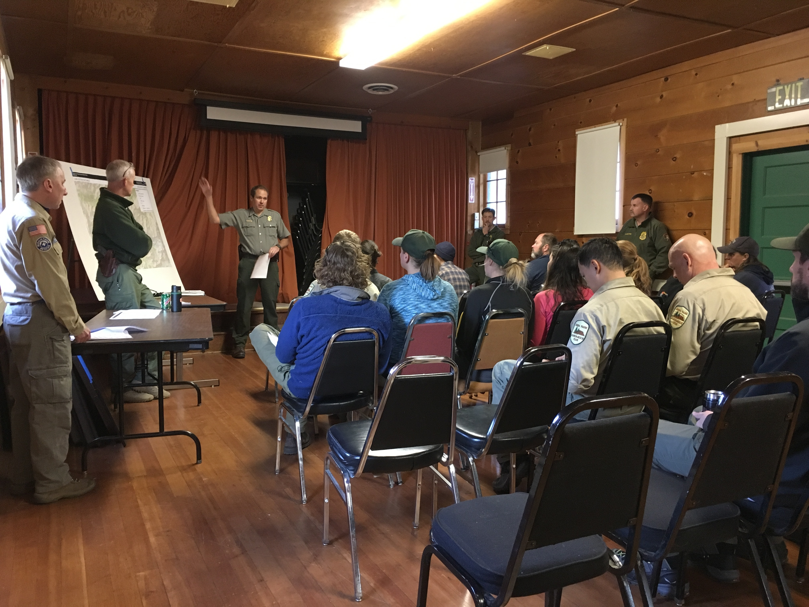

# Exploratory testing is not ad hoc testing

*Exploratory testing is disciplined and accountable - a charter, a time-box, running notes, a debrief. Ad hoc testing is unstructured poking with no record. Conflating the two is what costs exploratory testing its credibility with managers.*

> Here's the sentence that's quietly sabotaged exploratory testing's reputation in more companies than
> any single bad bug ever could: "oh, I just tested it exploratory-style, you know, clicked around a
> bit." Say that in front of a manager who's never seen exploratory testing done properly and you've
> just taught them that the word means "no plan, no record, trust me." It doesn't, and this note draws
> the line with a fence around it. Exploratory testing, done for real, is a disciplined activity with
> a stated mission, a fixed time budget, running notes, and a debrief that lets someone else judge what
> got covered - all of it built earlier in this chapter and covered in full later in this module. Ad
> hoc testing is the thing your careless coworker actually did: unstructured, unrecorded, unaccountable
> poking that happens to sometimes find a bug. They can look identical from across the room, the way a
> surgeon's incision and a bar fight both involve a blade. Confuse the two out loud, in front of the
> wrong person, and you've handed exploratory testing's credibility away for free.

> **In real life**
>
> Two people walk into the same stretch of forest looking for a lost hiker. The first is part of an
> official search-and-rescue grid team: briefed before stepping off the trailhead on exactly which
> quadrant they're covering and for how long, radio check-ins on a schedule, a notebook where every
> searched ravine gets logged whether or not anything turned up, and a debrief back at base where the
> team lead marks the map and decides what to search next. The second is a well-meaning bystander who
> heard about the missing hiker on the radio, grabbed a flashlight, and wandered into the woods
> wherever looked interesting. Both people are physically doing the same thing - walking through trees,
> looking for a person. Only one of them produces something the search coordinator can actually use:
> a map of what's confirmed clear, a reliable account of where nobody's looked yet, and a result that
> means something whether or not the hiker was found. The bystander might get lucky and find the hiker
> first. That doesn't make the wandering equivalent to the grid search - it makes it a lucky guess that
> happened to work, once, with nothing learned for next time. Exploratory testing is the grid team. Ad
> hoc testing is the flashlight and good intentions.

**ad hoc testing**: Testing performed with no charter, no time-box, and no record - the tester acts on immediate, in-the-moment impulse with no stated mission and produces no coverage evidence afterward, whether or not a bug happens to turn up. Ad hoc testing can still find real defects, but it cannot be planned, assigned, compared, or reported on, because nothing about it was fixed in advance or written down afterward. Contrast sharply with exploratory testing, which shares the improvised, judgment-driven moment-to-moment mechanic (the learn-design-execute loop) but wraps it in a charter (a stated mission, agreed before the session), a time-box (an agreed length), running session notes (what was tried, what was found, what's left uncovered), and a debrief (someone else reviewing coverage against the charter afterward). The two can look identical from the outside for the length of a single click - the difference is entirely in the accountability structure around the clicking, not in the clicking itself.

## The one thing they share, and the four things they don't

Here's the part that makes the confusion so easy to fall into: ad hoc testing and exploratory
testing genuinely share their moment-to-moment mechanic. Both involve a tester improvising, reading
the product live, and deciding what to try next without a pre-written script - the learn-design-
execute loop from earlier in this chapter shows up in both, because both are, in the smallest sense,
"unscripted." If you filmed thirty seconds of either one, you might not be able to tell them apart.
That's exactly why the distinction has to be drawn somewhere other than the clicking itself - and it
is: a charter, a time-box, running notes, and a debrief. Take any one of the four away and you've
started sliding toward ad hoc. Take all four away and there is nothing left to call exploratory
testing at all, no matter how many real bugs the session happens to turn up.

A **charter**, covered in full in this module's next chapter, is a short written mission agreed
*before* the session starts - what area, what technique or angle, what kind of problem to hunt. Ad
hoc testing has no charter; the tester decides what to look at only once they're already looking at
it, which means nobody agreed to the scope in advance and nobody can hold the tester to any scope
afterward either. A **time-box** is an agreed length set in advance, the exploratory equivalent of
the dive lead's thirty minutes of bottom time - it turns "test this for a while" into a schedulable,
comparable unit of work. Ad hoc testing has no time-box; it runs until the tester gets bored, gets
interrupted, or gets distracted by something shinier, and nobody can plan around a length nobody
agreed to. **Running notes** are a live record of what got tried, what was found, and - just as
importantly - what was NOT covered. Ad hoc testing leaves no such trail; if nothing gets logged
along the way, "what did you actually check" becomes a question only the tester's memory can answer,
and memory is a documentation format nobody should be signing off releases against. And a **debrief**
is a short conversation afterward where someone else compares what happened against the charter -
this is what makes a session's coverage a fact the team can rely on instead of a claim the team has
to take on faith.

## Why the conflation costs real credibility

Watch what happens when a manager who's only ever seen the ad hoc version hears the word
"exploratory" for the first time. They see a tester with no plan, producing no artifact, unable to
say afterward what got covered versus what didn't - and they draw the entirely reasonable conclusion
that "exploratory testing" is corporate language for "winging it." From that moment on, every request
for exploratory testing time reads to that manager as a request for unaccountable time, and every
manager who's ever had to defend a testing budget to THEIR boss will fight that request, correctly,
because unaccountable time genuinely doesn't belong in a serious release process. The tragedy is that
the manager isn't wrong about what they saw - they're wrong about what exploratory testing actually
is, because the version they saw was missing all four structural pieces. Every tester who calls
undocumented poking "exploratory testing" spends a little of the real technique's credibility on
their own behalf, and the bill eventually comes due for someone else, in some other meeting, trying
to get real exploratory time approved.

The fix isn't to abandon the improvisation - the improvisation is the entire point, and this
chapter's earlier notes spent a lot of effort establishing exactly why it's structurally powerful.
The fix is to never let the improvisation travel without its four companions. A tester who can say
"here's my charter, I had twenty minutes, here are my session notes covering what I tried and what I
didn't get to, and here's what I found" has just described something a lead can schedule, evaluate,
and defend upward - using the exact same freewheeling, judgment-driven session a careless coworker
would describe as "clicked around a bit." Same session, radically different credibility, entirely
because of what surrounds it on paper.


*Search and rescue staff receive briefing about operations — NPS Photo, public domain (Sequoia and Kings Canyon National Parks)*
- **The marked map on the easel = the charter** — Before anyone deploys, the search area is named, drawn, and agreed on in front of the whole team. That is the charter's job: fixing what area and what kind of thing the search is for, before the improvising starts, not instead of it.
- **The papers and notes on the table = running notes waiting to be filled in** — Blank now, but this is where coverage gets logged as the operation proceeds. Without that log, a cleared area and an unsearched area look identical from base camp - the exact problem session notes solve for a tester.
- **The ranger actively briefing, hand raised toward the map = a coordinator directing a specific, deliberate mission** — Nobody here is wandering in on their own initiative - a named person is assigning specific ground to specific people, out loud, in front of witnesses. This is what makes what follows a charter, not an errand.
- **The seated group, oriented toward the briefing = teams receiving a charter before heading out** — Every person in these chairs is about to search SOMETHING specific, decided in this room, not wherever felt interesting once they got outside. Ad hoc testing skips this room entirely.
- **The formal, structured indoor setting itself = a deliberate process, not a casual gathering** — A dedicated room, chairs in rows, a marked map, papers on a table - every detail signals this is accountable, organized work, the same signal a charter and time-box give an exploratory testing session.

**Same profile-photo upload bug, found two ways - only one produces a usable record**

1. **Tester A gets a charter: explore profile photo upload with unusual file types, fifteen minutes, looking for crashes or silent failures** — Scope, time, and risk focus all fixed before a single click. Tester B, nearby, just opens the profile page because it's next on their screen and starts clicking around with no stated goal.
2. **Both testers try uploading a corrupted image file within the first few minutes** — Tester A logs it in running notes: 'corrupted JPEG, 0KB result, no error shown to user - noted, continuing.' Tester B notices the same thing, mutters 'huh, weird,' and moves on without writing anything down.
3. **Tester A's time-box hits fifteen minutes and the session stops on schedule** — Tester B is still going, now on a completely different page because something else caught their eye - there was never an agreed boundary to hit.
4. **Tester A's debrief: charter shown, notes read aloud - three areas covered, one bug confirmed (silent failure on corrupted upload), two areas explicitly marked not-yet-covered** — A lead can now assign someone to the uncovered areas with full confidence about what's actually been checked.
5. **Tester B, asked what got tested, says 'the profile page, it's mostly fine, I think I saw something weird with an upload once'** — The exact same bug exists in both testers' memory. Only one of them can prove it, schedule around it, or hand it to a debrief that means anything - the other produced a rumor.

Here's the shape as runnable code: two testers doing genuinely improvised, unscripted work on the
same feature - watch which one produces something a lead could actually act on afterward:

*Run it - a charter, time-box, and notes vs. pure improvisation with no record (Python)*

```python
# The product under test: profile photo upload with an undocumented quirk.
def upload_photo(file_type, size_kb):
    if file_type == "corrupted_jpeg":
        return "silent failure - upload appears to succeed but photo never saves, no error shown"
    if file_type == "heic" and size_kb > 5000:
        return "large HEIC file times out the upload with a generic 500 error"
    return None

# TESTER A: exploratory testing - charter, time-box, running notes.
def exploratory_session(charter, time_box_minutes):
    print("CHARTER:", charter)
    print("TIME-BOX:", time_box_minutes, "minutes")
    notes = []
    tries = [("corrupted_jpeg", 200), ("heic", 6000), ("png", 300)]
    minutes_used = 0
    for file_type, size in tries:
        if minutes_used >= time_box_minutes:
            notes.append("STOPPED at time-box - remaining file types not yet covered")
            break
        result = upload_photo(file_type, size)
        entry = file_type + " (" + str(size) + "kb): " + (result if result else "no issue found")
        notes.append(entry)
        minutes_used += 5
    return notes

# TESTER B: ad hoc - no charter, no time-box, no notes kept.
def ad_hoc_poking():
    # No mission was agreed. No length was agreed. Nothing gets written down.
    result = upload_photo("corrupted_jpeg", 200)
    if result:
        return "saw something weird once, don't remember exactly what"  # this is the entire record
    return "seemed fine I think"

print("Tester A - exploratory session:")
session_notes = exploratory_session(
    "explore profile photo upload with unusual file types, looking for crashes or silent failures",
    15,
)
for line in session_notes:
    print(" ", line)

print()
print("Tester B - ad hoc poking, asked afterward what they found:")
print(" ", ad_hoc_poking())

print()
print("Same product, same real bug exists for both testers to find.")
print("Only one produced a record a lead could actually act on.")

# Tester A - exploratory session:
# CHARTER: explore profile photo upload with unusual file types, looking for crashes or silent failures
# TIME-BOX: 15 minutes
#   corrupted_jpeg (200kb): silent failure - upload appears to succeed but photo never saves, no error shown
#   heic (6000kb): large HEIC file times out the upload with a generic 500 error
#   png (300kb): no issue found
#
# Tester B - ad hoc poking, asked afterward what they found:
#   saw something weird once, don't remember exactly what
#
# Same product, same real bug exists for both testers to find.
# Only one produced a record a lead could actually act on.
```

Same story in Java - trace how tester A's session produces a list a debrief can read line by line,
while tester B's whole "record" is a single vague string with nothing behind it:

*Run it - a charter, time-box, and notes vs. pure improvisation with no record (Java)*

```java
import java.util.*;

class Main {
    static String uploadPhoto(String fileType, int sizeKb) {
        if (fileType.equals("corrupted_jpeg"))
            return "silent failure - upload appears to succeed but photo never saves, no error shown";
        if (fileType.equals("heic") && sizeKb > 5000)
            return "large HEIC file times out the upload with a generic 500 error";
        return null;
    }

    // TESTER A: exploratory testing - charter, time-box, running notes.
    static List<String> exploratorySession(String charter, int timeBoxMinutes) {
        System.out.println("CHARTER: " + charter);
        System.out.println("TIME-BOX: " + timeBoxMinutes + " minutes");
        List<String> notes = new ArrayList<>();
        String[][] tries = {{"corrupted_jpeg", "200"}, {"heic", "6000"}, {"png", "300"}};
        int minutesUsed = 0;
        for (String[] t : tries) {
            if (minutesUsed >= timeBoxMinutes) {
                notes.add("STOPPED at time-box - remaining file types not yet covered");
                break;
            }
            String result = uploadPhoto(t[0], Integer.parseInt(t[1]));
            notes.add(t[0] + " (" + t[1] + "kb): " + (result != null ? result : "no issue found"));
            minutesUsed += 5;
        }
        return notes;
    }

    // TESTER B: ad hoc - no charter, no time-box, no notes kept.
    static String adHocPoking() {
        String result = uploadPhoto("corrupted_jpeg", 200);
        if (result != null) return "saw something weird once, don't remember exactly what";
        return "seemed fine I think";
    }

    public static void main(String[] args) {
        System.out.println("Tester A - exploratory session:");
        List<String> sessionNotes = exploratorySession(
            "explore profile photo upload with unusual file types, looking for crashes or silent failures",
            15
        );
        for (String line : sessionNotes) System.out.println("  " + line);

        System.out.println();
        System.out.println("Tester B - ad hoc poking, asked afterward what they found:");
        System.out.println("  " + adHocPoking());

        System.out.println();
        System.out.println("Same product, same real bug exists for both testers to find.");
        System.out.println("Only one produced a record a lead could actually act on.");
    }
}

/* Tester A - exploratory session:
   CHARTER: explore profile photo upload with unusual file types, looking for crashes or silent failures
   TIME-BOX: 15 minutes
     corrupted_jpeg (200kb): silent failure - upload appears to succeed but photo never saves, no error shown
     heic (6000kb): large HEIC file times out the upload with a generic 500 error
     png (300kb): no issue found

   Tester B - ad hoc poking, asked afterward what they found:
     saw something weird once, don't remember exactly what

   Same product, same real bug exists for both testers to find.
   Only one produced a record a lead could actually act on. */
```

> **Tip**
>
> Before your next exploratory session, say the four words out loud to yourself like a checklist:
> charter, time-box, notes, debrief. If you can't name your charter in one sentence, you don't have
> one yet - go write it. If you don't know how long you're going for, pick a number now, before you
> start, not whenever you happen to stop. If you finish a session and can't produce at least a rough
> list of what you tried, you weren't taking notes, you were just remembering, and memory decays by
> the time anyone asks. And if nobody ever hears how the session went, the debrief never happened,
> and neither did the accountability that separates you from the bystander with the flashlight.

### Your first time: Your mission: produce something an ad hoc session structurally cannot

- [ ] Run tester B's ad_hoc_poking function and read its entire output — One vague sentence. That's not a caricature - that's genuinely the full information content of testing with no charter, no time-box, and no notes, even when a real bug was seen.
- [ ] Run tester A's exploratory_session and read every line of its notes — Notice the notes include what was NOT covered, not just what was found - 'no issue found' and the stopped-at-time-box line are both real, useful information a debrief needs, and ad hoc testing produces neither.
- [ ] Shrink the time_box_minutes argument to 5 and rerun tester A's session — Watch the session stop mid-list and explicitly say what got skipped. A time-boxed session that runs out of time still produces a trustworthy partial record - an untimed session that just trails off produces nothing comparable.
- [ ] Try to answer 'what got covered' using only tester B's function — You can't, beyond the single vague line - there is no charter to compare against and no notes to check. Write down, in one sentence, what information is missing that a real debrief would need and could never recover.
- [ ] Rewrite your own last few days of testing as a one-line charter each — For each real testing task you did recently, write the charter you SHOULD have stated beforehand, even if you didn't write it down at the time. If you can't reconstruct a plausible charter for a session, it may have been closer to ad hoc than you thought.

You've now watched the exact same bug get found by two different testers, and seen in code why only the one with a charter, a time-box, and notes produced something a debrief - or a manager - could actually trust.

- **A tester defends undocumented, unplanned testing by saying 'exploratory testing is supposed to be improvised, that's the whole point'**
  Improvisation describes the moment-to-moment mechanic - the learn-design-execute loop - not the surrounding accountability. A charter, time-box, and notes don't remove the improvisation; they wrap it so someone else can trust and schedule it. Point back at this note's four-piece structure: the clicking stays free, the paperwork around it doesn't disappear.
- **A manager hears 'exploratory testing' and immediately assumes it means unplanned, unreportable time, and resists scheduling any**
  The manager likely only ever saw the ad hoc version and is (correctly) rejecting THAT. Don't argue the definition in the abstract - show a real charter, a real time-box, and real session notes from a past session, and let the artifact do the arguing. A manager who sees the accountability structure stops treating the request like a blank check.
- **A team calls its bug bash 'exploratory testing' but nobody wrote a charter, set a time-box, or collected notes from any participant**
  That's a bug bash - a genuinely useful activity - mislabeled with exploratory testing's more disciplined name. Fix the label or fix the activity: either call it what it is, or bolt on the missing pieces (even a loose shared charter per table and a shared notes doc) so the 'exploratory testing' name is actually earned.
- **A tester's session notes exist but only list bugs found, with nothing about what was tried and came back clean or what never got reached**
  That's a bug list, not session notes - useful, but it answers a different question than a debrief needs. Session notes need three kinds of entries: what was tried and found nothing (coverage), what was tried and found something (bugs), and what the time-box ran out before reaching (gaps). A notes file with only the middle category still leaves 'what got covered' unanswerable.

### Where to check

Whether a session was exploratory testing or ad hoc testing wearing its name, check for these
artifacts after the fact - not during, when it's too late to reconstruct them honestly:

- **Is there a charter written before the session, not reconstructed afterward?** A charter invented after the fact to justify whatever happened isn't a charter, it's a rationalization.
- **Was there an agreed length, and did the session actually respect it?** A time-box nobody enforced is a suggestion, not a boundary - check whether "fifteen minutes" turned into ninety with no note explaining why.
- **Do the notes mention anything that was NOT covered?** Notes listing only bugs found are a bug list. Real session notes include gaps and clean areas too - that's the part ad hoc testing structurally cannot produce, because nothing was tracked against a scope in the first place.
- **Can someone other than the tester describe what got tested, from the notes alone?** If the honest answer requires asking the tester and trusting their memory, the artifact didn't do its job.
- **Did a debrief actually happen, even briefly?** A charter and notes that nobody ever reviewed against each other are only half the accountability loop - the debrief is what closes it.

### Worked example: the bug bash that almost lost its credibility, saved by four small additions

1. **The situation:** a team schedules a two-hour "exploratory testing session" before a big release. Ten people, one shared feature, zero written charters, zero time-boxes per person, zero shared notes document.
2. **What actually happens:** everyone opens the app and clicks around wherever looks interesting. Three real bugs get found. Genuinely useful outcome - the bugs are real and worth fixing.
3. **The problem surfaces in the retro:** a director asks "what did the two hours actually cover, beyond the three things you happened to notice?" Nobody can answer. Ten people spent twenty person-hours, and the only artifact is three bug tickets - no record of what was checked and came back clean, no record of what never got looked at.
4. **The credibility hit:** the director's takeaway is "exploratory testing produced three bugs in twenty hours of unaccountable time" - and the NEXT time someone requests exploratory testing time, that framing is what they're arguing against, whether or not it's fair.
5. **The fix, applied to the very next bash:** each pair gets a one-line charter before starting ("explore checkout with international addresses, looking for validation errors"), a shared forty-minute time-box, and a shared notes doc with three columns - tried and clean, tried and found, not yet reached.
6. **The second bash finds two bugs, fewer than the first,** but produces a document showing exactly which of eight feature areas got real coverage, which came back clean, and which three areas ran out of time before anyone touched them.
7. **The debrief now takes ten minutes instead of an argument:** the director reads the coverage columns, immediately sees the three uncovered areas, and assigns a follow-up session to exactly those - a decision the first bash's output made structurally impossible to make well.
8. **The lesson:** the improvised, judgment-driven clicking barely changed between the two bashes. What changed was four small additions that turned twenty hours of "trust me" into twenty hours of evidence - and that difference is the entire distance between exploratory testing and ad hoc testing wearing its name.

> **Common mistake**
>
> Assuming that adding a charter, time-box, notes, and a debrief will slow exploratory testing down
> enough to erase its speed advantage over scripted testing. It doesn't - a charter is one sentence
> written in under a minute, a time-box is a number picked before a timer starts, session notes are a
> few words jotted after each finding rather than a formal document, and a debrief can run four minutes
> long, as covered later in this module's chapter on session-based test management. None of the four
> pieces requires upfront test design the way a scripted case does - they're accountability scaffolding
> around the loop, not a second technique bolted on top of it. The teams that skip all four aren't
> saving meaningful time; they're spending the same twenty minutes and getting a rumor back instead of
> evidence.

**Quiz.** A tester spends thirty unplanned minutes clicking through a feature with no stated goal beforehand, keeps no notes, and afterward reports finding one real bug. What is the most accurate way to classify this session?

- [ ] Exploratory testing, because a real bug was found using unscripted, judgment-driven improvisation
- [x] Ad hoc testing - it shares exploratory testing's improvised moment-to-moment mechanic, but has no charter, no time-box, and no notes, so nothing about its coverage is knowable or reportable afterward
- [ ] Scripted testing performed poorly, since no written steps were followed
- [ ] It cannot be classified at all unless the bug found turns out to be a real defect

*Finding a real bug does not make a session exploratory testing - the technique is defined by its accountability structure (charter, time-box, notes, debrief), not by whether it happened to succeed. This session shares the improvised loop with real exploratory testing but is missing all four structural pieces, which is the textbook definition of ad hoc testing: judgment-driven, but unplanned and unreportable. Option one is the exact conflation this note exists to prevent - a lucky find does not retroactively supply a charter, a time-box, or notes that were never made. Option three is a category error: scripted testing is defined by design happening before execution via written steps, which is not what happened here at all - there was no design phase, planned or unplanned. Option four is also wrong: classification depends on the STRUCTURE around the session (charter, time-box, notes), which is knowable regardless of whether a bug turned up - a session with no charter and no notes is ad hoc testing whether it finds zero bugs or ten.*

- **Ad hoc testing - definition** — Testing with no charter, no time-box, and no record - the tester acts on pure in-the-moment impulse with no stated mission and produces no coverage evidence afterward. Can still find real bugs, but cannot be planned, assigned, compared, or reported on.
- **What exploratory and ad hoc testing genuinely share** — The moment-to-moment mechanic - the learn-design-execute loop, improvised and judgment-driven rather than scripted. This is exactly why they can look identical for the length of a single click.
- **The four structural pieces that separate exploratory testing from ad hoc testing** — A charter (a stated mission agreed before starting), a time-box (an agreed length), running session notes (what was tried, found, and left uncovered), and a debrief (someone else reviewing coverage against the charter afterward).
- **Why conflating the two costs exploratory testing credibility** — A manager who's only seen the undocumented, ad hoc version reasonably concludes 'exploratory testing' means unaccountable time, and resists approving real exploratory sessions later - the technique's reputation gets spent by every tester who calls unplanned poking 'exploratory testing.'
- **What real session notes need to contain, beyond bugs found** — Three kinds of entries: what was tried and came back clean (coverage), what was tried and found something (bugs), and what the time-box ran out before reaching (gaps). Notes with only bugs listed are a bug list, not proof of coverage.
- **Why the four accountability pieces don't erase exploratory testing's speed advantage** — A charter is one sentence, a time-box is a number picked in advance, notes are a few words per finding, and a debrief can run a few minutes - none of them require the upfront test design a scripted case needs. They're scaffolding around the loop, not a second technique.

### Challenge

Recall a real testing session you or a teammate did recently that had no written charter, no fixed
time-box, and no notes kept - even if it found something useful. Rewrite it, after the fact, as if it
had been done properly: write the charter it should have started with, pick the time-box it should
have run inside, and reconstruct as honest a set of session notes as you can from memory, including
at least one thing you're now unsure whether you actually covered. Circle that uncertain item - it's
the exact kind of gap real session notes exist to prevent. In the Python playground, extend
upload_photo with one more undocumented quirk of your own, then extend ad_hoc_poking's single-line
report to show just how little information survives even a real find when nothing was charted, timed,
or noted.

### Ask the community

> Credibility problem: at my `[company / bootcamp / project]`, when I say I did exploratory testing, the reaction is `[skepticism / a request for a full test script anyway / it gets dismissed as not real testing]`. Looking back, my sessions usually have `[a charter but no time-box / notes but no charter / none of the four pieces / all four, and I'm still not believed]`. What's actually missing, and how do you present exploratory testing results so a skeptical manager trusts them?

This is almost always either a genuine structure gap (one of the four pieces missing) or a
presentation gap (the structure exists but never gets shown). Describe which pieces you actually have
versus which ones you show afterward, and the community can usually tell you fast whether you need to
fix the session or just fix how you report it.

- [James Bach - Exploratory Testing Explained, including the distinction from unstructured testing](https://www.satisfice.com/exploratory-testing)
- [Cem Kaner - a definition and history of exploratory testing, from the technique's originator](https://kaner.com/?p=46)
- [ISTQB Glossary - formal definitions distinguishing exploratory testing from unstructured testing](https://glossary.istqb.org/)
- [The Quality Analyst — Difference between Ad hoc Testing and Exploratory Testing](https://www.youtube.com/watch?v=1xn77TYeASY)

🎬 [Difference between Ad hoc Testing and Exploratory Testing](https://www.youtube.com/watch?v=1xn77TYeASY) (5 min)

- Exploratory testing and ad hoc testing share the same improvised, judgment-driven moment-to-moment mechanic - the difference is entirely in the accountability structure around it, not the clicking itself.
- Ad hoc testing has no charter, no time-box, and no notes - it can still find real bugs, but produces nothing plannable, comparable, or reportable afterward.
- Exploratory testing wraps the same improvisation in four pieces: a charter (mission), a time-box (length), running notes (coverage, finds, and gaps), and a debrief (someone else checking coverage against the charter).
- Conflating the two is what actually damages exploratory testing's reputation - a manager who's only seen the undocumented version reasonably distrusts every future request for exploratory time.
- The four accountability pieces are cheap - a sentence, a number, a few words per finding, a short conversation - so adding them doesn't erase exploratory testing's speed advantage over scripted testing, it just makes the same session provable.


---
_Source: `packages/curriculum/content/notes/exploratory-testing/the-exploratory-mindset/exploratory-not-ad-hoc.mdx`_
