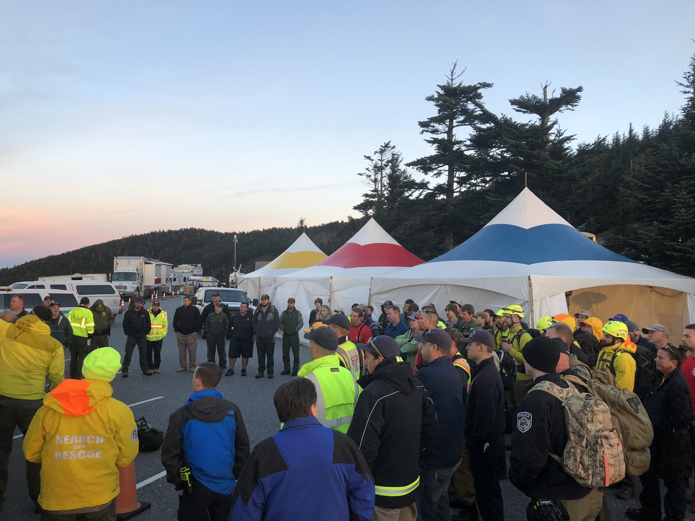

# When exploratory testing wins

*Four situations where exploratory testing is structurally the right tool: new or poorly-specified features, real time pressure, hunting unknown-unknowns, and a scripted suite that already ran clean. Concrete scenarios, not vibes.*

> "We don't have time for exploratory testing" is one of the most backwards sentences a deadline ever
> produces, and by the end of this note you'll be able to say why with a straight face in a planning
> meeting. You already know exploratory testing and scripted testing are complementary tools, not
> rivals, and you've watched the loop that makes exploratory testing tick. What's missing is judgment:
> given a real situation, which tool actually wins? This note is a field guide to four situations where
> reaching for exploratory testing isn't a mood or a shortcut, it's the mathematically correct call -
> a brand-new feature nobody's written a spec for yet, a deadline too tight for upfront test design, a
> hunt for the failure nobody thought to ask about, and the deceptively dangerous moment right after a
> scripted suite goes fully green. Learn to recognize these four on sight and you'll stop apologizing
> for reaching for exploratory testing and start defending it with a reason a skeptical lead can't
> argue with.

> **In real life**
>
> A homicide detective gets called back onto a case file that patrol already closed. The uniformed
> officers did their job properly: canvassed the block, filed the report, checked the obvious boxes -
> was the door forced, were there witnesses, does the timeline match the neighbor's statement. Clean
> report, case marked resolved. The detective isn't there to redo that work. She's there because
> something about the file itches - a detail that technically fits the report but doesn't sit right -
> and her job for the next few hours has no checklist. She'll follow whichever thread looks strangest,
> double back when one goes nowhere, and change her next question based on the answer she just got.
> That's not sloppier work than the patrol report; it's a completely different kind of work, aimed at
> a completely different kind of gap - not "did we follow procedure" but "what did procedure structurally
> never have a box for." Every scripted suite is the patrol report. Exploratory testing is the
> detective called back in, specifically because the report was clean and something still itches.

**unknown-unknown**: A risk, defect, or behaviour nobody on the team has thought to ask about yet - as distinct from a known-unknown, which is a risk the team is already aware it hasn't checked (a documented gap, a flagged edge case, an item on a backlog). Scripted testing, built from specifications and known requirements, is structurally limited to checking known-unknowns and knowns - it can only test what someone already imagined enough to write a step for. Exploratory testing is one of the few techniques capable of surfacing unknown-unknowns, because the tester's live judgment, not a document written in advance, is choosing what to investigate next - including directions nobody had a name for until the session found them.

## New ground and moving targets

The first situation is the most obvious once you see it: a feature that's genuinely new, or specified
so thinly that "the spec" is really just a one-line ticket and a hopeful Slack thread. Writing
detailed scripted cases against a target like that produces cases built entirely from guesses - the
tester's guesses about what the feature is supposed to do, dressed up as steps and expected results.
Half of those guesses will be wrong the moment a developer makes a real decision, and the scripted
cases go stale before anyone even finishes running them once. Exploratory testing sidesteps the
problem by not needing the guess to be right in advance: a tester opens the actual, real, currently-existing
behaviour and learns what it does directly, which is strictly more reliable than reading a
requirements document that was already out of date by the time it got approved. The healthy sequence
on a new or poorly-specified feature is explore first to learn what actually exists, then write
scripted regression cases once the behaviour has settled enough to be worth locking down - not the
other way around.

The second situation looks completely different on the surface but has the identical shape
underneath: real time pressure, a release tomorrow, and not enough hours to write proper scripted
cases from scratch. The tempting move under pressure is to skip testing design altogether and just
click around - but that's not actually what "reach for exploratory testing" means here. Exploratory
testing wins under time pressure specifically because of the economics covered earlier in this
chapter: scripted testing is cheap to repeat but expensive to WRITE, because someone has to imagine
every case before execution starts. Exploratory testing needs no such upfront design phase - a
tester with a five-minute charter can be producing real findings inside of six minutes, where a
scripted suite of comparable coverage might take an afternoon to author before a single check runs.
Under a real deadline, exploratory testing isn't the corner-cut version of proper testing. It's very
often the only technique that fits in the time available at all.

## Hunting what nobody thought to ask, and testing the suite that already passed

The third situation is the purest form of exploratory testing's actual job: deliberately hunting for
unknown-unknowns. A scripted suite, by construction, can only check behaviours someone already
imagined - it has no mechanism for finding a risk nobody named. Exploratory testing does, because the
tester's judgment in the moment can wander somewhere no requirements document pointed, following a
detail that "doesn't sit right" the way a detective follows a hunch. This is why exploratory testing
tends to concentrate on areas where nobody's confident they know all the risks yet - complex state
interactions, unusual input sequences, timing, anything that emerged from combining features nobody
combined on purpose when writing the spec. You cannot schedule "find the thing nobody thought of" on
a scripted test plan, because a scripted test plan is, definitionally, a list of things somebody
already thought of.

The fourth situation is the one that catches teams off guard the most: a scripted regression suite
that has been green for release after release, treated as proof the area is safe, is precisely the
moment exploratory testing has the most room to find something. A long green streak proves the
documented behaviours everyone already knew about still work - it says nothing whatsoever about the
behaviours nobody wrote a check for, and those don't become rarer just because the known ones keep
passing. If anything, a mature, stable, boring-looking green suite is a strong signal that an area
hasn't had fresh human judgment applied to it in a while, which is exactly the condition under which
unknown-unknowns quietly accumulate undetected. Scheduling a short exploratory session specifically
on your GREENEST area, on purpose, on a schedule, is one of the highest-leverage moves in this whole
chapter - and it directly sets up the session-based test management practices covered later in this
module, which turn "go poke at the stable area occasionally" into a plannable, reportable activity.


*Interagency personnel attending search and rescue operational briefings, Great Smoky Mountains National Park — NPS Photo, public domain*
- **The dense, dark forested ridge = the vast, only partially known territory still ahead** — Nobody has a detailed, pre-written plan for every tree line on that mountain. Sending searchers in with a rigid, fixed route here is guesswork dressed as a plan - better to send people whose job is to learn the terrain as they move through it.
- **The fading sunset colors in the sky = real time pressure** — There is not enough daylight left to painstakingly script every step before acting. A team that spends the remaining light drafting a perfect plan gets caught out by dark with nothing walked yet - moving and learning simultaneously is the only technique that fits the clock.
- **The command tents = where judgment gets applied on purpose** — Nobody here is wandering randomly - there is a coordination hub, a mission, a structure. The freedom to choose the next move lives inside a deliberate, briefed effort, which is the same relationship exploratory testing has with a charter.
- **The 'SEARCH AND RESCUE' jacket, worn by someone in this specific crowd = a specialized skill assembled for exactly this unknown** — Not a generic bystander - a person whose actual expertise is operating in unmapped, high-uncertainty situations. This is exactly the skill set exploratory testing calls for: judgment applied to genuine unknowns, not a checklist.
- **The sheer size of this gathered crowd = a scale of response that only makes sense when the standard approach hasn't been enough yet** — Dozens of interagency personnel, mobilized together - this isn't the first move in a routine search. It's what happens when the situation demands more than a scripted, by-the-book pass, echoing exactly the high-uncertainty, high-stakes situations where exploratory testing earns its place.

**A bulk CSV product-import feature, from ticket to production - four moments exploratory testing wins**

1. **The ticket: 'let sellers import a CSV of products' - one sentence, no format spec** — New, poorly-specified ground. A scripted case written now can only test guesses about column order, encoding, and error handling - none of which exist as decided facts yet.
2. **An exploratory session learns the actual behaviour first: what columns are expected, what happens with a missing one** — Instead of guessing, a tester learns the real, current behaviour directly, then hands developers a list of decisions that still need making before anything can be locked into a script.
3. **Launch is moved up two weeks - real time pressure, no room for a full scripted suite** — A tester writes a ten-minute charter instead of a two-day test plan: explore malformed and oversized CSV files, looking for silent data loss. Coverage starts in minutes, not after a design phase that would have eaten the deadline.
4. **The scripted smoke suite for import goes green on every subsequent build for six weeks** — Green proves the three documented cases - valid file, empty file, wrong file type - still work. It says nothing about a file that's VALID but describes a product that already exists under a different name.
5. **A scheduled exploratory pass on the now-boring, always-green import feature finds it: duplicate SKUs from two different sellers silently merge into one listing, and the second seller's inventory count vanishes** — The unknown-unknown nobody wrote a step for, found specifically because someone went looking at the calm, stable, 'done' area on purpose - not because anything was reported broken.

Here's the shape as runnable code: a scripted suite built strictly from the documented cases, next
to an exploratory pass that keeps digging into a feature the scripted suite already called clean -
watch what only shows up after the green result:

*Run it - a green scripted suite next to an exploratory pass that keeps digging (Python)*

```python
# The product: a bulk CSV product-import feature with an undocumented merge quirk.
def import_csv(rows):
    bugs = []
    skus = {}
    for row in rows:
        sku = row.get("sku")
        seller = row.get("seller")
        qty = row.get("qty", 0)
        if sku in skus and skus[sku]["seller"] != seller:
            bugs.append("duplicate SKU across sellers silently merges - " + seller + "'s stock vanishes")
        else:
            skus[sku] = {"seller": seller, "qty": qty}
    if not rows:
        bugs.append("empty file accepted with zero warning, listing count silently stays at 0")
    return bugs

# SCRIPTED: only the three documented cases from the ticket.
def run_scripted_suite():
    documented_cases = [
        [{"sku": "A1", "seller": "acme", "qty": 10}],   # valid file
        [],                                              # empty file
        [{"sku": "B2", "seller": "acme", "qty": 5}],     # another valid file
    ]
    found = set()
    for rows in documented_cases:
        for bug in import_csv(rows):
            found.add(bug)
    return found

# EXPLORATORY: keeps probing an area the scripted suite already called clean.
def run_exploratory_pass():
    found = set()
    print("charter: explore the import feature the scripted suite already passed clean")
    print("learn: scripted suite is green, three documented cases all fine")
    print("design: try two DIFFERENT sellers uploading overlapping product codes")
    rows = [
        {"sku": "X9", "seller": "acme",     "qty": 20},
        {"sku": "X9", "seller": "riverside", "qty": 7},
    ]
    for bug in import_csv(rows):
        print("  execute -> found:", bug)
        found.add(bug)
    return found

print("Scripted suite (documented cases only):")
scripted = run_scripted_suite()
print(" ", scripted if scripted else "all green - nothing found")
print()
print("Exploratory pass on the SAME already-green feature:")
exploratory = run_exploratory_pass()
print(" total found:", exploratory)
print()
print("The green suite was not wrong. It just never asked the question")
print("that only occurred to someone once they went looking on purpose.")

# Scripted suite (documented cases only):
#   {'empty file accepted with zero warning, listing count silently stays at 0'}
#
# Exploratory pass on the SAME already-green feature:
# charter: explore the import feature the scripted suite already passed clean
# learn: scripted suite is green, three documented cases all fine
# design: try two DIFFERENT sellers uploading overlapping product codes
#   execute -> found: duplicate SKU across sellers silently merges - riverside's stock vanishes
#  total found: {"duplicate SKU across sellers silently merges - riverside's stock vanishes"}
#
# The green suite was not wrong. It just never asked the question
# that only occurred to someone once they went looking on purpose.
```

Same story in Java - the scripted method only ever runs the three cases from the ticket, while the
exploratory method goes hunting specifically because the ticket's cases already came back clean:

*Run it - a green scripted suite next to an exploratory pass that keeps digging (Java)*

```java
import java.util.*;

class Main {
    static List<String> importCsv(List<Map<String, Object>> rows) {
        List<String> bugs = new ArrayList<>();
        Map<String, String> skuOwner = new HashMap<>();
        for (Map<String, Object> row : rows) {
            String sku = (String) row.get("sku");
            String seller = (String) row.get("seller");
            if (skuOwner.containsKey(sku) && !skuOwner.get(sku).equals(seller)) {
                bugs.add("duplicate SKU across sellers silently merges - " + seller + "'s stock vanishes");
            } else {
                skuOwner.put(sku, seller);
            }
        }
        if (rows.isEmpty())
            bugs.add("empty file accepted with zero warning, listing count silently stays at 0");
        return bugs;
    }

    static Map<String, Object> row(String sku, String seller, int qty) {
        Map<String, Object> r = new HashMap<>();
        r.put("sku", sku); r.put("seller", seller); r.put("qty", qty);
        return r;
    }

    // SCRIPTED: only the three documented cases from the ticket.
    static Set<String> runScriptedSuite() {
        List<List<Map<String, Object>>> documentedCases = List.of(
            List.of(row("A1", "acme", 10)),
            List.of(),
            List.of(row("B2", "acme", 5))
        );
        Set<String> found = new LinkedHashSet<>();
        for (var rows : documentedCases) found.addAll(importCsv(rows));
        return found;
    }

    // EXPLORATORY: keeps probing an area the scripted suite already called clean.
    static Set<String> runExploratoryPass() {
        Set<String> found = new LinkedHashSet<>();
        System.out.println("charter: explore the import feature the scripted suite already passed clean");
        System.out.println("learn: scripted suite is green, three documented cases all fine");
        System.out.println("design: try two DIFFERENT sellers uploading overlapping product codes");
        List<Map<String, Object>> rows = List.of(
            row("X9", "acme", 20),
            row("X9", "riverside", 7)
        );
        for (String bug : importCsv(rows)) {
            System.out.println("  execute -> found: " + bug);
            found.add(bug);
        }
        return found;
    }

    public static void main(String[] args) {
        System.out.println("Scripted suite (documented cases only):");
        Set<String> scripted = runScriptedSuite();
        System.out.println("  " + (scripted.isEmpty() ? "all green - nothing found" : scripted));

        System.out.println();
        System.out.println("Exploratory pass on the SAME already-green feature:");
        Set<String> exploratory = runExploratoryPass();
        System.out.println("  total found: " + exploratory);

        System.out.println();
        System.out.println("The green suite was not wrong. It just never asked the question");
        System.out.println("that only occurred to someone once they went looking on purpose.");
    }
}

/* Scripted suite (documented cases only):
     [empty file accepted with zero warning, listing count silently stays at 0]

   Exploratory pass on the SAME already-green feature:
   charter: explore the import feature the scripted suite already passed clean
   learn: scripted suite is green, three documented cases all fine
   design: try two DIFFERENT sellers uploading overlapping product codes
     execute -> found: duplicate SKU across sellers silently merges - riverside's stock vanishes
     total found: [duplicate SKU across sellers silently merges - riverside's stock vanishes]

   The green suite was not wrong. It just never asked the question
   that only occurred to someone once they went looking on purpose. */
```

> **Tip**
>
> Build yourself a one-line trigger list and actually use it in planning: reach for exploratory testing
> when the ticket is thinner than the questions it raises, when the deadline is too tight to author a
> scripted suite before execution needs to start, when you catch yourself wanting to find "whatever's
> actually wrong" rather than confirm "does the known thing still work," and on a fixed cadence for
> whichever area has been green the longest. That last trigger is the one teams skip most often,
> because a long green streak FEELS like a signal to look elsewhere - when it's actually a signal that
> nobody's applied fresh judgment there in a while.

### Your first time: Your mission: catch a bug a green scripted suite structurally could not see

- [ ] Run the Python scripted suite alone and confirm it's fully green — Three documented cases, zero bugs. This is not a weak suite - it correctly proves every case someone thought to write actually works.
- [ ] Run the exploratory pass and read the charter and learn/design lines before the result — Notice the exploratory pass starts by explicitly naming that the area is already green - that's the fourth trigger from this note in action, not an afterthought.
- [ ] Add the duplicate-SKU case as a fourth scripted step, then rerun both — Once written down, scripted testing catches it forever, cheaply. This is the same healthy handoff from the previous note in this chapter - exploratory discovers, scripted locks in.
- [ ] Invent a fifth undocumented quirk of your own for a CSV import feature — Something like a column with mismatched case sensitivity, or a file where two rows have the same seller but conflicting quantities for the same SKU. Add it to import_csv and design an exploratory move that would plausibly stumble onto it.
- [ ] Name your own team's greenest, most-ignored area — Pick one real feature at your job or in BuggyShop that has passed its scripted suite for the longest without anyone testing it exploratorily recently. Write one sentence proposing when you'd schedule a session there and why now.

You've now seen a fully green suite sit right next to a bug it structurally could not have found - and practiced spotting the exact moment that gap becomes worth acting on.

- **A team under deadline pressure decides to 'do exploratory testing' by skipping test design entirely and having nobody write down what got covered**
  That's not exploratory testing winning under time pressure - that's ad hoc testing wearing exploratory testing's reputation as cover, and it produces nothing a manager can trust later. Even under real pressure, a charter takes thirty seconds to write and turns the session back into something plannable and reportable - the whole point of this chapter's later material on session-based test management.
- **A lead reads 'exploratory testing wins after scripted suites already ran clean' and starts cancelling scripted regression suites entirely in favour of only exploratory sessions**
  That overcorrects into the opposite failure this chapter already warned about: exploratory sessions are hard to repeat exactly, so cancelling the scripted suite removes the provable, repeatable proof that KNOWN behaviour still works. Keep the scripted suite running for regression proof, and add scheduled exploratory passes on top of it for unknown-unknown hunting - both, not a swap.
- **A new, poorly-specified feature ships to production with zero testing because 'there's no spec yet to test against'**
  A missing spec is exactly the trigger to explore, not the reason to skip testing. An exploratory session can learn and report the feature's actual current behaviour well before a formal spec exists, which is often the fastest way to SURFACE the decisions a spec still needs to make.
- **A tester keeps hunting for unknown-unknowns on a brand-new, still-unstable feature that's changing daily, and gets frustrated that nothing they find stays fixed**
  Unknown-unknown hunting pays off best on stable, mature, 'done' areas where the known risks are already handled and something fresh is genuinely rare to find. On a feature that's still actively changing, most bugs found ARE the known-unknowns of active development - that's a different, earlier-stage kind of exploratory session, and it's fine, just don't expect the same kind of surprising find.

### Where to check

A few concrete signals tell you, in the moment, that exploratory testing is the right call rather
than a fallback:

- **Count the questions the ticket raises versus the questions it answers.** More open questions than answered ones means a scripted case right now would mostly test guesses.
- **Check whether a scripted suite could even be authored before the deadline.** If the honest answer is no, exploratory testing isn't the corner-cut option - it's the only technique whose cost fits the clock.
- **Ask what you're actually hoping to find.** "Does the known thing still work" points at scripted. "I have no idea what I'm looking for, I just want to look" points at exploratory, and that's a legitimate answer, not a weak one.
- **Look at how long an area's scripted suite has been green.** The longer the streak, the more due that area is for a fresh exploratory pass, not less.
- **Watch for a detail that doesn't sit right even though every scripted check passed.** That itch is usually a thread only judgment can follow - a script has no field for "this feels off."

### Worked example: the CSV import bug that only existed after everything else was clean

1. **The ticket:** "Let sellers bulk-import products via CSV." One sentence. No column spec, no error-handling spec, no mention of what happens with duplicate data across sellers.
2. **New ground, first response:** rather than guess at a scripted suite, a tester runs a thirty-minute exploratory session just to learn the real behaviour - what columns are actually read, what a missing column does, what an empty file does. The findings become the first real spec the feature has.
3. **Deadline moves up two weeks:** there's no time left to author a full scripted suite from that new understanding. A ten-minute charter - explore malformed and oversized files, looking for silent data loss - ships coverage inside the day instead of inside a sprint.
4. **A basic scripted smoke suite gets written from the three most obvious cases** - valid file, empty file, wrong file type - and goes green on every build for six straight weeks. The team treats the feature as settled.
5. **A scheduled exploratory pass revisits the now-boring feature on purpose,** specifically because it's been green the longest of anything in the catalog, not because anything was reported broken.
6. **The find:** two different sellers upload files with the same product SKU. The import silently merges them into a single listing under whichever seller's row processed last - the OTHER seller's entire inventory count for that SKU quietly disappears from the system with no error, no warning, no log entry a support agent would ever think to check.
7. **Why the scripted suite could never have found this:** it checks three fixed cases, none of which involve two sellers or overlapping SKUs, because nobody who wrote the ticket, the exploratory learning session, or the smoke suite had reason to imagine two unrelated sellers using the same product code. It's a genuine unknown-unknown - not a known gap anyone had flagged and deprioritized.
8. **The lesson:** every one of this note's four triggers touched this one feature at a different point in its life - new and poorly-specified at the start, time-pressured at launch, and finally the green-streak trigger that caught what the other three passes structurally could not.

> **Common mistake**
>
> Believing "when exploratory testing wins" means "instead of scripted testing" rather than "in
> addition to, and often specifically because of, scripted testing." The fourth trigger in this note -
> a suite that already ran clean - only exists as a trigger BECAUSE the scripted suite did its job
> correctly and proved the known behaviours hold. Exploratory testing isn't rescuing you from a failed
> scripted suite in that scenario; it's building on top of a successful one, looking exactly where a
> successful, clean, boring result makes everyone least likely to keep looking. Treat a long green
> streak as a reason to stop testing an area and you've guaranteed that any unknown-unknown living
> there gets to stay hidden indefinitely.

**Quiz.** A feature's scripted regression suite has passed every build for two months straight. A lead argues this proves the area is low priority for further testing time. What's the strongest counter-argument from this note?

- [ ] Scripted suites are unreliable and should be replaced with exploratory sessions entirely
- [x] A long green streak proves the known, documented behaviours still work - it says nothing about unknown-unknowns nobody wrote a check for, which tend to accumulate exactly where fresh judgment stops being applied
- [ ] The suite should be run more frequently, since running it more often would eventually surface new bugs
- [ ] Green results are only meaningful for new features, so a two-month-old feature's suite result can be ignored either way

*The core argument in this note's fourth trigger is that a scripted suite can only ever prove what it was written to check - a long green streak is real evidence the documented behaviours hold, but zero evidence about behaviours nobody wrote a step for, and those don't get rarer while the known ones keep passing. Option one overcorrects into abandoning scripted testing, which this note explicitly warns against - the green streak has genuine value, it just isn't the whole picture. Option three misunderstands the mechanism: running the SAME fixed checks more often still only checks the same fixed things: more repetitions of an unchanged scripted case do not manufacture new coverage. Option four is simply false - a stable, mature feature's green streak is precisely the scenario this note identifies as MOST worth an exploratory look, not least, because stability is exactly when fresh judgment stops getting applied.*

- **The four triggers where exploratory testing structurally wins** — New or poorly-specified features (nothing to script from yet); real time pressure (no time to author scripted cases before execution must start); hunting unknown-unknowns (risks nobody's thought to ask about); and a scripted suite that's already green (proves the knowns, says nothing about the unknowns).
- **Unknown-unknown - definition** — A risk nobody on the team has thought to ask about yet, as distinct from a known-unknown (a flagged, documented gap). Scripted testing is structurally limited to knowns and known-unknowns; exploratory testing's live judgment is one of the few techniques that can surface a true unknown-unknown.
- **Why time pressure favours exploratory, not corner-cutting** — Scripted testing is cheap to repeat but expensive to WRITE - someone must imagine every case before execution starts. Exploratory testing needs no upfront design phase, so it can be producing real findings within minutes when a scripted suite of similar coverage would take far longer just to author.
- **Why a green scripted suite is a trigger for exploratory testing, not a reason to stop** — A long green streak proves documented behaviours still work; it proves nothing about behaviours nobody wrote a check for. Stability is exactly the condition under which unknown-unknowns quietly accumulate, because fresh human judgment stops being applied to an area everyone assumes is 'done'.
- **The right sequence on a new or poorly-specified feature** — Explore first to learn what the feature actually does, THEN write scripted regression cases once the behaviour has settled enough to be worth locking down - not the reverse, which produces scripted cases built from guesses that go stale immediately.
- **The mistake this note warns against** — Reading 'exploratory wins here' as 'instead of scripted testing' rather than 'in addition to it.' The green-streak trigger specifically only exists because a scripted suite already succeeded at its own job - exploratory testing builds on that success, it doesn't replace it.

### Challenge

Pick a real feature at your job, in BuggyShop, or anywhere you have access, and run all four triggers
against it as a checklist: is it new or thinly specified, is there genuine time pressure around it
right now, is there a plausible unknown-unknown you haven't gone looking for, and has its scripted
coverage (if any) been green for a suspiciously long time. Pick whichever trigger scores highest and
run a real fifteen-minute exploratory session against that exact angle, with a one-line charter
written first. In the Python playground, add a second undocumented quirk to import_csv - something
plausible for a bulk-import feature - and prove it stays invisible to run_scripted_suite while
run_exploratory_pass can reach it, by adding one new design line that a tester would plausibly try.

### Ask the community

> Trigger check: I'm looking at `[feature]` and trying to decide whether to spend my limited testing time on `[running/expanding the scripted suite / an exploratory session]`. Here's the situation: `[describe - e.g. how new the feature is, how much time pressure, how long the current suite has been green]`. Based on the four triggers in this note, which way would you lean, and what would change your answer?

This is the single most useful judgment call this chapter teaches, and it gets easier with more real
examples, not more theory. Describe your actual situation against the four triggers and the
community can usually tell you fast whether you're sitting on an obvious call or a genuinely close
one worth debating.

- [James Bach - Exploratory Testing Explained, including when the technique is the strongest available option](https://www.satisfice.com/exploratory-testing)
- [Cem Kaner - a definition and history of exploratory testing, from the technique's originator](https://kaner.com/?p=46)
- [ISTQB Glossary - formal definitions of exploratory testing and related risk-based testing terms](https://glossary.istqb.org/)
- [elsa — Exploratory testing for beginners and why it's important](https://www.youtube.com/watch?v=Pq1Zw7kl2SQ)

🎬 [Exploratory testing for beginners and why it's important](https://www.youtube.com/watch?v=Pq1Zw7kl2SQ) (10 min)

- Exploratory testing structurally wins in four situations: new or poorly-specified features, genuine time pressure, hunting unknown-unknowns, and right after a scripted suite has already gone clean.
- A poorly-specified feature makes scripted cases guesses dressed as steps - explore first to learn real behaviour, then script once it settles, not the reverse.
- Under real deadlines, exploratory testing isn't the shortcut version of testing - it needs no upfront design phase, so it's often the only technique whose cost fits the available time.
- A scripted suite can only ever check known and known-unknown risks; exploratory testing's live judgment is one of the few techniques capable of surfacing a genuine unknown-unknown.
- A long green streak proves known behaviours still hold and nothing else - treat it as a trigger to schedule a fresh exploratory pass, not a signal that an area no longer needs testing attention.


---
_Source: `packages/curriculum/content/notes/exploratory-testing/the-exploratory-mindset/when-exploratory-wins.mdx`_
