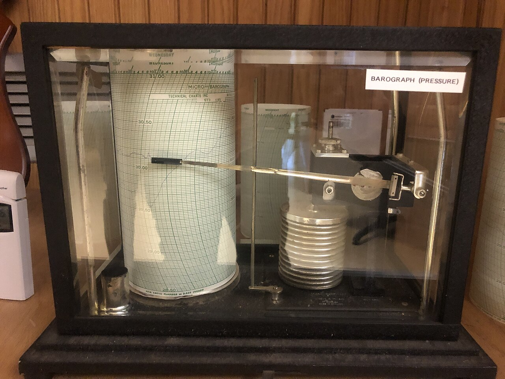

# Allure

*Allure builds test reports from annotations: @Step on reusable actions records structured step trees automatically, @Attachment pins evidence, and history carried between CI runs turns single verdicts into trends - so 'failing since Tuesday' and 'flaky all month' stop looking identical.*

> A test fails tonight. Is that new? A single-run report - however rich - cannot answer, because it
> only knows about tonight. Allure's answer is structural: keep history between CI runs, so the
> report shows this test green for 30 builds and red since Tuesday's deploy - or red-green-red all
> month, which is a completely different bug. And it gets its step detail a different way than
> ExtentReports does: not by you calling a logging API, but by annotating your framework's actions
> once and letting every test narrate itself.

> **In real life**
>
> A barograph is a pressure gauge that writes. A pen arm rests on a slowly rotating drum of chart
> paper, and nobody ever takes a reading - recording is a side effect of the instrument existing.
> When a storm hits, you don't get one number; you get the whole week's trace, and the shape of the
> fall tells you what kind of weather is coming. Allure works both halves of that: annotations make
> recording a side effect of your tests simply running, and kept history turns each run's verdict
> into a point on a curve instead of an isolated fact.

**Allure**: Allure Report is an open-source, multi-language test reporting framework. In Java it integrates with TestNG or JUnit through an adapter: methods annotated with @Step('Log in as {user}') are recorded as report steps - with parameter values interpolated - every time any test calls them, and nested calls between annotated methods produce a structured step tree. @Attachment methods (or Allure.addAttachment) pin screenshots, logs, and payloads to the step where they happened. During the run the adapter writes machine-readable results into an allure-results directory; a separate step - allure generate or allure serve - builds the HTML report from them. If the previous report's history folder is copied into allure-results before generating, the dashboard adds trend graphs across CI runs: pass-rate over time, duration curves, retries, and flaky-versus-newly-broken classification per test.

## Annotate once, narrate everywhere

The API-driven style (ExtentReports and classic logging) makes every test narrate itself, call by
call:

```java
// Every test repeats this narration by hand - and can forget to
ExtentTest report = extent.createTest("Checkout total after promo");
report.info("Logging in as standard_user");
loginPage.logIn("standard_user", "secret_sauce");
report.info("Adding backpack to cart");
cartPage.add("Sauce Labs Backpack");
```

Allure moves the narration onto the actions themselves, so it happens wherever they're called:

```java
public class LoginPage {
    @Step("Log in as {user}")
    public void logIn(String user, String pass) {
        enterCredentials(user, pass);   // also @Step-annotated
        submit();                       // also @Step-annotated
    }

    @Attachment(value = "Cart screenshot", type = "image/png")
    public byte[] attachCart(WebDriver driver) {
        return ((TakesScreenshot) driver).getScreenshotAs(OutputType.BYTES);
    }
}

// The test body carries zero reporting calls - and still produces a full step tree
loginPage.logIn("standard_user", "secret_sauce");
cartPage.add("Sauce Labs Backpack");
```

- **`@Step` text interpolates real parameters** - `{user}` becomes `standard_user` in the report,
  so steps carry their data without anyone formatting log messages.
- **Nested annotated calls become a step TREE** - `logIn` contains `enterCredentials` and
  `submit` as child steps, mirroring the actual structure of the framework instead of a flat list.
- **The philosophical difference from ExtentReports** - API-driven means each test owns its
  narration and can do it inconsistently or not at all; annotation-driven means narration is a
  property of the shared actions, identical and automatic for every test that uses them.
- **`allure-results` is data, not the report** - the run produces JSON; `allure generate` (or
  `allure serve` locally) builds the HTML dashboard from it, usually as a CI step.
- **History is the headline feature** - carry the report's `history` folder into the next run's
  results before generating, and every test gets a trend: when it started failing, how often, and
  whether it's flaky or genuinely broken since a specific build.

> **Tip**
>
> Make the history copy a permanent CI step: after generating a report, archive it; before
> generating the next one, copy the previous report's history folder into allure-results. It's two
> lines of pipeline script, and it's the difference between a report that answers "what failed
> tonight?" and one that answers "what CHANGED on Tuesday?"

> **Common mistake**
>
> Treating `allure-results` as the report. Teams run the suite, find a folder of JSON files, decide
> Allure is broken, and rip it out. The run only ever emits raw results - the dashboard exists after
> `allure generate` builds it (or `allure serve` builds and opens it locally). If CI doesn't run
> that step and publish the output, nobody ever sees a report, no matter how well the tests are
> annotated.


*Barograph in the weather station display, Rutgers University — Wikimedia Commons, CC BY-SA 4.0 (Famartin). [Source](https://commons.wikimedia.org/wiki/File:2024-03-27_18_58_04_Barograph_in_the_weather_station_display_at_the_Environmental_%26_Natural_Resource_Sciences_Building_on_the_Cook-Douglass_campus_of_Rutgers_University_in_New_Brunswick,_Middlesex_County,_New_Jersey.jpg)*
- **Weekdays printed across the drum - a record that spans runs** — Tuesday, Wednesday, Thursday on one sheet. One reading is weather trivia; a week's trace is a forecast. Allure's kept history does this for tests: tonight's failure becomes a point on a visible curve.
- **The pen arm - recording as a side effect** — Nobody takes readings; the pen writes because the instrument exists. That's annotation-driven reporting: @Step methods record themselves whenever any test calls them, with no logging calls in the test body.
- **The aneroid capsule stack - raw signal, structured output** — Pressure flexes the capsules; linkage turns that into a clean trace on gridded paper. The Allure adapter does the same translation: raw method calls in, structured step trees and JSON results out.

**From an annotated action to a trend across CI runs**

1. **A test calls logIn() - a method annotated with @Step** — No reporting code in the test. The adapter records 'Log in as standard_user' with its nested child steps.
2. **The run writes allure-results** — Machine-readable JSON per test: steps, parameters, attachments, timings, status. Not yet a report.
3. **CI copies the previous report's history folder in** — The two-line pipeline step that connects tonight's run to every run before it.
4. **allure generate builds the dashboard** — Step trees for each test, attachments in place - and trend graphs fed by the carried history.
5. **The failing test shows its past, not just its present** — Green for 30 builds, red since Tuesday's deploy - or red-green-red all month. Two different bugs, finally distinguishable.

The annotation idea has a shape you can simulate without any library: wrap an action once, and
calling it records a structured, nested step - no logging calls in the test body.

*Run it - steps recorded as a side effect of calling annotated actions (Python)*

```python
# Allure's idea: annotate reusable actions once - every test that calls
# them gets structured, nested steps recorded for free.

report = []
depth = 0

def step(name):  # stands in for Allure's @Step annotation
    def wrap(fn):
        def inner(*args):
            global depth
            report.append("  " * depth + name.format(*args))
            depth += 1
            try:
                return fn(*args)
            finally:
                depth -= 1
        return inner
    return wrap

@step("Enter credentials for {0}")
def enter_credentials(user):
    pass

@step("Click submit")
def submit():
    pass

@step("Log in as {0}")
def log_in(user):
    enter_credentials(user)
    submit()

@step("Add '{0}' to cart")
def add_to_cart(item):
    pass

# The test body: plain calls, zero logging statements
log_in("standard_user")
add_to_cart("Sauce Labs Backpack")

print("Step tree recorded as a side effect of calling annotated actions:")
for line in report:
    print("  " + line)
print()
print("No report.log(...) calls anywhere - the annotations did the bookkeeping.")
```

Same idea in Java - a wrapper stands in for what Allure's `@Step` annotation does via bytecode
weaving.

*Run it - steps recorded as a side effect of calling wrapped actions (Java)*

```java
import java.util.*;

public class Main {
    static List<String> report = new ArrayList<>();
    static int depth = 0;

    // Stands in for Allure's @Step annotation: wrap an action once,
    // and every caller gets a structured step recorded for free.
    static void step(String name, Runnable action) {
        report.add("  ".repeat(depth) + name);
        depth++;
        try {
            action.run();
        } finally {
            depth--;
        }
    }

    static void logIn(String user) {
        step("Log in as " + user, () -> {
            step("Enter credentials for " + user, () -> {});
            step("Click submit", () -> {});
        });
    }

    static void addToCart(String item) {
        step("Add '" + item + "' to cart", () -> {});
    }

    public static void main(String[] args) {
        // The test body: plain calls, zero logging statements
        logIn("standard_user");
        addToCart("Sauce Labs Backpack");

        System.out.println("Step tree recorded as a side effect of calling wrapped actions:");
        for (String line : report) {
            System.out.println("  " + line);
        }
        System.out.println();
        System.out.println("Allure's @Step does this wrapping automatically - the test body stays clean.");
    }
}
```

### Your first time: Your mission: get a step tree without writing a single logging call

- [ ] Add allure-testng to a scratch Maven project, with the AspectJ weaver in surefire's argLine — The weaver (-javaagent:aspectjweaver.jar) is what makes @Step interception work - it's the step everyone skips and then wonders why steps don't appear.
- [ ] Run the suite, confirm allure-results fills with JSON, then run 'allure serve' to see the report — Note what you did NOT write: no createTest, no report.info - the step tree came from the annotations.
- [ ] Run the suite twice more, copying the report's history folder into allure-results between runs — Watch the trend widgets come alive - this is the view a single-run reporter cannot give you.

You've now seen both halves of the philosophy: steps recorded as a side effect, and a report that
remembers previous runs.

- **Tests appear in the report, but with no steps - just names and verdicts.**
  The AspectJ weaver isn't running, so @Step annotations are never intercepted. Add -javaagent:path/to/aspectjweaver.jar to surefire's argLine (or the equivalent in Gradle) and confirm the version matches the allure-java release notes.
- **allure generate produces an empty report even though tests ran.**
  It was pointed at the wrong directory - the adapter wrote allure-results somewhere else (often under target/). Find the JSON files first, then pass that path: allure generate path/to/allure-results.
- **The report works, but trend graphs and 'flaky' flags never appear in CI.**
  History isn't being carried between builds. Archive each generated report, and copy its history folder into allure-results before the next generate - no history in, no trends out.
- **With parallel execution, steps land under the wrong tests.**
  Usually an outdated adapter or a custom lifecycle being shared across threads. Upgrade allure-testng/allure-junit5 to a current version - the modern adapters are thread-aware - and remove any hand-rolled static AllureLifecycle usage.

### Where to check

- **The `allure-results` directory after a run** — JSON files appearing here is the proof the
  adapter works; everything downstream is just building HTML from them.
- **Surefire's `argLine` in the pom** — the AspectJ weaver lives here; it's the first place to
  look whenever steps are missing from the report.
- **The CI pipeline's report stage** — the generate step, the publish step, and the history copy;
  all three must exist for the full feature set to reach the team.
- **The Allure official docs (allurereport.org)** — adapter setup per framework, annotation
  reference, and the history/trends mechanics this note summarizes.

### Worked example: telling a flaky test from a broken one in thirty seconds

1. Wednesday's nightly run: two tests red - `checkoutTotalAfterPromo` and `searchSortByPrice`.
   Same verdict, same color. Without history, they'd get identical treatment.
2. The Allure dashboard, with history carried across builds, shows their trends side by side.
3. `checkoutTotalAfterPromo`: green for 34 consecutive runs, red in all 3 runs since Tuesday's
   deploy. The step tree shows the same step failing all three times, with the same wrong total.
4. `searchSortByPrice`: red in 9 of the last 30 runs, in no pattern, each time at a different
   step - and Allure's retry data shows it usually passes on immediate retry. Flagged flaky.
5. Two different actions before standup: the first becomes a bug report against Tuesday's deploy
   with the step tree attached; the second becomes a stability ticket for the test itself. The
   trend view is what kept the real regression from drowning in flake noise.

**Quiz.** A team migrates from ExtentReports to Allure by replacing every test.info(...) call with Allure.step(...) inside each test method. It works, but what did they miss about Allure's model?

- [ ] Nothing - inline Allure.step calls are the recommended way to build step trees
- [x] The annotation-driven philosophy: putting @Step on shared page-object and action methods once, so every test that calls them gets its narration automatically instead of each test hand-writing it
- [ ] Allure.step is deprecated and the calls will stop compiling in the next release
- [ ] Inline steps make the report render slower because they bypass the adapter

*They ported the API-driven habit into a framework designed to eliminate it. Inline Allure.step works, but it keeps the old cost structure: every test narrates itself, inconsistently, and a forgotten call means a silent gap in the report. Annotating the shared actions once inverts that - narration becomes a property of the framework, uniform across every test, including tests written next year. Option one mistakes 'supported' for 'recommended as the primary style'. Options three and four are invented: Allure.step is a real, current API and routes through the same lifecycle - the issue is philosophy and maintenance cost, not deprecation or performance.*

- **What does @Step do in Allure?** — Marks a method so the adapter records it as a report step every time any test calls it - with parameter values interpolated into the step text, and nested annotated calls forming a step tree.
- **How do attachments work in Allure?** — An @Attachment-annotated method's return value (e.g. screenshot bytes) is pinned to the current step - or call Allure.addAttachment directly. Evidence lands where it happened in the tree.
- **allure-results versus the report** — The run only writes machine-readable JSON into allure-results. The HTML dashboard is built afterwards by allure generate (CI) or allure serve (local) - forgetting this step is the classic 'Allure is broken' mistake.
- **What unlocks Allure's trend graphs across CI runs?** — Carrying history: copy the previous generated report's history folder into allure-results before generating. Without it every report is an amnesiac single-run view.
- **Allure versus ExtentReports in one sentence** — ExtentReports is API-driven - tests narrate themselves through logging calls; Allure is annotation-driven - shared actions are annotated once and every test's narration is automatic, plus kept history turns verdicts into trends.

### Challenge

Take five UI tests you have access to and count the reporting calls inside their bodies (info,
log, step - whatever the current style uses). Now sketch the annotation-driven version: list the
shared page-object methods that would carry @Step annotations, and work out how many of those
per-test calls simply disappear. Then answer the harder question from your last month of CI runs:
for your most recently failing test, could you currently tell whether it's flaky or newly broken -
and what evidence would Allure's trend view have given you?

### Ask the community

> I've set up Allure with TestNG: annotations look like `[paste one @Step method]`, surefire argLine is `[paste it]` - but my report shows `[tests with no steps / no trends / empty]`. What's my setup missing?

Allure setup failures are nearly always one of three visible things - weaver missing from argLine,
generate pointed at the wrong results directory, or no history copy in CI - and pasting the exact
config lets someone identify which in one glance.

- [Allure Report — official documentation](https://allurereport.org/docs/)
- [allure-framework/allure2 — official GitHub repository](https://github.com/allure-framework/allure2)

🎬 [#1: Allure Report in selenium using TestNG and Maven — SDET Adda For QA Automation](https://www.youtube.com/watch?v=Xv9-u5qVz58) (14 min)

- Allure is annotation-driven: @Step on shared actions records structured, parameter-interpolated steps for every test that calls them - no logging calls in test bodies.
- Nested annotated calls produce a step TREE that mirrors the framework's real structure, with @Attachment evidence pinned where it happened.
- The run emits allure-results (JSON); the dashboard is built by allure generate/serve - a separate step CI must run and publish.
- Carrying the history folder between CI runs unlocks trends: when a test started failing, how often, and flaky-versus-newly-broken classification.
- The contrast with ExtentReports is philosophy, not features: API-driven narration owned by each test, versus narration as an automatic property of the framework's actions.


## Related notes

- [[Notes/framework-design/logging-and-reporting/logging-log4j|Logging (Log4j)]]
- [[Notes/framework-design/logging-and-reporting/extentreports|ExtentReports]]
- [[Notes/framework-design/logging-and-reporting/screenshots-on-failure|Screenshots on failure]]


---
_Source: `packages/curriculum/content/notes/framework-design/logging-and-reporting/allure.mdx`_
