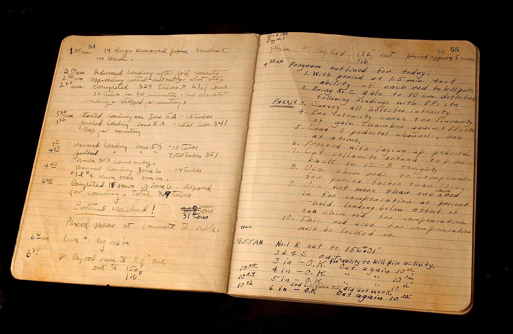

# Logging (Log4j)

*Leveled, configurable logging via Log4j (or SLF4J over it) records what the framework was doing - which step, which value, which page - so a failure's context lives in a log file instead of dying with the console. DEBUG/INFO/WARN/ERROR discipline beats print statements every time.*

> A stack trace tells you WHERE the code died: `NullPointerException at LoginPage.java:47`. It says
> nothing about what the framework was actually doing - which test step, which user it logged in as,
> which value it had just read from the page. A framework that logs its own actions leaves a written
> record of the minutes before the failure, and that record usually explains the crash faster than
> the crash message itself.

> **In real life**
>
> The operators of the world's early nuclear reactors kept a handwritten logbook: a timestamped entry
> for every action taken - "2:12am, resumed loading after foil counts," "3:22am, started loading zone
> 5A." Most entries were routine and nobody read them twice. But the moment something momentous
> happened, the log turned into the single most valuable document in the building, because the
> entries LEADING UP to that moment explained exactly how the reactor got there. A test framework's
> log file works the same way: mostly unread routine, until a failure makes the last ten entries the
> whole story.

**Logging with Log4j**: Log4j (current version Log4j 2) is the standard Java logging framework used to add structured, leveled logging throughout a test framework, usually behind SLF4J - a facade API that code logs against while Log4j does the actual writing. Every message is logged at a severity level - DEBUG (fine-grained diagnostic detail), INFO (normal milestones: test started, page loaded, value submitted), WARN (something odd but survivable), ERROR (a failure with its context) - and configuration (log4j2.xml on the classpath) decides which levels actually get written, in what format (timestamp, level, class, message via a pattern layout), and to which destinations (appenders: console, rolling log files, or both). Because level and destination live in config, not code, the same framework can run quiet in CI and verbose during debugging without touching a single line of Java.

## Levels, loggers, and why config - not code - decides what gets written

```java
public class LoginTest {
    private static final Logger log = LogManager.getLogger(LoginTest.class);

    @Test
    public void validUserCanLogIn() {
        log.info("Starting login test for user: {}", user);
        loginPage.open();
        log.debug("Login page loaded, title was: {}", driver.getTitle());
        loginPage.signIn(user, password);
        log.info("Submitted credentials, expecting dashboard");
        Assert.assertTrue(dashboard.isDisplayed());
    }
}
```

- **One logger per class** — `LogManager.getLogger(LoginTest.class)` stamps every message with the
  class it came from, so a log line is traceable to its source without grepping.
- **The four levels that matter** — DEBUG for fine detail you only want while investigating (element
  located, value read), INFO for the milestones a normal run should narrate (step started, data
  submitted), WARN for survivable oddities (retry needed, fallback used), ERROR for failures plus
  the context around them. A level is a filter, not a decoration: setting the config to INFO makes
  every DEBUG call silently free.
- **Parameterized messages** — `log.info("Deleting order {}", orderId)` defers string building until
  the level is actually enabled - and keeps the DATA in the log, which is what makes an entry useful
  months later.
- **Config over code** — `log4j2.xml` (in `src/test/resources`) defines appenders (console for
  humans watching, a file appender so CI runs leave a permanent record) and the active level. Turning
  a quiet suite verbose is a one-line config change, not a re-release.
- **SLF4J as the facade** — most frameworks write `org.slf4j.Logger` calls and let Log4j sit behind
  them, so the logging backend can be swapped without touching test code.

> **Tip**
>
> Log the data, not just the action. "Clicked submit" is nearly useless in a post-mortem; "Submitted
> promo code SAVE20 for user standard_user, cart total 41.97" answers the questions a failure
> investigation actually asks. If a value influenced what the test did, it belongs in the message.

> **Common mistake**
>
> Using `System.out.println` as the framework's logging. Prints have no level (you can never quiet
> them down or turn detail up without editing code), no timestamp, no source class, and no file
> destination - the output scrolls past in the console and is gone the moment the CI job's buffer
> rotates. The five minutes saved by not configuring Log4j is repaid every single time a failure has
> to be reproduced just to see what happened.


*Graphite Reactor Log Book — Wikimedia Commons, Public domain (US DOE photo, Lynn Freeny). [Source](https://commons.wikimedia.org/wiki/File:Graphite_Reactor_Log_Book_(44370070971).jpg)*
- **A time against every entry** — 1:30am, 2:12am, 2:42am - each action is stamped with when it happened, the same job Log4j's pattern layout does automatically on every line. Sequence and timing ARE the diagnosis, so they are never optional.
- **Routine entries nobody reads twice** — Loading tubes, counting, resuming - the DEBUG and INFO of reactor operation. Individually boring, but they are exactly the entries that explain the state of things when something notable finally happens.
- **'Critical reached!' - underlined** — The one entry that matters most is visually distinct from the routine around it - the same discipline as reserving ERROR (and WARN) for what genuinely demands attention, so it stands out instead of drowning.
- **The numbered program on the facing page** — The plan for the day, written before executing it - context a reader needs to interpret the entries. A test log's 'Starting login test for user X' plays this role: it tells the reader what the following lines are trying to do.

**From a silent failure to a narrated one**

1. **A test starts; the framework logs the milestone** — INFO: 'Starting checkout test for user standard_user' - the narrative begins.
2. **Each step logs what it did and with what data** — DEBUG/INFO entries: page loaded, item added, promo code SAVE20 applied.
3. **An assertion fails** — ERROR: 'Expected total 33.58 but found 41.97' - the failure lands with its context, not alone.
4. **The log file keeps the whole story** — The file appender wrote every line to disk - the CI console can scroll away; the record survives.
5. **The engineer reads the last ten lines** — The promo code was applied but the total never changed - diagnosed from the log alone, no reproduction needed.

Leveled logging is really just: attach a severity to every message, and let a configurable
threshold - not the code - decide what gets written. Here's that shape as a small, generic
simulation.

*Run it - one threshold setting changes what the same code writes (Python)*

```python
LEVELS = {"DEBUG": 10, "INFO": 20, "WARN": 30, "ERROR": 40}

def make_logger(threshold):
    def log(level, message):
        if LEVELS[level] >= LEVELS[threshold]:
            print(f"  [{level:5}] {message}")
    return log

events = [
    ("INFO",  "Starting checkout test for user standard_user"),
    ("DEBUG", "Login page loaded, title: Swag Labs"),
    ("DEBUG", "Located promo field by id 'promo-code'"),
    ("INFO",  "Applied promo code SAVE20, cart total 41.97"),
    ("ERROR", "Expected total 33.58 but found 41.97"),
]

for threshold in ["INFO", "DEBUG"]:
    print(f"config threshold = {threshold}:")
    log = make_logger(threshold)
    for level, message in events:
        log(level, message)
    print()

print("Same code, two behaviors - the config decided, not the tests.")
```

Same threshold-filtering shape in Java.

*Run it - one threshold setting changes what the same code writes (Java)*

```java
import java.util.*;

public class Main {
    static final Map<String, Integer> LEVELS =
        Map.of("DEBUG", 10, "INFO", 20, "WARN", 30, "ERROR", 40);

    record Event(String level, String message) {}

    static void replay(List<Event> events, String threshold) {
        System.out.println("config threshold = " + threshold + ":");
        for (Event e : events) {
            if (LEVELS.get(e.level()) >= LEVELS.get(threshold)) {
                System.out.printf("  [%-5s] %s%n", e.level(), e.message());
            }
        }
        System.out.println();
    }

    public static void main(String[] args) {
        List<Event> events = List.of(
            new Event("INFO",  "Starting checkout test for user standard_user"),
            new Event("DEBUG", "Login page loaded, title: Swag Labs"),
            new Event("DEBUG", "Located promo field by id 'promo-code'"),
            new Event("INFO",  "Applied promo code SAVE20, cart total 41.97"),
            new Event("ERROR", "Expected total 33.58 but found 41.97")
        );

        replay(events, "INFO");
        replay(events, "DEBUG");

        System.out.println("Same code, two behaviors - the config decided, not the tests.");
    }
}
```

### Your first time: Your mission: give one test a voice, then change what it says without touching it

- [ ] Add log4j-core and log4j-api (or slf4j-api plus a Log4j binding) to a scratch Maven project — Then put a log4j2.xml in src/test/resources with a Console appender and a File appender, root level INFO.
- [ ] Take one existing test and narrate it: an INFO per step, a DEBUG per detail — Include real data in the messages - the username used, the value read, the total computed.
- [ ] Run it and open the log FILE, not the console — Confirm every line carries a timestamp, level, and class name - things println could never give you.
- [ ] Change the root level to DEBUG in log4j2.xml only, and re-run — Watch the same untouched test produce a far more detailed record - config decided, not code.

You've now seen the core payoff: the framework's verbosity is a setting, and a failure's context is
a file you can read tomorrow.

- **No log output at all, or a console warning about using the default configuration.**
  Log4j couldn't find log4j2.xml - confirm it sits in src/test/resources (so it lands on the test classpath) and is named exactly log4j2.xml, not log4j.xml (the Log4j 1.x name).
- **The log file is so noisy that nobody can find the failure narrative in it.**
  Level discipline has slipped - detail that should be DEBUG is being logged at INFO. Demote fine-grained entries and keep INFO as the readable milestone narrative; the detail is still one config change away when needed.
- **An ERROR line exists for the failure, but nothing before it explains the context.**
  The framework only logs when things go wrong - the opposite discipline problem. Add INFO milestones through the flow (and data in the messages), because the value of the ERROR line is mostly the lines above it.
- **Startup prints SLF4J binding warnings, or two logging frameworks both write half the output.**
  The classpath has competing backends (a library dragged in Logback next to your Log4j). Check mvn dependency:tree, exclude the unwanted backend, and route stragglers through a bridge (log4j-slf4j2-impl for SLF4J-to-Log4j).

### Where to check

- **`src/test/resources/log4j2.xml`** — the single source of truth for active level, message format,
  and where output goes; almost every "logging is weird" question is answered here.
- **The file appender's target path** (e.g. `target/logs/test.log`) — the permanent record a CI run
  leaves behind; confirm the CI job archives it as an artifact.
- **The first lines of a run's console output** — Log4j and SLF4J announce configuration problems
  (missing config, competing bindings) there, before any test runs.
- **`mvn dependency:tree` filtered for log4j/slf4j/logback** — when output is duplicated, missing,
  or oddly formatted, the classpath usually holds two logging frameworks fighting.

### Worked example: a 2am CI failure diagnosed at 9am without reproducing it

1. The nightly suite reports one failure: `AssertionError: expected 33.58 but was 41.97` in
   `CheckoutTest`. The stack trace names the assertion line and nothing else.
2. Instead of re-running the suite, the engineer opens the archived `test.log` from the run and
   jumps to the ERROR entry, timestamped 02:14:31.
3. The INFO lines above it narrate the run: user `standard_user` logged in, two items added, then
   `Applied promo code SAVE20, cart total 41.97` - the promo application was logged as done, but the
   total logged immediately after never changed.
4. One DEBUG-level re-run of that single test (a one-line config change) shows the promo service
   responded with an expired-code message the UI silently swallowed.
5. The bug report is filed before lunch, with the log excerpt pasted in as the reproduction - the
   failure never had to be reproduced locally, because the framework wrote down what it was doing
   the whole time.

**Quiz.** A framework logs every element lookup, every attribute read, and every wait poll at INFO level 'so nothing is missed.' Failures are now hard to diagnose because each test produces hundreds of log lines. What's the right fix?

- [ ] Remove most of the logging calls - the framework was better off quiet
- [x] Demote the fine-grained entries to DEBUG and keep INFO for readable milestones - the detail stays available via a config change, while the default record becomes a narrative a human can actually follow
- [ ] Keep everything at INFO but write a script that filters the log afterwards
- [ ] Switch from Log4j back to print statements, which produce less output

*Levels exist precisely so detail can be captured without drowning the narrative: DEBUG entries cost nothing while the threshold is INFO, and become available the moment an investigation needs them - that's the leveled-logging discipline this note is about. Option one throws away diagnostic detail that a one-line config change could have kept on tap. Option three treats the symptom downstream while leaving the log unreadable for everyone without the script. Option four is strictly worse: prints have no levels at all, so the only way to quiet them is editing code - the exact problem leveled logging exists to solve.*

- **The four working log levels and their jobs** — DEBUG: fine diagnostic detail; INFO: normal milestones of a run; WARN: survivable oddities; ERROR: failures with their context. The configured threshold filters which get written.
- **Why are print statements an anti-pattern versus Log4j?** — No level (can't quiet down or turn detail up without code edits), no timestamp, no source class, no file destination - the output dies with the console buffer.
- **What is SLF4J relative to Log4j?** — A facade API: code logs against org.slf4j.Logger while Log4j does the actual writing behind it - so the backend can be swapped without touching test code.
- **Where does a Log4j-based test framework's configuration live, and what does it control?** — log4j2.xml on the test classpath (src/test/resources) - it sets the active level, the line format (pattern layout), and the appenders (console, file) output goes to.
- **The reactor-logbook analogy for framework logging** — Timestamped routine entries nobody reads twice - until something momentous happens, and the entries leading up to it become the whole diagnosis. Log mostly for the failure you haven't had yet.

### Challenge

Take one real test class you own (or a scratch one against SauceDemo) and give it a full narration:
an INFO milestone per logical step with the real data in each message, DEBUG for element-level
detail, and the assertion failure context in an ERROR entry. Then deliberately break the test, run
it, and hand ONLY the log file - not the code, not the stack trace - to someone else (or read it
yourself the next day). Score how much of the diagnosis the log alone supported, and add the two
messages you found yourself wishing were there.

### Ask the community

> My framework logs `[describe what you currently log and at which levels]` but failures still take ages to diagnose from the log - here's what a typical failure's last 10 lines look like: `[paste them]`.

Pasting the actual last-lines-before-failure is the fastest way to get help - level discipline
problems (everything at INFO, or silence until ERROR) are usually visible to a reader in seconds.

- [Apache Log4j 2 — official documentation](https://logging.apache.org/log4j/2.x/)
- [SLF4J — official user manual](https://www.slf4j.org/manual.html)

🎬 [Logging in Selenium Java using Log4j2 | Setup, Configuration, and Example — Codebun](https://www.youtube.com/watch?v=BMrc7VBflWE) (15 min)

- A stack trace says where code died; the framework's log says what it was doing - the step, the data, the page state - which is usually the actual diagnosis.
- Levels are a filter, not decoration: DEBUG for investigation detail, INFO for the run's readable narrative, WARN for survivable oddities, ERROR for failures with context.
- Configuration (log4j2.xml), not code, decides what gets written and where - the same suite runs quiet in CI and verbose in debugging without an edit.
- Log the data in the message (user, value, total) - entries without data answer none of the questions a post-mortem asks.
- Print statements have no level, timestamp, class, or file - they are the anti-pattern leveled logging replaces, not a lightweight alternative to it.


## Related notes

- [[Notes/framework-design/logging-and-reporting/extentreports|ExtentReports]]
- [[Notes/framework-design/logging-and-reporting/allure|Allure]]
- [[Notes/framework-design/logging-and-reporting/screenshots-on-failure|Screenshots on failure]]


---
_Source: `packages/curriculum/content/notes/framework-design/logging-and-reporting/logging-log4j.mdx`_
