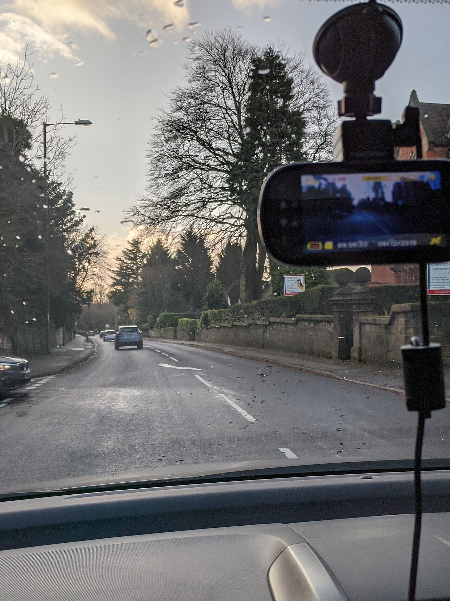

# Screenshots on failure

*A test lifecycle listener - TestNG's ITestListener or JUnit 5's TestWatcher - captures a screenshot the instant a test fails, while the browser still shows the failing state, and attaches it to the report. It's the standard cure for 'works on my machine, red on CI, no idea why'.*

> The test passes on your machine every single time. On CI it's red, in a headless browser, on a
> container that was destroyed seconds after the run ended. The failure happened on a screen nobody
> can ever look at - unless the framework photographed it at the moment it happened. Screenshot on
> failure is exactly that reflex, wired in once: the instant a test fails, capture the browser as it
> stands, and attach the picture to the report.

> **In real life**
>
> Nobody reaches for a camera during a collision. That's the entire point of a dashcam: you mount it
> once, it records every journey without being asked, and the moment something goes wrong there is a
> timestamped frame of exactly what the road looked like - the rain, the other car, the light. The
> insurance dispute is settled by footage, not by two drivers' memories. A failure listener is a
> dashcam for your test suite: installed once, silent while everything passes, and the only witness
> that was actually there when something breaks on a CI machine at 2am.

**Screenshot on failure**: Screenshot on failure is a framework pattern in which a test lifecycle listener captures the browser the instant a test fails - not after cleanup, not on re-run. In TestNG the hook is ITestListener.onTestFailure(ITestResult result), registered once via @Listeners or the suite XML; in JUnit 5 it's a TestWatcher extension's testFailed callback. The listener gets the failing test's WebDriver, calls ((TakesScreenshot) driver).getScreenshotAs(...) - typically OutputType.BYTES - and attaches the image to the run's report (ExtentReports via MediaEntityBuilder, or Allure via addAttachment), so the evidence sits next to the failure that produced it. Because the listener fires while the driver is still alive and the page still shows the failing state, it captures what no log line can: what the screen actually looked like.

## The listener that presses the shutter for you

Without the pattern, a CI failure leaves only text - or every test carries its own camera code:

```java
@Test
public void checkoutTotalAfterPromo() {
    try {
        loginPage.signIn("standard_user", "secret_sauce");
        cartPage.applyPromo("SAVE20");
        Assert.assertEquals(cartPage.total(), 33.58, 0.001);
    } catch (AssertionError e) {
        // every test must remember to bring its own camera - most won't
        File shot = ((TakesScreenshot) driver).getScreenshotAs(OutputType.FILE);
        Files.copy(shot.toPath(), Paths.get("shots", "checkout.png"));
        throw e;
    }
}
```

With the pattern, one listener owns the reflex for every test in the suite:

```java
public class ScreenshotListener implements ITestListener {
    @Override
    public void onTestFailure(ITestResult result) {
        WebDriver driver = ((BaseTest) result.getInstance()).getDriver();
        if (driver == null) return;
        byte[] shot = ((TakesScreenshot) driver).getScreenshotAs(OutputType.BYTES);
        Allure.addAttachment(result.getName(), "image/png",
                new ByteArrayInputStream(shot), ".png");
    }
}

// Registered once - every test in the class (or suite XML) is covered
@Listeners(ScreenshotListener.class)
public class CheckoutTest extends BaseTest {
    // tests contain zero screenshot code
}
```

- **The hook fires at the instant of failure** - the driver is still alive and the page still
  shows the failing state; a screenshot taken during teardown or on a re-run shows a different
  world.
- **Registered once, covers everything** - `@Listeners`, the suite XML, or a service loader; new
  tests are protected the day they're written, with zero code in their bodies.
- **JUnit 5 has the same shape** - a `TestWatcher` extension's `testFailed` callback, registered
  with `@ExtendWith`; the pattern is the lifecycle hook, not the specific framework.
- **Capture as `OutputType.BYTES` and attach to the report** - into ExtentReports via
  `MediaEntityBuilder` or Allure via `addAttachment`. Bytes embed directly into the report, so
  the evidence survives when the CI workspace - and its loose PNG files - is deleted.
- **This is the cure for the CI-only mystery** - "works on my machine, red on CI, no idea why"
  means the failure exists only in an environment you can't watch. The screenshot is the only
  witness that was there.

> **Tip**
>
> While you're in `onTestFailure`, grab the cheap extras too: `driver.getCurrentUrl()`,
> `driver.getTitle()`, and `driver.getPageSource()` attached as text. The screenshot shows what the
> page LOOKED like; the page source shows what was actually in the DOM - together they answer both
> "what did it look like?" and "why didn't the locator match?"

> **Common mistake**
>
> Taking the screenshot too late. Capturing in `@AfterMethod` after cleanup has navigated away - or
> worse, after `driver.quit()` - produces a blank page, the login screen, or a dead-session
> exception instead of the failing state. The whole value of the pattern is WHEN the shutter fires:
> inside the failure hook, before any teardown touches the browser. Order the lifecycle so
> `onTestFailure` runs first, and guard for a null or already-quit driver.


*Dashcam recording a road — Wikimedia Commons, CC BY-SA 4.0 (Ed6767). [Source](https://commons.wikimedia.org/wiki/File:Dashcam_recording_a_road.jpg)*
- **The mount - installed once, before any journey** — Nobody attaches a dashcam mid-crash. It's fixed to the glass on day one, like a listener registered once in the suite XML - present before the failure it exists to record.
- **The screen - a timestamped frame of the exact moment** — Live footage with time and date burned in. That's the screenshot's job: not a reconstruction, but the actual failing state, captured while it existed, stamped to a specific run.
- **The rainy road - conditions you could never reconstruct** — Wet asphalt, low sun, that specific van. A CI failure has its own unrepeatable weather - an overlay that appeared, a half-loaded page - which only a capture at the instant preserves.
- **The power cable - wired into every drive automatically** — Hardwired power means recording never depends on someone remembering to press a button. The listener works the same way: every test is covered, including the ones written next year.

**From a thrown assertion to evidence in the report**

1. **A test fails on CI - assertion throws, page still on screen** — The browser is headless and the container has minutes to live. No human will ever see this state directly.
2. **TestNG notifies the registered listener** — onTestFailure(result) fires immediately - before @AfterMethod teardown, while the driver is still alive.
3. **The listener captures the browser as it stands** — ((TakesScreenshot) driver).getScreenshotAs(OutputType.BYTES) - the failing state, photographed in place.
4. **The image is attached to the report, next to the failure** — Into ExtentReports or Allure, pinned to this test's failure entry - not dropped as a loose file the CI cleanup will delete.
5. **At 9am, the picture answers the question the log couldn't** — A cookie-consent overlay is sitting on top of the checkout button. 'No idea why' becomes a one-line fix.

The mechanism underneath is simple bookkeeping: a hook that runs at the moment of failure and
freezes the state that's about to be destroyed. Here is that shape, simulated.

*Run it - a failure hook freezes state that would otherwise die with the run (Python)*

```python
# A listener captures state AT THE INSTANT of failure - versus finding
# out later, with nothing left to look at.

app_state = {}

def checkout_test():
    app_state.update(page="cart", user="standard_user",
                     total="41.97", banner="Promo code expired")
    assert app_state["total"] == "33.58", "expected total 33.58"

def run(test, listener=None):
    try:
        test()
        print(f"  {test.__name__} ... PASS")
    except AssertionError as e:
        print(f"  {test.__name__} ... FAIL ({e})")
        if listener:
            listener(dict(app_state))  # fires while the failing state still exists

evidence = []

def on_failure(snapshot):
    evidence.append(snapshot)  # the 'screenshot': state frozen at failure time

print("Without a listener:")
run(checkout_test)
print("  evidence captured: none - the state died with the run")
print()
print("With a listener registered once:")
run(checkout_test, on_failure)
print(f"  evidence captured: {evidence[0]}")
```

Same failure-hook bookkeeping in Java.

*Run it - a failure hook freezes state that would otherwise die with the run (Java)*

```java
import java.util.*;
import java.util.function.Consumer;

public class Main {
    static Map<String, String> appState = new LinkedHashMap<>();

    static void checkoutTest() {
        appState.put("page", "cart");
        appState.put("user", "standard_user");
        appState.put("total", "41.97");
        appState.put("banner", "Promo code expired");
        if (!appState.get("total").equals("33.58")) {
            throw new AssertionError("expected total 33.58");
        }
    }

    static void run(Runnable test, Consumer<Map<String, String>> onFailure) {
        try {
            test.run();
            System.out.println("  checkoutTest ... PASS");
        } catch (AssertionError e) {
            System.out.println("  checkoutTest ... FAIL (" + e.getMessage() + ")");
            if (onFailure != null) {
                // fires while the failing state still exists
                onFailure.accept(new LinkedHashMap<>(appState));
            }
        }
    }

    public static void main(String[] args) {
        List<Map<String, String>> evidence = new ArrayList<>();

        System.out.println("Without a listener:");
        run(Main::checkoutTest, null);
        System.out.println("  evidence captured: none - the state died with the run");
        System.out.println();
        System.out.println("With a listener registered once:");
        run(Main::checkoutTest, evidence::add);
        System.out.println("  evidence captured: " + evidence.get(0));
    }
}
```

### Your first time: Your mission: install the dashcam, then crash on purpose

- [ ] Write a ScreenshotListener implementing ITestListener with only onTestFailure filled in — Get the driver from the test instance (a BaseTest getter is the common route), guard against null, capture OutputType.BYTES.
- [ ] Register it once - @Listeners on your base class or a listener entry in testng.xml — Deliberately do NOT touch any test body. The point is coverage without per-test code.
- [ ] Break a real test the way CI breaks: make an element unclickable or an assertion wrong — Run it and confirm the listener fired - a screenshot exists, taken at failure time, not after teardown.
- [ ] Attach the capture to your report (ExtentReports or Allure) and view the failure entry — The image should sit next to the red step. If you're saving loose PNGs instead, note how easily CI cleanup would destroy them.

You've now built the reflex every mature framework has: failures photograph themselves, and the
evidence lands in the report.

- **Screenshots are blank, show the login page, or throw NoSuchSessionException.**
  The capture is happening too late - after teardown navigated away or quit the driver. Move it into onTestFailure (which runs before @AfterMethod), and make sure teardown doesn't run first via lifecycle misordering in a custom runner.
- **onTestFailure fires, but the listener can't reach the WebDriver.**
  The listener is a separate object with no natural reference to the test's driver. Expose it deliberately: a getter on BaseTest reached via result.getInstance(), or a ThreadLocal driver holder the listener can read.
- **Screenshots exist locally but are missing when CI failures are investigated.**
  They're written as loose files into a workspace CI deletes after the run. Attach bytes into the report itself (base64/addAttachment), and archive the report directory as a build artifact - evidence must outlive the container.
- **In parallel runs, the screenshot attached to a failure shows a different test's page.**
  All threads share one driver reference, so the listener photographs whoever currently owns the browser. Scope the driver per thread (ThreadLocal in BaseTest) and have the listener resolve it through the failing test's own instance.

### Where to check

- **Your listener registration** (`@Listeners`, `testng.xml`, or `@ExtendWith` for JUnit 5) — the
  pattern silently protects nothing if the listener never got registered in the CI profile.
- **The lifecycle order around failure** — confirm `onTestFailure` runs before your `@AfterMethod`
  teardown; a quit driver is the number-one source of blank captures.
- **The report's failure entries** — the screenshot should be attached IN the report next to the
  red step, not referenced as a file path that only existed on the CI machine.
- **TestNG's listener documentation and Selenium's TakesScreenshot API** — the two halves of the
  pattern: when the hook fires, and how the capture works.

### Worked example: red on CI, green locally - solved by one picture

1. `checkoutTotalAfterPromo` passes locally on every run, but fails on CI three nights straight
   with ElementClickInterceptedException on the checkout button. The team's first theory: timing,
   so they add waits. Still red.
2. The framework has a ScreenshotListener attached, and each failure's capture is in the Allure
   report. Someone finally opens one instead of re-reading the stack trace.
3. The screenshot shows the checkout page with a cookie-consent banner covering the button. CI
   containers start with a fresh browser profile every run - no stored consent - while every
   developer machine accepted that banner months ago.
4. The fix is a one-liner in the navigation flow: dismiss the consent banner if present. The
   waits that were added on the wrong theory get removed.
5. Total diagnosis time once someone looked at the picture: about two minutes - after two days of
   guessing from text. The screenshot didn't speed up the debugging; it replaced it.

**Quiz.** A team captures screenshots in @AfterMethod - after their cleanup code logs out and clears cookies - 'so every test gets one'. Failures show the login page in every screenshot. What's the actual lesson?

- [ ] Screenshots should be taken by each test's own catch block instead of shared code
- [x] The value of the pattern is WHEN the capture happens: it must fire at the instant of failure (onTestFailure), before any teardown changes what the browser shows
- [ ] They should re-run each failed test and screenshot the second attempt instead
- [ ] Headless browsers can't produce meaningful screenshots, so CI captures will never help

*A screenshot is evidence only if it shows the failing state - and that state exists for a very short window between the assertion throwing and cleanup touching the browser. onTestFailure fires inside that window; @AfterMethod (after logout) does not, which is why every capture shows the login page. Option one abandons the listener's guarantee and reintroduces per-test camera code most tests will forget. Option three photographs a different run - flaky failures especially won't reproduce on demand. Option four is simply false: headless browsers render real pages and screenshot them fine; the timing, not the headlessness, was the problem.*

- **The TestNG and JUnit 5 hooks for screenshot-on-failure** — TestNG: ITestListener.onTestFailure(ITestResult), registered via @Listeners or suite XML. JUnit 5: a TestWatcher extension's testFailed callback, registered with @ExtendWith.
- **Why must the capture happen in the failure hook, not in teardown?** — The failing state exists only until cleanup navigates away or quits the driver. onTestFailure fires while the browser still shows exactly what failed - teardown photographs a different world.
- **Why capture OutputType.BYTES and attach into the report?** — Bytes embed directly into ExtentReports/Allure, so the evidence lives inside the archived report - loose PNG files die with the CI workspace.
- **What problem does screenshot-on-failure specifically solve?** — The CI-only failure: red in a headless browser on a destroyed container, green locally. The screenshot is the only witness that was in the environment where the failure actually happened.
- **The dashcam analogy for failure screenshots** — Mounted once, records every journey unasked, and produces a timestamped frame of the exact moment something went wrong - footage instead of memory, a listener instead of per-test camera code.

### Challenge

Find the last CI-only failure your team (or you) debugged by re-running and guessing - the kind
where the fix took days because nobody could see the screen. Write down what the diagnosis
actually turned out to be. Then implement a ScreenshotListener in that suite, deliberately
recreate the failure's conditions (fresh profile, small viewport, slow network - whatever CI has
that laptops don't), and check whether the screenshot alone would have revealed the cause on day
one.

### Ask the community

> My screenshot-on-failure listener is set up like this: `[paste your onTestFailure method]` - but on CI the captures are `[blank / login page / missing / wrong test's page]`. Where is my lifecycle going wrong?

Each broken-capture symptom maps to a specific lifecycle mistake - too late (teardown ran first),
no driver reference, files not archived, or a shared driver across threads - so pasting the
listener plus the symptom usually gets you the exact diagnosis in one reply.

- [TestNG — official listeners documentation (ITestListener)](https://testng.org/#_testng_listeners)
- [Selenium — TakesScreenshot API (Javadoc)](https://www.selenium.dev/selenium/docs/api/java/org/openqa/selenium/TakesScreenshot.html)

🎬 [Taking ScreenShot ONLY for Failed Tests in Selenium using TestNG Listener — Naveen AutomationLabs](https://www.youtube.com/watch?v=1V1w8ccRp_M) (32 min)

- Screenshot on failure = a lifecycle hook (ITestListener.onTestFailure / JUnit 5 TestWatcher) that photographs the browser the instant a test fails, while the failing state still exists.
- Register the listener once and every test is covered forever - no per-test try/catch camera code, no forgetting.
- Timing is the whole pattern: capture before teardown touches the browser; a screenshot from @AfterMethod or a re-run shows a different world.
- Attach bytes into ExtentReports or Allure so the evidence sits next to the red step and survives CI workspace cleanup.
- This is the standard cure for 'works on my machine, red on CI' - the screenshot is the only witness in the environment where the failure really happened.


## Related notes

- [[Notes/framework-design/logging-and-reporting/logging-log4j|Logging (Log4j)]]
- [[Notes/framework-design/logging-and-reporting/extentreports|ExtentReports]]
- [[Notes/framework-design/logging-and-reporting/allure|Allure]]


---
_Source: `packages/curriculum/content/notes/framework-design/logging-and-reporting/screenshots-on-failure.mdx`_
