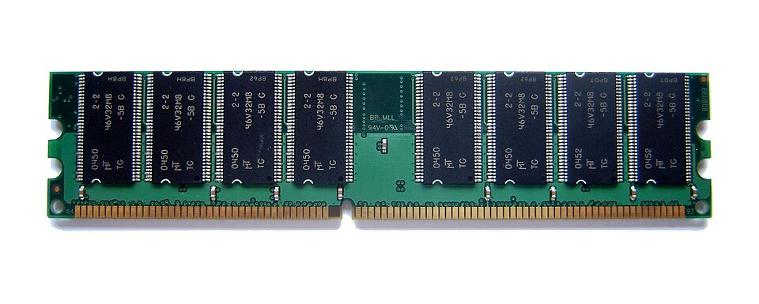
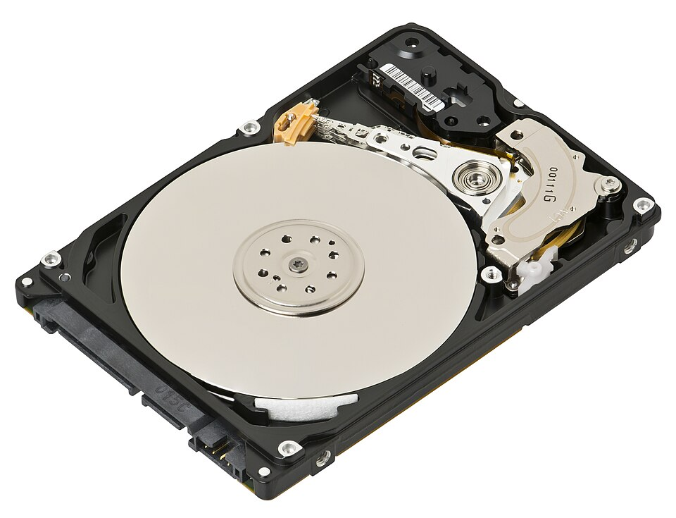
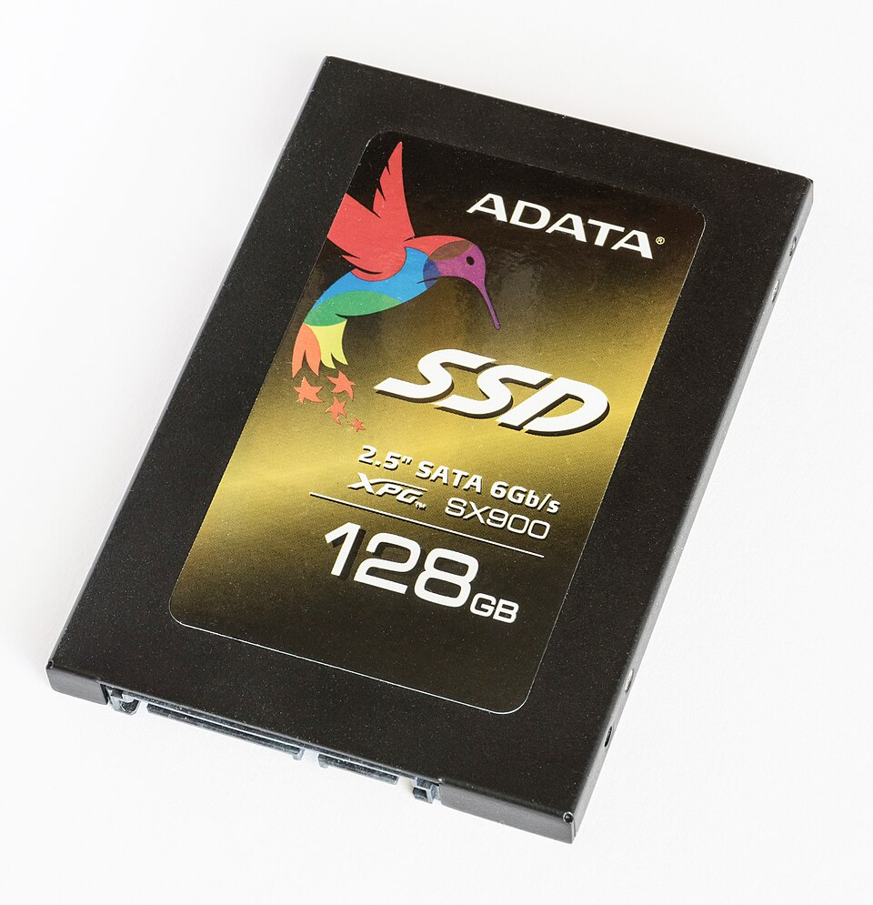

# RAM vs storage

*The two kinds of 'memory' everyone confuses — one fast and forgetful, one slow and loyal — and why unsaved work dies when the power blinks.*

> "My laptop has 512 memory!" — "No wait, it has 8 memory!" Both sentences are said
> daily, both mean completely different things, and the confusion has sold a million
> wrong laptops. There are TWO kinds of "memory" in your machine, they do opposite
> jobs, and mixing them up is the single most common hardware misunderstanding on
> Earth. Five minutes from now, you'll never do it again.

> **In real life**
>
> Back to the kitchen. **RAM is the counter** — where the chef spreads out ingredients
> for dishes being cooked RIGHT NOW. Fast to reach, but small, and wiped clean every
> night. **Storage is the pantry** — big, holds everything you own, keeps it after
> closing time... but the chef has to walk over there to fetch anything. Big pantry,
> small counter: that's every computer ever built.

## RAM — the counter (fast, small, forgetful)


*Photo: Wikimedia Commons, CC BY-SA 2.5. [Source](https://commons.wikimedia.org/wiki/File:RAM_module_SDRAM_1GiB.jpg)*
- **The memory chips** — These black rectangles hold the actual data — every open app, every unsaved document, every browser tab lives in chips like these while you work. Electrically, not permanently. Power gone = contents gone. No negotiation.
- **The gold contacts** — The stick's connection to the motherboard — data blasts across these contacts at speeds a hard disk can only dream about. That speed is RAM's whole job.
- **The notch** — That gap in the gold edge is offset on purpose — the stick only fits its slot one way. Hardware designers learned long ago: if it CAN be inserted wrong, someone WILL. (Testers reach the same conclusion about software users, roughly weekly.)

The rules of RAM:

- **It's the working space.** Open an app → it gets loaded from storage into RAM. Every open tab, every unsaved edit: on the counter.
- **It's blazing fast** — hundreds of times faster than a hard disk. That's why things run FROM RAM, not from the pantry.
- **It forgets everything at power-off.** Instantly. Completely. This is physics, not policy.
- **When it's full, everything crawls** — the chef starts stacking overflow back in the pantry (slow!) and the whole kitchen queues behind those trips. More on that two topics from now.

## Storage — the pantry (big, slow-ish, loyal)


*Photo: Evan-Amos — Wikimedia Commons, CC BY-SA 3.0. [Source](https://commons.wikimedia.org/wiki/File:Laptop-hard-drive-exposed.jpg)*
- **The platter** — A mirror-polished disk coated in magnetic material — your files live here as microscopic magnetic dots. It spins at 5,400–7,200 RPM, which is why old computers made that soft whirring sound. That was your data, literally spinning.
- **The read/write arm** — Floats a few NANOMETERS above the platter — proportionally, a jumbo jet flying at grass height — reading and writing magnetic dots as everything spins. This is why drops kill hard drives: the jet crashes into the lawn.
- **The pivot & motor** — Swings the arm to the right track thousands of times a second. All this MOVING is why HDDs are slow compared to RAM: mechanical parts vs pure electricity. Physics always wins.
- **The connector** — Where data and power enter the drive — this one's SATA, the standard plug for drives. Remember shapes-not-labels from the ports topic? It follows you everywhere.

That's the classic **HDD** (hard disk drive). Its modern replacement, the
**SSD**: Solid State Drive — storage built from flash chips, like a giant permanent USB stick. No moving parts, several times faster than a spinning disk.,
threw out every moving part: no platter, no arm, just chips. Nothing spins, nothing
crashes into the lawn, everything is several times faster. It's why a 10-year-old
laptop with an SSD boots faster than a 3-year-old one without.



*An SSD — the pantry, rebuilt from pure chips. No spinning, no whirring, no jumbo jet at grass height. Just speed.*

## The one table to remember forever

- **RAM:** the counter · fast · small (8–32 GB typical) · **forgets at power-off** · holds running apps and unsaved work
- **Storage (HDD/SSD):** the pantry · slower · big (256 GB–several TB) · **remembers forever** · holds your files, apps, the OS itself
- **"Save"** = copying work from the counter to the pantry. Now — and only now — it survives a power cut.

That's why the file you never saved is GONE after a crash, but everything you saved
is fine. The crash wiped the counter; the pantry never even noticed.

> **Common mistake**
>
> "My phone has 128 GB of memory so it's fast." That 128 GB is STORAGE — the pantry.
> Speed while multitasking comes from RAM — the counter — which on that same phone
> might be 4 GB. Two different numbers, two different jobs, and salespeople blur them
> daily (sometimes by accident). You, from today, are unblurrable.

### Your first time: Your mission: find your counter and your pantry

- [ ] Find your RAM amount — Windows: Settings → System → About → 'Installed RAM'. Mac:  → About This Mac → Memory. That's your counter size.
- [ ] Find your storage size AND how full it is — Windows: Settings → System → Storage. Mac: About This Mac → Storage. Pantry size + how stuffed it is.
- [ ] Watch RAM being used live — Task Manager → Performance → Memory (Windows) or Activity Monitor → Memory (Mac). Open a few apps and watch the counter fill.
- [ ] Identify: HDD or SSD? — Windows: Task Manager → Performance shows the disk type. Mac: any machine from the last decade = SSD. Older desktop that whirs and clicks = spinning platter, treat it kindly.
- [ ] Do one conscious Save — Open any editor, type a line, hit Ctrl+S / Cmd+S — and know that you just moved data from the counter to the pantry. It survives anything now.

Counter size, pantry size, pantry fullness, disk type — you just collected the exact
numbers that appear in every performance bug report.

- **The power blinked and my document is GONE. Hours of work!**
  The unsaved part lived on the counter — RAM — and RAM forgets at power-off; that part is genuinely gone. BUT: check for auto-recovery before mourning (Word/Docs/most editors auto-save to the pantry every few minutes — reopen the app and look for 'recovered documents'). Then adopt the twitch: Ctrl+S after every paragraph, forever.
- **'Your disk is almost full' — and everything got slow at the same time.**
  Not a coincidence. A nearly-full pantry leaves the system no room for temp files and RAM-overflow (that swap trick from the counter analogy). Free up a few GB: empty the trash/recycle bin, clear the Downloads folder graveyard, uninstall the games you finished in 2023. Slowness often lifts immediately.
- **I saved the file, I SWEAR, but I can't find it anywhere.**
  It saved — to wherever the app defaulted, which is rarely where you'd look. Search the filename (Windows key / Cmd+Space and type it), then check Downloads and Documents. Pro habit: 'Save As' shows you WHERE it's going before it goes. The pantry is big; know your shelves.
- **My computer says 'out of memory' but I have 500 GB free!**
  That 500 GB is the pantry (storage) — the complaint is about the COUNTER (RAM). Close some of the 47 browser tabs and heavyweight apps. If it happens daily, the honest fixes are: run less at once, or get more RAM. Storage space can't help; it's the wrong kind of 'memory'. (You now speak both dialects.)

### Where to check

Both memories confess everything in the same places you've been using:

- **RAM live usage:** Task Manager → Performance → Memory / Activity Monitor → Memory. Near 100% constantly = counter too small for your habits.
- **Storage fullness:** Settings → Storage (Windows) / About This Mac → Storage. Above ~90% full = expect weirdness.
- **What's eating the pantry:** both OSes show biggest folders/files — the answer is always Downloads. Always.

"Slow machine" bugs split on these two numbers the way slowness split on CPU% last
topic. RAM maxed → memory problem. Disk maxed → storage problem. Both fine → keep
hunting. Three glances, and you've narrowed a vague complaint into a category.

**The life of your unsaved paragraph — press Play**

1. **⌨️ You type** — Every word lands on the counter — RAM. Fast, comfortable... and wired directly to the power supply.
2. **⚡ Danger zone** — Minutes pass. The paragraph exists ONLY in RAM. A power blink right now = it never existed. This is the zone where work dies.
3. **💾 Ctrl+S** — The save copies your work from counter to pantry — RAM to storage. One keystroke, one border crossing, total change of fate.
4. **🛡 Survives anything** — Power cut? Crash? Force shutdown? The saved copy doesn't care — the pantry keeps everything without electricity. Ctrl+S is a lifestyle.

*Try it — counter vs pantry, in numbers*

```python
# How much LIFE fits in each memory? Change the sizes to match YOUR machine.
ram_gb = 8
storage_gb = 512
photo_mb = 4          # one phone photo
song_mb = 8           # one song

print(f"Your RAM (counter) could hold  {ram_gb*1024//photo_mb:>6} photos — but forgets them at power-off.")
print(f"Your disk (pantry) could hold  {storage_gb*1024//photo_mb:>6} photos — and keeps them for years.")
print(f"Same unit (GB), opposite jobs. The ad shouts the second number.")
```

### Worked example: the 'out of memory' laptop with 300 GB free

A relative's laptop shows "low memory" warnings. They point at 300 GB of free disk, outraged. The walk:

1. **Translate:** the warning is about RAM (counter), the 300 GB is storage (pantry). Two dialects — the machine isn't contradicting itself.
2. **Evidence:** Task Manager → Memory: 7.8 of 8 GB used. The counter is packed.
3. **Find the eaters:** sort by memory — a browser with 42 tabs and two chat apps hoarding a gig each.
4. **Verdict:** close the tab museum, RAM drops to 4 GB, warnings vanish. Prescription: bookmarks instead of eternal tabs — or a RAM upgrade if 42 tabs is a lifestyle. The pantry was never involved.

🎬 [Techquickie — RAM explained fast](https://www.youtube.com/watch?v=PVad0c2cljo) (5 min)

**Quiz.** A user was typing a report when the power cut. They'd saved 20 minutes ago. What survived?

- [ ] Everything — computers keep everything automatically
- [ ] Nothing — power cuts erase the whole disk
- [x] Everything up to the save from 20 minutes ago; the last 20 minutes lived in RAM and are gone (unless auto-save helped)
- [ ] Only the app itself, not the document

*Save = counter → pantry. The saved version sits safely in storage, which doesn't care about power. The unsaved 20 minutes existed only in RAM — wiped instantly. This exact scenario is also a REAL TEST CASE for any editor app: 'kill the power mid-edit, what does the user recover?' Congratulations, you just thought of it yourself.*

- **RAM** — The counter: fast working memory for running apps and unsaved work. Wiped completely at power-off. 8–32 GB typical.
- **Storage (HDD/SSD)** — The pantry: big, permanent home of files, apps and the OS. Survives power-off. 256 GB–several TB.
- **Save (Ctrl+S)** — Copies work from RAM (counter) to storage (pantry). The moment it becomes power-cut-proof. Twitch-press it forever.
- **SSD vs HDD** — SSD = flash chips, no moving parts, fast. HDD = spinning magnetic platter + flying arm, slower, hates being dropped.
- **'Out of memory' with free disk** — RAM is full — the counter, not the pantry. Close apps/tabs; free storage can't help. Two memories, two dialects.

> **Tip**
>
> The RAM/storage split explains half of all everyday computer mysteries: why reopening
> everything after a restart takes a moment (pantry → counter reload), why phones close
> background apps (small counter), why "just restart it" clears weird states (dirty
> counter, wiped clean). One analogy, dozens of explanations. Kitchens: underrated.

### Challenge

Write your machine's full memory spec line like a pro: **"[X] GB RAM, [Y] GB/TB
[SSD/HDD], [Z]% full."** Then answer honestly: if the power died right now, what
would YOU lose? If the answer scares you even slightly — Ctrl+S is right there. This
spec line + that question are both standard furniture in real bug reports and real
test environments.

### Ask the community

> My machine has [X GB RAM, Y storage, Z% full] and I'm seeing [exact behavior]. RAM sits at [%] during it. Is this a memory problem or should I look elsewhere?

Memory questions with the two numbers attached (RAM %, disk fullness) get solved
fast — because you've pre-sorted the problem into its category. That pre-sorting IS
triage, and triage is a paid QA skill you're currently learning for free.

- [Techquickie — RAM explained fast and painless](https://www.youtube.com/watch?v=PVad0c2cljo)
- [GCFGlobal — Inside a computer](https://edu.gcfglobal.org/en/computerbasics/inside-a-computer/1/)
- [Crucial — what memory actually does (from people who make it)](https://www.crucial.com/articles/about-memory/support-what-does-computer-memory-do)

- Two 'memories', opposite jobs: RAM = fast forgetful counter for NOW; storage = big loyal pantry for KEEPS.
- Save = counter → pantry. Unsaved work dies with the power. Ctrl+S is a reflex, not a choice.
- SSD replaced the spinning platter with chips — the single biggest speed upgrade old machines can get.
- 'Out of memory' ≠ 'disk full' — different memory, different fix. You now speak both dialects.
- RAM % + disk fullness = two glances that categorize any slowness complaint. Evidence first, always.


---
_Source: `packages/curriculum/content/notes/how-a-computer-works/cpu-memory-and-storage/ram-vs-storage.mdx`_
