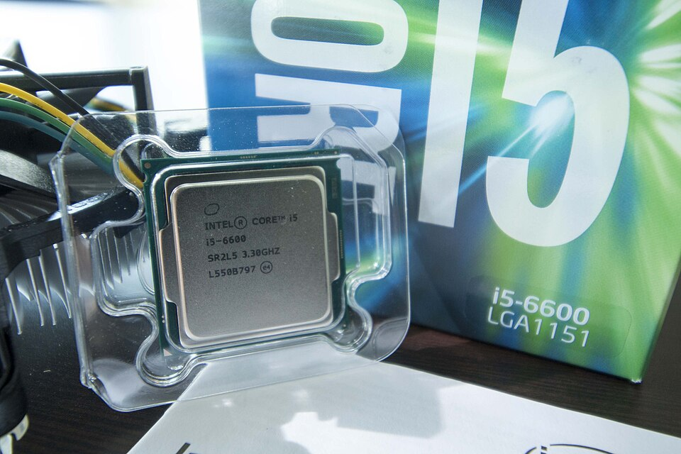
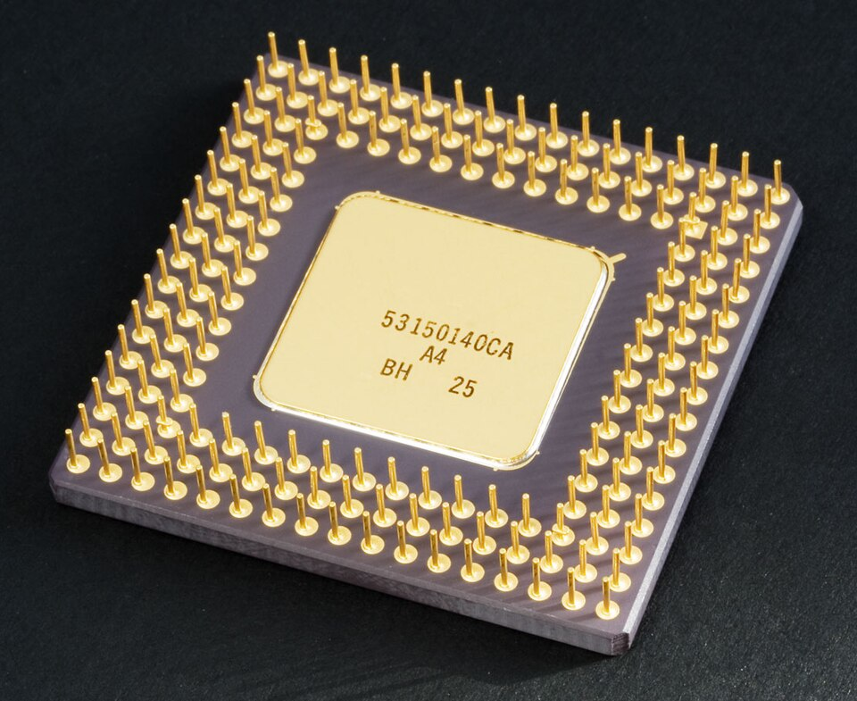

# What the CPU does

*The chip that does every single calculation in your machine — how it thinks, why it has 'cores', and why it's both a genius and a goldfish.*

> Right now, as you read this, a piece of metal smaller than a biscuit is performing
> **billions of calculations per second** so this page can exist on your screen. It has
> no idea what a page is. It has no idea what anything is. It just follows orders,
> insanely fast, forever. Meet the CPU — the hardest worker in the building, and the
> most misunderstood.

> **In real life**
>
> The CPU is the **head chef** from our kitchen. Every app is a stack of order tickets
> written in tiny steps: "add 2 and 3", "compare these", "move that". The chef reads one
> ticket, does exactly what it says, grabs the next. No creativity, no opinions, no
> understanding — just perfect, blinding speed. A genius at doing, a goldfish at knowing.

## The chip itself



*A real CPU (Intel Core i5) fresh out of its box. That little metal square runs entire worlds. Note the '3.30GHZ' printed on it — hold that thought for two topics from now.*

That metal lid isn't the brain — it's a helmet. The actual silicon chip hides
underneath, and it's even smaller. The helmet spreads heat away, because this thing
works so hard it would literally cook itself without the fan you saw bolted on top of
it in the tower X-ray last chapter.

## And its hundreds of legs


*Photo: Wikimedia Commons, CC BY-SA 2.0. [Source](https://commons.wikimedia.org/wiki/File:Intel_80486DX2_bottom.jpg)*
- **The pin grid** — Hundreds of gold pins, each one a separate wire into the motherboard. Data, orders and power all flow through these. They bend if you look at them wrong — which is why CPUs are handled like newborn birds.
- **The corner marker** — One corner is always marked — it only fits the socket ONE way. Even hardware has a 'this side up'. Force it wrong and you've bought a very expensive fridge magnet.
- **The ceramic body** — The tough shell around the silicon. This particular chip is a 486 from the early 90s — your phone is thousands of times faster than it. Progress is rude like that.

## What "doing" actually means

Every second, the CPU loops the same three-step dance billions of times:

1. **Fetch** — grab the next instruction from memory ("the next order ticket").
2. **Decode** — figure out what it's asking ("ah, add these two numbers").
3. **Execute** — do it. Done. Next ticket. Forever.

That's it. That's the whole magic trick. Videos, games, this website — all of it
decomposes into billions of tiny "add this, compare that, move this" tickets. The CPU
never sees the movie. It just does the math that becomes the movie.

**The chef's eternal dance — press Play**

1. **1 · Fetch** — Grab the next instruction from memory — the chef pulls the next order ticket off the rail. Billions of times per second.
2. **2 · Decode** — Figure out what the ticket asks: 'add these two numbers', 'compare these', 'move this'. No understanding — just recognizing the shape of the order.
3. **3 · Execute** — Do it. One tiny operation, done perfectly. Then the loop restarts — fetch the next ticket. Forever. This three-step dance IS computing.

*Try it — make the chef do 10 million steps*

```python
# The chef will execute this loop about 10 MILLION times.
# Watch how fast it finishes — then add another zero to see it sweat.
total = 0
for i in range(10_000_000):
    total += i
print("The chef added ten million numbers.")
print("Total:", total)
```

## Cores — when one chef isn't enough

Modern CPUs aren't one chef — they're **several chefs in one chip**, called
**cores**: An independent processing unit inside the CPU. A quad-core CPU is literally four processors working side by side..
A "quad-core" is four chefs cooking in parallel; your browser gets one, your music
another, the OS a third. That's how a computer "multitasks" — it's not one genius
juggling, it's a small team, plus VERY fast turn-taking on top.

> **Tip**
>
> Tester radar: when an app is slow, the first professional question is **what is it
> waiting for?** If the CPU is at 100%, the chefs are maxed out — the app is
> compute-bound. If the CPU is at 5% and the app still crawls, the kitchen is idle and
> the problem is elsewhere (disk, network, memory). One glance at CPU usage splits every
> slowness bug into two very different investigations. You'll do this weekly, forever.

### Your first time: Your mission: catch your CPU in the act

- [ ] Open your machine's activity monitor — Windows: Ctrl+Shift+Esc opens Task Manager (yes, that easy). Mac: Cmd+Space, type 'Activity Monitor', Enter.
- [ ] Find the CPU graph or CPU % column — Windows: Performance tab → CPU. Mac: the CPU tab. That wiggling line is the chef's heart-rate monitor.
- [ ] Note the idle percentage — Probably a few percent. Right now the fastest worker you own is mostly... waiting for you. Awkward.
- [ ] Now open 10 browser tabs fast and watch the spike — There it is — the chefs sprinting. Close the tabs, watch it calm down. You just caused and observed load. That's a performance test, technically.
- [ ] Count your cores — Windows: Performance tab shows Cores. Mac: Apple menu → About This Mac (or the CPU tab). Write the number down — it goes in your machine's spec line.

You just monitored live CPU load and counted cores. That's the exact first move of
every performance investigation you'll ever run.

- **The fan suddenly screams and the machine gets hot — but I'm not doing anything!**
  Something IS doing something — just not you. Open Task Manager / Activity Monitor and sort by CPU: the top row is your culprit. Usually an update, a stuck browser tab, or an app having a private crisis. Kill the offender (End Task / Quit) and the kitchen calms down.
- **Everything is in slow motion and CPU shows 100% constantly.**
  The chefs are drowning. Sort processes by CPU and look at the top: one app eating everything = that app's problem (restart it). EVERYTHING high all the time on an older machine = the workload simply outgrew the chip — fewer simultaneous apps, or lighter software.
- **My laptop shuts itself off during heavy work.**
  That's overheating protection — the CPU hit its panic temperature and pulled the fire alarm. Check the vents (Chapter 1 knowledge!), work on a hard surface, and if it's an older machine: the fan and heatsink may be caked in dust. Wait till you see the photo in 'Why computers slow down'. Bring a mask.
- **An app says it needs 'more cores' or feels slow only on my machine.**
  Check what you have: Task Manager → Performance → Cores (Windows) or About This Mac. A 2-core machine running 4-core-hungry software is like two chefs handling a wedding — technically working, visibly suffering. Knowing your core count turns 'it's slow' into an explainable fact.

### Where to check

The CPU's identity card is one click away:

- **Windows:** Task Manager → Performance → CPU — model name, cores, current speed, live load.
- **macOS:**  → About This Mac — the chip line (and Activity Monitor for live load).
- **Any bug report:** the CPU line matters when the bug smells like performance — "slow on my machine" means nothing without WHICH machine.

Watch the live graph for a minute someday. Spiky = normal life. Flatlined at 100% =
somebody's drowning. Flatlined at 0% while everything's frozen = the problem isn't
the CPU at all. The graph talks.

> **Common mistake**
>
> Saying "the CPU is the computer's brain". Half-true and it ruins people's mental
> model: brains understand things. The CPU understands NOTHING — it executes tiny
> instructions at absurd speed. All the "intelligence" lives in the software (the
> recipes), not the chef. This distinction will matter a lot when you start reading
> code and asking "wait, who decided THIS behavior?" — the answer is always the recipe,
> never the chef.

### Worked example: the fan that screamed at an idle desk

A machine roars while 'nothing' is running. The investigation:

1. **Evidence first:** Ctrl+Shift+Esc → sort by CPU. Top row: a browser tab's process pinned at 96%.
2. **Interpret:** one chef is sprinting flat-out — some page is running heavy script in a loop (a stuck ad, a broken animation, occasionally a sneaky crypto-miner).
3. **Act:** close that one tab. CPU falls to 4%; the fan spins down within seconds — heat follows work (Chapter 2 logic, live).
4. **Verdict:** no virus, no dying hardware — one greedy **process**: A single sequence of running code; here, the browser tab's own process eating a full core.. Evidence took 20 seconds and named the exact culprit. Guessing would have taken an afternoon.

🎬 [Crash Course — how a CPU actually works](https://www.youtube.com/watch?v=cNN_tTXABUA) (12 min)

**Quiz.** A user's video-editing app is painfully slow. You check: CPU sits at 98–100% the whole time it runs. What did you just learn?

- [ ] The app has a bug and should be reinstalled
- [x] The workload is compute-bound — this machine's CPU is the bottleneck for this task
- [ ] The internet connection is too slow
- [ ] Nothing useful — CPU numbers don't mean anything

*CPU pinned at 100% during the slowness = the chefs are the constraint. Video editing is heavy compute — on this machine, that's the ceiling. Slow with LOW CPU would point elsewhere (disk, memory, network). One number, two completely different diagnoses — that's why testers look before guessing.*

- **CPU** — The processor — executes every instruction in the machine, billions per second. Genius at doing, goldfish at knowing: zero understanding, pure speed.
- **Core** — An independent processor inside the CPU. Quad-core = four chefs cooking in parallel. More cores = more true multitasking.
- **Fetch → Decode → Execute** — The CPU's eternal three-step loop: grab instruction, understand it, do it. Everything your computer does is billions of these.
- **Compute-bound** — Slowness where the CPU is the bottleneck (pinned at ~100%). The opposite: CPU idle but still slow → look at disk/network/memory instead.
- **Ctrl+Shift+Esc** — Instant Task Manager on Windows — the tester's window into what the CPU is actually doing. (Mac: Activity Monitor.)

### Challenge

Open Task Manager / Activity Monitor and identify: **(1)** your CPU's model name,
**(2)** how many cores it has, **(3)** the top-3 processes using CPU right now. Write
all three down. You've just profiled a live system — and next time anything is slow,
you'll check the evidence before guessing. That reflex is worth more than most
certifications.

### Ask the community

> My machine [exact slowness behavior]. CPU shows [X%] during it, and the top process is [name]. It's a [core count]-core [model]. Is this normal or worth digging into?

CPU questions with NUMBERS get answered in minutes; "my computer is slow" gets
sympathy at best. You now know how to bring the numbers. Notice the difference —
that's evidence-based reporting, the spine of all QA work.

- [Crash Course — How a CPU works (the best 12 minutes on the subject)](https://www.youtube.com/watch?v=cNN_tTXABUA)
- [GCFGlobal — Inside a computer](https://edu.gcfglobal.org/en/computerbasics/inside-a-computer/1/)
- [How-To Geek — cores and threads, finally explained](https://www.howtogeek.com/194756/cpu-basics-multiple-cpus-cores-and-hyper-threading-explained/)

- The CPU executes every instruction in the machine — billions per second, zero understanding. Genius at doing, goldfish at knowing.
- Fetch → decode → execute, forever. All software decomposes into these tiny steps.
- Cores = parallel chefs. More cores = real multitasking, not just fast juggling.
- CPU at 100% during slowness = compute-bound; CPU idle during slowness = look elsewhere. One glance, two different bugs.
- Ctrl+Shift+Esc / Activity Monitor = your window into the kitchen. Check evidence before guessing — always.


---
_Source: `packages/curriculum/content/notes/how-a-computer-works/cpu-memory-and-storage/what-the-cpu-does.mdx`_
