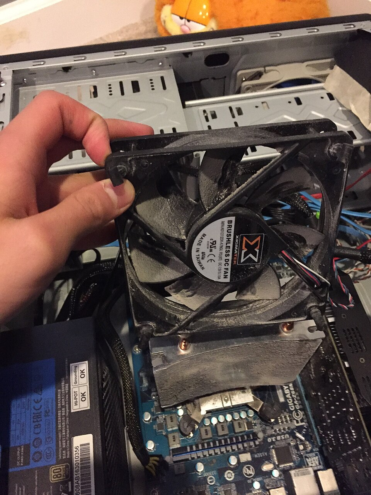

# Why computers slow down

*The five real reasons machines get slow over time — and the diagnosis routine that finds YOUR reason in five minutes instead of five guesses.*

> Every family has one: the laptop that "used to be fast". Everyone has a theory —
> viruses! age! it just KNOWS it's old! — and everyone's first fix is to buy a new one.
> Plot twist: computers don't wear out like shoes. They slow down for five specific,
> findable, mostly FIXABLE reasons. You're about to learn all five, plus the 5-minute
> routine that identifies which one is strangling any given machine. Family hero status
> incoming.

> **In real life**
>
> A slowing computer is a **kitchen slowly going wrong**: too many dishes cooking at
> once (overloaded CPU/RAM), a counter buried in clutter (startup apps), a pantry
> stuffed to the door (full disk), a chef overheating because the vents are blocked
> (thermal throttling), and one waiter secretly working for another restaurant
> (malware). Five problems, five different fixes — and yelling "the kitchen is old!"
> fixes none of them.

## Exhibit A: the crime scene


*Photo: Wikimedia Commons, CC BY 3.0. [Source](https://commons.wikimedia.org/wiki/File:Dusty_fan_and_heatsink.jpg)*
- **The fan (allegedly)** — Under that grey felt is a fan. It has been filtering the room's air for years, unpaid and unthanked. Every blade is wearing a dust sweater. Airflow: theoretical.
- **The heatsink fins** — These metal fins are supposed to shed the CPU's heat into passing air. Caked in dust, they're shedding heat into a blanket. The CPU underneath is running a fever and slowing itself down on purpose to survive — that's thermal throttling.
- **The hand of a hero** — Someone finally opened the case. This is what 'my computer got slow over the years' looks like in physical form. A can of compressed air costs almost nothing and reverses YEARS of this.

That photo is why "old computers are slow" feels true. The machine didn't age — it
**suffocated**. When a CPU overheats, it deliberately slows down to avoid cooking
itself (**thermal throttling**: The CPU reducing its own speed to lower temperature. Protective, automatic, and the hidden cause of many 'mysteriously slow' machines.).
Clean the dust, restore the airflow, and the "old" machine mysteriously finds its
youth.

## The five real reasons

1. **Too much running at once** — 40 tabs + 12 background apps = full counter (RAM) and busy chefs (CPU). The machine isn't slow; it's oversubscribed.
2. **Startup app hoarding** — every app you ever installed that sneaked into "launch at login". Each one alone is innocent. Twenty of them = the machine starts its day pre-exhausted.
3. **A stuffed pantry** — disk above ~90% full leaves no room for temp files and RAM overflow. Everything queues.
4. **Heat + dust** — Exhibit A above. Throttling turns a sports car into a delivery van, silently.
5. **Malware / junkware** — the waiter secretly working for someone else: crypto-mining, ad-injecting, "helpful" toolbars. Less common than grandma fears, more common than zero.

And the honest sixth: **software grew, hardware didn't.** 2026 websites are heavier
than 2019 websites — same laptop, bigger job. That one isn't a malfunction; it's
inflation. (An SSD upgrade + more RAM fights it surprisingly well.)

### Your first time: Your mission: the 5-minute slowdown diagnosis

- [ ] Open Task Manager / Activity Monitor and sort by CPU — Anything pinned high while you're 'doing nothing'? Name and shame. That's suspect #1.
- [ ] Check RAM usage — Memory tab. Constantly above ~90%? The counter is the bottleneck — too much open, or too little RAM for modern life.
- [ ] Check disk fullness — Settings → Storage. Above 90% full = pantry problem. Empty trash, purge Downloads, breathe.
- [ ] Audit startup apps — Windows: Task Manager → Startup apps — disable the freeloaders. Mac: System Settings → General → Login Items. Be ruthless; they can all be reopened manually.
- [ ] Listen and feel — Fan screaming during light work? Bottom hot? That's the heat suspect — check vents, consider the compressed-air ritual (or a technician for laptops).

Five checks, five minutes, and you know WHICH of the five reasons owns this machine —
instead of guessing like everyone else. This checklist alone upgrades you past most
of the internet.

- **It takes five minutes just to become usable after turning on.**
  Startup hoarding, almost certainly. Task Manager → Startup apps (or Login Items on Mac) and disable everything that isn't essential — updaters, helpers, launchers, that game store from 2022. Reboot and time the difference. This is the most satisfying fix in consumer computing.
- **It's fine at first, then gets slower the longer it's on.**
  Classic memory creep — apps (browsers especially) slowly hoard RAM and don't give it back. Check the Memory tab after a few hours: if it climbed to ~100%, there's your pattern. Restarting the browser (or the machine) resets the counter. If one app always leads the climb — that's a memory leak, a genuine bug class you'll hunt professionally.
- **It got DRAMATICALLY slower recently, like a switch flipped.**
  Sudden = event. Recent install? Update? Disk suddenly near-full? Check all three, in that order (uninstall the suspect / free space). Nothing? Sort processes by CPU — sudden slowness with a mystery process pegging the CPU is where the malware suspicion becomes legitimate. Run a reputable scan.
- **Everything is slow AND the fan is always loud AND the bottom could fry an egg.**
  Heat, guaranteed. The machine is throttling to survive. Vents first (Chapter 1!), hard surface, and if it's years old — the inside probably looks like Exhibit A. Compressed air for the brave, a technician for laptops under warranty. Cooling fixed = speed returns like magic.
- **I did EVERYTHING and it's still slow.**
  Then you've likely hit reason six: modern software on tired hardware. The honest escalation path: (1) SSD if it still has a spinning disk — biggest single upgrade in computing; (2) more RAM if the counter maxes daily; (3) only THEN consider replacement. You've now made an evidence-based hardware decision — which is more than the shop assistant will do.

### Where to check

The whole diagnosis lives in two windows you already know:

- **Task Manager / Activity Monitor** — CPU %, Memory %, the sorted list of who's eating what, and (Windows) the Startup apps tab with each app's startup cost rated.
- **Settings → Storage** — pantry fullness + what's hogging it.
- **Bonus, uptime** (from the power topic): "up 34 days" + slow = restart first, diagnose second.

Notice something? Chapter 2 taught you CPU, RAM, storage, and heat — and the
slowness diagnosis is just those four topics with a checklist. That's how knowledge
compounds. You didn't learn four facts; you learned a diagnostic system.

> **Common mistake**
>
> "It's slow, it must be a virus." The most-blamed, least-guilty suspect. Malware is
> real but it's reason #5 of 5 — behind tabs, startup hoarding, full disks and dust.
> Jumping to the dramatic explanation before checking the boring ones is the #1
> diagnosis error in tech (and honestly, in life). Boring causes first. Every good
> tester's motto.

**How a healthy machine chokes — press Play**

1. **📱 Apps pile up** — Tabs, launchers, updaters, 'helpers' — each one takes counter space and chef attention. Individually innocent.
2. **🧠 RAM fills** — The counter hits its edge. The OS starts the emergency plan: shoving the overflow into the pantry (swap).
3. **💾 Disk thrashes** — The pantry is 100× slower than the counter — and now EVERY task queues behind slow pantry trips. The machine is working furiously and achieving little.
4. **🐌 The crawl** — Clicks lag, fans roar, everything stutters. Nothing is broken — the kitchen is drowning. The 5-minute diagnosis names which step started it.

*Try it — the 5-minute diagnosis, as code*

```python
# Feed in a machine's vital signs; the logic names the prime suspect.
cpu_percent = 85
ram_percent = 60
disk_full_percent = 55
fan_loud_and_hot = False

if fan_loud_and_hot:
    print("Suspect: HEAT — check vents and dust before anything else.")
elif cpu_percent > 80:
    print("Suspect: a runaway process — sort Task Manager by CPU.")
elif ram_percent > 90:
    print("Suspect: RAM pressure — too much open, counter overflowing.")
elif disk_full_percent > 90:
    print("Suspect: stuffed pantry — free some disk space.")
else:
    print("Vitals look fine — check startup apps and uptime next.")
```

### Worked example: the family laptop, un-slowed in 20 minutes

The annual holiday request: "you're good with computers, this thing is dying." The full 5-minute diagnosis, executed:

1. **CPU check:** 85% at idle — an updater stuck in a loop plus two 'helper' apps from installed-then-forgotten software.
2. **RAM check:** 90% used at startup — 14 startup apps. Startup audit: 11 disabled.
3. **Disk check:** 96% full — Downloads folder alone holds 60 GB of forgotten installers and videos.
4. **Heat check:** vents dusty but airflow OK — not the main villain this time.
5. **Verdict:** three of five causes guilty at once (hoarding, full disk, stuck process). After the cleanup: boots in 40 seconds, idle CPU 3%. Machine age: irrelevant. Family status: hero. Diagnosis, not magic.

🎬 [Techquickie — why computers slow down over time](https://www.youtube.com/watch?v=nwXVU9V7XJ0) (6 min)

**Quiz.** A 6-year-old laptop is 'unbearably slow'. Fan constantly loud, bottom very hot, slowness worst during work. What's the MOST likely primary cause?

- [ ] A virus — old laptops always get infected
- [x] Thermal throttling — dust-choked cooling forcing the CPU to slow itself down
- [ ] The CPU wore out from age
- [ ] It needs a new operating system

*Loud fan + hot chassis + slow-under-load is the throttling signature — the machine protecting itself from its own blocked cooling. CPUs don't 'wear out' into slowness; they either work or die. The fix might be a $5 can of air. Diagnosis from symptoms → most likely cause: you just did real troubleshooting.*

- **Thermal throttling** — CPU slowing itself to survive heat. Signature: loud fan + hot chassis + slow under load. Cure: airflow (often just dust removal).
- **Startup apps** — Programs auto-launching at login. Individually innocent, collectively why booting takes 5 minutes. Audit them ruthlessly.
- **Memory creep / leak** — RAM slowly filling the longer things run (browsers, guilty). Machine fine at boot, sluggish by evening. Restart resets; a repeat-offender app = real bug.
- **The 5-minute diagnosis** — CPU% → RAM% → disk fullness → startup audit → heat check. Five looks, five causes covered, zero guessing.
- **Boring causes first** — Tabs before viruses, dust before hardware death. The most-dramatic explanation is almost never the right first check.

> **Tip**
>
> This whole topic is secretly your first lesson in **performance testing mindset**:
> observe symptoms → form a hypothesis → check the cheap evidence → escalate only with
> data. Replace "slow laptop" with "slow web app" and the exact same discipline earns a
> salary. Same brain, bigger stage — and you'll meet that stage in Track E.

### Challenge

Find the slowest computer in your household (there's always one) and run the full
5-minute diagnosis on it. Write down: CPU% at idle, RAM% with normal apps, disk
fullness, startup app count, heat/fan status — and your verdict on WHICH of the five
reasons is the main culprit. Bonus points if you fix it and someone hugs you. That
write-up is genuinely a **performance investigation report**, junior edition.

### Ask the community

> Machine: [specs]. Symptom: slow [always / after hours / suddenly since date]. Diagnosis so far: CPU [X%], RAM [Y%], disk [Z% full], startup apps [count], heat [normal/hot]. What's my next step?

Bring the five numbers and this becomes one of the most answerable questions in all
of tech support — you've done the evidence collection that 99% of "why is my computer
slow" posts skip. You're not asking for a guess; you're asking for a review of your
diagnosis. Feel the difference? That's the professional posture.

- [Techquickie — why do computers slow down over time?](https://www.youtube.com/watch?v=nwXVU9V7XJ0)
- [GCFGlobal — keeping your computer physically clean](https://edu.gcfglobal.org/en/computerbasics/keeping-your-computer-clean/1/)
- [How-To Geek — taming startup programs](https://www.howtogeek.com/74523/how-to-disable-startup-programs-in-windows/)

- Computers don't age into slowness — they suffocate (dust/heat), oversubscribe (RAM/CPU), hoard (startup apps), overfill (disk), or get hijacked (malware).
- The 5-minute diagnosis: CPU% → RAM% → disk → startup audit → heat. Which one owns THIS machine?
- Thermal throttling is the invisible thief — loud fan + hot chassis + slow under load = clean the cooling.
- Boring causes before dramatic ones. Tabs before viruses. Always.
- Symptoms → hypothesis → cheap evidence → escalate with data. That's performance testing with training wheels — the wheels come off in Track E.


---
_Source: `packages/curriculum/content/notes/how-a-computer-works/cpu-memory-and-storage/why-computers-slow-down.mdx`_
